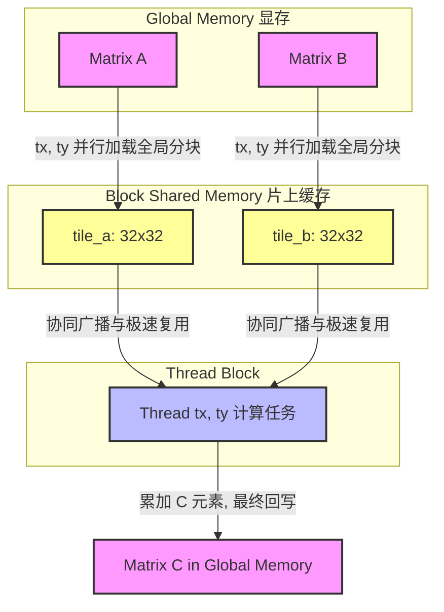

# 01_Basics 基础与并行化入门

## 一、 全景导览与学习目标

该子项目在整个 CUDA-Practice 学习体系中处于最根基的 **基础与访存调优 (L1)** 阶段。在这部分，我们旨在帮助读者熟悉 CUDA 编程的核心模型（Grid-Block-Thread 结构）与基本的数据搬移（H2D，D2H）过程。不仅如此，本章节还引入了 CUDA 脱离新手期的首个也是最重要的优化工具——**Shared Memory (共享内存/片上 SRAM)**，展示了它在对抗全局内存（Global Memory）延迟中的巨大威力。

本项目包含了以下三个逐步进阶的核心源文件与实现：

- `01_vector_add/vector_add.cu`：实现基础的向量加法。教学了 `Grid-Stride Loop` 技巧，展现了简单算理下逼近物理网卡极限的内存带宽榨取力。
- `02_matrix_mul_naive/matrix_mul_naive.cu`：朴素版矩阵乘法（Naive GEMM）。采用最直白的并行化计算方式，暴露了冗余地读取全局内存带来严重的性能瓶颈和算力浪费。
- `03_matrix_mul_tiled/matrix_mul_tiled.cu`：**分块矩阵乘法（Tiled GEMM）**。通过利用极低延迟的 Shared Memory 寄存小块数据，结合 `__syncthreads()` 同步指令，大幅复用当前 Block 数据，使得矩阵算力显著跃升。

---

## 二、 原理推导与数学表达

### 1. 向量加法 (Vector Add)

向量加法是计算绝对独立的 1D 数组数据操作模型：
$$ \mathbf{C}_i = \mathbf{A}_i + \mathbf{B}_i \quad \forall i \in [0, N-1] $$
它在 GPU 中的计算几乎只被内存带宽所限制（Bandwidth-Bound），而非被 GPU 的浮点运算能力限制。

### 2. 传统矩阵乘法 (Naive Matrix Multiplication)

对于 $C = A \times B$，其元素 $C_{i,j}$ 的值为 A 矩阵第 $i$ 行与 B 矩阵第 $j$ 列的内积：
$$ \mathbf{C}_{i,j} = \sum_{k=0}^{K-1} \mathbf{A}_{i,k} \cdot \mathbf{B}_{k,j} $$
在并行化时，若我们让每个 Thread 去计算一个 $\mathbf{C}_{i,j}$：
这个线程需要从显存（Global Memory）拉取 A 的整整一行与 B 的整整一列数据。对于 $N \times N$ 的乘法，每个元素都被重复拉取了 $N$ 次！这导致全局总访存量达到了恐怖的 $O(N^3)$。

### 3. 分块矩阵乘法 (Tiled Matrix Multiplication)

为了缓解 $O(N^3)$ 的全局访存压力，数学上我们将乘法按 TILE（例如 $32 \times 32$）块进行分解提取：
$$ \mathbf{C}_{i,j} = \sum_{t=0}^{\lceil K / \text{TILE} \rceil - 1} \left( \sum_{k=0}^{\text{TILE}-1} \mathbf{A}_{i, t \cdot \text{TILE} + k} \cdot \mathbf{B}_{t \cdot \text{TILE} + k, j} \right) $$

**算法层面改进**：在块索引 $t$ 迭代期间，我们将 $\text{TILE} \times \text{TILE}$ 大小的局部 A 和 B 缓存到共享内存（Shared Memory）中。Block 内的所有线程随后即可在此 $L1$ 层级的快速 SRAM 中反复获取数据，从而将计算任务中对较慢的全局内存的依赖降低为原本的 $1/\text{TILE}$。

---

## 三、 硬核内存映射解析

当涉及 Shared Memory 时，认清 Thread 是怎么“组团”搬运数据并利用这些数据的，是优化的第一步：



### GEMM Block/Thread 线程与数据映射关系

| 层级 | 逻辑坐标 / 尺寸参数 | 对应物理意义与责任 |
| --- | --- | --- |
| **Grid** (网格) | `gx = k/32, gy = m/32` | 每个 Block 负责计算输出矩阵 C 的一个 `32x32` 子矩阵结果 |
| **Block** (线程块) | `bx = 32, by = 32` | 包含 `1024` 个并发线程，硬件层面刚好被绑定到一个 SM，享用同一块 Shared Memory（SRAM）|
| **Thread** (单线程) | `tx = 0~31, ty = 0~31` | 在协同加载阶段：每线程只认领读入 $A_1$, $B_1$ 的一个数据放入 SRAM；<br>在计算阶段：计算内积 $\sum \text{tile\_a} \cdot \text{tile\_b}$ 以累加 $\mathbf{C}$ 的一个元素 |

---

## 四、 关键源码逐行解剖

我们精选 2 个最能体现 GPU 访存特性的核心片段进行审视：

### 1. Vector Add 的 Grid-Stride Loop

```cpp
// 典型的单开循环！这被称为“网格跨步循环”
__global__ void vector_add(const float* A, const float* B, float* C, const int n) {
    // 获取全局极坐标：当前线程在整个大局中的绝对位置
    int idx = blockDim.x * blockIdx.x + threadIdx.x;
    
    // 如果大矩阵大小 n 大于所有线程总数，利用步长 = 总线程数 进行跃迁扫描
    // 本项目中并未显式使用 += blockDim.x * gridDim.x, 
    // 这是因为启动配置 blocks = (n + threads - 1) / threads 足额覆盖了规模。
    if (idx < n) {
        // 单指令发出 2 次内存读取 (load) 与 1 次写入 (store)
        // 连续的线程读取连续的数据，实现完美的合并访存 (Memory Coalescing)！
        C[idx] = A[idx] + B[idx]; 
    }
}
```

### 2. Tiled GEMM 在 Shared Memory 中的同步奥秘

```cpp
__shared__ float tile_a[TILE_WIDTH][TILE_WIDTH];
__shared__ float tile_b[TILE_WIDTH][TILE_WIDTH];

for (int tile = 0; tile < num_tiles; ++tile) {
    // 1️⃣ 群体协作：将 Global Memory 拉向 Shared Memory
    int mCol = tile * TILE_WIDTH + tx;
    tile_a[ty][tx] = (row < m && mCol < n) ? a[row * n + mCol] : 0.0f; // 内置越界补 0 保护
    int nRow = tile * TILE_WIDTH + ty;
    tile_b[ty][tx] = (nRow < n && col < k) ? b[nRow * k + col] : 0.0f;
    
    // 2️⃣ 绝不可少的屏障同步：强迫所有该 Block 的线程等待，直到 tile_a 和 tile_b 被全员安全填充完毕！
    __syncthreads();

    // 3️⃣ 高性能算力释放：全部从高速的片上 SRAM 获取运算位素
    for (int i = 0; i < TILE_WIDTH; ++i) {
        value += tile_a[ty][i] * tile_b[i][tx];
    }

    // 4️⃣ 第二层屏障保护：由于外层存在 for 循环，我们必须保障全部乘法完毕后，
    // 才允许部分“跑得快”的线程迈入下一轮并覆盖当前宝贵的 SRAM。
    __syncthreads();
}
```

---

## 五、 性能基准与分析

所有数据均来自于 `Results/01_Basics.md` 中捕获的客观日志：

- **测试硬件**：NVIDIA GeForce RTX 4090 (sm_89) × 2, Linux 环境
- **测试规模**：
  - Vector Add：长度 $N = 67,108,864$ ($64\text{M}$)，共计 $256\text{MB} \times 3$ 单精度开支
  - Matrix Mul：$1024 \times 1024$ 方阵相乘，$10$ 次循环平均

| 实现版本 | Kernel 时间 | 有效带宽 / TFLOPS | vs 基准加速比 (CPU) |
| -------- | ----------- | ---------------- | ------------- |
| Vector Add CPU | 156.45 ms | — | 1x |
| **Vector Add GPU** | **0.86 ms** | **932.81 GB/s** | **181.22x** |
| GEMM CPU | ~2086.13 ms| 1.03 GFLOPS | 1x |
| **GEMM Naive (GPU V1)** | **0.41 ms** | **5.22 TFLOPS** | **5086.95x** |
| **GEMM Tiled (GPU V2)** | **0.31 ms** | **6.89 TFLOPS** | **6696.47x** |

````mermaid
xychart-beta
  title "GEMM Kernel 执行时间对比 (1024方阵相乘, ms, 越低越好)"
  x-axis ["Naive V1 (显存访问多)", "Tiled V2 (Shared Mem 优化)"]
  y-axis "时间 (ms)" 0 --> 0.5
  bar [0.41, 0.31]
````

**📊 深入分析：**

1. **绝佳的带宽压榨**：在 1D 线性运算中，Vector Add 将 RTX 4090 的显存总线运用到了惊人的 `932.81 GB/s`！这十分逼近理论理论物理上限 `1008 GB/s`，展示了 GPU 在 Bandwidth-Bound 任务中的统治级速度。
2. **缓解显存拖累产生算力跃升**：与单核 CPU 相比，甚至不加任何优化的 Naive GPU 均取得了 `5086x` 左右的加速！但这**仅仅是开始**：引入 Shared Memory (Tiled V2 版)，使得我们不需要在缓慢的显存里重复读数据，算力性能直接由 $5.22\text{ TFLOPS}$ 升华至 $6.89\text{ TFLOPS}$，耗时更是压至 $0.31\text{ ms}$。这也是我们进行 L1 进阶教学中必须掌握 Tiling 优化的原因。

---

## 六、 编译及参考资料

### 编译与标准运行指令

借助根目录的统一 `CMakeLists.txt` 构建目标：

```bash
# 1. 切换至项目根目录并执行整体软配置（首次构建）
cmake -B build -DCMAKE_BUILD_TYPE=Release

# 2. 独立编译对应的子项目 Target
cmake --build build --target vector_add -j8
cmake --build build --target matrix_mul_naive -j8
cmake --build build --target matrix_mul_tiled -j8

# 3. 运行单个基础验证程序进行观测
./build/01_Basics/01_vector_add/vector_add
./build/01_Basics/02_matrix_mul_naive/matrix_mul_naive
./build/01_Basics/03_matrix_mul_tiled/matrix_mul_tiled

# 4. 可选：借助 Nsight Compute 指明探测底层带宽耗时比例
ncu --metrics sm__throughput.avg.pct_of_peak_sustained_elapsed,dram__throughput.avg.pct_of_peak_sustained_elapsed ./build/01_Basics/03_matrix_mul_tiled/matrix_mul_tiled
```

### 推荐阅读

- [NVIDIA 官方 Docs：CUDA Shared Memory 剖析](https://docs.nvidia.com/cuda/cuda-c-programming-guide/index.html#shared-memory)
- [NVIDIA 技术博客：Efficient Matrix Multiplication with Shared Memory](https://developer.nvidia.com/blog/efficient-matrix-transpose-cuda-cc/)
- 原项目 `Common/include/` 的诸多小工具也是你探索进阶必备的最佳参考模版。
