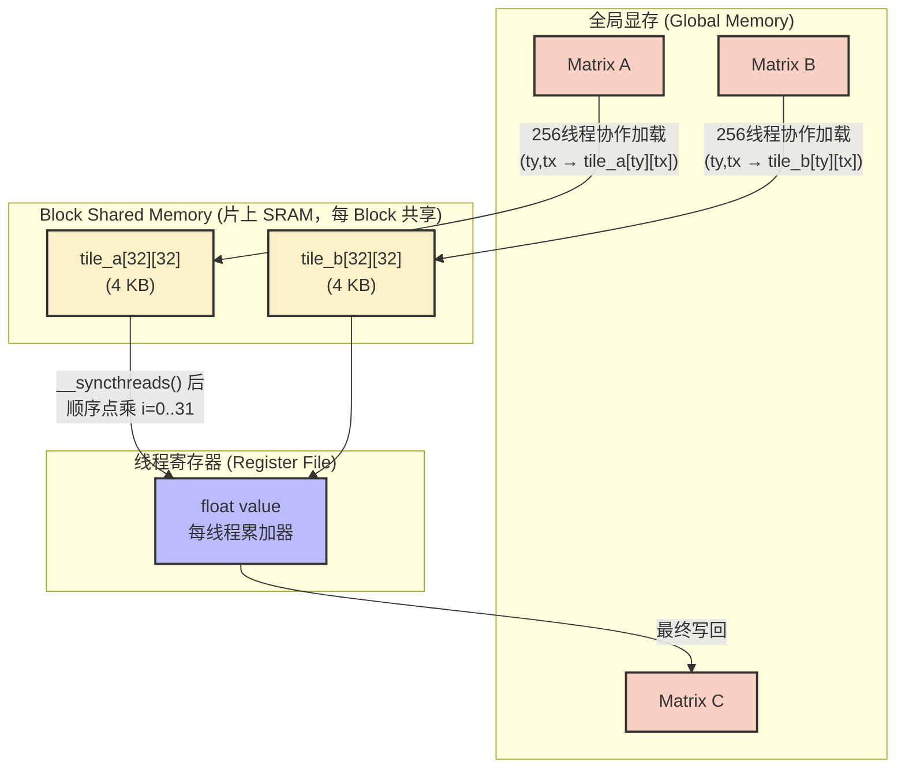
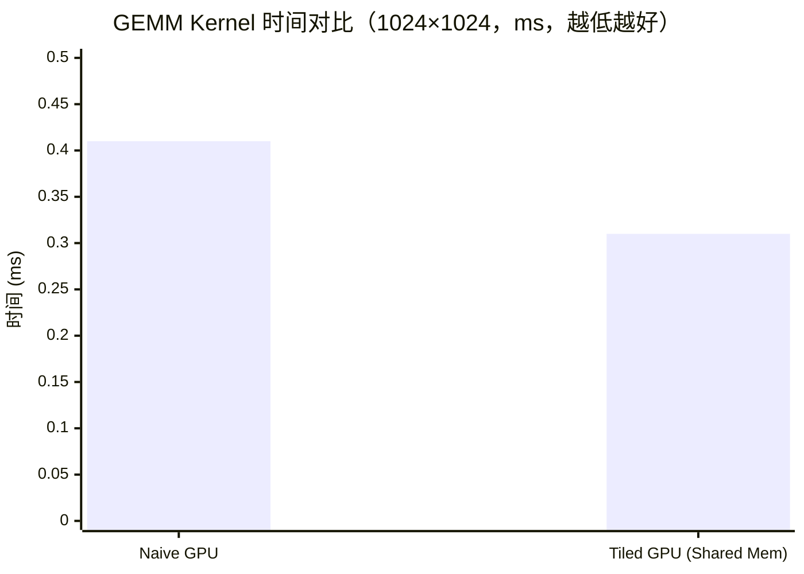

# 01_Basics — 基础并行化入门

## 一、全景导览与学习目标

本子项目是 CUDA-Practice 学习体系的起点，对应**基础与访存调优（L1）**阶段。这里的核心任务是建立 GPU 编程的底层直觉：理解 Grid-Block-Thread 三级并行模型、掌握 Host/Device 内存管理（H2D / D2H），并通过 Shared Memory 初步体验片上高速缓存对性能的决定性影响。

三个源文件构成一条递进优化链：

| 文件 | Kernel 名称 | 优化层级 | 核心技术 |
|------|------------|----------|---------|
| `01_vector_add/vector_add.cu` | `vector_add` | L1 带宽感知 | Grid-Stride Loop，合并访存 |
| `02_matrix_mul_naive/matrix_mul_naive.cu` | `matrix_mul_naive` | L1 朴素基准 | 2D Grid，每线程一个输出元素 |
| `03_matrix_mul_tiled/matrix_mul_tiled.cu` | `matrix_mul_tiled` | L1 Shared Mem Tiling | `__shared__` + `__syncthreads()` |

---

## 二、原理推导与数学表达

### 1. 向量加法（Vector Add）

向量加法是典型的 Memory-Bound 操作，每个元素的计算独立：

$$\mathbf{C}_i = \mathbf{A}_i + \mathbf{B}_i, \quad \forall i \in [0, N-1]$$

GPU 端带宽利用率是唯一关键指标。理论有效带宽 = $\frac{3 \cdot N \cdot \text{sizeof(float)}}{\text{kernel\_time}}$（读 A、读 B、写 C 三次 DRAM 访问）。

### 2. 朴素矩阵乘法（Naive GEMM）

对于 $C = A \times B$，其中 $A \in \mathbb{R}^{M \times N}$，$B \in \mathbb{R}^{N \times K}$：

$$C_{i,j} = \sum_{k=0}^{N-1} A_{i,k} \cdot B_{k,j}$$

每个线程计算一个 $C_{i,j}$，需要从 Global Memory 读取 $N$ 个 $A$ 元素和 $N$ 个 $B$ 元素。对于整个矩阵，全局访存量为 $O(M \cdot K \cdot N)$，在 $M=K=N=1024$ 时产生约 8 GB 的冗余流量。

### 3. 分块矩阵乘法（Tiled GEMM）

将矩阵按 $T=32$ 的 Tile 大小分块，把大循环分解为多个小 tile 的累加：

$$C_{i,j} = \sum_{t=0}^{\lceil N/T \rceil - 1} \sum_{k=0}^{T-1} A_{i,\; t \cdot T + k} \cdot B_{t \cdot T + k,\; j}$$

每次迭代将 $T \times T$ 的 $A$ 子块和 $B$ 子块加载到 Shared Memory，Block 内所有线程在片上 SRAM 中复用数据，将 Global Memory 访问量降低为原来的 $1/T$。

---

## 三、硬核内存映射解析

### Tiled GEMM 数据流动路径



### Block / Thread 映射关系

| 层级 | 配置参数 | 负责的数据范围 |
|------|---------|--------------|
| Grid | `((K+31)/32, (M+31)/32)` | 将整个 $C$ 矩阵切分为 $32 \times 32$ 的块 |
| Block | `dim3(32, 32)`，1024 线程 | 计算 $C$ 的一个 $32 \times 32$ 子矩阵 |
| Thread `(tx,ty)` | 唯一编号 | **加载阶段**：加载 `tile_a[ty][tx]` 和 `tile_b[ty][tx]`；**计算阶段**：累加 $\sum_i \text{tile\_a}[ty][i] \cdot \text{tile\_b}[i][tx]$ |

---

## 四、关键源码逐行解剖

### 1. Tiled GEMM 的 Shared Memory 装填与同步

```cpp
// 外层循环：沿 K 维度按 TILE_WIDTH=32 步进
for (int tile = 0; tile < num_tiles; ++tile) {
    // 协作加载：每线程加载 tile_a 和 tile_b 各一个元素
    // 越界补 0 保护（非方阵场景）
    int mCol = tile * TILE_WIDTH + tx;
    tile_a[ty][tx] = (row < m && mCol < n) ? a[row * n + mCol] : 0.0f;

    int nRow = tile * TILE_WIDTH + ty;
    tile_b[ty][tx] = (nRow < n && col < k) ? b[nRow * k + col] : 0.0f;

    // ① 必须的第一道屏障：确保所有线程加载完毕，再开始计算
    __syncthreads();

    // 纯 Shared Memory 内层循环：全部命中片上 SRAM，无 DRAM 访问
    for (int i = 0; i < TILE_WIDTH; ++i)
        value += tile_a[ty][i] * tile_b[i][tx];

    // ② 必须的第二道屏障：防止快线程提前加载下一 tile 覆盖当前 SRAM
    __syncthreads();
}
```

**关键点**：两次 `__syncthreads()` 缺一不可。第一次保证数据就绪，第二次防止 SRAM 数据竞争。省去任何一次均会导致结果错误，且错误难以确定性重现。

---

## 五、性能基准与分析

> 所有数据提取自 `Results/01_Basics.md` 真实日志，测试硬件：NVIDIA GeForce RTX 4090（sm_89）× 2，Linux，nvcc -O3。

### 1. Vector Add（$N = 67,108,864$，100 次平均，单数组 256 MB）

| 版本 | Kernel 时间 | 有效带宽 | vs CPU 加速比（Kernel） |
|------|------------|---------|----------------------|
| CPU 参考 | 156.45 ms | — | 1× |
| **GPU Vector Add** | **0.86 ms** | **932.81 GB/s** | **181.22×** |

有效带宽 932.81 GB/s 达到 RTX 4090 理论峰值（~1008 GB/s）的约 **92.5%**，说明 GPU 在 Memory-Bound 任务上的带宽压榨能力。

### 2. GEMM 对比（$1024 \times 1024$，10 次平均，共 12 MB）

| 版本 | Kernel 时间 | 计算吞吐 | vs CPU 加速比 |
|------|------------|---------|-------------|
| CPU 参考（Naive GEMM） | 2090.49 ms | 1.03 GFLOPS | 1× |
| **GPU Naive GEMM** | **0.41 ms** | **5225.65 GFLOPS** | **5086.95×** |
| **GPU Tiled GEMM** | **0.31 ms** | **6893.42 GFLOPS** | **6696.47×** |



**分析**：

- Tiled GEMM 相比 Naive 快约 **1.32×**（0.41 ms → 0.31 ms），对应 Shared Memory 减少了 32× 的 Global Memory 读取次数（$\text{TILE\_WIDTH} = 32$）。
- 6.89 TFLOPS 的实际性能约为 RTX 4090 FP32 理论峰值（82.6 TFLOPS）的 **8.3%**——瓶颈仍主要在内存访问而非算术运算，这为后续 Register Tiling（`04_GEMM_Optimization`）的引入埋下伏笔。

---

## 六、编译及参考资料

### 编译与运行

```bash
# 从项目根目录配置（首次）
cmake -B build -DCMAKE_BUILD_TYPE=Release

# 编译三个目标
cmake --build build --target vector_add -j8
cmake --build build --target matrix_mul_naive -j8
cmake --build build --target matrix_mul_tiled -j8

# 标准运行
./build/01_Basics/01_vector_add/vector_add
./build/01_Basics/02_matrix_mul_naive/matrix_mul_naive
./build/01_Basics/03_matrix_mul_tiled/matrix_mul_tiled

# 内存安全检查
compute-sanitizer ./build/01_Basics/03_matrix_mul_tiled/matrix_mul_tiled

# Nsight Compute 带宽分析
ncu --metrics sm__throughput.avg.pct_of_peak_sustained_elapsed,dram__throughput.avg.pct_of_peak_sustained_elapsed \
    ./build/01_Basics/03_matrix_mul_tiled/matrix_mul_tiled
```

### 参考资料

- [CUDA C++ Programming Guide: Shared Memory](https://docs.nvidia.com/cuda/cuda-c-programming-guide/index.html#shared-memory) — NVIDIA 官方文档，详述 `__shared__` 声明与 Bank 访问规则
- [NVIDIA Blog: An Even Easier Introduction to CUDA](https://developer.nvidia.com/blog/even-easier-introduction-cuda/) — CUDA 模型入门，含 Grid-Stride Loop 的最佳实践说明
- [Professional CUDA C Programming (Cheng et al.)](https://www.wiley.com/en-us/Professional+CUDA+C+Programming-p-9781118739327) — 第 4 章详细推导 Tiled GEMM 的访存分析与性能模型
