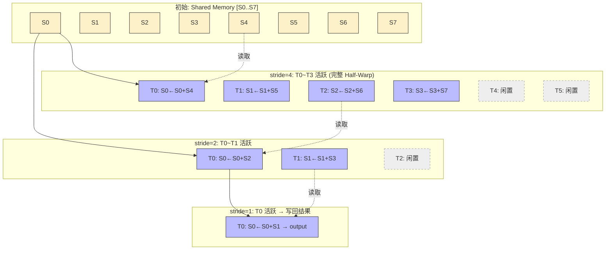
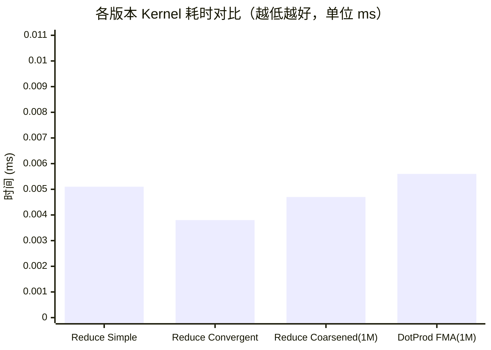

# 02_Reduction — 规约算法与线程收敛

## 一、全景导览与学习目标

本子项目属于 CUDA-Practice 学习体系的 **经典算子与并发（L2）** 阶段。归约（Reduction）是将 $N$ 个元素通过满足结合律的二元运算符折叠为单个标量的经典并行原语，是求和、求最大值、点积等操作的基础。

与上一模块的"映射"（Map）操作不同，归约面临的核心难点是 **多线程数据汇聚时的协作同步**——如何在消除 Warp 发散（Warp Divergence）的同时最大化内存带宽利用率。

三个源文件构成完整的优化演进链：

| 文件 | Kernel 列表 | 核心技术 | 优化层级 |
|------|------------|----------|---------|
| `01_reduce_sum/reduce_sum.cu` | `simple_reduce_sum`、`convergent_reduce_sum`、`shared_reduce_sum` | Divergence 分析、Shared Memory 归约 | 入门 |
| `02_reduce_optimized/reduce_optimized.cu` | `segmented_reduce_sum`、`coarsened_reduce_sum`、`coarsened_reduce_max` | Thread Coarsening、`atomicAdd`、Warp Shuffle | 进阶 |
| `03_dot_product/dot_product.cu` | `shared_dot_product`、`coarsened_dot_product`、`fma_dot_product` | FMA 指令、规约常见变体 | 进阶 |

---

## 二、原理推导与数学表达

归约操作的数学定义：对满足结合律的二元运算符 $\oplus$（如 $+$、$\max$），将 $N$ 个元素折叠为单个标量：

$$S = x_0 \oplus x_1 \oplus x_2 \oplus \cdots \oplus x_{N-1}$$

在 GPU 上引入多级树状折叠（Tree-Based Reduction），每轮 $d$ 的递推为：

$$V^{(d+1)}_i = V^{(d)}_i \oplus V^{(d)}_{i + 2^d}, \quad \text{stride} = 2^D, 2^{D-1}, \ldots, 1$$

**三种算法的数学/硬件层面区别**：

1. **Simple（朴素版）**：stride 从 1 倍增到 blockDim。条件 `if (tid % stride == 0)` 导致同一 Warp 内部分线程分叉，产生严重 **Warp Divergence** 和 Bank Conflict。

2. **Convergent（收敛版）**：stride 从 blockDim 减半到 1。活跃线程始终从 `tid=0` 起连续排列（同一 Warp 内所有活跃线程步调一致），从根本上消除了 Divergence。

3. **Thread Coarsening（粗化版）**：每线程在进入并行归约前，串行地在寄存器中预累加 `COARSE_FACTOR×2 = 8` 个元素。数学上等价于：

   $$\text{local-sum} = \sum_{j=0}^{2 \cdot \text{COARSE} - 1} x_{tid + j \cdot \text{BLOCK-SIZE}}$$

   大幅削减了启动的 Block 总数和 `__syncthreads()` 调用次数。

---

## 三、硬核内存映射解析

### 收敛归约（BlockDim=8）线程-数据时序图

以下展示了 Convergent 版本中，存活线程始终从 `tid=0` 起连续分布的关键优势：



**关键点**：每轮活跃线程 ID 均连续（T0-T3 → T0-T1 → T0），保证 Warp 内不出现分叉，SM 利用率接近满载。

### Thread Coarsening 数据粒度对比

| 策略 | 每线程处理元素数 | 启动 Block 数（1M 元素） | `__syncthreads()` 开销 |
|------|----------------|------------------------|----------------------|
| Simple/Convergent | 1 | 1024 | 高 |
| **Coarsened (COARSE=4)** | **8** | **128** | **低（约 1/8）** |

---

## 四、关键源码逐行解剖

### Thread Coarsening 核心片段（来自 `reduce_optimized.cu`）

```cpp
// 每线程的全局起始地址（跨步 2×COARSE_FACTOR 个 Block）
CInt sid = 2 * COARSE_FACTOR * blockDim.x * blockIdx.x + tid;

float sum = 0.0f;
// 寄存器内预累加：COARSE_FACTOR×2=8 个全局元素
// 完全避免了 Shared Memory 参与，直接在寄存器中悄然完成初步折叠
for (int i = 0; i < COARSE_FACTOR * 2; ++i) {
    if (sid + i * BLOCK_SIZE < length) {
        sum += input[sid + i * BLOCK_SIZE];  // 全局内存连续读取，合并访存
    }
}
// 将高度浓缩的局部和放入 Shared Memory，供后续对折归约使用
shared_data[tid] = sum;
// 此后执行标准的收敛式 Shared Memory 归约...
```

**为什么有效**：不粗化时处理同样 8 个元素需要 8× 更多 Block，每个 Block 都有 `__syncthreads()` 的同步栅栏开销。粗化让这部分"私人搬运"工作全部在高速寄存器内完成，而非反复在 Shared Memory 里排队。

---

## 五、性能基准与分析

> 所有数据提取自 `Results/02_Reduction.md` 真实日志，测试硬件：NVIDIA GeForce RTX 4090（sm_89）× 2，Linux，nvcc -O3。

### 1. 小规模算法对决（`reduce_sum`，N=2048，100 次平均）

| 版本 | Kernel 时间 | vs Simple 加速比 | 正确性 |
|------|------------|-----------------|--------|
| Simple（朴素，有 Divergence） | 0.0051 ms | 1× | PASSED |
| **Convergent（收敛，消除 Divergence）** | **0.0038 ms** | **1.36×** | PASSED |
| Shared Memory（Shared + Convergent） | 0.0038 ms | 1.36× | PASSED |

### 2. 大规模工业级优化（`reduce_optimized`，N=1,048,576，COARSE\_FACTOR=4，100 次平均）

| 版本 | Kernel 时间 | 有效带宽 | vs CPU（4.69 ms）加速比 |
|------|------------|---------|----------------------|
| CPU 参考 | 4.69 ms | — | 1× |
| GPU Segmented（基础分段）| 0.0084 ms | — | ~559× |
| **GPU Coarsened（线程粗化）** | **0.0047 ms** | **887.48 GB/s** | **991.52×** |

### 3. 点积变体（`dot_product`，N=1,048,576，100 次平均）

| 版本 | Kernel 时间 | 有效带宽 | vs CPU（1.69 ms）加速比 |
|------|------------|---------|----------------------|
| CPU 参考 | 1.69 ms | — | 1× |
| GPU Simple | 0.0092 ms | — | 183.7× |
| GPU Coarsened | 0.0056 ms | — | 301.8× |
| **GPU FMA（融合乘加）** | **0.0056 ms** | **1506.49 GB/s\*** | **303.86×** |

*\* 注：1506.49 GB/s 超过 DRAM 理论峰值（~1008 GB/s），系 1MB 数组完全驻留在 L2 Cache（72 MB）中的正常缓存命中现象，非硬件限制。*



**分析**：

- **Convergent vs Simple**（N=2048）：1.36× 提升完全来自消除 Warp Divergence，无额外算法开销。  
- **Coarsened vs Segmented**（N=1M）：约 1.79× 提升来自 Block 数量减少 8× 和 `__syncthreads()` 频率降低，寄存器粗化是核心。

---

## 六、编译及参考资料

### 编译与运行

```bash
# 从项目根目录配置（首次）
cmake -B build -DCMAKE_BUILD_TYPE=Release

# 编译三个目标
cmake --build build --target reduce_sum -j8
cmake --build build --target reduce_optimized -j8
cmake --build build --target dot_product -j8

# 标准运行
./build/02_Reduction/01_reduce_sum/reduce_sum
./build/02_Reduction/02_reduce_optimized/reduce_optimized
./build/02_Reduction/03_dot_product/dot_product

# 内存安全检查（建议对 reduce_optimized 执行）
compute-sanitizer ./build/02_Reduction/02_reduce_optimized/reduce_optimized

# Nsight Compute 分析
ncu --metrics sm__throughput.avg.pct_of_peak_sustained_elapsed,dram__throughput.avg.pct_of_peak_sustained_elapsed \
    ./build/02_Reduction/02_reduce_optimized/reduce_optimized
```

### 参考资料

- [Mark Harris, NVIDIA: Optimizing Parallel Reduction in CUDA](https://developer.download.nvidia.com/assets/cuda/files/reduction.pdf) — 必读经典，完整推导从 Naive 到 Warp-Unroll 优化的全过程
- [NVIDIA Developer Blog: Faster Parallel Reductions on Kepler](https://developer.nvidia.com/blog/faster-parallel-reductions-kepler/) — 介绍 `__shfl_down_sync` 相较于 Shared Memory 归约的优势
- [CUDA C++ Programming Guide: Warp Shuffle Functions](https://docs.nvidia.com/cuda/cuda-c-programming-guide/index.html#warp-shuffle-functions) — `__shfl_down_sync` 等指令的官方规范与 mask 参数语义
