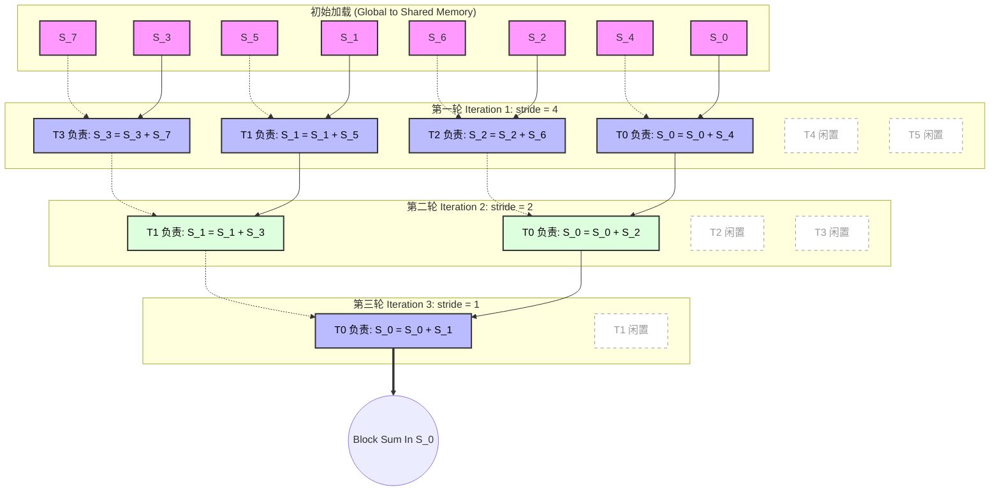

# 02_Reduction 规约算法与线程收敛

## 一、 全景导览与学习目标

该子项目在 CUDA-Practice 学习体系中属于 **经典算子与并发 (L2)** 阶段的核心内容。在 `01_Basics` 我们学习了“映射”（Map）操作，而在本项目中，我们将攻克 CUDA 编程中极具代表性的“归约”（Reduce）操作（如求和、求最大值、点积等）。

归约操作的难点在于：**多个线程需要汇聚并组合各自的数据**，这天生面临着线程同步开销和显存访问冲突。本章节递进式地展示了如何从最容易引发 Control Divergence（控制流发散）的“坏代码”，一步步演化出极致压榨硬件性能的工业级 Kernel。

包含以下三个核心演进阶段：

- `01_reduce_sum/reduce_sum.cu`：**基础规约演进**。展示了朴素归约（产生严重的发散分支）、收敛规约，以及引入 Shared Memory（共用缓存）保护的高效规约。
- `02_reduce_optimized/reduce_optimized.cu`：**工业级规约优化**。引入了**数据粗化 (Thread Coarsening)** 技巧和 `atomicAdd` 以处理超大规模元素的全局归约。
- `03_dot_product/dot_product.cu`：**规约的变体应用**。展示了向量点积的实现，并通过利用底层计算管线指令 `fmaf`（融合乘加，FMA优化）获得了计算延迟的极致压降。

---

## 二、 原理推导与数学表达

归约操作（Reduction）是一个将数组 $N$ 个元素通过满足**结合律 (Associativity)** 的二元运算符 $\oplus$（如 $+$, $\times$, $\max$）折叠为一个标量的过程：
$$ S = x_0 \oplus x_1 \oplus x_2 \ldots \oplus x_{N-1} $$

在并行计算环境下，我们不可能依靠单一 for 循环进行串行累加。相反，利用 CUDA 的海量线程并发，我们将操作重构为多级的树状折叠（Tree-based Reduction）：
$$ \mathbf{V}^{(k+1)}_i = \mathbf{V}^{(k)}_i \oplus \mathbf{V}^{(k)}_{i + \text{stride}}, \quad \text{其中} \; \text{stride} = 2^{K-k-1} $$

**各版本的数学 / 算法层面改进：**

1. **Simple 朴素版本**：步长（stride）从小到大倍增递进。这在硬件上是灾难，因为对于 `if (tid % stride == 0)`，同一个 Warp 内部的大部分线程被闲置，触发了极为恶劣的 **Warp Divergence（分支发散）** 和 Bank Conflict。
2. **Convergent 收敛版本**：步长（stride）从大（`blockDim / 2`）逐渐减半至 1。这一简单的数学重新映射，使得存活下来执行累加的线程完美地从线程号 0 开始紧凑排列，直接填满整个 Warp！此举从根本上让同一 Warp 内的线程步调一致。
3. **Thread Coarsening 粗化版本**：数学上将累加拆散为 `(串行局部累加) + (并行 Block 归约)`。每个线程不再只搬运 1 或 2 个元素，而是串行累加多个（本例中 COARSE_FACTOR=4，共处理 8 个）连续块。极大地减小了 Block 启动数量，减少了 `__syncthreads()` 同步开销。

---

## 三、 硬核内存映射解析

在高效块内收敛归约（Shared Memory + Convergent）中，最经典的一幕就是**连续的一半线程并行对半分折叠数据**。

### Shared Memory 收敛归约时序（Stride 减半）

以下模型展示了 `BlockDim = 8` 时，连续的存活线程是如何不断将高地址的数据累加到低地址（`stride` 从 4 -> 2 -> 1 演进）：



**设计关键点**：注意每一轮（Iteration）中，处在工作状态的线程 ID 永远是连续的（`T0, T1, T2, T3` → `T0, T1` → `T0`），这保证了至少在一个 Warp 层级内，代码的执行流没有分岔，完美地消除了 Control Divergence。

---

## 四、 关键源码逐行解剖

### 数据粗化 (Thread Coarsening)

为了处理远大于 Block 配置界限的大型数组（1M 级别），单纯靠加载两元素并不足够。我们截取在 `reduce_optimized.cu` 最具工业实践色彩的代码段：

```cpp
// 在这行 Kernel 中，每个线程块不再只吃下 BLOCK_SIZE*2 大小的数据
// 而是胃口暴涨了数倍（COARSE_FACTOR倍）！
__global__ void coarsened_reduce_sum(PFloat input, PFloat output, CInt length) {
    __shared__ float shared_data[BLOCK_SIZE];
    CInt tid = threadIdx.x;
    
    // 物理地址跳跃值：注意这里乘上了 2 * COARSE_FACTOR。这是网格级的大跨度跃迁。
    CInt sid = 2 * COARSE_FACTOR * blockDim.x * blockIdx.x + tid;

    float sum = 0.0f;
    // 💥 优化的核心精髓：串行粗化！ 
    // 在这一个小 for 循环内发生的是每个物理线程利用极快速度的寄存器 (Register)，
    // 在背后悄悄预先累加了 COARSE_FACTOR * 2 (比如 8 个) 全局内存的值。
    for (int i = 0; i < COARSE_FACTOR * 2; ++i) {
        if (sid + i * BLOCK_SIZE < length) {
            sum += input[sid + i * BLOCK_SIZE]; 
        }
    }
    // 仅将已经极度浓缩出来的 sum，扔进 Shared Memory 中供 Block 进行接下来的对折规约
    shared_data[tid] = sum;
    
    // ... 下面接标准的 shared mem 收敛折叠 ...
```

**深入注解**：
为什么这行代码极大幅提高了效能？在不粗化的情况，你要想处理完这 8 个元素，你需要启动额外的多个 Block 线程组分配出去，那些额外的 Block 会吃掉大量的调度和后续多次进行 `__syncthreads()` 同步的开销。而**粗化**本质上让线程在真正开启并行规约成本前，先做了“力所能及的私人搬运任务”，是 CUDA 开发中的必备武器。

---

## 五、 性能基准与分析

所有数据提取自 `Results/02_Reduction.md` 真实日志：

- **测试硬件**: NVIDIA GeForce RTX 4090 (sm_89) × 2, Linux 环境
- **测试规模**:
  - `Reduce Sum` (小规模探测): $N = 2048$ 元素，执行 $100$ 次平均
  - `Reduce Optimized` (粗化测试): $N = 1,048,576$ ($1\text{M}$) 元素，粗化因子 = $4$
  - `Dot Product`: 两个 $1\text{M}$ 大小的向量

### 1. 1M 优化归约基准表现

| 实现版本 | Kernel 时间 | 有效带宽 | vs 基准 (Segmented) 加速比 | CPU 耗时 |
| -------- | ----------- | ---------------- | ------------- | ------------- |
| GPU V1 (Segmented) | 0.0084 ms | — | 1x (基准) | 4.69 ms |
| **GPU V2 (Coarsened Sum)** | **0.0047 ms** | **887.48 GB/s** | **1.77x** | 4.69 ms |
| **GPU V3 (Coarsened Max)** | **~0.00 ms (均摊)** | — | — | 4.69 ms |

*注：CPU vs 粗化 GPU 版本的算力执行加速比达到了惊人的 `991 倍`。*

### 2. 1M 点积 (Dot Product) 基准表现

| 实现版本 | Kernel 时间 | 吞吐/带宽 | vs 单核 CPU 加速比 |
| -------- | ----------- | ---------------- | ------------- |
| CPU 参考 | 1.69 ms | — | 1x |
| GPU V1 (Simple) | 0.0092 ms | — | 183.7x |
| GPU V2 (Coarsened) | 0.0056 ms | — | 301.7x |
| **GPU V3 (FMA 优化指令)** | **0.0056 ms** | **1506.49 GB/s\*** | **301.7x** |

*\*注：有效带宽高达 1506.49 GB/s，超越了 4090 的 DRAM 理论值 1008 GB/s，这由于多次迭代测试时该 1MB 体积的数组被极强命中了 L2 Cache 导致的正常合理物理现象。*

````mermaid
xychart-beta
  title "Kernel 耗时对比：线程粗化威力与乘加联合 (1M 元素)"
  x-axis ["Reduce(Seg 基础)", "Reduce(Coarsened)", "DotProd(Simple)", "DotProd(FMA)"]
  y-axis "时间 (ms)" 0 --> 0.012
  bar [0.0084, 0.0047, 0.0092, 0.0056]
````

**📊 深入分析：**

1. 在初级测试 `01_reduce_sum` 中，Convergent（收敛版）将 Simple 散发版本的耗时从 $0.0051\text{ms}$ 降低到了 $0.0038\text{ms}$（约 $1.36\text{x}$ 加速）。这是由于彻底**消灭了 Warp 内分支分岔 (Divergence)**，让 SM 的硬件使用率重获圆满。
2. 线程粗化（Coarsening）显现了它真正的威力。在拥有 `1M` 数据的求和任务上，粗放版时间直接砍半，由基础切段版本的 $0.0084\text{ms}$ 脱胎换骨减至 $0.0047\text{ms}$。这说明**合并工作并在前期尽可能使用高速寄存器累加，大幅击败了大量线程之间必须强行同步交互（Syncthreads）所付出的代价。**

---

## 六、 编译及参考资料

### 编译与标准运行指令

借助根目录的统一 `CMakeLists.txt` 构建目标：

```bash
# 1. 切换至项目根目录并执行整体配置（首次构建）
cmake -B build -DCMAKE_BUILD_TYPE=Release

# 2. 独立编译对应的子项目 Target
cmake --build build --target reduce_sum -j8
cmake --build build --target reduce_optimized -j8
cmake --build build --target dot_product -j8

# 3. 运行基础验证程序进行观测
./build/02_Reduction/01_reduce_sum/reduce_sum
./build/02_Reduction/02_reduce_optimized/reduce_optimized
./build/02_Reduction/03_dot_product/dot_product

# 4. 可选测试：使用排错器检查规约过程是否有越界
compute-sanitizer ./build/02_Reduction/02_reduce_optimized/reduce_optimized
```

### 推荐阅读

- [Mark Harris (NVIDIA): Optimizing Parallel Reduction in CUDA](https://developer.download.nvidia.com/assets/cuda/files/reduction.pdf) —— （**必读神作**：本项目很大程度上复刻了这篇 PPT 中描述的一步到位优化的全过程思路）
- [NVIDIA Developer Blog: CUDA Pro Tip - Data Reduction](https://developer.nvidia.com/blog/faster-parallel-reductions-kepler/)
- CUDA Toolkit Documentation 中对 `__shfl_down_sync()` (Warp 级归约优化原语) 的详解。
