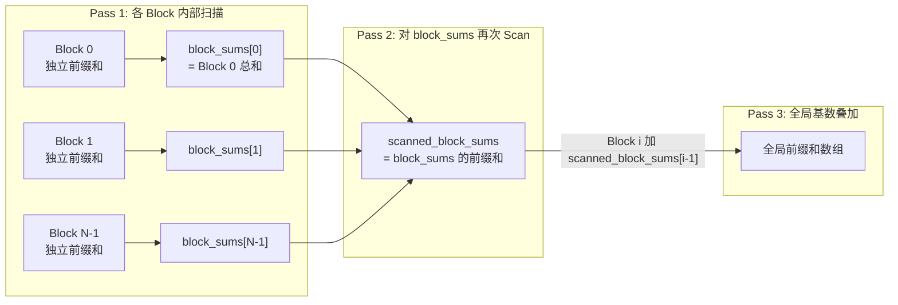
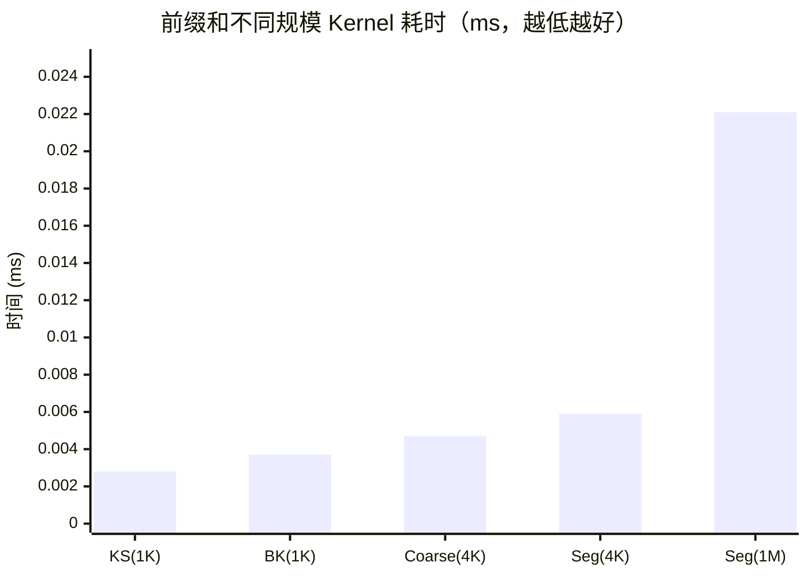

# 03_Scan — 前缀和与分段扫描

## 一、全景导览与学习目标

本子项目属于 CUDA-Practice 学习体系的**经典算子与并发（L2）**阶段。前缀和（Prefix Sum / Scan）是比归约更复杂的并行原语：它不仅要折叠数据，还必须保存每一个中间状态。前缀和是流压缩（Stream Compaction）、基数排序（Radix Sort）、稀疏矩阵运算的基础组件。

本模块探讨两种截然不同的并行设计哲学，以及如何将单 Block 算法推广到超大规模：

| 文件 | Kernel 列表 | 算法类型 | 核心优化 |
|------|------------|----------|---------|
| `01_prefix_sum/prefix_sum.cu` | `kogge_stone_scan`、`brent_kung_scan` | KS（步骤高效）、BK（工作量高效）| Shared Memory 并行前缀 |
| `02_segmented_scan/segmented_scan.cu` | `segmented_scan`、`add_block_sums`、`coarse_scan` | 三遍扫描（3-Pass Scan）| 多 Block 拼接、Thread Coarsening |

---

## 二、原理推导与数学表达

**前缀和（Inclusive Scan）**的数学定义：

$$y_i = \sum_{j=0}^{i} x_j \quad \text{（Inclusive，包含自身）}$$

$$y_i = \sum_{j=0}^{i-1} x_j, \quad y_0 = 0 \quad \text{（Exclusive，不包含自身）}$$

串行形式 $y_i = y_{i-1} + x_i$ 具有严格数据依赖，无法直接并行化，因此诞生了两种主流策略：

### 1. Kogge-Stone 算法（步骤高效，Step-Efficient）

每个元素在步骤 $d$ 累加距离 $2^{d-1}$ 处的历史结果：

$$y^{(d)}_i = y^{(d-1)}_i + y^{(d-1)}_{i - 2^{d-1}}, \quad i \ge 2^{d-1}$$

共需 $\log_2 N$ 步，并行深度最浅，但总加法次数为 $\mathcal{O}(N \log N)$。

### 2. Brent-Kung 算法（工作量高效，Work-Efficient）

分两阶段：

- **Up-sweep（归约阶段）**：建立二叉树中间节点和，$\mathcal{O}(N)$ 工作量
- **Down-sweep（散发阶段）**：从树根自顶向下分发前缀和

总工作量 $\mathcal{O}(N)$，并行深度 $2\log_2 N - 2$。

### 3. 三遍扫描（3-Pass Scan，跨 Block 推广）

对超过单 Block 容量（1024 元素）的大数组：

1. **Pass 1**：每个 Block 独立扫描，将本 Block 总和写入 `d_block_sums[blockIdx.x]`
2. **Pass 2**：对 `d_block_sums` 数组再次进行 Prefix Sum
3. **Pass 3**：每个 Block 将 `d_scanned_block_sums[blockIdx.x-1]` 加到本块所有元素

---

## 三、硬核内存映射解析

### Kogge-Stone 并行加法时序（N=8）

| tid | 初始值 | Step-1（跨 1）| Step-2（跨 2）| Step-3（跨 4）| 结果 |
|:---:|:---:|:---:|:---:|:---:|:---:|
| 0 | $x_0$ | $x_0$ | $x_0$ | $x_0$ | $y_0$ |
| 1 | $x_1$ | $x_{0..1}$ | $x_{0..1}$ | $x_{0..1}$ | $y_1$ |
| 2 | $x_2$ | $x_{1..2}$ | $x_{0..2}$ | $x_{0..2}$ | $y_2$ |
| 3 | $x_3$ | $x_{2..3}$ | $x_{0..3}$ | $x_{0..3}$ | $y_3$ |
| 4 | $x_4$ | $x_{3..4}$ | $x_{1..4}$ | $x_{0..4}$ | $y_4$ |
| 5 | $x_5$ | $x_{4..5}$ | $x_{2..5}$ | $x_{0..5}$ | $y_5$ |
| 6 | $x_6$ | $x_{5..6}$ | $x_{3..6}$ | $x_{0..6}$ | $y_6$ |
| 7 | $x_7$ | $x_{6..7}$ | $x_{4..7}$ | $x_{0..7}$ | $y_7$ |

**与 Reduction 的关键区别**：KS 中随着步数加深，参与运算的线程数越来越多（Step-3 时 tid=4~7 全部参与），而归约中参与线程数逐步减少——这使 KS 对 GPU SIMT 架构的并行度非常友好。

### 三遍扫描数据流（Mermaid）



---

## 四、关键源码逐行解剖

### KS Scan 的双缓冲写保护（来自 `prefix_sum.cu`）

```cpp
float val = 0.0f;
// 反直觉之处：必须先读到寄存器，再写回 shared，隔绝读写竞争
if (tid >= stride) {
    val = shared_data[tid] + shared_data[tid - stride];
}
__syncthreads(); // ① 确保所有线程的读操作已完成

if (tid >= stride) {
    shared_data[tid] = val; // ② 此时才安全写入，不会污染邻居的读取
}
__syncthreads(); // ③ 确保写入完成，下一轮 stride 才可继续
```

**典型错误**：直接写 `shared[tid] += shared[tid - stride]` + 单次 sync，后续线程可能读到半更新状态（脏数据）。读-算-存必须被屏障完整隔开。

---

## 五、性能基准与分析

> 所有数据提取自 `Results/03_Scan.md` 真实日志，测试硬件：NVIDIA GeForce RTX 4090（sm_89）× 2，Linux，nvcc -O3。

### 1. 单 Block 算法决战（`prefix_sum`，N=1024，100 次平均）

| 版本 | Kernel 时间 | 算法特征 | vs KS 比较 |
|------|------------|---------|-----------|
| **GPU Kogge-Stone** | **0.0028 ms** | $\mathcal{O}(N\log N)$ 工作、$\log N$ 深度 | 基准 |
| GPU Brent-Kung | 0.0037 ms | $\mathcal{O}(N)$ 工作、$2\log N$ 深度 | 0.76×（慢） |

**反直觉分析**：理论上"工作量高效"的 BK 在 GPU 实测中比 KS 慢约 32%。原因在于 BK 的树状遍历轨迹使得 Up/Down-sweep 阶段活跃线程分布不均，造成 Warp 发散和额外的 `__syncthreads()` 等待；KS 的平坦广播结构与 SIMT 并行架构更契合。

### 2. 算法扩展对比（`segmented_scan`，N=4096，100 次平均）

| 版本 | Kernel 时间 | 正确性 |
|------|------------|--------|
| Coarse Scan（粗化）| 0.0047 ms | PASSED |
| Segmented Scan（分段）| 0.0059 ms | PASSED |

### 3. 百万量级大规模测试（`segmented_scan`，N=1,048,576，100 次平均）

| 版本 | Kernel 时间 | 有效带宽 | vs CPU（1.79 ms）加速比 |
|------|------------|---------|----------------------|
| CPU 参考 | 1.79 ms | — | 1× |
| **GPU 三遍分段扫描** | **0.0221 ms** | **378.77 GB/s** | **80.69×** |



**扩展性分析**：从 4096 元素（0.0059 ms）到 1M 元素（0.0221 ms），数据量增长 **256×** 而 Kernel 时间仅增长 **3.78×**，体现了 GPU 海量 SM 并发在面对大规模数据时的近线性扩展能力。

---

## 六、编译及参考资料

### 编译与运行

```bash
# 从项目根目录配置（首次）
cmake -B build -DCMAKE_BUILD_TYPE=Release

# 编译两个目标
cmake --build build --target prefix_sum -j8
cmake --build build --target segmented_scan -j8

# 标准运行
./build/03_Scan/01_prefix_sum/prefix_sum
./build/03_Scan/02_segmented_scan/segmented_scan

# 内存安全检查（检测跨 Block 拼接时的越界）
compute-sanitizer ./build/03_Scan/02_segmented_scan/segmented_scan

# Nsight Compute 分析
ncu --metrics sm__throughput.avg.pct_of_peak_sustained_elapsed,dram__throughput.avg.pct_of_peak_sustained_elapsed \
    ./build/03_Scan/02_segmented_scan/segmented_scan
```

### 参考资料

- [GPU Gems 3, Ch.39: Parallel Prefix Sum (Scan) with CUDA](https://developer.nvidia.com/gpugems/gpugems3/part-vi-gpu-computing/chapter-39-parallel-prefix-sum-scan-cuda) — 图文并茂讲解 KS、BK 以及 Bank Conflict Padding 解法的经典文章
- [Blelloch, G. E. (1990). Prefix Sums and Their Applications](https://www.cs.cmu.edu/~guyb/papers/Ble93.pdf) — Brent-Kung 算法的理论奠基论文
- [CUDA Toolkit: Thrust Scan](https://nvidia.github.io/cccl/thrust/api/groups/group__prefixsums.html) — 工业级前缀和实现参考，可与本项目手写版本对比
