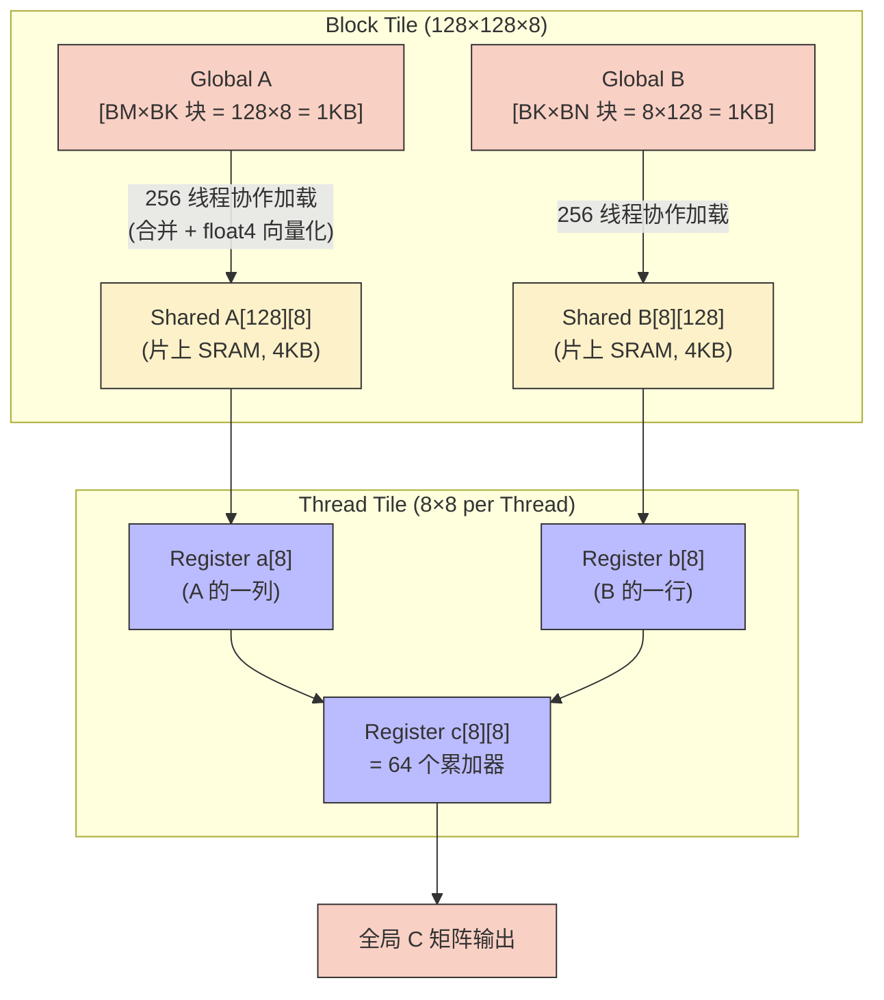
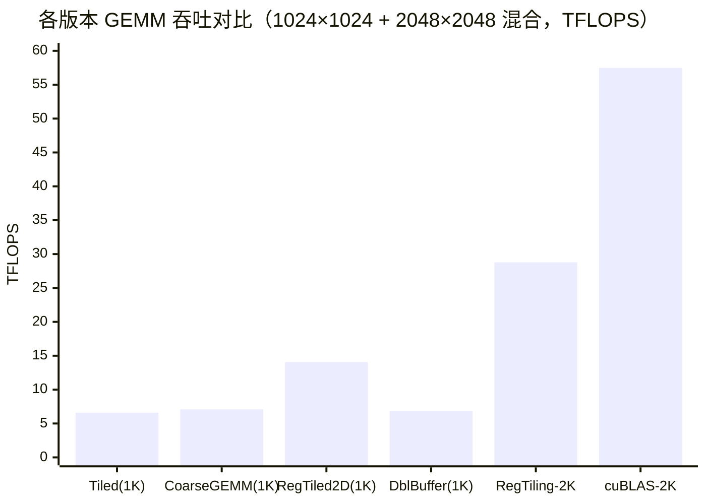

# 04_GEMM_Optimization — GEMM 优化阶梯

## 一、全景导览与学习目标

本子项目属于 CUDA-Practice 学习体系的 **性能深度优化（L2-L3）** 阶段。通用矩阵乘法（GEMM）是深度学习中最核心的算子，也是 GPU 优化技术的典型靶场。从 Shared Memory Tiling 到 Register Tiling，每一层优化都针对特定的硬件瓶颈。

三个源文件构成完整的优化演进链：

| 文件 | Kernel 列表 | 核心技术 | 测试规模 |
|------|------------|----------|---------|
| `01_tiled_gemm/tiled_gemm.cu` | `tiled_gemm`、`coarse_gemm`、`register_tiled_gemm` | Shared Tiling → 1D 粗化 → 2D 寄存器分块 | 1024×1024 |
| `02_advanced_gemm/advanced_gemm.cu` | `vectorized_gemm`、`double_buffer_gemm` | `float4` 向量化、双缓冲流水线 | 1024×1024 |
| `03_register_tiling/register_tiling.cu` | `register_tiling_gemm` vs `cublasSgemm` | 极致寄存器复用（8×8 子块）| 2048×2048 |

---

## 二、原理推导与数学表达

### 1. Arithmetic Intensity（算术强度）

对 $C = A \times B$，其中矩阵规模为 $N \times N$：

- **计算量**：$2N^3$ FLOP（每个 $C_{ij}$ 需 $N$ 次乘、$N$ 次加）
- **最低访存量**（假设完美缓存）：$3N^2 \cdot \text{sizeof(float)} \approx 3N^2 \times 4$ 字节

算术强度 $I = \frac{2N^3}{3N^2 \times 4} = \frac{N}{6}$ FLOP/Byte，在 $N=1024$ 时 $I \approx 170$ FLOP/Byte，远超 RTX 4090 的拐点（~85 FLOP/Byte），理论上应该是 **Compute Bound**。但若无 Tiling，每个线程的实际 DRAM 访问为 $2N$，总访存量高达 $2N^3$——退化为 Memory Bound！

### 2. Register Tiling 寄存器复用比

Block Tile（BM=128, BN=128, BK=8）下，每个线程负责 $TM \times TN = 8 \times 8 = 64$ 个输出元素。每次协作加载 BK=8 列，每个线程需读取 8 个 A 寄存器值和 8 个 B 寄存器值，执行 $8 \times 8 = 64$ 次 FMA。

寄存器复用比：$\frac{\text{FMA 次数}}{\text{读取寄存器次数}} = \frac{64}{8+8} = 4$

---

## 三、硬核内存映射解析

### 三级 Tiling 数据复用层次



**三级复用层次**：每字节数据从 DRAM 加载后，先在 Shared Memory（延迟 ~30 cycle）被 Block 内多线程共享，再下沉到 Register（延迟 ~1 cycle）被 Thread 的 $8 \times 8$ 计算内核反复使用，最终对 DRAM 的实际读写量被压缩至近理论下限。

---

## 四、关键源码逐行解剖

### 2D Register Tiling 核心内层循环（来自 `tiled_gemm.cu` 的 `register_tiled_gemm`）

```cpp
// Thread Tile 缓冲区：values[COARSE_Y][COARSE_X] = values[4][4]，全部驻留在寄存器池
float values[COARSE_Y][COARSE_X] = {0.0f};

for (int i = 0; i < cdiv(N, TILE_SIZE); ++i) {
    // 协作加载：多行/多列一次性搬入 Shared Memory
    for (int j = 0; j < COARSE_Y; ++j) {
        CInt a_row = row + j * TILE_SIZE;
        shared_A[j * TILE_SIZE + threadIdx.y][threadIdx.x] = (a_row < M && tiled_col < N) ? A[a_row * N + tiled_col] : 0.0f;
    }
    for (int j = 0; j < COARSE_X; ++j) {
        CInt b_col = col + j * TILE_SIZE;
        shared_B[threadIdx.y][j * TILE_SIZE + threadIdx.x] = (b_col < K && tiled_row < N) ? B[tiled_row * K + b_col] : 0.0f;
    }
    __syncthreads();

    // 内层 COARSE_Y×COARSE_X FMA 矩阵外积展开（全部命中 Shared Memory）
    for (int t = 0; t < TILE_SIZE; ++t) {
        for (int j = 0; j < COARSE_Y; ++j)
            for (int k = 0; k < COARSE_X; ++k)
                values[j][k] = fmaf(shared_A[j * TILE_SIZE + threadIdx.y][t],
                                    shared_B[t][k * TILE_SIZE + threadIdx.x], values[j][k]);
    }
    __syncthreads();
}
```

**关键点**：编译器在 `#pragma unroll` 的辅助下，将双重循环完全展开为连续 `fma` 指令，消除分支和循环计数器开销。注意此处 `COARSE_X = COARSE_Y = 4`（共 16 次 FMA/tile 步），而 `03_register_tiling` 中的极致版本将 TM=TN=8（共 64 次 FMA/tile 步），复用比更高。

---

## 五、性能基准与分析

> 所有数据提取自 `Results/04_GEMM_Optimization.md` 真实日志，测试硬件：NVIDIA GeForce RTX 4090（sm_89）× 2，Linux，nvcc -O3。

### 1. Tiling 阶梯进化（`tiled_gemm`，$1024 \times 1024$，10 次平均）

| 版本 | Kernel 时间 | 计算吞吐 | vs Tiled 基准 |
|------|------------|---------|-------------|
| CPU 参考 | 2117.46 ms | 1.01 GFLOPS | — |
| GPU Tiled GEMM（Shared，TILE=32）| 0.3273 ms | — | 1× |
| GPU Coarse GEMM 1D（×4 粗化）| 0.3047 ms | — | 1.07× |
| **GPU Register Tiled 2D（TM=TN=4）** | **0.1528 ms** | **14055.10 GFLOPS** | **2.14×** |

### 2. 高级技术对比（`advanced_gemm`，$1024 \times 1024$，10 次平均）

| 版本 | Kernel 时间 | 计算吞吐 | vs Vectorized 基准 |
|------|------------|---------|-------------------|
| GPU Vectorized GEMM（float4）| 0.3821 ms | — | 1× |
| **GPU Double Buffer GEMM** | **0.3149 ms** | **6820.01 GFLOPS** | **1.21×** |

### 3. 极限优化对比（`register_tiling`，$2048 \times 2048$，20 次平均）

| 版本 | Kernel 时间 | 计算吞吐 | 与 cuBLAS 比率 |
|------|------------|---------|--------------|
| **手写 Register Tiling（BM=BN=128, BK=8, TM=TN=8）** | **0.60 ms** | **28.79 TFLOPS** | **50.1%** |
| cuBLAS SGEMM（基准）| 0.30 ms | 57.49 TFLOPS | 100% |



**分析**：

- Register Tiling 2D（TM=TN=4）在 1K 规模相比基础 Tiling2.14× 提升，源于将 Shared Memory 的元素进一步缓存到寄存器中，消除 Shared Memory 带宽瓶颈。
- 即便极致优化，手写 Register Tiling（2048 规模）仍仅达 cuBLAS 的 **50.1%**——cuBLAS 使用汇编级调优和架构专属 Tensor Core 通路，差距反映了闭源生产级优化的门槛。

---

## 六、编译及参考资料

### 编译与运行

```bash
# 从项目根目录配置（首次）
cmake -B build -DCMAKE_BUILD_TYPE=Release

# 编译三个目标
cmake --build build --target tiled_gemm -j8
cmake --build build --target advanced_gemm -j8
cmake --build build --target register_tiling -j8

# 标准运行
./build/04_GEMM_Optimization/01_tiled_gemm/tiled_gemm
./build/04_GEMM_Optimization/02_advanced_gemm/advanced_gemm
./build/04_GEMM_Optimization/03_register_tiling/register_tiling

# Nsight Compute 分析（重点分析 register_tiling）
ncu --metrics sm__throughput.avg.pct_of_peak_sustained_elapsed,\
l1tex__t_bytes_pipe_lsu_mem_global_op_ld.sum,\
sm__inst_executed_pipe_fma.sum \
./build/04_GEMM_Optimization/03_register_tiling/register_tiling
```

### 参考资料

- [Simon Boehm: How to Optimize a CUDA Matmul Kernel for cuBLAS-like Performance](https://siboehm.com/articles/22/CUDA-MMM) — 从基础 Tiling 到 Register Tiling 的完整优化推导，含 SASS 分析
- [NVIDIA cuBLAS Performance](https://docs.nvidia.com/cuda/cublas/index.html#gemm-performance-tuning) — cuBLAS SGEMM 的架构适配说明，解释为何闭源库性能超越手写内核
- [Lei Mao: CUDA Matrix Multiplication Optimization](https://leimao.github.io/article/CUDA-Matrix-Multiplication-Optimization/) — 含寄存器分块的内存访问推导和 Bank Conflict 分析
