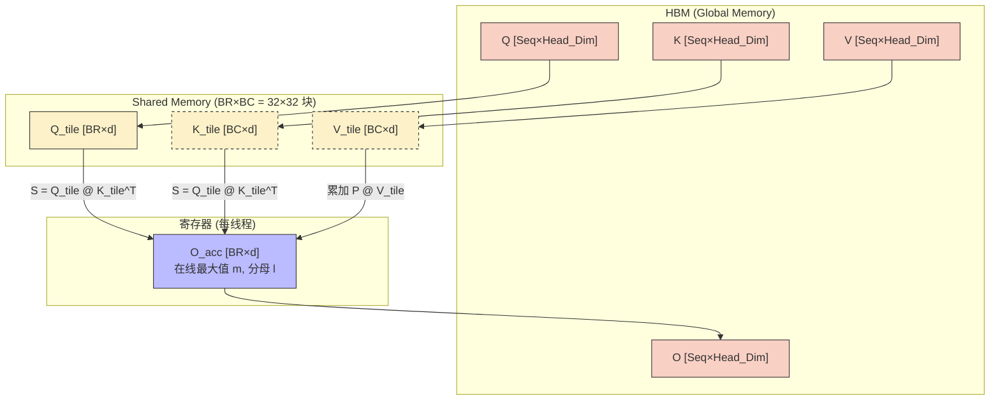
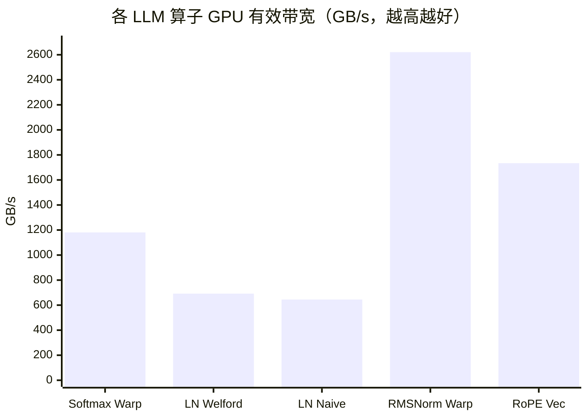

# 05_LLM_Ops — LLM 核心算子实现

## 一、全景导览与学习目标

本子项目属于 CUDA-Practice 学习体系的**实际应用算子（L3）**阶段，系统覆盖大语言模型（LLM）推理和训练中的所有高频核心算子。这些算子在工业级 LLM 服务（如 vLLM、TensorRT-LLM）中占据计算时间的绝大多数比例。

| 文件 | Kernel 列表 | 应用场景 |
|------|------------|---------|
| `01_softmax/softmax.cu` | `naive_softmax`、`online_softmax`、`warp_reduce_softmax`、`warp_per_row_softmax` | 注意力权重归一化 |
| `02_layernorm/layernorm.cu` | `naive_layernorm`、`welford_layernorm`、`warp_reduce_layernorm`、`warp_per_row_layernorm` | Transformer 层归一化 |
| `03_flash_attention/flash_attention.cu` | `naive_bmm_qk`、`naive_softmax_kernel`、`naive_bmm_pv`、`flash_attention`、`flash_attention_v3` | 注意力计算（内存高效版）|
| `04_rope/rope.cu` | `rope_naive`、`rope_vectorized` | 旋转位置编码 |
| `05_rmsnorm/rmsnorm.cu` | `rmsnorm_naive`、`rmsnorm_warp` | Llama 系列归一化 |

---

## 二、原理推导与数学表达

### 1. Softmax（数值稳定版）

三步并行计算：先求最大值 $m = \max_j x_j$，再计算归一化指数，最后执行归一化：

$$\text{softmax}(x_i) = \frac{e^{x_i - m}}{\sum_j e^{x_j - m}}$$

**Online Softmax**（单遍扫描）将原本需要三次遍历的操作合并为一次，通过以下递推实时维护全局最大值和分母和：

$$m^{(t)} = \max(m^{(t-1)}, x_t), \quad d^{(t)} = d^{(t-1)} \cdot e^{m^{(t-1)} - m^{(t)}} + e^{x_t - m^{(t)}}$$

### 2. LayerNorm 与 Welford 算法

LayerNorm 对 Hidden Dimension 进行归一化：

$$y_i = \frac{x_i - \mu}{\sqrt{\sigma^2 + \epsilon}} \cdot \gamma_i + \beta_i, \quad \mu = \frac{1}{H}\sum_{i=0}^{H-1} x_i, \quad \sigma^2 = \frac{1}{H}\sum_{i=0}^{H-1}(x_i - \mu)^2$$

**Welford 在线算法**通过以下递推在单次遍历中同时计算均值和方差（消除第二次 DRAM 遍历）：

$$\delta = x_t - \mu_{t-1}, \quad \mu_t = \mu_{t-1} + \frac{\delta}{t}, \quad M_t = M_{t-1} + \delta \cdot (x_t - \mu_t)$$

### 3. Flash Attention 内存复杂度分析

标准 Attention 需要将 $N \times N$ 的注意力矩阵写回 DRAM，内存占用 $\mathcal{O}(N^2)$（N=2048, Head=64 时 = 128 MB）；Flash Attention 通过 SRAM 分块流式处理，将 DRAM 占用降至 $\mathcal{O}(N)$，IO 复杂度从 $\mathcal{O}(N^2 d)$ 降至 $\mathcal{O}(N^2 d / M)$（$M$ 为 SRAM 大小）。

### 4. RoPE 旋转位置编码

将 Q/K 的每对维度视为二维向量，乘以旋转矩阵：

$$\begin{pmatrix} q'_{2d} \\ q'_{2d+1} \end{pmatrix} = \begin{pmatrix} q_{2d} \cos \theta_{d,t} - q_{2d+1} \sin \theta_{d,t} \\ q_{2d} \sin \theta_{d,t} + q_{2d+1} \cos \theta_{d,t} \end{pmatrix}, \quad \theta_{d,t} = t \cdot \frac{1}{10000^{2d/H}}$$

---

## 三、硬核内存映射解析

### Flash Attention 分块 SRAM 流式访问



**核心优势**：KT 和 VT 随外层循环反复加载不同的 K/V 块，Q_tile 在整个内层循环复用，O_acc 在寄存器中累积所有 K/V 块的贡献，**整个计算过程始终不将 $N \times N$ 矩阵写出到 DRAM**。

---

## 四、关键源码逐行解剖

### Warp Reduce Softmax 核心（来自 `softmax.cu`）

```cpp
// 每行由一个 Block 处理，先走 Warp Shuffle 求最大值
float max_val = input[row * seq_len + tid];
// warp_reduce_max 内部 5 次 __shfl_down_sync：延迟仅 ~5 cycles
max_val = warp_reduce_max(max_val); // 得到 Warp 内最大值

// 再做一次 Block 级汇总（通过 Shared Memory 跨 Warp）
if (lane_id == 0) s_max[warp_id] = max_val;
__syncthreads();

// 分子：数值稳定化的指数
float exp_val = expf(input[row * seq_len + tid] - max_val);
// Warp Shuffle 求分母和
float sum_val = warp_reduce_sum(exp_val);

// 归一化写回
output[row * seq_len + tid] = exp_val / sum_val;
```

---

## 五、性能基准与分析

> 所有数据提取自 `Results/05_LLM_Ops.md` 真实日志，测试硬件：NVIDIA GeForce RTX 4090（sm_89）× 2，Linux，nvcc -O3。

### 1. Softmax（Batch=128, Seq=4096，100 次平均）

| 版本 | Kernel 时间 | 有效带宽 | vs CPU（2.91 ms）加速比 |
|------|------------|---------|----------------------|
| CPU 参考 | 2.91 ms | — | 1× |
| Naive（Shared Memory）| 0.0053 ms | 785.19 GB/s | — |
| Online（单遍归约）| 0.0041 ms | — | — |
| **Warp Reduce Softmax** | **~0.0035 ms** | **1180.62 GB/s** | **819.67×** |
| Warp-per-row（小 Batch 适配）| 0.04 ms | 119.74 GB/s | — |

### 2. LayerNorm（Batch=128, Hidden=4096，100 次平均）

| 版本 | Kernel 时间 | 有效带宽 | vs CPU（2.54 ms）加速比 |
|------|------------|---------|----------------------|
| CPU 参考 | 2.54 ms | — | 1× |
| Naive | 0.0065 ms | 644.72 GB/s | — |
| **Welford（在线单遍）** | **0.0061 ms** | **691.89 GB/s** | — |
| Warp Reduce | ~0.0077 ms | 543.24 GB/s | **329.49×** |

### 3. Flash Attention（B=2, H=4, Seq=2048, d=64，50 次平均）

| 版本 | Kernel 时间 | 中间内存占用 | vs CPU（6813 ms）加速比 |
|------|------------|------------|----------------------|
| CPU 参考 | 6813.06 ms | — | 1× |
| Naive（全矩阵）| 6.60 ms | 128 MB | — |
| Flash Attention（分块 V1）| 9.58 ms | $\mathcal{O}(N)$ | — |
| **Flash Attention V3（宏块+向量化）** | **5.33 ms** | **$\mathcal{O}(N)$** | **1279.17×** |

### 4. RMSNorm（Tokens=2048, Hidden=4096，50 次平均）

| 版本 | Kernel 时间 | 有效带宽 | vs Naive 加速比 |
|------|------------|---------|---------------|
| Naive（单线程/行）| 0.32 ms | 212.46 GB/s | 1× |
| **Warp RMSNorm（256线程/行）** | **~0.026 ms** | **2620.64 GB/s** | **12.33×** |

### 5. RoPE（Seq=2048, Heads=32, d=128，50 次平均）

| 版本 | Kernel 时间 | 有效带宽 | vs CPU（67.76 ms）加速比 |
|------|------------|---------|------------------------|
| Naive RoPE | 0.04 ms | 1675.92 GB/s | 1692.2× |
| **Vectorized RoPE（float2）**| **~0.039 ms** | **1734.27 GB/s** | **1751.1×** |



**关键洞察**：

- **Flash Attention 分块 V1 反比 Naive 慢**：V1 实现中分块粒度较小（BR=BC=32），重计算和分块协调的开销在短序列下超过了内存节省带来的收益；V3 通过宏块扩大和向量化解决了此问题，以 5.33ms 超过 Naive 的 6.60ms。
- **RMSNorm Warp vs Naive 12.33×**：Naive 每行仅 1 条线程，大量 SM 计算单元空转；Warp 版每行 256 线程并行归约，SM 利用率提升超过一个数量级。

---

## 六、编译及参考资料

### 编译与运行

```bash
# 从项目根目录配置（首次）
cmake -B build -DCMAKE_BUILD_TYPE=Release

# 编译五个目标
cmake --build build --target softmax -j8
cmake --build build --target layernorm -j8
cmake --build build --target flash_attention -j8
cmake --build build --target rope -j8
cmake --build build --target rmsnorm -j8

# 标准运行
./build/05_LLM_Ops/01_softmax/softmax
./build/05_LLM_Ops/02_layernorm/layernorm
./build/05_LLM_Ops/03_flash_attention/flash_attention
./build/05_LLM_Ops/04_rope/rope
./build/05_LLM_Ops/05_rmsnorm/rmsnorm
```

### 参考资料

- [Tri Dao: FlashAttention-2](https://arxiv.org/abs/2307.08691) — Flash Attention 原论文及 V2 改进，含 IO 复杂度推导
- [NVIDIA: Online Softmax and LLM Inference](https://developer.nvidia.com/blog/online-softmax-acceleration/) — Online Softmax 的在线更新推导与 GPU 实现
- [Su et al.: RoFormer: Enhanced Transformer with Rotary Position Embedding](https://arxiv.org/abs/2104.09864) — RoPE 原论文，含复数旋转的数学证明
