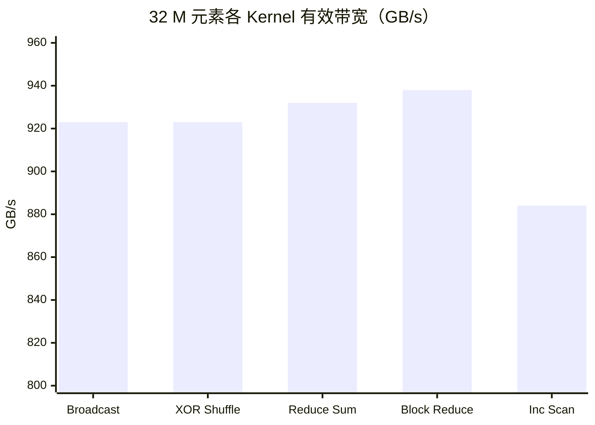

# 06_Warp_Primitives — Warp 级原语与跨线程通信

## 一、全景导览与学习目标

本子项目属于 CUDA-Practice 学习体系的**微架构级优化（L2）**阶段，专注于 Warp（32 个线程的硬件调度单元）内部的无共享内存直接通信机制——**Warp Shuffle 指令**。掌握 Warp 级原语是实现高性能归约、前缀和和 LLM 算子（如 Softmax、LayerNorm）的前提。

三个源文件按从底层到应用的顺序递进：

| 文件 | Kernel 列表 | 核心技术 | 测试规模 |
|------|------------|----------|---------|
| `01_warp_shuffle/warp_shuffle.cu` | `kernel_warp_broadcast`、`kernel_warp_xor_shuffle`、`kernel_warp_up_down_shuffle`、`test_kernel_warp_reduce_sum` | 四种 Shuffle 变体演示 | 32 M 元素，128 MB |
| `02_warp_reduce/warp_reduce.cu` | `block_reduce_sum`、`block_reduce_max` | 多 Warp Block 归约 | 32 M 元素，128 MB |
| `03_warp_scan/warp_scan.cu` | `block_scan_inclusive`、`block_scan_exclusive` | Warp Scan 拼接 Block Scan | 32 M 元素，128 MB |

---

## 二、原理推导与数学表达

### Warp Shuffle 四种指令语义

| 指令 | 原型 | 语义 |
|------|------|------|
| `__shfl_sync` | `T __shfl_sync(mask, val, srcLane, width=32)` | 所有线程读取 `srcLane` 号线程的 `val` |
| `__shfl_down_sync` | `T __shfl_down_sync(mask, val, delta, width=32)` | 线程 `i` 读取线程 `i+delta` 的值（常用于规约） |
| `__shfl_up_sync` | `T __shfl_up_sync(mask, val, delta, width=32)` | 线程 `i` 读取线程 `i-delta` 的值（常用于前缀和） |
| `__shfl_xor_sync` | `T __shfl_xor_sync(mask, val, laneMask, width=32)` | 线程 `i` 读取线程 `i XOR laneMask` 的值（蝴蝶网络） |

其中 `mask` 通常取 `0xffffffff`（全 32 线程参与），`width` 决定虚拟 Warp 尺寸（支持 2、4、8、16、32）。

### Warp Reduce 的五轮蝴蝶归约

`__shfl_down_sync` 实现归约的递推（sum 为例，共 $\log_2 32 = 5$ 轮）：

$$\text{轮次} \; d: \quad v_i \leftarrow v_i + v_{i+2^{d-1}}, \quad d = 1,2,3,4,5$$

每轮延迟约 2-4 cycles（L1-level 寄存器互连），远低于 Shared Memory（~30 cycles）和 Global Memory（~600 cycles）。

### Warp Inclusive Scan 的上摆指令（`__shfl_up_sync`）

对 offset = 1, 2, 4, 8, 16 依次累加来自低位线程的部分和：

$$y^{(d)}_i = y^{(d-1)}_i + y^{(d-1)}_{i-2^{d-1}}, \quad i \ge 2^{d-1}$$

经过 $\log_2 32 = 5$ 步后，$y_i$ 包含从 `lane 0` 到 `lane i` 的完整前缀和。

---

## 三、硬核内存映射解析

### `__shfl_down_sync` 归约五轮示意（Warp 内 8 线程简化版）

| lane | 初始 | 轮 1（δ=4）| 轮 2（δ=2）| 轮 3（δ=1）| 最终结果 |
|:----:|:----:|:--------:|:--------:|:--------:|:------:|
| 0 | $v_0$ | $v_0+v_4$ | $v_{0..5}$ | $v_{0..7}$ | ✓ 全和 |
| 1 | $v_1$ | $v_1+v_5$ | $v_{1..6}$ | 无效 | — |
| 2 | $v_2$ | $v_2+v_6$ | 无效 | — | — |
| 3 | $v_3$ | $v_3+v_7$ | — | — | — |
| 4 | $v_4$ | 无效 | — | — | — |

只需 Lane 0 写回全局输出（结合 `atomicAdd` 跨 Block 汇总）。

### `__shfl_up_sync` 前缀和示意（同 8 线程）

| lane | 初始 | 轮 1（δ=1）| 轮 2（δ=2）| 轮 3（δ=4）|
|:----:|:----:|:--------:|:--------:|:--------:|
| 0 | $v_0$ | $v_0$ | $v_0$ | $v_0$ |
| 1 | $v_1$ | $v_{0..1}$ | $v_{0..1}$ | $v_{0..1}$ |
| 2 | $v_2$ | $v_{1..2}$ | $v_{0..2}$ | $v_{0..2}$ |
| 3 | $v_3$ | $v_{2..3}$ | $v_{0..3}$ | $v_{0..3}$ |
| 4 | $v_4$ | $v_{3..4}$ | $v_{2..4}$ | $v_{0..4}$ |

经过 $\log_2 N$ 轮后每个 Lane 持有完整的 Inclusive Prefix Sum。

---

## 四、关键源码逐行解剖

### Block Reduce 多 Warp 协作（来自 `warp_reduce.cu` 的 `block_reduce_sum`）

```cpp
// 第一阶段：每个 Warp 内部调用 kernel_warp_reduce_sum 归约
// （内部使用 __shfl_xor_sync 蝴蝶网络实现 5 轮归约）
float sum = (tid < n) ? input[tid] : 0.0f;
sum = kernel_warp_reduce_sum(sum);

// 每个 Warp 的 Lane 0 将本 Warp 结果写入 Shared Memory
__shared__ float shared_warp_sums[32]; // 最多 32 个 Warp
int warp_id = threadIdx.x / 32;
int lane_id = threadIdx.x % 32;
if (lane_id == 0) shared_warp_sums[warp_id] = sum;
__syncthreads();

int num_warps = blockDim.x / 32;

// 第二阶段：用单个 Warp 对 shared_warp_sums 二次规约
if (warp_id == 0) {
    sum = (lane_id < num_warps) ? shared_warp_sums[lane_id] : 0.0f;
    sum = kernel_warp_reduce_sum(sum);
    // Lane 0 将本 Block 结果写入 output[blockIdx.x]
    if (lane_id == 0) output[blockIdx.x] = sum;
}
```

**为何仍需 Shared Memory**：Shuffle 只能在同一 Warp 内通信；跨 Warp 的数据交换必须借助 `__shared__` 作为中转站。这是 Warp Primitive 的能力边界。注意输出采用 per-Block 写出（`output[blockIdx.x]`），最终汇总在 Host 端完成。

---

## 五、性能基准与分析

> 所有数据提取自 `Results/06_Warp_Primitives.md` 真实日志，测试硬件：NVIDIA GeForce RTX 4090（sm_89）× 2，Linux，nvcc -O3。  
> 测试规模：$N = 33,554,432$（32 M 元素），128 MB，100 次平均。

### 1. Warp Shuffle 变体对比（`warp_shuffle`）

| 版本 | Kernel 时间 | 有效带宽 | vs CPU 加速比 |
|------|------------|---------|-------------|
| CPU Broadcast 参考 | 29.54 ms | — | 1× |
| GPU Warp Broadcast | 0.2908 ms | 923.14 GB/s | 101.58× |
| GPU XOR Shuffle | 0.2908 ms | ~923 GB/s | — |
| GPU Up/Down Shuffle | 0.30 ms | — | — |
| **GPU Warp Reduce Sum** | **0.15 ms** | **932.06 GB/s** | **276.09×** |

**关键发现**：Broadcast、XOR、Up/Down 三种变体耗时几乎相同（均 ≈ 0.29 ms），因为它们的计算强度相近、访存模式等同。Warp Reduce Sum 之所以快一倍，是因为归约后每个 Block 仅输出一个标量，D2H 传输量从 128 MB 降至微不足道的大小，整体 pipeline 更短。

### 2. Block 级归约（`warp_reduce`，32 M 元素）

| 版本 | Kernel 时间 | 有效带宽 | vs CPU（~49 ms）加速比 |
|------|------------|---------|----------------------|
| CPU 参考 | 48.87 ms | — | 1× |
| **GPU Block Reduce Sum** | **0.14 ms** | **937.89 GB/s** | **340.14×** |
| **GPU Block Reduce Max** | **0.14 ms** | **937.89 GB/s** | **351.17×** |

带宽 937.89 GB/s 达到 RTX 4090 理论峰值的约 **93%**。

### 3. Block 级前缀和（`warp_scan`，32 M 元素）

| 版本 | Kernel 时间 | 有效带宽 | vs CPU（~52 ms）加速比 |
|------|------------|---------|----------------------|
| CPU 参考 | 51.61 ms | — | 1× |
| **GPU Block Inclusive Scan** | **0.30 ms** | **884.34 GB/s** | **170.02×** |
| **GPU Block Exclusive Scan** | **0.30 ms** | **884.58 GB/s** | **170.00×** |



**分析**：Inclusive 和 Exclusive Scan 耗时完全相同，因为 Exclusive 只在最终 Inclusive 结果上偏移一位（`s_inclusive - val`），额外开销几乎为零。

---

## 六、编译及参考资料

### 编译与运行

```bash
# 从项目根目录配置（首次）
cmake -B build -DCMAKE_BUILD_TYPE=Release

# 编译三个目标
cmake --build build --target warp_shuffle -j8
cmake --build build --target warp_reduce -j8
cmake --build build --target warp_scan -j8

# 标准运行
./build/06_Warp_Primitives/01_warp_shuffle/warp_shuffle
./build/06_Warp_Primitives/02_warp_reduce/warp_reduce
./build/06_Warp_Primitives/03_warp_scan/warp_scan

# Nsight Compute 分析（验证无 Shared Memory Bank Conflict）
ncu --metrics l1tex__data_pipe_lsu_wavefronts_mem_shared_op_ld.sum \
    ./build/06_Warp_Primitives/02_warp_reduce/warp_reduce
```

### 参考资料

- [CUDA C++ Programming Guide: Warp Shuffle Functions](https://docs.nvidia.com/cuda/cuda-c-programming-guide/index.html#warp-shuffle-functions) — 四种 Shuffle 指令的官方语义规范、mask 参数与越界行为
- [NVIDIA DevBlog: Using CUDA Warp-Level Primitives](https://developer.nvidia.com/blog/using-cuda-warp-level-primitives/) — 附带可视化示意图，清晰对比 Shared Memory 与 Shuffle 的访问路径
- [Optimizing Parallel Reduction in CUDA (Mark Harris)](https://developer.download.nvidia.com/assets/cuda/files/reduction.pdf) — 第 5 节专门分析 Warp Unrolling 与 `__shfl_down` 的效率对比
