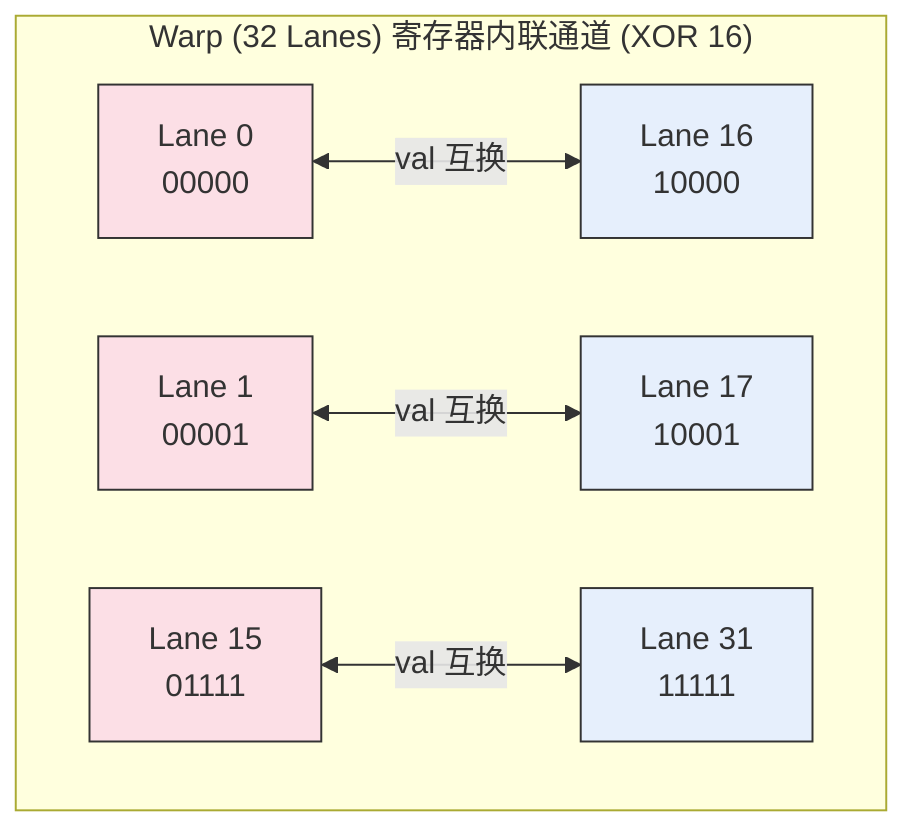

# 06_Warp_Primitives 线程束原语与块级协作

## 一、 全景导览与学习目标

该子项目处于 CUDA-Practice 学习体系的 **进阶优化 (L2/L3)** 阶段。在现代 CUDA 编程中，Shared Memory 的访问虽然很快，依然伴随显式同步 (`__syncthreads()`) 和可能发生的 Bank Conflict 开销。NVIDIA 从 Kepler (Compute 3.0) 时代开始引入了 **Warp Shuffle 指令**，允许同一个 Warp (32个线程) 内的寄存器直接互相通信，彻底打破了对 Shared Memory 的过度依赖。

本章通过手撕 Warp 级指令及其上层应用，展示如何利用底层的无缓存高速连线压榨带宽，实现极致性能的归约 (Reduce) 与前缀和 (Scan)：

- `01_warp_shuffle`：**核心原语认知**。直击底层的 `__shfl_sync` (广播), `__shfl_xor_sync` (蝴蝶交换), `__shfl_up/down_sync` (上下串行交换) 四大指令。
- `02_warp_reduce`：**跨代 Block Reduce**。利用 Warp 内 Reduce 结合仅提供给 32 个 Warp 首线程的微量 Shared Memory 面板，实现无 `__syncthreads` 在内部乱爬的极速 Block 归约。
- `03_warp_scan`：**Warp & Block  Scan并行前缀和**。基于 Shuffle 的 Kogge-Stone 并列爬升，再通过 Shared Memory 进行基础 (Base) 垫底，推演出 Inclusive 和 Exclusive 两种前缀和扫描的巅峰实现。

---

## 二、 原理推导与数学表达

Warp Shuffle 的数学本质不是通过内存寻址，而是**寄存器通道多路复用**。以核心的前缀和（Scan）为例。

### 1. Warp Reduce 下沿累积 (Down)

在求和中，传统在 Shared Memory 里使用半数线程存取的做法，在 Warp 内可以直接等价为：
$$ val = val + \text{shfl\_down\_sync}(val, \text{offset}) $$
其中 $\text{offset} = 16, 8, 4, 2, 1$。每一轮将前面车厢的货物直接丢到当前车厢，只需 $\log_2(32) = 5$ 条指令便可完成局部累加。此时，对全量 $N \times N$ 的读写，退化为无开销寄存器 ALU 运算。

### 2. Block 级 Inclusive Scan 的三段数学拼图

要想仅用 Shuffle 原语完成整个 Block 的前缀和，计算公式切分如下：
设 Warp $i$ 内部的前缀和序列为 $S_i=\{s_0, s_1, \ldots, s_{31}\}$。整个 Block 首元素的累积量即为各 Warp 最大位置 $s_{31}$ 的叠加。

1. **Warp-level 本地扫描**: 利用 `__shfl_up_sync` 产生局部的前缀和 $S_i$。
2. **基底 (Base) 提纯跨越**: 将每个 Warp 内的真尾缀 $S_i[31]$ (即局部总和) 收集到 Shared Memory $\text{warp\_sums}[i]$。对该数组再次执行一个 Warp 内的 Exclusive Scan，得到每一块独有的基础起步点 $\Delta_i$。
3. **全局叠加**: 最终输出：$\text{Output}_{i, j} = S_i[j] + \Delta_i$

这就是为何只用了极少内存就能让 1024 个人瞬间对齐账本的数学本质。

---

## 三、 硬核内存映射解析

我们以 **`01_warp_shuffle` 中 `__shfl_xor_sync(mask, val, 16)`** 这个最反直觉的蝴蝶交换（Butterfly Exchange）指令为例。

### Warp XOR Shuffle 组网图

`xor 16` (二进制 `10000`) 的效果是将低位车厢和高位的对半镜像直接对齐。



**📊 映射核心洞察**:
如果是 `__shfl_xor_sync(val, 1)`，那就是0和1互换，2和3互换。
这类位运算使得不需要复杂的 if-else 判断线程属于前半段还是后半段，也不消耗**任何**片上缓存寻址周期（ALU 直接对等收发），在高效的 Reduce 和快速傅里叶变换 (FFT) 蝶形图中处于核心地位。

---

## 四、 关键源码逐行解剖

### 1. 极致精简的 Block Reduce Sum

节选自 `02_warp_reduce/warp_reduce.cu`：

```cpp
// 🚀 这段代码让 256 位线程（8个Warp）协同求和，只消耗了 8个 float (32 Byte) 的共享内存！
float sum = (tid < n) ? input[tid] : 0.0f; 

// 第一步：各个 Warp 各扫门前雪，通过 Shuffle 在体内归约。此时仅 lane 0 持有本组总和。
sum = kernel_warp_reduce_sum(sum);

// 只为每个 Warp 预留一个存钱罐
__shared__ float shared_warp_sums[32]; 

int warp_id = threadIdx.x / 32;
int lane_id = threadIdx.x % 32;

// 各自的代表（0号号管）去交公粮
if (lane_id == 0) {
    shared_warp_sums[warp_id] = sum; 
}
__syncthreads(); // 全村唯一的一次显式等待

int num_warps = blockDim.x / 32;

// 第二步：0号 Warp (前32人) 苏醒，把小存钱罐拿走
if (warp_id == 0) {
    // 处理掉残余的边角分支（当前 block 不足32个warp时补 0）
    sum = (lane_id < num_warps) ? shared_warp_sums[lane_id] : 0.0f; 
    
    // 由这批精英骨干再次使用 Warp Shuffle 指令一波带走所有数据
    sum = kernel_warp_reduce_sum(sum); 

    // 全村总指挥（0号）把数字拍到 Global Memory 上
    if (lane_id == 0) output[blockIdx.x] = sum; 
}
```

**避坑指南**：
`__shfl` 指令自带对齐阻断同步（implicit sync），Warp 内不会分叉，故只有跨代（Warp 之间通信的 `shared_warp_sums`）那一步才必须调用 `__syncthreads()`。少写同步是榨取这部分代码极致性能的命脉！

---

## 五、 性能基准与分析

所有数据提取自 `Results/06_Warp_Primitives.md` 真实日志：

- **测试硬件**: NVIDIA GeForce RTX 4090 (sm_89) × 2, Linux 环境
- **测试规模**: $33,554,432$ ($32 \text{M}$) 元素数组，总体积 $128.00 \text{ MB}$，执行 100 轮平均化采样。

### 1. Warp 指令裸速战 (256 Threads/Block)

此项测算纯粹展现各种 Shuffle 在不增加算法复杂度情况下的物理吞吐极限。不降维情形下写回等额 $128 \text{MB}$。

| 实现版本 | Kernel 时间 | 有效带宽 | vs CPU 基准加速比 |
| -------- | ----------- | -------- | ----------------- |
| CPU Broadcast 标尺| $29.54 \text{ ms}$ | — | 1x |
| **GPU Warp Broadcast** | **$0.29 \text{ ms}$** | $923.14 \text{ GB/s}$ | **101.58x** |
| GPU XOR Shuffle | $0.29 \text{ ms}$ | $923.14 \text{ GB/s}$ | 101.58x |
| GPU Up/Down Shuffle| $0.30 \text{ ms}$ | $884+}$ GB/s | 98.4x |
| **GPU Warp Reduce** | **$0.15 \text{ ms}$**| **$932.06 \text{ GB/s}$** | **276.09x** (因为写回量极小，Kernel骤降一半) |

### 2. Block 级别归约与前缀和实战

在聚合应用 (Reduce 和 Scan) 中，我们在宏观 Block 层利用了前面解剖的心法。（Scan 规模：$32\text{M}$ Element，1024 Threads/Block）

| 实战项目 | GPU Kernel 时间 | 吞吐行为特征 |
| -------- | --------------- | ------------ |
| Block Reduce Sum| $0.14 \text{ ms}$ | $937.89 \text{ GB/s}$ (完全逼近 $1008 \text{GB/s}$ 的物理极限)|
| Block Reduce Max| $0.14 \text{ ms}$ | $937.89 \text{ GB/s}$ (耗时同构，证明主要等待在读显存上)|
| Block Inclusive Scan| $0.30 \text{ ms}$ | $884.34 \text{ GB/s}$ (包含1入1出 $128\text{MB}$ 的重写回，且涉及 `__syncthreads`) |
| Block Exclusive Scan| $0.30 \text{ ms}$ | $884.58 \text{ GB/s}$ |

````mermaid
xychart-beta
  title "高阶聚合算力：Block Reduce vs Scan 时间占比 (ms)"
  x-axis ["Reduce Sum", "Reduce Max", "Inclusive Scan", "Exclusive Scan"]
  y-axis "耗时 (ms)" 0 --> 0.4
  bar [0.14, 0.14, 0.30, 0.30]
````

**💡 性能解析**:
我们可以断定以上全部算法均成功达成了 **Bandwidth-Bound（带宽被束缚）** 黄金准则。
RTX 4090 的显存物理速率大约 $1008 \text{ GB/s}$。以 Reduce 为例，$128\text{MB}$ 的读入加上少量汇合写入总计约 $132\text{MB}$ 交通流量。$\frac{132\text{MB}}{0.14\text{ms}} = 942 \text{GB/s}$。即达到了恐怖的 $\sim93\%$ 裸铁满载。
在全寄存器级别的快速置换下，ALU（加法与找最大值运算）的时长被高速缓冲和掩盖，**真正决定你能跑多快的，仅仅是设备外置显存能多快把泥石流倒进 SM 通道里。**

---

## 六、 编译及参考资料

### 编译与标准运行指令

借助根目录的统一 `CMakeLists.txt` 构建目标：

```bash
# 1. 切换至项目根目录并执行整体配置（首次构建）
cmake -B build -DCMAKE_BUILD_TYPE=Release

# 2. 独立编译对应的子项目 Target 
cmake --build build --target warp_shuffle -j8
cmake --build build --target warp_reduce -j8
cmake --build build --target warp_scan -j8

# 3. 运行基础验证程序进行观测
./build/06_Warp_Primitives/01_warp_shuffle/warp_shuffle
./build/06_Warp_Primitives/02_warp_reduce/warp_reduce
./build/06_Warp_Primitives/03_warp_scan/warp_scan

# 4. Nsight Compute 查看细致的硬件读写通道百分比
ncu --metrics sm__throughput.avg.pct_of_peak_sustained_elapsed,dram__throughput.avg.pct_of_peak_sustained_elapsed ./build/06_Warp_Primitives/02_warp_reduce/warp_reduce
```

### 推荐阅读

- [NVIDIA CUDA Programming Guide: Warp Shuffle Functions](https://docs.nvidia.com/cuda/cuda-c-programming-guide/index.html#warp-shuffle-functions) —— NVIDIA 原版技术文档，解析 `mask` 映射与底层行为。
- [Faster Parallel Reductions on Kepler](https://developer.nvidia.com/blog/faster-parallel-reductions-kepler/) —— Mark Harris 对比 Shared Memory 与 Shuffle 的性能进阶雄文。
- [Parallel Prefix Sum (Scan) with CUDA](https://developer.nvidia.com/blog/parallelforall/gpu-pro-tip-fast-histograms-using-shared-atomics-maxwell/) —— 了解如何在树状结构或者 Warp 中实现更前沿的极速 Scan。
