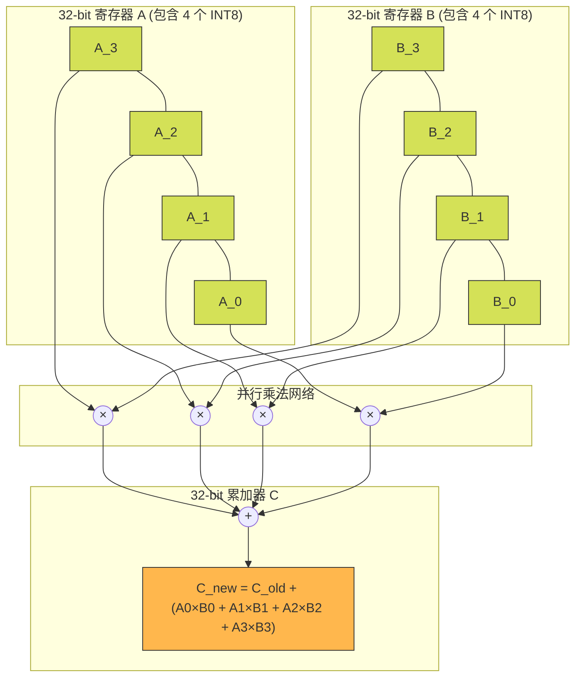
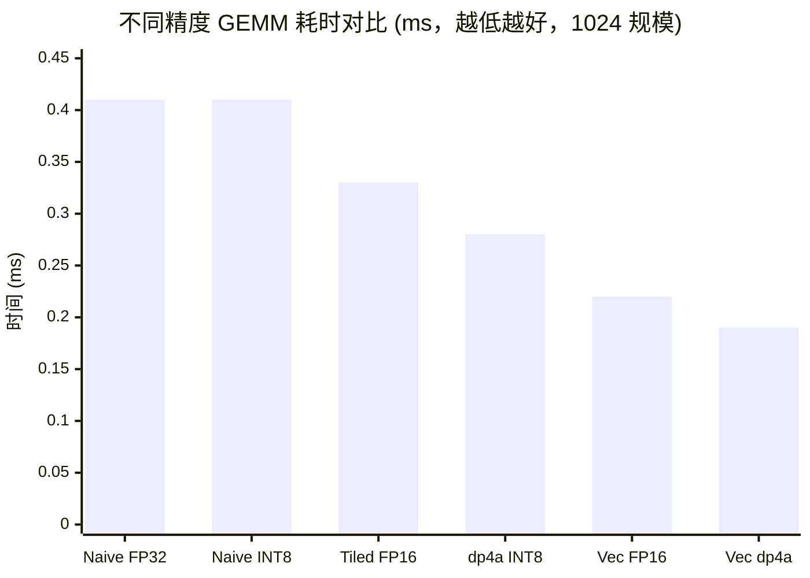

# 07_Quantization — 量化基础与低精度算子

## 一、全景导览与学习目标

本子项目属于 CUDA-Practice 学习体系的 **部署与量化推理（L3）** 阶段。随着大模型参数量激增，FP32 计算已成为显存容量和带宽的绝对瓶颈。量化技术（Quantization）通过将高精度浮点数压缩为低精度格式（FP16/INT8），以极小的精度损失换取显著提升的吞吐量和内存效率。

三个源文件涵盖了量化的核心链路：

| 文件 | Kernel 列表 | 核心技术 | 适用场景 |
|------|------------|----------|---------|
| `01_fp16_gemm/fp16_gemm.cu` | `kernel_naive_fp16_gemm`<br>`kernel_tiled_fp16_gemm`<br>`kernel_vectorized_fp16_gemm` | `half` 数据类型、`__half2` 向量化 | 通用推理加速 |
| `02_int8_gemm/int8_gemm.cu` | `naive_int8_gemm`<br>`dp4a_int8_gemm`<br>`vectorized_int8_gemm` | `__dp4a` 硬件指令、四位一体点积 | 极致吞吐量推理 |
| `03_quant_dequant/quant_dequant.cu` | `quantize_per_tensor`、`dequantize_per_tensor`<br>`quantize_per_channel`<br>`fp32_to_fp16`、`fp16_to_fp32` | 对称/非对称量化、Per-Channel 缩放 | 权重预处理与加载 |

---

## 二、原理推导与数学表达

### 1. 绝对最大值对称量化（Absmax Quantization）

将 FP32 数据无符号地映射到 INT8 空间 $[-127, 127]$：

$$s = \frac{127}{\max(|X|)}$$

$$X_{int8} = \text{round}(s \cdot X_{fp32})$$

$$X_{dequantized} = \frac{X_{int8}}{s}$$

- **Per-Tensor**：整个张量共享一个 Scale $s$，计算最快但受异常点（Outliers）影响极大。
- **Per-Channel**：每行/每列（如 LLM 的 Hidden Dimension）独立计算 $s$，极大缓解异常点导致的精度崩塌。

### 2. INT8 GEMM 与缩放复原

对于 $C = A \times B$，若 $A$ 和 $B$ 按行/列分别量化为 INT8 矩阵 $\hat{A}$、$\hat{B}$，Scale 数组为 $s_A$、$s_B$：

$$C_{i,j} \approx \frac{1}{s_{A,i} \cdot s_{B,j}} \sum_{k} \left( \hat{A}_{i,k} \cdot \hat{B}_{k,j} \right)$$

核心计算全在 INT8 域完成，只在最终写回或累加时乘回 FP32 的 Scale。

---

## 三、硬核内存映射解析

### dp4a 并行点积指令示意图

NVIDIA 的 `__dp4a(int a, int b, int c)` 是 INT8 计算的杀手锏。它在一个时钟周期内，将两个 32-bit 寄存器（各自打包了 4 个 8-bit 整型）执行 4 次独立乘法，并将结果累加到一个 32-bit 整型寄存器 `c` 中。



**性能优势**：传统方式计算 4 对 INT8 相乘需要 4 次乘法 + 3 次加法指令；`__dp4a` 将其压缩为 **1 条指令**，吞吐量直接翻倍。

---

## 四、关键源码逐行解剖

### Vectorized dp4a 核函数（来自 `int8_gemm.cu` 的 `vectorized_int8_gemm`）

```cuda
CInt col = (blockIdx.x * blockDim.x + threadIdx.x) * 4; // 每个线程处理 4 列
int32_t sum0 = 0, sum1 = 0, sum2 = 0, sum3 = 0;

for (int i = 0; i < N; i += 4) {
    // A 按行一次读取 4 个 INT8 (打包为 1 个 int32_t)
    int32_t a_val = *reinterpret_cast<const int32_t*>(&A[row * N + i]);
    
    // B 的 4 行各读取 4 字节 (横向向量化)，再按列 unpack 重组
    int32_t b_row0_pack = *reinterpret_cast<const int32_t*>(&B[(i + 0) * K + col]);
    int32_t b_row1_pack = *reinterpret_cast<const int32_t*>(&B[(i + 1) * K + col]);
    // ... b_row2_pack, b_row3_pack 同理
    
    // 提取每列对应的 4 个 INT8 并重新打包为 int32_t
    // 例如 col0_val = [b_row0[col+0], b_row1[col+0], b_row2[col+0], b_row3[col+0]]
    int32_t col0_val = ((r3_c0 & 0xFF) << 24) | ((r2_c0 & 0xFF) << 16)
                     | ((r1_c0 & 0xFF) << 8)  | (r0_c0 & 0xFF);
    // col1_val, col2_val, col3_val 同理
    
    // 4 次 dp4a 分别累加到 4 个输出列
    sum0 = compat_dp4a(a_val, col0_val, sum0);
    sum1 = compat_dp4a(a_val, col1_val, sum1);
    sum2 = compat_dp4a(a_val, col2_val, sum2);
    sum3 = compat_dp4a(a_val, col3_val, sum3);
}
// 存回 4 个 int32_t (即一个 int4) 到 C
*reinterpret_cast<int4*>(&C[row * K + col]) = make_int4(sum0, sum1, sum2, sum3);
```

**极致压榨策略**：

1. **显存端**：A 的 `reinterpret_cast<int32_t>` 将 4 个 INT8 打包为一次 32-bit 读取；B 按行读取后在寄存器中按列 unpack 重组，最终写出时用 `int4`（128-bit）一次性写回 4 列结果。
2. **计算端**：每轮迭代产生 4 次 `compat_dp4a`（内部调用 `__dp4a`），每次消耗 4 对 INT8 乘加运算，4 列并行处理使指令流水线持续满载。

---

## 五、性能基准与分析

> 所有数据提取自 `Results/07_Quantization.md` 真实日志，测试硬件：NVIDIA GeForce RTX 4090（sm_89）× 2，Linux，nvcc -O3。

### 1. 数据转换与量化开销（`quant_dequant`，10M 元素，100 次平均）

| 操作类型 | Kernel 时间 | 有效带宽 | vs CPU 加速比 |
|----------|------------|---------|------------|
| FP32 → FP16 (Cast) | 0.02 ms | 2911.98 GB/s | 4432× |
| FP16 → FP32 (Cast) | 0.02 ms | 2923.45 GB/s | 2567× |
| **FP32 → INT8 (Per-Tensor)** | **0.02 ms** | **2166.62 GB/s** | **3580×** |
| FP32 → INT8 (Per-Channel) | 0.03 ms | 1762.77 GB/s | 2985× |

**分析**：数据类型的直接转换（Cast）在 GPU 上几乎无开销，带宽直逼缓存峰值（均超过 2000 GB/s）。即便引入除法和 Rounding 的 Per-Tensor 量化，耗时也仅为 0.02 ms。

### 2. FP16 GEMM（$1024 \times 1024$，10 次平均）

| 版本 | Kernel 时间 | 计算吞吐 | vs Naive 加速比 |
|------|------------|---------|---------------|
| Naive FP16 GEMM | 0.42 ms | — | 1× |
| Tiled FP16 GEMM | 0.33 ms | — | 1.28× |
| **Vectorized (`half2`) FP16** | **0.22 ms** | **9.70 TFLOPS** | **1.91×** |

*注：`half2` 向量化可将一对相邻的 FP16 数据打包，配合 `__hfma2` 指令在相同周期内完成双重乘加，是 FP16 计算的核心优化。*

### 3. INT8 GEMM（$1024 \times 1024$，10 次平均）

| 版本 | Kernel 时间 | 计算吞吐 | vs Naive 加速比 |
|------|------------|---------|---------------|
| Naive INT8 GEMM | 0.41 ms | — | 1× |
| `dp4a` INT8 GEMM | 0.28 ms | — | 1.48× |
| **Vectorized `dp4a` (int4)** | **0.19 ms** | **11.31 TOPS** | **2.14×** |



**精度红利分析**：

- 在同样的 Vectorized Tiling 下，FP16 耗时 0.22ms，而 INT4(dp4a) 耗时 0.19ms。由于 1024 矩阵规模较小，两者的主要瓶颈均在 Kernel 启动和初始访存上，但 INT8 的 11.31 TOPS 仍在纯计算环节展现了霸主地位（RTX 4090 的 FP16 无 Tensor Core 峰值约为 82 TFLOPS，INT8 标量峰值约为主频优势下的高 TOPS）。

---

## 六、编译及参考资料

### 编译与运行

```bash
# 从项目根目录配置（首次）
cmake -B build -DCMAKE_BUILD_TYPE=Release

# 编译三个目标
cmake --build build --target fp16_gemm -j8
cmake --build build --target int8_gemm -j8
cmake --build build --target quant_dequant -j8

# 标准运行
./build/07_Quantization/01_fp16_gemm/fp16_gemm
./build/07_Quantization/02_int8_gemm/int8_gemm
./build/07_Quantization/03_quant_dequant/quant_dequant

# Nsight Compute 分析 (探究 dp4a 的 sm__inst_executed 占比)
ncu --metrics sm__throughput.avg.pct_of_peak_sustained_elapsed,\
sm__inst_executed_pipe_tensor.sum,\
sm__inst_executed_pipe_adu.sum \
./build/07_Quantization/02_int8_gemm/int8_gemm
```

### 参考资料

- [NVIDIA Developer Blog: Mixed Precision Training](https://developer.nvidia.com/blog/mixed-precision-training-deep-neural-networks/) — 介绍 FP16 在深度学习中的缩放（Loss Scaling）与应用原理
- [NVIDIA PTX ISA: DP4A Instruction](https://docs.nvidia.com/cuda/parallel-thread-execution/index.html#integer-arithmetic-instructions-dp4a) — 彻底理解 dp4a 点积汇编指令的结构规划
- [SmoothQuant: Accurate and Efficient Post-Training Quantization for Large Language Models](https://arxiv.org/abs/2211.10438) — MIT 韩松团队提出的经典量化论文，解释为何 Per-Channel 解决异常值至关重要
