# 08_Advanced 进阶系统级编排与生态拓展

## 一、 全景导览与学习目标

该子项目处于 CUDA-Practice 学习体系的 **系统架构工程师 (L3/L4)** 阶段。当单个 Kernel 的极致优化（如 Shared Memory、Warp Primitive、寄存器打满）已经走到尽头时，性能的瓶颈往往转移到了 CPU 与 GPU 之间的通讯、以及粗粒度的任务编排上。

本章跳出“怎么写好一个 Kernel”的局限，从宏观的 CPU/GPU 交互系统层次，展示如何榨干设备的吞吐流水线并融入现代 AI 框架生态：

- `01_cuda_graphs`：**彻底消灭 CPU 发射开销**。针对由大量且执行时间极短的小 Kernel 组成的流水线，演示如何使用 CUDA Graphs (`cudaGraphLaunch`) 将整个拓扑打包图结构，一次性跨过 PCIe 送给 GPU 驱动执行。
- `02_multi_stream`：**压榨时空重叠 (Overlap)**。教你切片大规模数据，利用 Pinned 锁页内存与多个 `cudaStream_t` 异步协同，实现 H2D拷贝、Compute、D2H 拷贝的三重流水线掩盖。
- `03_pytorch_extension`：**工业级实战接轨**。抛弃冗余的 Python 循环，使用 PyBind11 和 `torch/extension.h` 将原生 C++ CUDA 代码无缝编译打包，使其直接成为可对梯度求导的顶层 PyTorch 算子。

---

## 二、 原理推导与数学表达

### 1. 复合流水线图拓展

在 `01_cuda_graphs` 中，程序需要极速处理连续的数学步骤：
$$ G_i = \left( A_i + B_i \right) \cdot D_i + F_i $$
对应的拓扑包含三个序贯执行但数据互斥的 Kernel：`Add -> Mul -> Add`。传统的串行化会由于 CPU 向 GPU API 发起 `cudaLaunch` 而带来大约 5~10$\mu s$ 的硬件级指令空窗。通过图化（Graph），消弭了这一系统级截断误差。

### 2. 自定义 Swish 激活函数偏导推导

对于 `03_pytorch_extension` 来说，想要融入深度学习体系，不仅要写前向（Forward），还必须写微积分反向传播（Backward）。
前向函数 Swish 定义为（带有 sigmoid）：
$$ \text{Swish}(x) = x \cdot \sigma(x) = \frac{x}{1 + e^{-x}} $$

反向传播，根据链式求导法则 $d(Swish)/dx$ ：
$$ \sigma'(x) = \sigma(x)(1 - \sigma(x)) $$
$$ \frac{d}{dx}\text{Swish}(x) = \sigma(x) + x \cdot \sigma'(x) = \sigma(x) + x \cdot \sigma(x)(1 - \sigma(x)) $$
$$ \frac{d}{dx}\text{Swish}(x) = \text{Swish}(x) + \sigma(x)(1 - \text{Swish}(x)) $$
故在反向 Kernel 中，梯度传导为：$grad\_x = grad\_y \times \left( \text{Swish}(x) + \sigma(x)(1 - \text{Swish}(x)) \right)$。

---

## 三、 硬核并发映射解析

### 多流 (Multi-Stream) 异步掩盖时序连线图

传统的 `cudaMemcpy` 会导致系统强行截断堵塞。在 `02_multi_stream` 中，借由 `cudaMemcpyAsync` 切分数据集 (Chunking)，我们使显存传输与张量计算打起时间差。

以配置 `num_streams = 4` 为例，理论完美流水线的时间甘特图（Gantt）模型如下：

```mermaid
gantt
    title CUDA 4-Stream 并发隐藏传输瓶颈 (Pipeline Overlap)
    dateFormat  s
    axisFormat  %S
    
    section Stream 0
    H2D (Chunk 0)   :crit, s01, 0, 1s
    Compute (Ch 0)  :active, s02, after s01, 2s
    D2H (Chunk 0)   :s03, after s02, 1s
    
    section Stream 1
    H2D (Chunk 1)   :crit, s11, after s01, 1s
    Compute (Ch 1)  :active, s12, after s11, 2s
    D2H (Chunk 1)   :s13, after s12, 1s
    
    section Stream 2
    H2D (Chunk 2)   :crit, s21, after s11, 1s
    Compute (Ch 2)  :active, s22, after s21, 2s
    D2H (Chunk 2)   :s23, after s22, 1s

    section Stream 3
    H2D (Chunk 3)   :crit, s31, after s21, 1s
    Compute (Ch 3)  :active, s32, after s31, 2s
    D2H (Chunk 3)   :s33, after s32, 1s
```



**💡 核心洞察**：

1. **引擎隔离**：现代 GPU 通常拥有一套独立的 Copy Engine (负责 PCI-e 搬运) 和一套 Compute Engine (负责 ALU)。
2. **阶梯式掩盖**：当 Stream 0 算完开始往回调取数据的同时，Stream 1 正在进行高强度计算，Stream 2 正在加载。整个系统的管道处于饱和状态。
3. **注意**：这一切的前提是主机必须采用**锁页内存（Pinned Memory / cudaMallocHost）**，否则操作系统级别的 Paging 机制会强行挂起阻塞流的独立运转。

---

## 四、 关键源码逐行解剖

### 1. CUDA Graph 的一击打包与录制 (Stream Capture)

节选自 `01_cuda_graphs/cuda_graphs.cu`：

```cpp
// 🚀 技巧 1: 开启“录像机”。在这之后通过 stream 参数发射的所有动作均不实际执行，而是构造成图
CUDA_CHECK(cudaStreamBeginCapture(stream, cudaStreamCaptureModeGlobal));

add_func<<<grid, block, 0, stream>>>(d_A, d_B, d_C, n);
mul_func<<<grid, block, 0, stream>>>(d_C, d_D, d_E, n);
add_func<<<grid, block, 0, stream>>>(d_E, d_F, d_G, n);

// 🚀 技巧 2: “按下停止键”，吐出一个定义好的黑盒 cudaGraph_t
CUDA_CHECK(cudaStreamEndCapture(stream, &graph));

// 取出缓存预编译配置并创建实例
CUDA_CHECK(cudaGraphInstantiate(&instance, graph, nullptr, nullptr, 0));

// 🚀 技巧 3: 主循环中彻底舍弃繁琐的多次 Launch，只要 1 个指令就能瞬间把 3 个 Kernel 按拓扑点燃！
for (int i = 0; i < iterations; ++i) {
    CUDA_CHECK(cudaGraphLaunch(instance, stream));
}
```

**为什么快？** CPU 不必跑 `cudaLaunch` -> `等 PCIe 队列` -> `再跑一次` 的长闭环，规避了大量 Driver 层序贯响应的 microseconds 盲区。

### 2. PyTorch ATen C++ 生态嫁接

节选自 `03_pytorch_extension/pytorch_extension.cu`：

```cpp
#include <torch/extension.h>

// 宏包装使得原生 CMake 和 PyTorch 的 JIT 可以同源兼容
#ifdef BUILD_PYTORCH_EXTENSION

// 直接接受 PyTorch 的原生 Tensor！
torch::Tensor swish_forward_cuda(torch::Tensor x) {
    // 防御性编程：确认存在于显卡且是内存连续块
    TORCH_CHECK(x.device().is_cuda(), "x must be a CUDA tensor");
    TORCH_CHECK(x.is_contiguous(), "x must be contiguous");

    // 不用操心显存泄漏，使用 PyTorch 内存池安全分配！
    auto y = torch::empty_like(x);

    // .data_ptr<float>() 直接剥去 Tensor 的 Python 皮，拿到纯净的裸露 device memory 指针
    swish_forward_kernel<<<grid, block>>>(x.data_ptr<float>(), y.data_ptr<float>(), n);

    return y; // 返回到 Python
}

// pybind11 将 C++ 函数映射为 Python 中的 model.forward()
PYBIND11_MODULE(TORCH_EXTENSION_NAME, m) {
    m.def("forward", &swish_forward_cuda, "Swish forward (CUDA)");
}
```

---

## 五、 性能基准与分析

所有数据提取自 `Results/08_Advanced.md` 真实日志：

- **测试硬件**: NVIDIA GeForce RTX 4090 (sm_89) × 2, Linux 环境, nvcc -O3

### 1. 多小任务流水下的 CPU 强释放测试 (Graphs)

测试条件：$1 \times 10^5$ Elements 极小矩阵，$1000$ 迭代圈数。针对此等“小米加步枪”的负载，发射损耗严重侵蚀计算周期。

| 发射模式 | 平均 Kernel 流水耗时 | CPU 发射开销减免比例 |
| -------- | ----------- | ------------- |
| 传统多重 Stream 发射 | $0.0049 \text{ ms}$ | 基准标尺 |
| **CUDA Graph 捕获图层** | **$0.0042 \text{ ms}$** | **1.18x** (降本增效) |

### 2. 宽带重叠：Multi Stream 掩盖测试

测试算子：$C = A \cdot \sin(B) + B \cdot \cos(A)$，规模极大：$16\text{M}$ ($192\text{MB}$)，4排队长度。

| 版本 | Pipeline 周期总时段 | vs 单流并发效率 | 状态分析 |
| ---- | ------------------- | --------------- | -------- |
| 串行阻塞 单流 | $15.55 \text{ ms}$ | 基准 1.0x | H2D, 计算, D2H 互相等待 |
| **流水线 4-Streams 并发**| **$13.73 \text{ ms}$** | **1.13x 加速** | 引擎彻底排满，掩盖了约 $2 \text{ms}$ 物理搬运窗口 |

### 3. Pytorch Extension 工业测速 (Swish)

$10\text{M}$ 元素 ($40\text{MB}$单体显存) 级 Activation 极限压榨：

| 执行阶段 | CPU (PyTorch 原生模拟) | C++/CUDA Extension (GPU) | 硬件吞吐量 | TFLOPS/带宽评估 |
| -------- | ---------------- | -------------- | ----------- | ------------- |
| Forward  | $30.30 \text{ ms}$ | $\mathbf{0.08 \text{ ms}}$ | 369.13x 加速 | $1022.08 \text{ GB/s}$ (L2缓存爆表) |
| Backward | $46.01 \text{ ms}$ | $\mathbf{0.13 \text{ ms}}$ | 342.43x 加速 | $936.41 \text{ GB/s}$ (接近 RTX 4090物理极限)|

````mermaid
xychart-beta
  title "高并发：流架构与CPU发射时延阻绝评测 (越低越好)"
  x-axis ["Stream 串行延时(ms)", "Stream 并发延时(ms)", "传统发射(×0.1ms)", "Graph发射(×0.1ms)"]
  y-axis "执行延时相对刻度" 0 --> 16
  bar [15.55, 13.73, 0.49, 0.42]
````

*(注：为对齐柱状图刻度，图中 Graph 测试被进行了 100x 放缩)*

**💡 宏观性能启示录**:

1. 当每次执行时间连一微秒 (`0.00x ms`) 都不到时，我们发现瓶颈甚至不在显卡上！CUDA Graphs 帮系统剥离多余的心跳应答，将 18% 可鄙的额外开销丢进了垃圾桶。
2. Swish 的测试呈现了教科书级别的 **Bandwidth-Bound** 场景：反向传播 (Backward) 需要同时汲取 $Y_{grad}$ 参数和缓存的 $X$，其读 2 阵列、写 1 阵列的 $936 \text{ GB/s}$ 指标证明该定做 Extension 已触达卡皇最深处（RTX4090 真机实测极值一般也就是 $\sim{950 \text{ GB/s}}$）。

---

## 六、 编译及参考资料

### 编译与标准运行指令

借助根目录的统一 `CMakeLists.txt` 构建目标：

```bash
# 1. 切换至项目根目录并执行整体配置（首次构建）
cmake -B build -DCMAKE_BUILD_TYPE=Release

# 2. 独立编译对应的子项目 Target 
cmake --build build --target cuda_graphs -j8
cmake --build build --target multi_stream -j8
cmake --build build --target pytorch_extension -j8

# 3. 运行基础验证程序进行观测
./build/08_Advanced/01_cuda_graphs/cuda_graphs
./build/08_Advanced/02_multi_stream/multi_stream
./build/08_Advanced/03_pytorch_extension/pytorch_extension

# 4. (使用 Nsight Compute 观测 Multi-Stream 并发的总吞吐占比)
ncu --metrics sm__throughput.avg.pct_of_peak_sustained_elapsed,dram__throughput.avg.pct_of_peak_sustained_elapsed ./build/08_Advanced/02_multi_stream/multi_stream
```

### 推荐阅读

- [CUDA C++ Programming Guide - Asynchronous Concurrent Execution](https://docs.nvidia.com/cuda/cuda-c-programming-guide/index.html#asynchronous-concurrent-execution) —— NVDIA 官方阐述 streams, event 与 overlap 的原典。
- [Getting Started with CUDA Graphs](https://developer.nvidia.com/blog/cuda-graphs/) —— NVIDIA Developer 博客：如何正确捕捉和启动内核图表。
- [PyTorch Custom C++ and CUDA Extensions](https://pytorch.org/tutorials/advanced/cpp_extension.html) —— 首选必备的 Pybind11 / Torch C++ 库联编接口权威指南。
