# 08_Advanced — 异构系统高级优化与框架集成

## 一、全景导览与学习目标

本子项目属于 CUDA-Practice 学习体系的**工程架构优化（L3）**阶段。随着单个 Kernel 的性能被榨干，系统级瓶颈（如 CPU 发射开销、Host-Device 数据传输等待、框架层调用隔离）开始显著影响端到端吞吐量。

本模块从全栈视角出发，通过三种工业级高级技术打破系统壁垒：

| 文件 | 核心技术 | 优化目标 | 适用场景 |
|------|----------|---------|---------|
| `02_multi_stream/multi_stream.cu` | **Multi-Stream 并发** | 掩盖 H2D/D2H PCIe 传输延迟 | 数据流水线、音视频处理 |
| `01_cuda_graphs/cuda_graphs.cu` | **CUDA Graphs 计算图** | 消除 CPU 端繁重的 Kernel 启动开销 | 极短耗时 Kernel 密集循环（如 GNN、小模型推断） |
| `03_pytorch_extension/pytorch_extension.cu` | **C++ / pybind11 扩展** | 打通框架层，消除 Python 解释器墙 | 自定义算子接入 PyTorch（如 Swish 激活） |

---

## 二、原理推导与机制解析

### 1. 流水线并发隐藏延迟（Multi-Stream）

默认情况下，单流（Stream 0）内的命令是严格串行执行的。H2D（显存复制）、Kernel Compute 和 D2H 依次排队，导致 PCIe 总线与 GPU 计算单元在多数时间处于闲置状态。

多流技术将大块数据均分为 $N$ 份，每份分配给独立的异步流。利用现代 GPU 独立的 Copy Engin e和 Kernel Engine，实现 **Compute** 与 **Transfer** 相互掩盖：

$$T_{\text{async}} \approx \text{MemCopy}_{H2D\_segment} + \max(T_{H2D\_segment}, T_{compute}, T_{D2H\_segment}) \times N + \text{MemCopy}_{D2H\_segment}$$

### 2. CUDA Graphs 发射降维

传统启动 Kernel 时，CPU 需执行驱动程序的参数打包、总线握手等底层操作，耗时约 **1~5 µs**。当单 Kernel 执行时间（如 $10 \mu s$）接近启动时间时，系统陷入 **CPU Bound**。

**CUDA Graphs** 将拓扑结构在预备期锁定进入驱动缓存。运行时，CPU 只需 1 条指令即可发射含有百个节点的完整图，每次重启的额外开销降至纳米级（~0.1 µs）。

---

## 三、硬核时序与流图解析

### 四流（4-Stream）并发流水线甘特图

```mermaid
gantt
    dateFormat  s
    title 单流串行 vs 4-Stream 并发时序对比
    axisFormat %S
    
    section 单流 (串行)
    H2D (Chunk 1-4)     :a1, 0, 4s
    Kernel (Chunk 1-4)  :a2, after a1, 4s
    D2H (Chunk 1-4)     :a3, after a2, 4s
    
    section Stream 1
    H2D (Chunk 1)       :b1, 0, 1s
    Kernel (Chunk 1)    :b2, after b1, 1s
    D2H (Chunk 1)       :b3, after b2, 1s
    
    section Stream 2
    H2D (Chunk 2)       :c1, 1, 1s
    Kernel (Chunk 2)    :c2, after c1, 1s
    D2H (Chunk 2)       :c3, after c2, 1s

    section Stream 3
    H2D (Chunk 3)       :d1, 2, 1s
    Kernel (Chunk 3)    :d2, after d1, 1s
    D2H (Chunk 3)       :d3, after d2, 1s

    section Stream 4
    H2D (Chunk 4)       :e1, 3, 1s
    Kernel (Chunk 4)    :e2, after e1, 1s
    D2H (Chunk 4)       :e3, after e2, 1s
```



*说明：蓝色段为 PCIe 传输，黄色段为计算。多流使得 GPU 和 PCIe 控制器在极高密度的重叠区满载。*

### PyTorch C++ Extension 编译与调用链

```mermaid
graph TD
    PY[PyTorch Python 脚本\n import my_extension] --> |pybind11 接口层| CPP[C++ Wrapper\nTORCH_EXTENSION_NAME]
    CPP --> |ATen 张量转指针\ntensor.data_ptr<float>()| CU[CUDA 核函数\n custom_swish_kernel]
    CU --> GPU((GPU 硬件计算))
```

---

## 四、关键源码逐行解剖

### 多流异步并发核心（来自 `multi_stream.cu`）

```cpp
// 关键前提：必须分配 Pinned Memory（锁页内存），使 DMA 控制器能不经 CPU 强制搬运
cudaHostAlloc((void**)&h_A, bytes, cudaHostAllocDefault);

// 循环分发给不同 Stream
for (int i = 0; i < NUM_STREAMS; ++i) {
    int offset = i * streamSize;
    
    // 异步拷贝 H2D (传入具体流 stream[i])
    cudaMemcpyAsync(&d_A[offset], &h_A[offset], streamBytes, cudaMemcpyHostToDevice, streams[i]);
    
    // 异步 Kernel 启动 (指定 stream[i])
    compute_kernel<<<grid, block, 0, streams[i]>>>(&d_A[offset], &d_out[offset], streamSize);
    
    // 异步拷贝 D2H
    cudaMemcpyAsync(&h_out[offset], &d_out[offset], streamBytes, cudaMemcpyDeviceToHost, streams[i]);
}

// 最后等待系统静默
cudaDeviceSynchronize();
```

---

## 五、性能基准与分析

> 所有数据提取自 `Results/08_Advanced.md` 真实日志，测试硬件：NVIDIA GeForce RTX 4090（sm_89）× 2，Linux，nvcc -O3。

### 1. Multi-Stream 延迟掩盖测试（4 流并发，16.7 M 元素，192 MB，10 次循环）

| 版本 | Pipeline 周期时长 | 吞吐带宽 | vs 单流提速 |
|------|-----------------|---------|-----------|
| 传统单流（串行执行）| 15.55 ms | 12.34 GB/s | 基准 |
| **四流并发（流水线掩盖）**| **13.73 ms** | **14.66 GB/s** | **1.13×** |

**分析**：耗时从 15.55ms 缩短到 13.73ms，13% 的提升直接来源于消除 PCIe 传输空当期。在处理海量图像/视频流（H2D 耗时极高）场景下，此收益将更为可观。

### 2. CUDA Graphs 发射开销测试（100,000 元素短耗时，1000 次重启）

| 版本 | 单圈发射+执行总时长（ms）| CPU 端驱动开销 | vs 传统发射加速 |
|------|------------------------|---------------|--------------|
| 多流分步骤 Launch（基准）| 0.0049 ms | 严重占比 | 1× |
| **CUDA Graph 捕获与回放** | **0.0042 ms** | **几乎为零** | **1.18×** |

**分析**：数据量极小（仅 2.67 MB），Kernel 执行瞬间完成。多流分步骤需要 CPU 多次通过驱动发射，CUDA Graph 将整个 `(A+B)*D+F=G` 操作连绵成一个节点，发射速度提升 18%，彻底解决 CPU Launch Bound。

### 3. PyTorch Extension 算子性能（Swish 激活函数，10.4 M 元素，40 MB）

| 前/反向阶段 | Kernel 耗时 | GPU 等效内存带宽 |
|----------|------------|----------------|
| **Forward传播** | **0.08 ms** | **1022.08 GB/s** |
| **Backward回传** | **0.13 ms** | **936.41 GB/s** |

**分析**：在 Python 端直接写 `x * torch.sigmoid(x)` 会生成多个独立的中间变量张量存取；自定义 C++ 扩展通过单个融合 Kernel，带宽利用率直达硬件极限（1022 GB/s，RTX 4090 DRAM 峰值 1008 GB/s，包含 Cache 命中红利）。

---

## 六、编译及参考资料

### 编译与运行

```bash
# 从项目根目录配置（首次）
cmake -B build -DCMAKE_BUILD_TYPE=Release

# 编译 C++ 二进制核心
cmake --build build --target multi_stream -j8
cmake --build build --target cuda_graphs -j8

# 运行基础测试
./build/08_Advanced/01_cuda_graphs/cuda_graphs
./build/08_Advanced/02_multi_stream/multi_stream

# 编译并测试 PyTorch Extension
# 注意：须在配有 Python、PyTorch 和 nvcc 环境下执行
cd 08_Advanced/03_pytorch_extension
python setup.py install
python test_swish.py
```

### 参考资料

- [NVIDIA Developer Blog: How to Overlap Data Transfers in CUDA C/C++](https://developer.nvidia.com/blog/how-overlap-data-transfers-cuda-cc/) — 官方剖析 `cudaMemcpyAsync` 与异步流重叠的经典教程
- [Getting Started with CUDA Graphs](https://developer.nvidia.com/blog/getting-started-with-cuda-graphs/) — Stream Capture 构建 CUDA Graph 的实现原理
- [PyTorch Docs: Custom C++ and CUDA Extensions](https://pytorch.org/tutorials/advanced/cpp_extension.html) — 官方编写 ATen 指针转换与 pybind11 打包的最全指南
