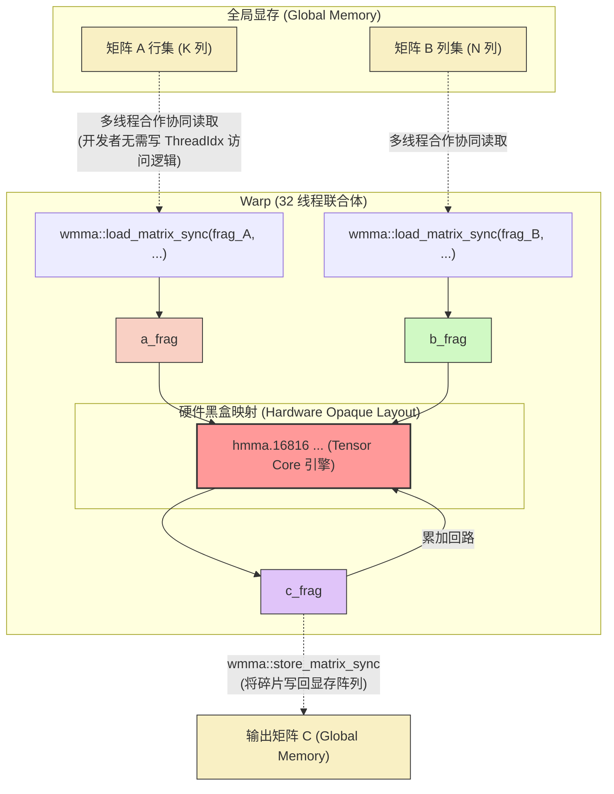

# 09_Tensor_Core 硬件加速核心与混合精度

## 一、 全景导览与学习目标

该子项目处于 CUDA-Practice 学习体系的 **前沿级 (L4)** 阶段。在深度学习的繁荣时代，仅靠传统的 CUDA Core (ALU) 进行标量或小向量乘加已经无法满足指数级增长的算力需求。NVIDIA 自 Volta 架构起引入了**张量核心 (Tensor Core)**，专门用于极速吞吐矩阵乘加运算 (MMA)。

本章打破常规线程级编程模型，直接调用硬件级 MMA 指令：

- `01_wmma_gemm`：**Tensor Core API 启蒙**。演示如何使用 `nvcuda::wmma` (Warp Matrix Multiply-Accumulate) 命名空间下的 API，让一个 32 线程的 Warp 像一个整体一样，在一个指令周期内吐出 $16 \times 16 \times 16$ 矩阵块的乘加结果。
- `02_mixed_precision`：**混合精度真理**。演示在大语言模型（LLM）等前沿领域最标准的操作规范：以低精度（`FP16` / `half`）读取数据以节约带宽，但使用高精度（`FP32` / `float`）矩阵容器进行无损累加，实现算力与精度的双赢。

---

## 二、 原理推导与数学表达

### 1. 硬件级矩阵乘加形变 (MMA)

传统的 CUDA Kernel 是“以线程为视角”定义计算性质：每个线程计算输出矩阵 $C$ 的一个点（或切片）。
$$ C_{i, j} += A_{i, k} \times B_{k, j} $$

在 WMMA 模型中，计算的视角被拉升到了**Warp (32 线程整编)**。
一个 Warp 的基本工作单元不再是标量，而是一个固定维度的矩阵瓦片（Tile）。以 $m=16, n=16, k=16$ 为例：
$$ \mathbf{C}_{16 \times 16} = \mathbf{A}_{16 \times 16} \times \mathbf{B}_{16 \times 16} + \mathbf{C}_{16 \times 16} $$
在这个等式中，无论内存怎么交错分配，开发者不再需要精确计算“几号线程拿取几号数据”，而是通过 `wmma::fragment` 将矩阵的搬运代理给底层的硬件寄存器微架构。

### 2. 混合精度 (Mixed Precision) 累加保真

在 `02_mixed_precision` 中，张量元素的数学定义发生了类型突变：
$$ \mathbf{C}^{FP32}_{16 \times 16} = \sum \left( \mathbf{A}^{FP16}_{16 \times 16} \times \mathbf{B}^{FP16}_{16 \times 16} \right) + \mathbf{C}^{FP32}_{16 \times 16} $$
在 `FP16` 中计算 $A \times B$，由于单次乘法的尾数位较短，舍入误差还未显露；但当进行大规模 $K$ 维度的 `+` 累加时，若继续用 `FP16`，很容易因为“大树吃小树”的对齐机制出现数值吞没现象。因此，将其强制送入 `FP32` `wmma::accumulator` 保证了反向传播梯度的无损累加。

---

## 三、 硬核内存映射解析 (WMMA)

在 WMMA 编程中，线程的概念被“Warp 协同隐喻”所取代。数据在进入 Tensor Core 之前，必须从 Global/Shared Memory 加载进被称为 `fragment` (碎片) 的黑盒硬件寄存器组中。



**💡 核心洞察**：

1. **黑盒化 (Opaque Layout)**：`wmma::fragment` 内在 32 个寄存器中的真实分布是由硬件体系结构（Volta、Ampere、Ada 互不相同）完全决定的。官方严禁玩家使用传统思维去越界访问 fragment 的下标，只能通过专用函数集体进行算术读写。
2. **粒度上升**：由于是以 `Warp` 为原子操作粒度，因此在配置 `blockDim` 时，必须保证其大小是 32 的整数倍（例如典型的 $32 \times 8 = 256$ 线程，即 8 个 Warp 矩阵阵列）。

---

## 四、 关键源码逐行解剖

### Tensor Core 的“四步标准舞”

节选自 `09_Tensor_Core/02_mixed_precision/mixed_precision.cu`，这是激活硬件张量加速引擎的起手式套路代码：

```cpp
// 🚀 舞步 1: 声明黑盒矩阵碎片 (Fragments)
// 语法：wmma::fragment<角色, M, N, K, 数据类型, [内存布局]>
wmma::fragment<wmma::matrix_a, 16, 16, 16, half, wmma::row_major> a_frag;
wmma::fragment<wmma::matrix_b, 16, 16, 16, half, wmma::row_major> b_frag;

// ⚡ 混合精度核心所在：Accumulator 坚决设定为 float 类型！
wmma::fragment<wmma::accumulator, 16, 16, 16, float> c_frag; 

// 先将 C 的累加器全部填 0 初始化
wmma::fill_fragment(c_frag, 0.0f);

for (int k = 0; k < K; k += 16) {
    // 🚀 舞步 2: 同步加载数据 (Load)
    // 一个 Warp 的 32 个线程会自动分工，将 A[warpM][k] 和 B[k][warpN] 起始的块咬进寄存器
    wmma::load_matrix_sync(a_frag, A + warpM * K + k, K);
    wmma::load_matrix_sync(b_frag, B + k * N + warpN, N);
    
    // 🚀 舞步 3: 瞬间爆发矩阵聚变 (MMA)
    // 硬件级发令枪，在 1 个指令周期内直接完成 16x16x16 的 FP16*FP16+FP32 密集运算
    wmma::mma_sync(c_frag, a_frag, b_frag, c_frag);
}

// 🚀 舞步 4: 回收结果 (Store)
wmma::store_matrix_sync(C + warpM * N + warpN, c_frag, N, wmma::mem_row_major);
```

**为什么这不能随意改动？**
API 名称带 `_sync` 特征词是因为在 Warp 内部，所有 32 个线程必须集体抵达该函数汇合点。如果你的代码涉及 `if` 发散分支（Divergence）导致有几条线程没有参与执行该行，整个 Warp 会由于无法凑齐数据的死锁现象直接 `__CUDA_ERROR_ILLEGAL_ADDRESS__` 崩溃。

---

## 五、 性能基准与分析

所有数据提取自 `Results/09_Tensor_Core.md` 真实日志：

- **测试硬件**: NVIDIA GeForce RTX 4090 (sm_89) × 2, Linux 环境, nvcc -O3

### 1. 纯 Tensor Core API 通用测试 (FP16)

在 $2048 \times 2048$（$32\text{ MB}$）规模下，验证 Naive Tensor Core 的碾压力：

| 实现版本       | Kernel 执行时间   | 有效算力 (TFLOPS)      | 注释                                                    |
| -------------- | ----------------- | ---------------------- | ------------------------------------------------------- |
| GPU Naive WMMA | $0.56 \text{ ms}$ | $30.50 \text{ TFLOPS}$ | 没有任何 TILE 共享显存优化，仅靠 Global Mem 直接喂入 TC |

*(CPU 参照因 $2048$ 量级过巨、 $O(N^3)$ 耗时过长而在本轮自动抛弃)*

### 2. Mixed Precision：算体降维打击 (FP16->FP32)

在 $1024 \times 1024$ 规模下与传统依靠 CUDA Core 计算 FP32 的性能比较：

| 实现架构与类型                       | Kernel 时间           | 理论等价算力               | vs 纯 FP32 加速比 | 访存带宽                  |
| ------------------------------------ | --------------------- | -------------------------- | ----------------- | ------------------------- |
| 传统 Naive FP32 GEMM                 | $0.39 \text{ ms}$     | $5.45 \text{ TFLOPS}$      | 1.0x (基准)       | $31.96 \text{ GB/s}$      |
| **WMMA Mixed (FP16 $\otimes$ FP32)** | **$0.05 \text{ ms}$** | **$39.36 \text{ TFLOPS}$** | **7.21x (暴涨)**  | **$153.73 \text{ GB/s}$** |

````mermaid
xychart-beta
  title "中等矩阵 (1Kx1K) Tensor Core 降维打击耗时比较 (ms, 极低更好)"
  x-axis ["Naive FP32 (传统 CUDA_Core)", "Mixed WMMA (Tensor_Core)"]
  y-axis "执行耗时 (ms)" 0 --> 0.45
  bar [0.39, 0.05]
````

**💡 性能解析**:

1. **7.2倍吞吐量拉升的秘密**：RTX 4090 的 FP32 单精度峰值理论算力约为 $82.58 \text{ TFLOPS}$，而 Tensor Core 在无稀疏下的 `FP16` 理论峰值可达 $\sim 165 \text{ TFLOPS}$ 或更高。这是一种纯粹的硬件隔离级碾压。代码只是从写 `A[i]*B[j]` 改造成了调一把 `wmma_sync`，就引爆了被闲置的晶体管。
2. **算力饥饿与内存墙的妥协**：你能看到 $39.36 \text{ TFLOPS}$ 虽然傲视群雄，但距离显卡全负载运转 $165 \text{ TFLOPS}$ 还差得远。因为 `0.05ms` 的极速计算意味着访存带宽抽水泵 ($153.73 \text{ GB/s}$) 已经见底了（Global Mem 到 Tensor Core 的长途跋涉存在巨大延迟）。要想进一步解锁，必须回归我们在 `04` 章节中学到的：加入 **Shared Memory 分块（Tiling）**，把局部数据在片上喂饱 Tensor Core。这正是后文 CUTLASS 存在的意义。

---

## 六、 编译及参考资料

### 编译与标准运行指令

借助根目录的统一 `CMakeLists.txt` 构建目标：

```bash
# 1. 切换至项目根目录并执行整体配置（首次构建）
cmake -B build -DCMAKE_BUILD_TYPE=Release

# 2. 独立编译对应的子项目 Target 
cmake --build build --target wmma_gemm -j8
cmake --build build --target mixed_precision -j8

# 3. 运行基础验证程序进行观测
./build/09_Tensor_Core/01_wmma_gemm/wmma_gemm
./build/09_Tensor_Core/02_mixed_precision/mixed_precision

# 4. 高级分析 (检查 Tensor Core 活跃度管道)
ncu --metrics sm__throughput.avg.pct_of_peak_sustained_elapsed,sm__inst_executed_pipe_tensor.avg.pct_of_peak_sustained_active ./build/09_Tensor_Core/02_mixed_precision/mixed_precision
```

### 推荐阅读

- [Programming Tensor Cores in CUDA 9](https://developer.nvidia.com/blog/programming-tensor-cores-cuda-9/) —— NVIDA 官方技术博客首篇介绍 WMMA API 概念与 fragments 用法的划时代启蒙文。
- [NVIDIA CUDA C++ Programming Guide - Warp Matrix Functions](https://docs.nvidia.com/cuda/cuda-c-programming-guide/index.html#wmma) —— CUDA 官方接口文档中关于所有 `matrix_a`、布局（Layout）重组定义的最核心字典。
- [Mixed Precision Training (Micikevicius et al., ICLR 2018)](https://arxiv.org/abs/1710.03740) —— 百度与 NVIDIA 联合推出的关于为什么深度学习可以用 FP16 通信但必须用 FP32 累加的最经典底层基石学术论文。
