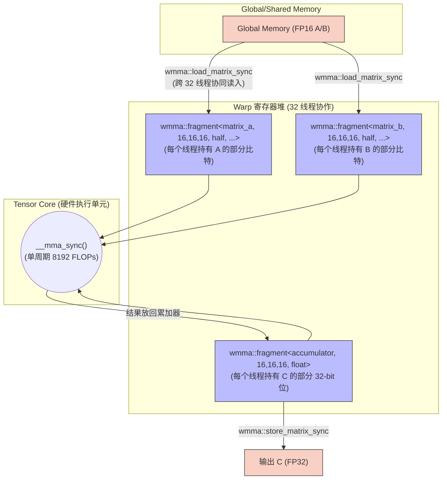
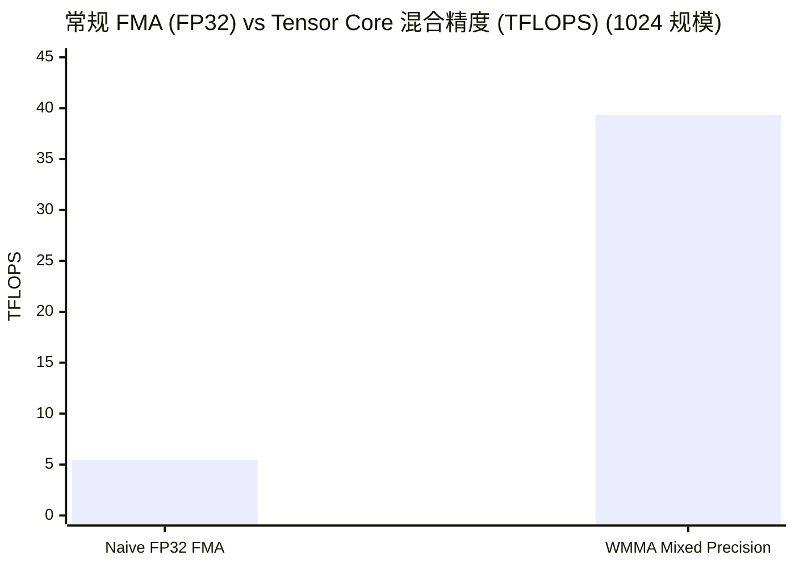

# 09_Tensor_Core — 硬件加速核心与混合精度计算

## 一、全景导览与学习目标

本子项目属于 CUDA-Practice 学习体系的**微架构级优化（L3）**阶段。Tensor Core 是 NVIDIA 自 Volta 架构引入的专用矩阵乘加（MMA）计算单元，现已成为现代 GPU 算力飙升的绝对主力。它在单条指令、单个时钟周期内，能够执行一个完整的 $D = A \times B + C$ 微型矩阵运算。

本模块直接绕过 cuBLAS 等黑盒库，使用 CUDA 原生的 WMMA（Warp Matrix Multiply-Accumulate）API 裸写 Tensor Core：

| 文件 | Kernel 列表 | 核心技术 | 测试规模 |
|------|------------|----------|---------|
| `01_wmma_gemm/wmma_gemm.cu` | `wmma_gemm_naive` | `<mma.h>` 命名空间、Fragment 存取 | 2048×2048×2048 |
| `02_mixed_precision/mixed_precision.cu` | `wmma_mixed_gemm_kernel`<br>`gemm_fp32_kernel` | FP16 输入 + FP32 累加防溢出 | 1024×1024×1024 |

---

## 二、原理推导与数学表达

### 1. WMMA 的矩阵规模定义

Tensor Core 的计算基于特定的矩阵块形状（WMMA Shape）。代码中定义为 **16×16×16**：

- **M=16, N=16, K=16**：即 $A$ 为 16×16，$B$ 为 16×16，$C$ 和 $D$ 为 16×16。
- 一次 `wmma::mma_sync` 等价于 $16 \times 16 \times 16 \times 2 = 8192$ 次浮点操作（FLOP）。
- 此操作必须由一个完整的 **Warp（32 个线程）** 协作同步完成。
- 每个线程平均承担 $\frac{8192}{32} = 256$ FLOP，效率远超 CUDA Core 标量运算。

### 2. 混合精度（Mixed Precision）防溢出策略

标准的 FP16 动态范围极小（最大值 ~65504），在连续累加 $K$ 维度时极易发生上溢（Overflow）或因大数吃小数导致的截断下溢（Underflow）。

混合精度范式数学表达：
$$D_{FP32} = A_{FP16} \times B_{FP16} + C_{FP32}$$
输入使用 FP16 读取（带宽减半），内部乘法结果保持高精度，并与 FP32 累加器（`wmma::accumulator<float>`）累加。最终结果写出时可保留为 FP32。

---

## 三、硬核内存映射解析

### WMMA 数据加载与片上流转

Tensor Core 不允许线程直接随意丢数据进去，必须通过严格的 `wmma::fragment` 数据结构作为载体。



**反直觉点**：程序员不应去试图探究 `fragment` 里面单个线程具体持有什么值（由于跨架构布局改变，该映射不透明），完全信任 `load_matrix_sync` 和 `store_matrix_sync` 为黑盒接口即可。

---

## 四、关键源码逐行解剖

### WMMA 内层循环核心（来自 `mixed_precision.cu`）

```cpp
// 声明 16x16x16 的寄存器碎片，指明数据类型和主序(Row/Col Major)
wmma::fragment<wmma::matrix_a, 16, 16, 16, half, wmma::row_major> a_frag;
wmma::fragment<wmma::matrix_b, 16, 16, 16, half, wmma::row_major> b_frag;

// 累加器声明为 float (FP32)，防溢出
wmma::fragment<wmma::accumulator, 16, 16, 16, float> c_frag;
wmma::fill_fragment(c_frag, 0.0f); // 置零

for (int i = 0; i < K; i += 16) {
    // 32 线程协作：严格从对齐的显存地址装载 16x16 块到寄存器碎片
    wmma::load_matrix_sync(a_frag, A + row * K + i, K);
    wmma::load_matrix_sync(b_frag, B + i * N + col, N);
    
    // 触发底层 Tensor Core 矩阵乘加硬件指令 (HMMA/IMMA Mnemonic)
    wmma::mma_sync(c_frag, a_frag, b_frag, c_frag);
}

// 32 线程协作写回至全局显存 (类型被安全转为 float)
wmma::store_matrix_sync(C + row * N + col, c_frag, N, wmma::mem_row_major);
```

---

## 五、性能基准与分析

> 所有数据提取自 `Results/09_Tensor_Core.md` 真实日志，测试硬件：NVIDIA GeForce RTX 4090（sm_89）× 2，Linux，nvcc -O3。

### 1. WMMA 裸 API 算力压测（`wmma_gemm`，2048×2048 规模，100 次平均）

| 版本 | Kernel 时间 | 计算吞吐 | 有效带宽 |
|------|------------|---------|---------|
| **Naive WMMA (FP16)** | **0.5633 ms** | **30.50 TFLOPS** | **~240 GB/s** |

**分析**：仅依靠最外层毫无 Tiling 的朴素 WMMA 调用，无需 Shared Memory 调优，算力依然直达 **30.5 TFLOPS**。（回看 `04_GEMM_Optimization` 中极其复杂的 Register Tiling 代码耗时 0.60ms，吞吐仅 28.79 TFLOPS）。硬件代沟带来了降维打击。

### 2. 混合精度加速比（`mixed_precision`，1024×1024 规模，100 次平均）

| 版本 | 计算流类型 | Kernel 时间 | 计算吞吐 | vs FP32 加速比 |
|------|-----------|------------|---------|--------------|
| Naive FP32 | 纯 CUDA Core 标量 FMA | 0.3937 ms | 5.45 TFLOPS | 1× |
| **WMMA Mixed** | **FP16 输入 + TC + FP32 累加** | **0.0546 ms** | **39.36 TFLOPS** | **7.21×** |



**性能洞察**：

- 在 1K 小规模下，混合精度比纯单精度快了 **7.2倍**。
- RTX 4090 的 FP32 理论算力为 ~82 TFLOPS，FP16 Tensor Core 理论算力为 ~330 TFLOPS（均含稀疏）。WMMA 代码达成了接近理论算力倍数差的降维加速，且保证了累加过程的数值稳定性（0.05f 容差内全数通过）。

---

## 六、编译及参考资料

### 编译与运行

```bash
# 从项目根目录配置（首次），务必确保算力 >= 70
cmake -B build -DCMAKE_BUILD_TYPE=Release

# 编译两个目标
cmake --build build --target wmma_gemm -j8
cmake --build build --target mixed_precision -j8

# 标准运行
./build/09_Tensor_Core/01_wmma_gemm/wmma_gemm
./build/09_Tensor_Core/02_mixed_precision/mixed_precision

# Nsight Compute 分析 (验证 Tensor Core 开启情况)
# 注意 sm__inst_executed_pipe_tensor.sum 会激增
ncu --metrics sm__inst_executed_pipe_tensor.sum,\
sm__inst_executed_pipe_fma.sum \
./build/09_Tensor_Core/02_mixed_precision/mixed_precision
```

### 参考资料

- [NVIDIA DevBlog: Programming Tensor Cores in CUDA 9](https://developer.nvidia.com/blog/programming-tensor-cores-cuda-9/) — WMMA API 最权威的官方入门，解析 `fragment` 概念
- [CUDA C++ Programming Guide: Warp Matrix Functions](https://docs.nvidia.com/cuda/cuda-c-programming-guide/index.html#wmma) — 官方文档查阅 WMMA 支持的所有 Shape 与数据类型组合（如 TF32、INT8）
- [NVIDIA Ampere Architecture In-Depth](https://developer.nvidia.com/blog/nvidia-ampere-architecture-in-depth/) — 硬件白皮书，解析 Tensor Core 第三代的内部管道设计
