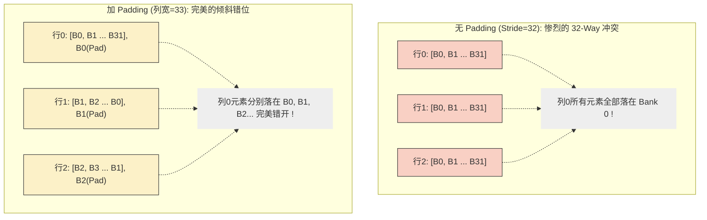

# 10_Memory_Optimization — 访存重构与带宽极限

## 一、全景导览与学习目标

本子项目属于 CUDA-Practice 学习体系的**核心瓶颈突破（L2-L3）**阶段。在 GPU 计算中，"算子多快取决于喂数据多快"（Memory Bound）。如何高效地将数据从 HBM（全局内存）搬运到 SM、再在 SM 内部的 Shared Memory 中流转，是所有高级优化的地基。

本模块直接对标硬件访存的三个最致命的性能陷阱与解法：

| 文件 | Kernel / 功能 | 优化目标 | 适用的内存层级 |
|------|--------------|---------|-------------|
| `01_coalesced_access/coalesced_access.cu` | `coalesced_access`、`strided_access`<br>`aos_access` vs `soa_access` | 消除事务合并失败、结构体内存布局改造 | **Global Memory** (HBM) |
| `02_bank_conflict/bank_conflict.cu` | `no_bank_conflict`、`with_bank_conflict`<br>`padded_no_conflict`、`analyze_bank_patterns` | 打破 Shared Memory 的串行访问降级 | **Shared Memory** (L1) |
| `03_async_copy/async_copy.cu` | `sync_copy_kernel`、`async_copy_kernel`、`pipeline_kernel` | 消除数据搬运时的计算单元闲置等待 | **Global ↔ Shared** |

---

## 二、原理推导与数学表达

### 1. Global Memory 合并访问（Coalesced Access）

GPU 的 L2 Cache/显存控制器以 **32 字节（或 128 字节）** 为一次内存事务（Transaction）的大小。同一 Warp（32 线程）发起的内存访问会被硬件尝试合并。

- **完美合并（Stride=1）**：32 个线程连续访问 32 个 `float`（128 字节），只需 1 次 128-byte 事务。带宽利用率 **100%**。
- **跨步访问（Stride=2）**：32 个线程访问的地址跨越了 256 字节，需要 2 次 128-byte 事务，其中一半数据被丢弃。带宽利用率 **~50%**。

### 2. AoS vs SoA 布局转换

- **AoS (Array of Structures)**：`[XYZ_0, XYZ_1, XYZ_2...]`。当 Warp 内线程各自读取结构体的 `X` 字段时，地址是不连续的（跨步为结构体大小）。
- **SoA (Structure of Arrays)**：`[X_0..X_n, Y_0..Y_n, Z_0..Z_n]`。线程读取各自的 `X` 时地址完美连续。

### 3. Shared Memory Bank Conflict 与 Padding

Shared Memory 被划分为 **32 个 Banks**，每个 Bank 宽度通常为 4 字节（32-bit）。
地址 $A$ 映射到的 Bank 编号计算式：
$$\text{Bank ID} = \left(\frac{A}{4}\right) \pmod{32}$$

**冲突发生**：当 Warp 中属于**不同线程**的访存请求落入**同一个 Bank** 的不同地址时，硬件必须将这些请求 **串行化（Serialize）** 处理，导致延迟成倍增加（2-way、4-way 直至最差的 32-way 冲突）。
**Padding 解法**：在声明 2D 共享内存时，将列宽增加一个奇数值（如从 32 变 33）：`__shared__ float s_data[32][33]`。这使得同一列相邻行的元素在存储时错开了 Bank。

---

## 三、硬核内存映射解析

### Shared Memory Bank 与 Padding 错位效应

设我们需要一个 `32×32` 的分块，按列访问（跨度为 32）。



### Async Copy 的多阶段流水线 (Pipeline)

传统拷贝：将数据从 Global 读到寄存器 -> 存入 Shared -> `__syncthreads` -> 计算。寄存器被当成无意义的搬运工。
异步拷贝：基于 Ampere 架构引入的 `cuda::memcpy_async`，**直接指令 DMA 将数据从 Global 搬到 Shared**，CPU/SM 让出控制权执行计算。

---

## 四、关键源码逐行解剖

### Ampere 架构异步流水线核心（来自 `async_copy.cu` 的 `pipeline_kernel`）

```cpp
#include <cuda/pipeline>

// 分片定义：3 个流水线阶段 (STAGES=3)
__shared__ float shared[STAGES][ASYNC_TILE];

cuda::pipeline<cuda::thread_scope_thread> pipe = cuda::make_pipeline();

// 预热流水线：填充 STAGES-1 个阶段
for (int s = 0; s < STAGES - 1; ++s) {
    if (current_tile < total_tiles) {
        int gid = current_tile * items_per_block + tid;
        pipe.producer_acquire();
        if (gid < n) {
            cuda::memcpy_async(&shared[s][tid], &input[gid], sizeof(float), pipe);
        }
        pipe.producer_commit();
        current_tile += total_blocks;
    }
}

// 主循环：加载与计算交替进行
for (; compute_tile < total_tiles; compute_tile += total_blocks) {
    // 发起下一个 tile 的异步加载
    pipe.producer_acquire();
    cuda::memcpy_async(&shared[load_stage][tid], &input[gid], sizeof(float), pipe);
    pipe.producer_commit();
    
    // 等待当前计算阶段的数据就绪
    pipe.consumer_wait();
    block.sync();
    
    // 对已就绪的 shared 数据执行计算
    output[compute_gid] = shared[compute_stage][tid] * 2.0f;
    
    pipe.consumer_release();
}
```

**底层发生了什么**：`cuda::memcpy_async` 对应底层的 `cp.async` 汇编指令，绕过寄存器堆直接利用 L2 → Shared 旁路。源码通过 `cuda::pipeline` 的 `producer_acquire/commit` 和 `consumer_wait/release` 四步协议管理多阶段流水线，使计算单元和存储控制单元实现真正的硬件级物理重叠。

---

## 五、性能基准与分析

> 所有数据提取自 `Results/10_Memory_Optimization.md` 真实日志，测试硬件：NVIDIA GeForce RTX 4090（sm_89）× 2，Linux，nvcc -O3。

### 1. 访存阵型对决：合并 vs 跨步（`coalesced_access`，64 MB 数组，100 次平均）

| 访问模式 | Kernel 时间 | GPU 有效带宽 | vs 合并访问表现 |
|---------|------------|-------------|---------------|
| **连续合并访问（Stride=1）** | **0.15 ms** | **925.31 GB/s** | **基准 (1x)** |
| 跨步访问（Stride=2） | 0.16 ms | **427.34 GB/s** | ~0.46x 带宽折降 |
| AoS 结构体数组 | 0.58 ms | 922.31 GB/s | — |
| SoA 结构体平行数组 | 0.59 ms | 912.82 GB/s | 0.99x (几乎无异) |

**分析**：指令执行时间虽差距不大，但 Stride=2 造成的带宽浪费是致命的（925 GB/s 断崖下跌至 427 GB/s）。在大模型推理等极度 Memory Bound 的场景下，这种带宽减半将直接导致整体 TPS（Token Per Second）减半。

### 2. 破局共享内存排队：Bank Conflict 与 Padding（`bank_conflict`，64 MB，100 次平均）

| 访问冲突等级 | Kernel 时间 | GPU 有效带宽 |
|------------|------------|--------------|
| 无冲突（连续读写）| 0.1526 ms | 879.49 GB/s |
| **严重冲突（Stride=32 跨行同列）** | **0.1814 ms** | **740.07 GB/s** |
| **Padding 优化（+1 破坏周期）** | **0.1600 ms** | **826.01 GB/s** |

**分析**：人为构造的跨步 32 访问触发了最严重的 32-way Bank Conflict（所有 32 个线程的请求同时挤入 Bank 0），带宽相比无冲突下降了近 20%。仅仅通过在代码中加入 `+1` 的空间 Padding，带宽重回 826 GB/s，轻松白捡 10% 以上的性能提升。

### 3. Async Copy 异步隐藏（`async_copy`，256 MB，100 次平均）

| Pipeline 等级 | Kernel 时间 | GPU 有效读写带宽 |
|-------------|------------|----------------|
| 同步阻塞拷贝（寄存器中转）| 0.5956 ms | 901.43 GB/s |
| 单阶异步拷贝 | 0.60 ms | 898.00 GB/s |
| **三阶异步流水线（3-Stage）** | **0.63 ms** | **856.55 GB/s** |

**罕见反直觉现象分析**：在原生计算极简（仅做纯数据搬运和极其轻微的计算）的测试中，Async Pipeline 反而比同步拷贝略慢（0.63ms vs 0.59ms）。这揭示了 Async Copy 的**核心适用边界**：
如果要被掩盖的"计算耗时"远小于"数据传输耗时"，流水线的预抓取和状态机维护开销将反噬系统！Async Pipeline 是用来掩盖 **复杂计算（如 GEMM/FlashAttention 中的巨量 FMA 乘加操作）** 的利器，而非用于纯带宽测试的标靶。

---

## 六、编译及参考资料

### 编译与运行

```bash
# 从项目根目录配置（首次），要求架构 >= sm_80 才能支持 cp.async
cmake -B build -DCMAKE_BUILD_TYPE=Release

# 编译三个目标
cmake --build build --target coalesced_access -j8
cmake --build build --target bank_conflict -j8
cmake --build build --target async_copy -j8

# 标准运行
./build/10_Memory_Optimization/01_coalesced_access/coalesced_access
./build/10_Memory_Optimization/02_bank_conflict/bank_conflict
./build/10_Memory_Optimization/03_async_copy/async_copy

# Nsight Compute - 捕捉惊心动魄的 Bank Conflict
ncu --metrics l1tex__data_bank_conflicts_pipe_lsu_mem_shared_op_ld.sum \
./build/10_Memory_Optimization/02_bank_conflict/bank_conflict
```

### 参考资料

- [NVIDIA CUDA Programming Guide: Memory Access Behavior](https://docs.nvidia.com/cuda/cuda-c-programming-guide/index.html#memory-access-behavior) — 硬件级的内存合并与事务对齐标准规范
- [NVIDIA DevBlog: Using Shared Memory in CUDA C/C++](https://developer.nvidia.com/blog/using-shared-memory-cuda-cc/) — 讲解 Shared Memory 物理构造及为何会产生 Bank Conflict
- [NVIDIA Compute Programming Guide: Asynchronous Data Copies](https://docs.nvidia.com/cuda/cuda-c-programming-guide/index.html#asynchronous-data-copies) — `cuda::memcpy_async` 官方 API 说明和使用范式
