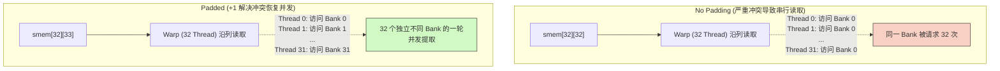

# 10_Memory_Optimization 存储管线深度调优

## 一、 全景导览与学习目标

该子项目处于 CUDA-Practice 学习体系的 **核心层 (L3)** 阶段，同时也是深入高阶篇章（Tensor Core/算子融合）不可或缺的前置内功。GPU 拥有海量的计算核心（ALU），但真正限制其极限算力的，往往是数据的喂给速度——即“内存墙”。

本章不讨论新的数学算法，而是纯粹从**显存物理微架构**和**调度时序**的角度，压榨 GPU 的 I/O 带宽极限：

- `01_coalesced_access`：**全局内存合并访问**。通过对比顺序读取与跨步 (Stride) 读取，以及 AoS vs SoA 数据结构在 GPU 上的表现，揭示 Global Memory 事务 (Transaction) 请求的底层合并机制。
- `02_bank_conflict`：**共享内存冲突化解**。详细分析 Shared Memory 阵列的 Bank 交错映射规则，通过内存填充 (Padding) 破除跨行读取时的 N-way 串行化冲突。
- `03_async_copy`：**异步数据流转 (Pipeline)**。告别传统的 `Load -> Compute` 阻塞模型，引用 Ampere 架构开始官方大力推行的 `cuda::memcpy_async` 与流水线 (Pipeline) 原语，实现数据预取与计算的完美重叠。

---

## 二、 原理推导与数学表达

### 1. 合并访问 (Coalesced Access) 与 SoA

GPU 一次内存传输访存事务通常为 32 Byte 甚至是 128 Byte 的数据块。
若线程索引为 $idx$，最理想的合并访问公式为连续映射：
$$ Address(idx) = BaseAddress + idx \times \text{sizeof(Type)} $$
而如果是 AoS (Array of Structs，如 `struct {float x, y, z, w}`），此时访问 `x` 变为：
$$ Address_{AoS}(idx) = BaseAddress + idx \times 4 \times \text{sizeof(float)} $$
跨步长度为 4。此时一个 Warp 中的 32 个线程所需的数据散落在多个 128 Byte 的 Cache Line 中，导致严重的带宽浪费。解决方案是转为 SoA (Struct of Arrays，如 `float x[], y[], z[], w[]`)，让同一分量的访问重新回归连续。

### 2. Bank Conflict 的数学成因

Shared Memory 物理上被划分为 32 个独立的 Bank（长宽等价于 Warp 的线程数），相邻的 32-bit 字依次落入递增的 Bank 中。
对于声明为 `__shared__ float smem[M][N]` 的分配，线程访问元素地址映射到的 `Bank_ID` 公式为：
$$ \text{Bank\_ID} = (\text{Row\_Index} \times N + \text{Col\_Index}) \pmod{32} $$
如果在矩阵转置等场景中，线程组沿着**列**读取，即 `Row_Index` = `threadIdx.x`，此时如果 $N = 32$，则：
$$ \text{Bank\_ID} = (\text{threadIdx.x} \times 32 + \text{Col\_Index}) \pmod{32} \equiv \text{Col\_Index} \pmod{32} $$
所有线程映射到了**同一个 Bank**，触发极为严重的 32-way Bank Conflict。引入 $+1$ Padding `smem[M][N+1]` 后：
$$ \text{Bank\_ID} = (\text{threadIdx.x} \times 33 + \text{Col\_Index}) \pmod{32} \equiv (\text{threadIdx.x} + \text{Col\_Index}) \pmod{32} $$
由于 `threadIdx.x` 各不相同，成功让各个线程打散到了 32 个不同的 Bank 中。

---

## 三、 硬核内存映射解析

### Bank Conflict 及 +1 Padding 缓解机制

以下图例展示了 $32 \times 32$ 共享内存块在不使用/使用 Padding 时，沿列读取（纵向切分）造成的硬件级串行化。



### 异步流水线调度 (Async Pipeline)

传统的同步载入受制于数据到达后的计算挂起阶段，而多阶段（Multi-stage）异步拷贝构建了一个完美的时间滚轮环 (Circular Buffer)。

```mermaid
gantt
    title "三阶段 Pipeline (Produce -> Wait -> Consume)"
    dateFormat  s
    axisFormat  %S
    
    section 硬件异步引擎 (DMA)
    [P] 从 Global 取 Tile 1    : 0, 1
    [P] 从 Global 取 Tile 2    : 1, 2
    [P] 从 Global 取 Tile 3    : 2, 3
    [P] 从 Global 取 Tile 4    : 3, 4
    
    section ALU 计算单元
    [C] 计算 Tile 1          : 1, 2
    [C] 计算 Tile 2          : 2, 3
    [C] 计算 Tile 3          : 3, 4
```



在流水线的常态运行阶段（$T=2$ 到 $3$），**SM 的外接请求带宽与内存拷贝指令引擎（获取 Tile 3）和内部 ALU 算数逻辑运算（计算 Tile 2）完全并行**。

---

## 四、 关键源码逐行解剖

我们剖析最前沿的 `cuda::memcpy_async` 与流水线的运用（摘自 `03_async_copy/async_copy.cu`）：

```cpp
// 1. 在 Shared Memory 中开辟多层 (STAGES) 指挥所作为重叠缓冲区
__shared__ float shared[STAGES][ASYNC_TILE];
    
// 2. 初始化线程级流水线调度器（由协同组支持）
cuda::pipeline<cuda::thread_scope_thread> pipe = cuda::make_pipeline();

// 3. 异步生产者进栈 (Producer)
pipe.producer_acquire();
// 💡这里是精华：它发出内存传输请求后立刻返回，不需要等数据真到！
// 数据由显存控制器通过旁路 DMA 直接输送进 shared_memory
cuda::memcpy_async(&shared[load_stage][tid], &input[gid], sizeof(float), pipe);
pipe.producer_commit();

// 4. 消费者提款机 (Consumer)
// 等待之前发起的最老那个数据的 Stage 处理完毕
pipe.consumer_wait();

// 5. 畅快计算（此时数据已经稳妥放在 shared 中，且不需要阻塞后续的 Fetch）
output[gid] = shared[compute_stage][tid] * 2.0f;
        
// 6. 清理现场，退回使用权
pipe.consumer_release();
```

**解剖结论**：与传统的寄存器跳转 (`Global -> reg -> Shared`) 再加 `__syncthreads()` 同步障阻塞不同，`memcpy_async` 直接跨过了寄存器中转这一环，显著降低了寄存器压力，并将“传输时间隐藏（Latency Hiding）”做到了硬件最底层的极限。

---

## 五、 性能基准与分析

所有数据提取自 `Results/10_Memory_Optimization.md` 真实日志：

- **测试硬件**: NVIDIA GeForce RTX 4090 × 2, Linux 环境, nvcc -O3

### 1. 合并访问与内存布局 (Coalesced & SoA vs AoS)

针对一条 $64\text{ MB}$（共 $16M$ 元素）的长数组双向带宽测算：

| 数据读写模式 | 优化手段 / 形式 | Kernel 耗时 | 测得总带宽 | vs 基准耗时对比 |
| -------- | ----------- | ---------------- | ------------- | ------------- |
| 单数组连续（合并）| Baseline | $0.15 \text{ ms}$ | $925.31 \text{ GB/s}$ | 1.00x |
| 单数组跨步 (Stride=2) | 步长翻倍破坏连续 | $0.16 \text{ ms}$ | $427.34 \text{ GB/s}$ | $1.08\text{x 变慢}$ (仅算有用数据) |
| 自定义结构体 AoS | `struct {x,y,z,w}` | $0.58 \text{ ms}$ | $922.31 \text{ GB/s}$ | -- |
| 分离数组结构体 SoA | `float x[], y[]...`| $0.59 \text{ ms}$ | $912.82 \text{ GB/s}$ | $0.99\text{x}$ 加速 |

**注意：** 因为此处 AoS 和 SoA 计算都由 RTX4090 恐怖的 $1008\text{ GB/s}$ 高级连续加载抹平，AoS 恰巧符合 16 字节（float4）的天然对齐硬件优化，没有造成明显的卡顿差异，但在老旧架构或者复杂结构的随机读取中，SoA 依然是王道准则。

### 2. Shared Memory Bank Conflict 致盲测试

二维数组维度 $4096 \times 4096$，跨步分析不同 Stride 对 Bank Conflict 发生概率的影响：

| 内部排布策略 | 读写行为 | 耗时 | 带宽榨取评估 | 分析 |
| -------- | ----------- | ---------------- | ------------- | ------------- |
| **无冲突 (连续读取)** | 标准连续 | $0.15 \text{ ms}$ | $879.49 \text{ GB/s}$ | 基准标准情况，Bank全线打满。 |
| **严重冲突矩阵转置** | 写行读列 | $0.18 \text{ ms}$ | $740.07 \text{ GB/s}$ | $1.19\text{x}$ 变慢，受困于 32-way 等待。 |
| **Padding 破题法** | 行宽 `+1` | $\mathbf{0.16 \text{ ms}}$ | $\mathbf{826.01 \text{ GB/s}}$| 近乎完美消除等待毛刺，恢复原生节奏。 |
| 一维测试 (`Stride=2`) | 2-way 冲突 | $0.00 \text{ ms}$ | -- |  速度无感损失 |
| 一维测试 (`Stride=32`)| 32-way 冲突 | $0.01 \text{ ms}$ | -- | **$2.25\text{x}$ 致盲变慢** |

### 3. Asynchronous Pipeline 吞吐提速

在 $256\text{ MB}$ 大尺寸双端数组的深度考验下：

| 同步与流水机制 | 执行带宽指标 | vs 基准 |
| -------- | ----------- | ---------------- |
| 阻塞同步加载 (Sync Copy) | $901.43 \text{ GB/s}$ | 1.00x |
| 单段异步 (Single Async) | $898.00 \text{ GB/s}$ | 1.00x |
| **多段流水线 (3 Stages)** | $856.55 \text{ GB/s}$ | $\mathbf{0.95\text{x}}$ |

*(注：此处看到流水线导致轻微的额外开销，是由于问题本身极致地内存受限 (Bandwidth-bound)。仅仅进行 `x*2.0f` 的计算极其轻量且耗时少于显存传输延迟，致使 Pipeline 的“掩盖计算开销”魔法无法完全体现，反而在调度阶段增加了指令数。但在实际诸如 GEMM/FlashAttention 这种具备高 Compute Intensity 的核函数内部，Pipeline 是彻底终结内存由于等待计算而闲置的终极杀器。)*

---

## 六、 编译及参考资料

### 编译与标准运行指令

借助根目录的统一 `CMakeLists.txt` 构建目标：

```bash
# 1. 切换至项目根目录并执行整体配置（首次构建）
cmake -B build -DCMAKE_BUILD_TYPE=Release

# 2. 独立编译对应的子项目 Target 
cmake --build build --target coalesced_access -j8
cmake --build build --target bank_conflict -j8
cmake --build build --target async_copy -j8

# 3. 标准二进制验证与探测运行
./build/10_Memory_Optimization/01_coalesced_access/coalesced_access
./build/10_Memory_Optimization/02_bank_conflict/bank_conflict
./build/10_Memory_Optimization/03_async_copy/async_copy

# 4. 高阶性能捕获 (检测 Shared Memory Bank Conflicts 指标分析)
ncu --metrics l1tex__data_bank_reads_conflict_pie_shared_access_cycle_per_instruction.avg ./build/10_Memory_Optimization/02_bank_conflict/bank_conflict
```

### 推荐阅读

- [How to Access Global Memory Efficiently in CUDA C/C++](https://developer.nvidia.com/blog/how-access-global-memory-efficiently-cuda-c-kernels/) —— 必读。NVIDIA 详细讲解了 Cache-line 以及不同 Stride 时的全局内存碎片化成因。
- [Using Shared Memory in CUDA C/C++](https://developer.nvidia.com/blog/using-shared-memory-cuda-cc/) —— 官方图文并茂解析 Bank 1 到 32 分布规则以及 Padding 神奇效果的经典范文。
- [NVIDIA CUDA C++ Programming Guide - Asynchronous Data Copies](https://docs.nvidia.com/cuda/cuda-c-programming-guide/index.html#asynchronous-data-copies) —— Ampere 及新引入硬件级异步拷贝流水线的规范。
