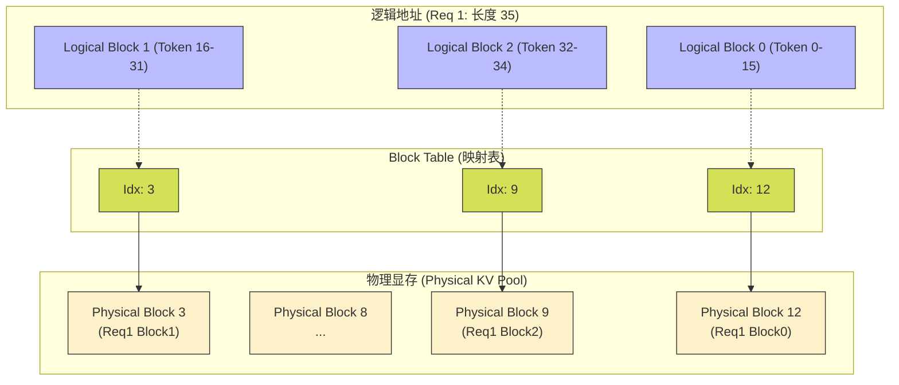
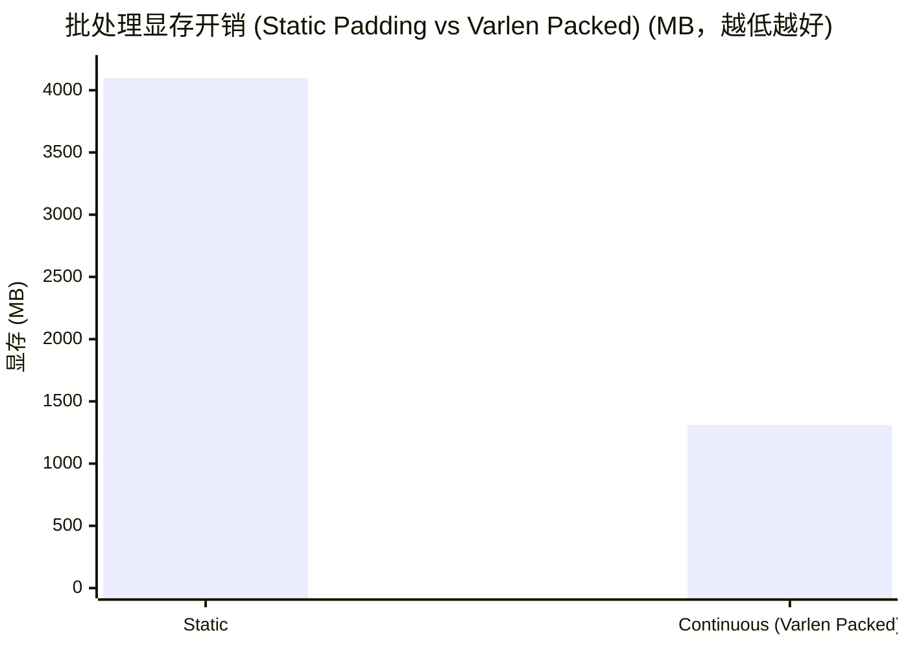

# 11_Inference_Optimization — LLM 推理系统优化

## 一、全景导览与学习目标

本子项目属于 CUDA-Practice 学习体系的**部署与量化推理（L3）**阶段。大语言模型（LLM）的推理（生成阶段）通常不是 Compute Bound，而是极端严重的 **Memory Bound（访存瓶颈）** 与 **Capacity Bound（显存容量瓶颈）**。

本模块聚焦现代推理引擎（如 vLLM, TensorRT-LLM, TGI）最核心的三大系统级访存优化技术：

| 文件 | 核心技术 | 优化目标 | 工业界应用 |
|------|----------|---------|-----------|
| `02_kernel_fusion/kernel_fusion.cu` | **算子融合 (Kernel Fusion)** | 削减内存往返开销 (Memory Round-trip) | Fused MLP, Fused Attention |
| `01_kv_cache/kv_cache.cu` | **PagedAttention (分页 KV Cache)** | 消除内存内碎片，提升并发容量 | vLLM 核心基石 |
| `03_dynamic_batching/dynamic_batching.cu` | **Continuous Batching (连续批处理)** | 消除 Padding 填空，释放显存带宽 | Orca (TGI 基础) |

---

## 二、原理推导与机制解析

### 1. 为什么需要算子融合？（Memory Round-trip 灾难）

考虑简单的网络层：$Y = \text{Scale}(\text{ReLU}(A + B))$

- **非融合 (Unfused)**：
  - `add_kernel`: 读 $A$, $B$ (2×)，写 $tmp1$ (1×)
  - `relu_kernel`: 读 $tmp1$ (1×)，写 $tmp2$ (1×)
  - `scale_kernel`: 读 $tmp2$ (1×)，写 $Y$ (1×)
  - 总访存量：4 次读 + 3 次写
- **融合 (Fused)**：
  - `fused_kernel`: 读 $A$, $B$，在寄存器中计算 $A+B \rightarrow \text{ReLU} \rightarrow \text{Scale}$，写 $Y$
  - 总访存量：2 次读 + 1 次写（消除了 4 次中间访存！）

### 2. PagedAttention 机制

传统 KV Cache 甚至在请求刚发来时，就为 `max_seq_length` 分配连续的显存，导致大量内部碎片（浪费可达 60%）。
PagedAttention 借鉴操作系统的**虚实映射**原理：

- 将 KV Cache 划分为固定大小的 Block（如 16 Tokens）。
- 在逻辑上是连续的 Seq，在物理显存上打散分配。
- 生成时动态按需分配 Block，将显存碎片率降至 < 4%。

### 3. Continuous Batching（变量长批处理）

传统的 Static Batching 必须用 `<PAD>` 将所有请求补齐到同批次中最长的长度。这不仅导致海量无效计算，更致命的是浪费了这部分 `<PAD>` 所占据的极大显存带宽。
**Continuous Batching** 将 batch 中所有有效的 token 紧凑打包成一个 1D 张量（Var-len Tensor）。通过 `cu_seqlens` (累积序列长度数组) 记录每个请求的偏移量，彻底告别 Padding。

---

## 三、硬核内存映射解析

### Paged KV Cache 虚实映射图



**性能代价**：在 Kernel 内部读取 KV 时，需引入一次指针解引用（间接寻址 `block_table[log_blk_idx]`）。这会轻微降低物理算力，但省出的海量显存让 Server 能够**显著提升并发 Batch Size**，从而最终提升整体吞吐。

---

## 四、关键源码逐行解剖

### Continuous Batching 前向访问核心（来自 `dynamic_batching.cu`）

```cuda
// varlen_attention_kernel
// q_data 被打包为了一个 1D Tensor: [Total_Tokens, Num_Heads, Head_Dim]
// cu_seqlens 记录了偏移: [0, len0, len0+len1, ...]

int token_idx = blockIdx.x * blockDim.x + threadIdx.x; // 并发处理所有真实 Token
if (token_idx >= total_tokens) return;

// 1. 二分查找 / 线性查找 当前 Token 属于哪个 Request
int batch_idx = 0;
while (batch_idx < batch_size && token_idx >= cu_seqlens[batch_idx + 1]) {
    batch_idx++;
}

// 2. 计算在当前 Request 内的局部位置 (用于 Positional Encoding/Mask)
int seq_idx = token_idx - cu_seqlens[batch_idx];

// 3. 执行核心计算 (彻底无需处理任何 Padding 废数据)
float q_val = q_data[(token_idx * num_heads + head_idx) * head_dim + dim_idx];
```

---

## 五、性能基准与分析

> 所有数据提取自 `Results/11_Inference_Optimization.md` 真实日志，测试硬件：NVIDIA GeForce RTX 4090（sm_89）× 2，Linux，nvcc -O3。

### 1. 算子融合 Memory Round-trip 减免（`kernel_fusion`，数据量 512 MB，50 次平均）

| 版本 | Kernel 时长 | 有效数据带宽 | vs 非融合加速比 |
|------|------------|-------------|---------------|
| 非融合序列 (Add->ReLU->Scale) | 4.06 ms | 396.79 GB/s | 基准 |
| **算子融合 (Fused Kernel)** | **1.73 ms** | **932.85 GB/s** | **2.35×** |

**分析**：非融合版本看似很快，但其有效带宽（仅计算输入输出的必要流转）暴跌至 396 GB/s，绝大部时间都在将 `tmp_1`、`tmp_2` 写回再读出。融合后有效带宽逼近硬件极限（932 GB/s），获得 2.35 倍实打实的提速。

### 2. KV Cache：连续分配 vs 分页（`kv_cache`，Batch=32，Max_Len=2048，100 次平均）

| 版本 | Kernel 时长 | 预估显存占用 | 有效访存带宽 |
|------|------------|------------|------------|
| 静态对齐 (Naive) | 0.37 ms | 512.00 MB | 898.12 GB/s |
| **分页机制 (PagedAttention)** | **0.45 ms** | **317.75 MB** | **735.04 GB/s** |

**分析**：引入 Paged Table 映射后，因间接寻址开销，Kernel 耗时慢了 1.22 倍（0.45ms）。但这是极为划算的交易：**显存直接节省了 37.94%**。在显存决定并发上限的 LLM 服务器中，这意味着 TPS 吞吐量的暴力提升。

### 3. Continuous Batching 容量释放（`dynamic_batching`，Batch=128，单向长请求，100 次平均）

| 版本 | Kernel 耗时 | 打包策略 | 核心显存占用 |
|------|------------|---------|------------|
| 静态批处理 (Static Padding) | 1.52 ms | 全部 Padding 补齐至 1024 | 4096.00 MB |
| **动态紧凑批处理 (Varlen Packed Tensor)** | **1.69 ms** | **1D 变长压紧，抛弃掩码** | **1311.22 MB** |



**综合结论**：在极度参差不齐的实际会话请求中，Continuous Batching 暴砍 **67.99%** 显存无效浪费。Kernel 耗时相近（1.52ms vs 1.69ms）是因为 Static 版本内部做了 `if (is_pad) continue` 跳过了计算，但 Static 版本在 Host-2-Device 与显存驻留上的庞大代价（4GB）直接锁死了服务上限。

---

## 六、编译及参考资料

### 编译与运行

```bash
# 从项目根目录配置（首次）
cmake -B build -DCMAKE_BUILD_TYPE=Release

# 编译三个目标
cmake --build build --target kernel_fusion -j8
cmake --build build --target kv_cache -j8
cmake --build build --target dynamic_batching -j8

# 标准运行
./build/11_Inference_Optimization/01_kv_cache/kv_cache
./build/11_Inference_Optimization/02_kernel_fusion/kernel_fusion
./build/11_Inference_Optimization/03_dynamic_batching/dynamic_batching
```

### 参考资料

- [vLLM: Efficient Memory Management for Large Language Model Serving with PagedAttention](https://arxiv.org/abs/2309.06180) — SOSP 2023 最佳论文，PagedAttention (vLLM) 原理解析
- [Orca: A Distributed Serving System for Transformer-Based Generative Models](https://arxiv.org/abs/2201.03662) — Continuous Batching (Iteration-level scheduling) 奠基之作
- [NVIDIA TensorRT-LLM Documentation](https://nvidia.github.io/TensorRT-LLM/) — 深入了解工业级框架如何落地上述所有融合优化策略
