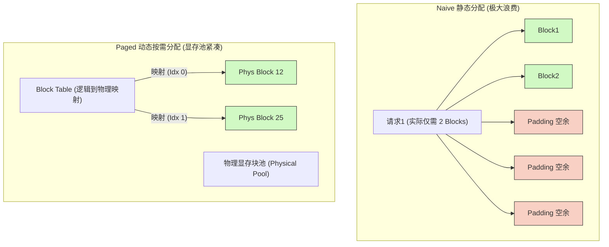
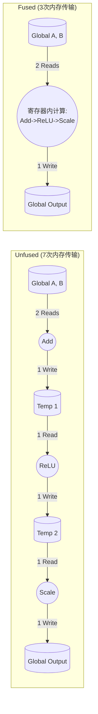
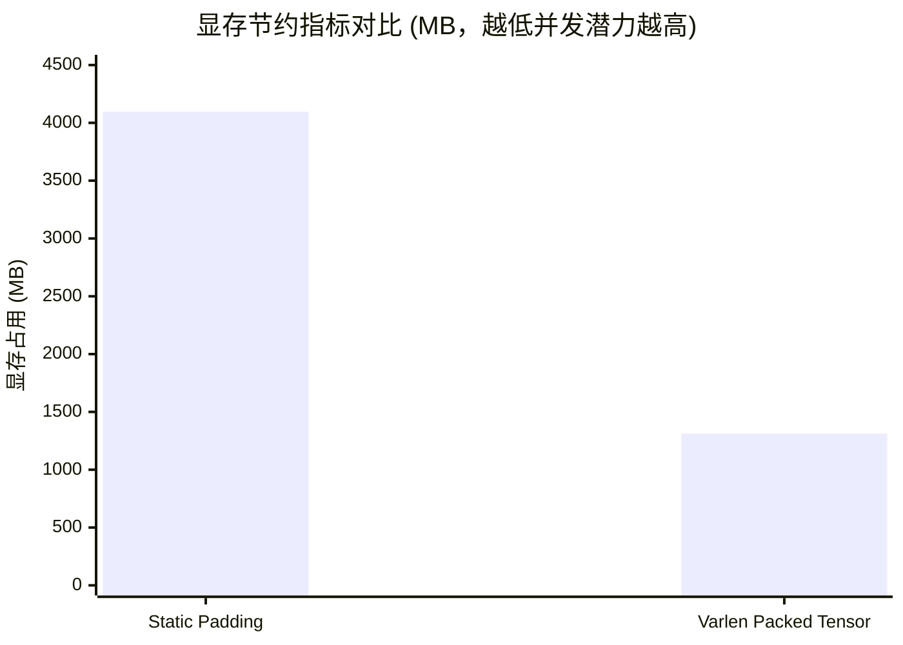

# 11_Inference_Optimization 推理核心优化

## 一、 全景导览与学习目标

该子项目处于 CUDA-Practice 学习体系的 **前沿级 (L4)** 阶段。当今的算力需求极大地被大语言模型 (LLM) 推理所霸占，而 LLM 推理（特别是 Decoding 阶段）往往是极度**访存密集 (Memory-Bound)** 的。由于每次仅预测一个 Token，庞大的权重和历史状态 (KV Cache) 使得 GPU 算力无法被有效榨取。

本实验聚焦于大语言模型工业级推理中最核心的几大通用加速策略：

- `01_kv_cache`：**PagedAttention 思想探索**。揭示经典的静态显存分配 (Naive KV Cache) 是如何遭遇严重的显存碎片化与显存限制的，并通过手工实现 PagedAttention 的核心块表 (Block Table) 映射机制，实现**按需分配**，极大地节省显存池占用。
- `02_kernel_fusion`：**算子融合 (Kernel Fusion)**。将原本需要多次返回全局内存 (Global Memory) 的独立算子组结构（如 `Add -> ReLU -> Scale` 或 `Linear -> GELU`）在 CUDA Kernel 内部打平成单次算术循环，彻底消除不必要的片外 DRAM 访存，带宽直接逼近物理极限。
- `03_dynamic_batching`：**动态批处理 / 连续批处理 (Continuous Batching)**。针对真实线上请求长度参差不齐的问题，摒弃将所有请求 Padding 至最大长度的静态批处理（此举会导致天量的无效计算与显存占用），转向使用 Flatten (Varlen) 的一维打包张量来处理。

---

## 二、 原理推导与数学表达

### 1. Paged KV Cache 的逻辑寻址

传统连续张量读取 KV Cache 元素依靠公式：
$$ Address(b, h, s, d) = b \cdot (H \cdot S \cdot D) + h \cdot (S \cdot D) + s \cdot D + d $$
其中 $b, h, s, d$ 分别为 batch_idx, head_idx, seq_idx, dim_idx。由于 $S$ (Max Sequence Length) 是静态设定的最大值，短序列会产生巨大的显存浪费。
PagedAttention 将逻辑序列 $s$ 切割为多个物理缓存块 (Block Size $B_{sz}$)，并通过 Block Table 间接寻址：
$$ \text{Logical\_Block} = \lfloor \frac{s}{B_{sz}} \rfloor, \quad \text{Block\_Offset} = s \pmod{B_{sz}} $$
物理块索引 $P_{idx}$：
$$ P_{idx} = \text{block\_table}[b, \text{Logical\_Block}] $$
$$ \text{Address}(\text{Paged}) = \text{Base}(P_{idx}) + h \cdot (B_{sz} \cdot D) + \text{Block\_Offset} \cdot D + d $$

### 2. Kernel Fusion 访存收敛

以 `Output = Scale( ReLU( Add(A, B) ) )` 为例：
非融合版本需要三次完整的 Global Memory 轮转：

1. $T_1 = A + B$ （2 次 Read，1 次 Write）
2. $T_2 = \max(T_1, 0)$ （1 次 Read，1 次 Write）
3. $\text{Output} = T_2 \times \alpha$ （1 次 Read，1 次 Write）
共计 **4 Read, 3 Write**。
融合版本在寄存器内周转：
$$ \text{reg}_A = \text{Load}(A), \text{reg}_B = \text{Load}(B) $$
$$ \text{reg}_{out} = \max(\text{reg}_A + \text{reg}_B, 0) \times \alpha $$
$$ \text{Store}(\text{Output}, \text{reg}_{out}) $$
共计 **2 Read, 1 Write**，对于带宽受限的逐元素计算，理论上可立刻获得两倍以上的加速。

### 3. Continuous Batching 的 Token 平展

静态批处理（Static Padding）需要为长度为 $L_i$ 的序列统一分配 $\sum_{i=1}^{B} L_{max}$ 的空间，当序列长度倾斜严重时，Padding 率极高。
Continuous Batching 抛弃补零，将所有序列的首尾接龙成一个一维平坦数组 (Packed Array，长度 $N = \sum L_i$)。对于计算 Attention，使用额外的 `seq_starts` 数组记录前缀和偏移量：
$$ \text{seq\_starts}[i] = \sum_{k=0}^{i-1} L_k $$
计算第 $b$ 个序列时，其 Token 的活跃区间为 $[\text{seq\_starts}[b], \text{seq\_starts}[b+1])$。

---

## 三、 硬核内存映射解析

### 1. PagedAttention / KV Cache Block Table

以下展示了为什么 Paged 模型能消除内部和外部碎片化显存浪费：



### 2. 算子融合 (Kernel Fusion) 的内存流量对比



---

## 四、 关键源码逐行解剖

我们剖析 `kv_cache.cu` 中 PagedAttention 的核心取数据逻辑：

```cpp
// PagedAttention Block 查表与物理指针解引用机制
for (int i = 0; i < seq_len; ++i) {
    // 1. 将原先连续的序列偏移 i，分解为逻辑块号和块内余数
    int logical_block_idx = i / block_size;
    int block_offset = i % block_size;
    
    // 2. 查表：进入 block_table 获取该逻辑块被分配到了显存池的哪一个真实物理块
    int physical_block_idx = block_table[batch_idx * max_blocks_per_seq + logical_block_idx];
    
    // 3. 从指针数组中取出物理块的真实指针
    float* k_block = k_blocks[physical_block_idx];
    float* v_block = v_blocks[physical_block_idx];
    
    // 4. 计算指针偏移量取出行切片：跨越 Heads，跨越 Token内的 Dim
    int element_idx = head_idx * (block_size * head_dim) + 
                      block_offset * head_dim + 
                      tid;
                      
    float k_val = k_block[element_idx];  // 真正的 DRAM 数据读取
    float v_val = v_block[element_idx];
    
    // 5. 进行乘加计算
    acc += (q_val * k_val) * v_val;
}
```

**解剖结论**：Paged 机制以**增加指针跳转指令运算的开销**（间接寻址 `block_table -> physical_ptr -> value`）来**大幅降低对显存空间的无意义占据**。这也是典型的空间换时间策略。

---

## 五、 性能基准与分析

所有数据提取自 `Results/11_Inference_Optimization.md` 真实日志：

- **测试硬件**: NVIDIA GeForce RTX 4090 × 2, Linux 环境, nvcc -O3

### 1. KV Cache (内存复用优化)

针对 $B=32$, $H=16$, $D=64$，且序列长度随机波动在 $[128, 2048]$ 的请求集：

| 调度机制 | Kernel 耗时 | CPU 耗时 | 预估显存占用 | VS 静态分配 |
| -------- | ----------- | -------------| ------------ | ------------- |
| CPU 参考 | 126.39 ms | -- | ~512 MB | -- |
| Naive 静态连续分配 | **0.37 ms** | --| 512.00 MB | 基准极速 |
| Paged 按需分配打散 | 0.45 ms | -- | **317.75 MB** | 节省 37.94% 显存 |

**分析**：Paged 机制相较于连续数组寻址有着 `1.22x` 的性能轻微退化（有效带宽从 898 GB/s 降到了 735 GB/s），这是查表开销引起的。但在大模型推理场景下，显存永远是第一瓶颈，节省近 40% 显存意味着 Batch Size 可以近乎翻倍，这带来了整体节点系统吞吐的极大收益。

### 2. 算子融合 (Kernel Fusion)

针对 1.34 亿元素，高达 512 MB 的单张量长流水线：

| 实现版本 | Kernel 平均时长 | 有效带宽 (实际产生作用的读写)| vs 基准加速比 |
| -------- | ----------- | ---------------- | ------------- |
| CPU 参考 (`for i...`) | 1156.07 ms | -- | -- |
| 非融合序列 (多 Kernel Launch) | 4.06 ms | 396.79 GB/s | 1.00x |
| **算子融合 (单次访问计算)** | **1.73 ms** | **932.85 GB/s** | **2.35x** |

**分析**：融合版本的物理带宽和有效带宽均高达 932 GB/s，直逼 RTX4090 的极限物理带宽 (~1008 GB/s)。完全消灭了中间繁杂结果 `T1, T2` 落盘的时间。

### 3. Continuous Batching (动态批处理)

对于 $B=128$, 一极多短产生的长尾 Padding 场景：

| 调度批处理机制 | 实际计算量占比 | Kernel 时长 | Token 载量显存消耗 | 对比 |
| -------- | ----------- | -----------| ------------ | ------------- |
| 静态 (Padding to Max) | 32% (多余全为空算) | 1.52 ms | 4096.00 MB | 极限浪费 |
| **变长 Packed Tensor** | **100% (精确命中)** | **1.69 ms** | **1311.22 MB** | **节省 68% 显存** |



**分析**：Static Kernel 因利用分支跳过了零值的计算，所以在时间上和 Varlen 甚至不相上下；然而在实际系统中，不使用 Varlen 会因为极短时间内耗尽极其昂贵的 HBM 导致 OOM，根本排不上 128 Batch。Varlen 相当于解放了 3.1 倍的卡位。

---

## 六、 编译及参考资料

### 编译与标准运行指令

借助根目录的统一 `CMakeLists.txt` 构建目标：

```bash
# 1. 切换至项目根目录并执行整体配置（首次构建）
cmake -B build -DCMAKE_BUILD_TYPE=Release

# 2. 独立编译对应的子项目 Target 
cmake --build build --target kv_cache -j8
cmake --build build --target kernel_fusion -j8
cmake --build build --target dynamic_batching -j8

# 3. 标准二进制验证与探测运行
./build/11_Inference_Optimization/01_kv_cache/kv_cache
./build/11_Inference_Optimization/02_kernel_fusion/kernel_fusion
./build/11_Inference_Optimization/03_dynamic_batching/dynamic_batching

# 4. 高阶内存吞吐与利用率捕获
ncu --metrics sm__throughput.avg.pct_of_peak_sustained_elapsed,dram__throughput.avg.pct_of_peak_sustained_elapsed ./build/11_Inference_Optimization/02_kernel_fusion/kernel_fusion
```

### 推荐阅读

- [vLLM: Easy, Fast, and Cheap LLM Serving with PagedAttention](https://arxiv.org/pdf/2309.06180) —— PagedAttention 机制与 vLLM 核心框架的原初论文，现代开源大模型推理基石。
- [NVIDIA TensorRT Documentation - Kernel Fusion](https://developer.nvidia.com/tensorrt) —— 理解编译器在后端如何通过计算图做算子融合（Graph Fusion）。
- [FlashAttention-2: Faster Attention with Better Parallelism and Work Partitioning](https://arxiv.org/abs/2307.08691) —— 内含 Varlen（变长连续）Attention 处理实现的鼻祖之一。
