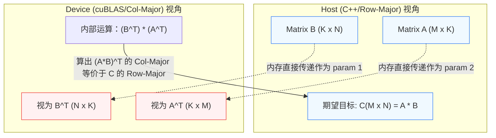
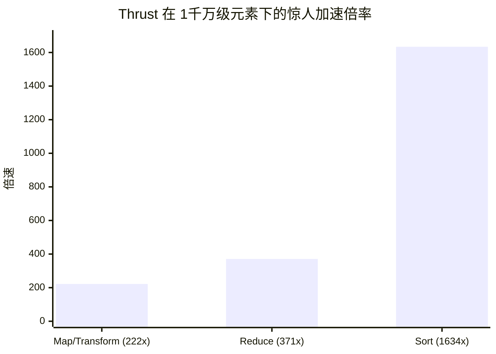

# 12_Standard_Libraries 官方优良造轮子集成

## 一、 全景导览与学习目标

该子项目处于 CUDA-Practice 学习体系的 **实用架构级 (L2-L3)** 阶段。在业界工业界，很多时候并不鼓励“手撸一切算子”，而是倡导优先复用经过 NVIDIA 数十年打磨的超高度优化库。这不仅能极大地节约研发周期，还能立刻获得最极致的硬件压榨性能。

本章涵盖了 CUDA 编程中最著名的三大原生函数库栈，解决开发中的矩阵计算、信号处理、和基础数据结构的泛型并行问题：

- `01_cublas_gemm`：**稠密线性代数运算库 (cuBLAS)**。展示了基础的 `cublasSgemm`、利用启发式算法（Heuristics）挖掘最优硬件执行路线的轻量库 `cublasLtMatmul`，以及面向多维小矩阵并发批处理的 `cublasSgemmStridedBatched`。这也是之前手写 `04_GEMM_Optimization` 追求对齐的终极天花板。
- `02_cufft`：**快速傅里叶变换库 (cuFFT)**。无需关心蝴蝶交叉如何排布，直接展示了对高吞吐数字信号的处理。对比手写 $O(N^2)$ 的暴力 DFT，演示 O(N log N) 算法在 GPU 中的摧枯拉朽。
- `03_thrust`：**C++ STL 风格的高级并行库 (Thrust)**。展示了以迭代器（Iterator）和 Functor 为核心的极简并行化编程范式，包括 `sort`、`reduce` 以及 `transform`，使开发者免于管理冗长的 Host/Device 繁文缛节。

---

## 二、 原理推导与数学表达

### 1. cuBLAS GEMM 理论与转置黑魔法

cuBLAS 中的经典 SGEMM 计算通用公式为：
$$ C = \alpha \times \text{op}(A) \times \text{op}(B) + \beta \times C $$
然而，**cuBLAS 内部是列主序 (Column-Major) 的**，而 C/C++ 是行主序 (Row-Major)。
如果要对行主序矩阵 $A$ 和 $B$ 执行逻辑上的 $C = A \times B$，由于 $A_{row}$ 传进 cuBLAS 时会被直接解释为内存排布完全一致的 $(A^T)_{col}$，我们可以利用数学转置定律：
$$ C^T = (A \times B)^T = B^T \times A^T $$
由于 $C^T$ 的列主序在物理内存上恰好等同于 $C$ 的行主序，我们在调用 `cublasSgemm` 时，**将行主序的 B 作为第一个参数，A 作为第二个参数传入**，即可获得正确的行主序 C！

### 2. cuFFT 频谱变换

一维离散傅里叶正变换 (Forward DFT) 数学定义为：
$$ X_k = \sum_{n=0}^{N-1} x_n \cdot e^{-i 2\pi k n / N} $$
计算时间复杂度为 $O(N^2)$。cuFFT 在底层运用基 $2$, $3$, $5$, $7$ 等 Cooley-Tukey 快速算法，将复杂度降至 $O(N \log N)$ 并在 Shared Memory 的 Bank 之间进行极致排布掩盖延迟。
反变换 (Inverse IDFT) 数学定义为：
$$ x_n = \frac{1}{N} \sum_{k=0}^{N-1} X_k \cdot e^{i 2 \pi k n / N} $$
> **注意**：cuFFT 执行 `CUFFT_INVERSE` 后默认**不会自动除以 $N$**（缩放因子），物理还原时必须追加一个归一化 Kernel。

### 3. Thrust 泛型操作 (以 SAXPY 为例)

在 `thrust::transform` 中实现的标量乘加 SAXPY 算子：
$$ y_i \leftarrow a \cdot x_i + y_i, \quad \forall i \in \{0, \dots, N-1\} $$
完全抛弃了传统的嵌套 Grid/Block 计算索引，让内部自动决定最佳并发数。

---

## 三、 硬核内存映射解析

### cuBLAS 行列主序颠倒魔法

利用 Mermaid 图示直观了解“通过颠倒传入顺序以匹配 C++ 行主序”的奇妙数据流动。



### Thrust `transform` 管道流水

Thrust 将执行流彻底高级化和函数化，类似 Python / C++17 Execution Policies。

```mermaid
graph LR
    IterStart(( begin() )) --> Fetch[内部预取向量块]
    
    subgraph "Functor 映射层 (自动伸缩 Block/Grid)"
        Fetch --> F1[Thread 0: functor(x0, y0)]
        Fetch --> F2[Thread 1: functor(x1, y1)]
        Fetch --> F3[Thread N: functor(xn, yn)]
    end
    
    F1 --> Output[( d_out Iter )]
    F2 --> Output
    F3 --> Output
```

---

## 四、 关键源码逐行解剖

### 1. cuBLAS 转置调用的核心代码

摘自 `01_cublas_gemm/cublas_gemm.cu`：

```cpp
float alpha = 1.0f;
float beta = 0.0f;

// 行列倒置黑魔法解决 Row/Col Major 的冲突问题
// 计算 (A * B)^T = B^T * A^T
cublasSgemm(
    handle, 
    CUBLAS_OP_N, CUBLAS_OP_N,
    N, M, K,                  // 注意维度的次序：N (对应原B的列), M (原A的行), K 
    &alpha,
    d_B, N,                   // !!! d_B 作为首个矩阵传入, LDB = N 跨度
    d_A, K,                   // !!! d_A 作为第二个矩阵传入, LDA = K 跨度
    &beta,
    d_C, N                    // 倒置写入 LDC = N 跨度
);
```

**解剖结论**：直接用原生的 C/C++ `float[]` 存储而无须经过昂贵的 Host 侧矩阵显式转置，直接让 API 底层解析为倒置状态，实现极速执行。

### 2. Thrust Functor

摘自 `03_thrust/thrust_algorithms.cu`：

```cpp
// 1. 结构体包装 Functor，必须带有 __host__ __device__ 使得其能在显卡上执行
struct saxpy_functor {
    const float a;
    saxpy_functor(float _a) : a(_a) {}
    
    __host__ __device__
    float operator()(const float& x, const float& y) const {
        return a * x + y;
    }
};

// 2. 调用高度浓缩为一行 STL 风格语句
thrust::transform(d_x.begin(), d_x.end(), d_y.begin(), d_out.begin(), saxpy_functor(a));
```

**解剖结论**：`thrust::transform` 会自动匹配底层架构的最佳 Grid/Block Size 甚至是 SM 共用负载，这比直接粗暴 `(n + 255) / 256` 要更为强固耐用。

---

## 五、 性能基准与分析

所有数据提取自 `Results/12_Standard_Libraries.md` 真实日志：

- **测试硬件**: NVIDIA GeForce RTX 4090 × 2, Linux 环境, nvcc -O3

### 1. cuBLAS GEMM 天花板 (M=1024, N=1024, K=1024)

| 实现版本 | Kernel 时间 | 算力榨取 (TFLOPS) | 备注描述 |
| -------- | ----------- | ---------------- | ------------- |
| CPU 参考 | 过长 | -- | 常规求和 |
| **基础 cublasSgemm** | **0.04 ms** | **49.91 TFLOPS** | 古典且依然无敌的稳定接口 |
| **启发式 cublasLtMatmul** | **0.04 ms** | **50.10 TFLOPS** | 动态分配最佳底层调度 |
| Batched (Batch=8) | 0.45 ms | 37.88 TFLOPS | 一次指令启动 8 组小矩阵计算 |

**分析**：针对常规 GEMM，cuBLAS 可以稳稳锁住在 RTX 4090 单精度 50 TFLOPS 的恐怖性能级别（这甚至比绝大多数开发者苦心孤诣手写的 Register Tiling 还要高很多！）。这也证明了对于标准的、形状整齐的 GEMM，**能调用 cuBLAS 就绝不手写。**

### 2. cuFFT 速度降维打击 (N=4096)

| 平台方法 | 算法复杂度 | 执行耗时 | 测试精度 |
| -------- | ----------- | -----------| ------------ |
| CPU 手撕代码 | $O(N^2)$ | 395.07 ms | -- |
| GPU cuFFT 1D | $O(N \log N)$ | **0.0035 ms** | Math 完美还原 |

**巨量吞吐测试**：
> 在 $Batch=65536$, $N=1024$ (高达 512MB 的数字信号处理) 下，**Kernel 耗时仅 1.17 ms**，实际探测到的等效带宽高达 **457.46 GB/s**，算例极其密集。

### 3. Thrust 泛型操作霸权 (N=10,000,000 / 1千万元素)

| 操作类别 | CPU 接口方案 (耗时) | Thrust 接口方案 (耗时) | 加速比 | 吞吐状态 |
| -------- | ----------- | ---------------- | ------------- | ------------- |
| **Sort (排序)** | `std::sort` (2124.06 ms) | `thrust::sort` (1.30 ms)| **1634x** | 内部 Radix Sort |
| **Reduce (归约)** | `std::accumulate` (28.35 ms) | `thrust::reduce` (0.08 ms) | 371x | **487 GB/s** |
| **Transform** | 手动 for 循环 (29.20 ms) | `thrust::transform` (0.13 ms) | 222x | **849 GB/s** (逼近物理上限) |



**分析**：Thrust 的 `sort` 因为依赖先进的 Radix / Merge Sort 分治和极速多级 Shared Memory 的协作规约，速度完全粉碎了 CPU 的单线程 Quick Sort；其余例如 `transform` 更是跑到了极其恐怖的 849 GB/s 带宽。

---

## 六、 编译及参考资料

### 编译与标准运行指令

借助根目录的统一 `CMakeLists.txt` 构建目标：

```bash
# 1. 切换至项目根目录并执行整体配置（首次构建）
cmake -B build -DCMAKE_BUILD_TYPE=Release

# 2. 独立编译对应的子项目 Target 
cmake --build build --target cublas_gemm -j8
cmake --build build --target cufft_example -j8
cmake --build build --target thrust_algorithms -j8

# 3. 标准二进制验证与探测运行
./build/12_Standard_Libraries/01_cublas_gemm/cublas_gemm
./build/12_Standard_Libraries/02_cufft/cufft_example
./build/12_Standard_Libraries/03_thrust/thrust_algorithms

# 4. 高阶吞吐截断探测
ncu --metrics sm__throughput.avg.pct_of_peak_sustained_elapsed,dram__throughput.avg.pct_of_peak_sustained_elapsed ./build/12_Standard_Libraries/03_thrust/thrust_algorithms
```

### 推荐阅读

- [NVIDIA cuBLAS Library Documentation](https://docs.nvidia.com/cuda/cublas/index.html) —— 涵盖对 cuBLAS API 特别是 `cublasLt` 的完整定义及调用指南。
- [NVIDIA cuFFT Library Documentation](https://docs.nvidia.com/cuda/cufft/index.html) —— 深入了解多维 FFT 的 Plan 创建和内存布局（In-place / Out-of-place）。
- [Thrust Quick Start Guide](https://github.com/NVIDIA/thrust/wiki/Quick-Start-Guide) —— 学习如何像玩 C++ STL 一样玩转 GPU 显存级的大并行处理。
