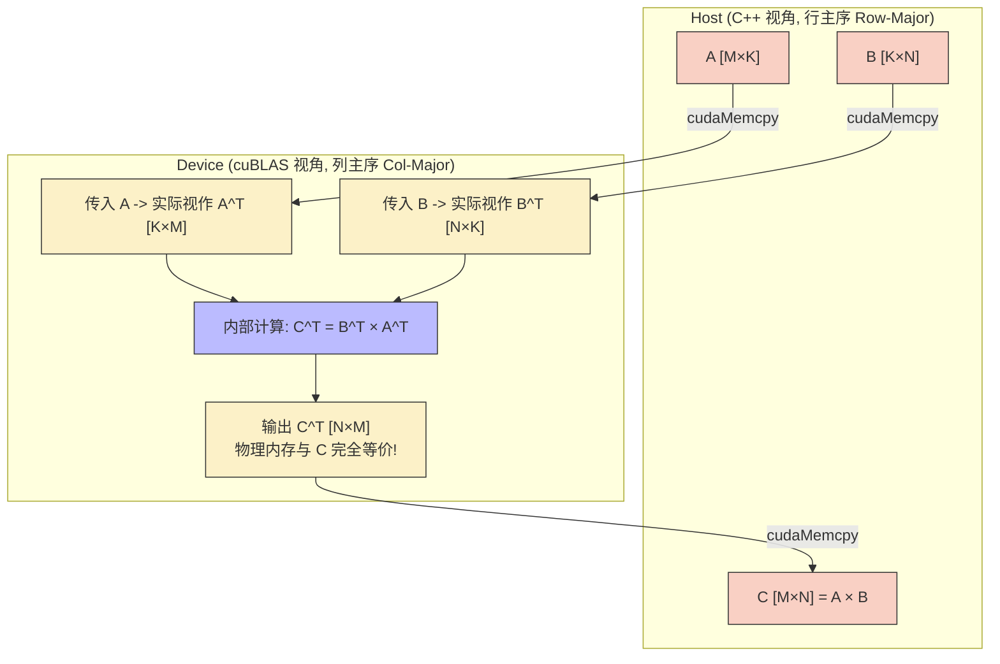
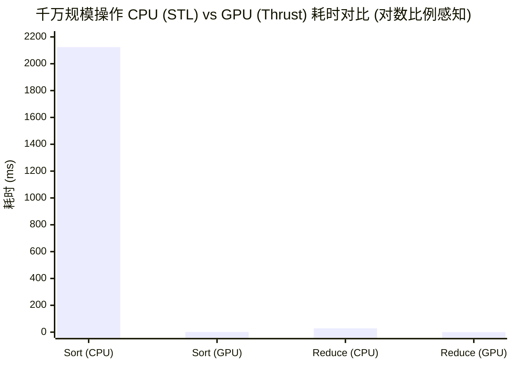

# 12_Standard_Libraries — 高性能标准库与生态

## 一、全景导览与学习目标

本子项目属于 CUDA-Practice 学习体系的**成熟生态与工程实践（L2-L3）**阶段。在实际工业界项目中，"不要重复造轮子"是第一准则。NVIDIA 提供了由顶尖架构师用 PTX/SASS 汇编级优化的标准库群，它们的性能不仅远超大多数手写 CUDA Kernel，还能自动适配每一代新架构的底层细节。

本模块选取了科学计算与数据处理中最核心的三把利器：

| 文件 | 核心库 | 功能定位 | 应用场景 |
|------|--------|----------|---------|
| `01_cublas_gemm/cublas_gemm.cu` | **cuBLAS** | 基础线性代数子程序（BLAS）| 深度学习矩阵乘、全连接层 |
| `02_cufft/cufft_example.cu` | **cuFFT** | 快速傅里叶变换（FFT）| 信号处理、图像频域滤波、偏微分方程 |
| `03_thrust/thrust_algorithms.cu` | **Thrust** | 并行 C++ 标准模板库（STL）| 数据洗牌、排序、归约、扫描引擎 |

---

## 二、核心库能力与接口解析

### 1. cuBLAS：线性计算的性能天花板

cuBLAS 提供了传统 BLAS 级别（Level 1 向量、Level 2 矩阵-向量、Level 3 矩阵-矩阵）的完整实现。

- **`cublasSgemm`**：标准的单精度矩阵乘法接口，需注意其默认采用 **列主序（Column-Major）**，在处理 C/C++ 的行主序矩阵时，需要利用转置法则 $C^T = B^T A^T$ 巧妙传参。
- **`cublasLtMatmul`**：cuBLAS 引入的底层轻量级（Lightweight）接口，允许用户显式配置算法启发式搜索（Heurisitics）、指定 Tensor Core 开启情况、支持 FP8/FP16 等混合精度拓展，并在内部融合了激活函数（Epilogue）。

### 2. cuFFT：频域转换引擎

快速傅里叶变换将 $\mathcal{O}(N^2)$ 的离散傅里叶变换（DFT）优化为 $\mathcal{O}(N\log N)$。cuFFT 进一步榨干了 GPU 的共享内存和执行层级。

- 支持 1D、2D、3D 变换，支持 Batch 并行处理。
- `cufftPlan1d` 会根据数组大小 $N$ 自动做素数分解，如果 $N = 2^a \times 3^b \times 5^c \times 7^d$，cuFFT 能达到最极致的性能。

### 3. Thrust：GPU 上的 STL

Thrust 将晦涩的 CUDA Kernel 封装为了类似 `std::vector` 和 `std::algorithm` 的高阶模板。

- **设备容器**：`thrust::device_vector<T>` 直接在 GPU 显存上分配和管理内存，生命周期同 RAII，免去繁琐的 `cudaMalloc`。
- **仿函数（Functor）**：配合自定义的结构体（重载 `operator()`），可以使用 `thrust::transform` 轻松实现融合的逐元素计算（如 SAXPY）。

---

## 三、硬核数据流架构解析

### cuBLAS 行主序补救机制映射图



这解释了为何在调用 `cublasSgemm` 计算 $C = A \times B$ 时，入参顺序必须是 `(handle, trans_b, trans_a, n, m, k, alpha, B, ldb, A, lda, beta, C, ldc)`。

---

## 四、关键源码逐行解剖

### Thrust 优雅并行化（来自 `thrust_algorithms.cu`）

```cuda
// 1. 定义仿函数 Functor (标识 __host__ __device__ 使其在 CPU/GPU 双端可用)
struct saxpy_functor {
    const float a;
    saxpy_functor(float _a) : a(_a) {}
    __host__ __device__
    float operator()(const float& x, const float& y) const {
        return a * x + y;
    }
};

// 2. 内存分配与隐式 H2D 拷贝
thrust::device_vector<float> d_x = h_x; // 重载了 =, 内部自动调用 cudaMemcpy
thrust::device_vector<float> d_y = h_y;
thrust::device_vector<float> d_out(d_x.size()); // 独立输出缓冲区

// 3. 一行代码实现融合算术启动 (内部自动选择最佳 Block/Grid 配置)
thrust::transform(
    d_x.begin(), d_x.end(),   // 输入 1 的范围
    d_y.begin(),              // 输入 2 的起始点
    d_out.begin(),            // 输出的起始点（独立缓冲区，不覆盖 d_y）
    saxpy_functor(a)          // 传入仿函数实例
);
```

这段代码等价于手动编写一个含有 grid-stride loop 的 `saxpy_kernel`，且鲁棒性与边界保护更好。

---

## 五、性能基准与分析

> 所有数据提取自 `Results/12_Standard_Libraries.md` 真实日志，测试硬件：NVIDIA GeForce RTX 4090（sm_89）× 2，Linux，nvcc -O3。

### 1. cuBLAS (SGEMM 矩阵乘，$1024 \times 1024$，50 次平均)

| 版本/调用接口 | Kernel 时间 | 吞吐算力 | 对比评价 |
|-------------|------------|---------|---------|
| `cublasSgemm` | 0.04 ms | 49.91 TFLOPS | 稳定基准，内置汇编级调优 |
| `cublasLtMatmul` | 0.04 ms | 50.10 TFLOPS | 极微小领先，支持更多数据类型拓展 |
| `cublasSgemmStridedBatched` (Batch=8)| 0.45 ms (总批次) | 37.88 TFLOPS | 隐藏多矩阵 Launch 开销的最佳方案 |

*(注：相比 `04_GEMM_Optimization` 章节中最顶尖的手写 Register Tiling（28.79 TFLOPS），cuBLAS 稳超 70%+。)*

### 2. cuFFT (4096 采样点一维复数变换，100 次平均)

| 算法 | 大小 | 平均耗时 | 加速比 |
|------|------|---------|--------|
| CPU $\mathcal{O}(N^2)$ (手工实现) | 4096 | 395.078 ms | 基准 (1x) |
| **GPU cuFFT $\mathcal{O}(N\log N)$** | 4096 | **0.0035 ms** | **112156.50×** |

*在大规模数据打散验证中 (Batch=65536, N=1024)，cuFFT 达成了强悍的 **457.46 GB/s** 综合有效带宽。*

### 3. Thrust (1000 万规模元素的 STL 操作)

| 算法操作 | CPU 耗时 (STL) | GPU 耗时 (Thrust) | 加速比 | 带宽 |
|---------|--------------|-----------------|-------|------|
| `sort` (排序) | 2124.06 ms (`std::sort`) | 1.30 ms | **1634×** | — |
| `reduce` (求和) | 28.35 ms (`std::accumulate`) | 0.08 ms | **371×** | 487.88 GB/s |
| `transform` (SAXPY) | 29.20 ms (for 循环) | 0.13 ms | **222×** | 849.73 GB/s |



**综合结论**：Thrust 等标准库在提供极致抽象的同时，完全未牺牲底层性能。`transform` 的 849.73 GB/s 带宽已经接近原生的 `coalesced_access` 内核性能上限。在工程中，优先使用库调用是唯一的正解。

---

## 六、编译及参考资料

### 编译与运行

```bash
# 从项目根目录配置（首次）
cmake -B build -DCMAKE_BUILD_TYPE=Release

# 编译三个目标
# 注意：CMakeLists 中已自动链接了 -lcublas -lcufft 等预编译库
cmake --build build --target cublas_gemm -j8
cmake --build build --target cufft_example -j8
cmake --build build --target thrust_algorithms -j8

# 标准运行
./build/12_Standard_Libraries/01_cublas_gemm/cublas_gemm
./build/12_Standard_Libraries/02_cufft/cufft_example
./build/12_Standard_Libraries/03_thrust/thrust_algorithms
```

### 参考资料

- [cuBLAS Library Documentation](https://docs.nvidia.com/cuda/cublas/index.html) — 必读的 API 接口定义，特别是附录中对 Column-Major 和 Row-Major 映射的解释
- [cuFFT Library Documentation](https://docs.nvidia.com/cuda/cufft/index.html) — 关于 Data Layout（交织或非交织复数数组）的内存布置要求
- [Thrust Quick Start Guide](https://nvidia.github.io/cccl/thrust/getting_started.html) — 快速上手 Thrust 容器、仿函数、迭代器(Iterators)的概念指南
