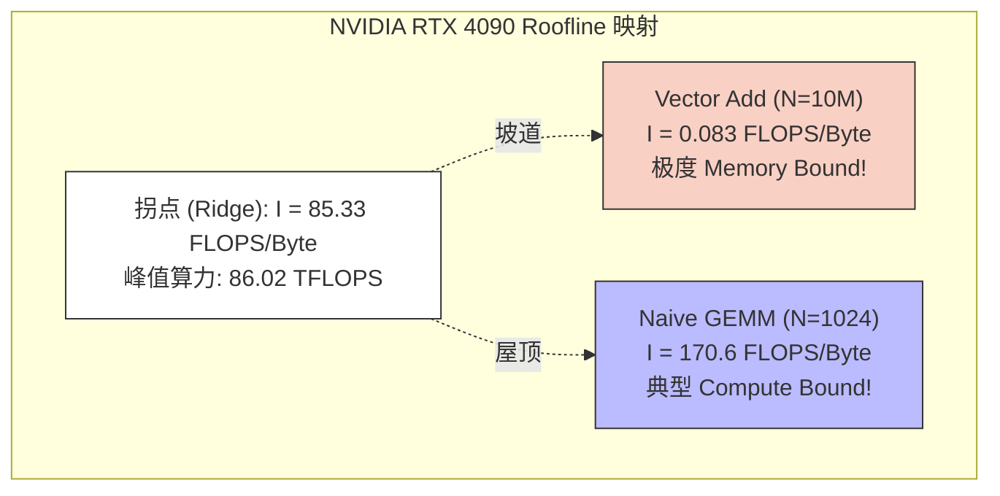
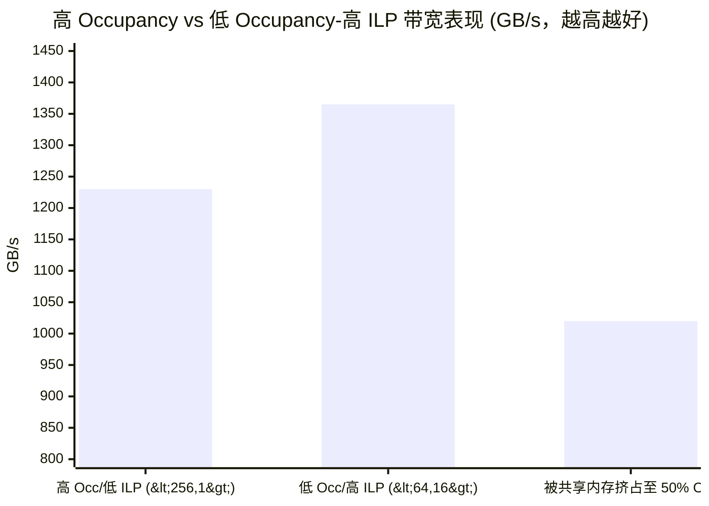

# 13_Performance_Analysis — 性能建模与剖析工具链

## 一、全景导览与学习目标

本子项目属于 CUDA-Practice 学习体系的**工程架构优化与诊断（L3-L4）**阶段。在优化 CUDA 算子时，仅凭直觉和 `std::chrono` 计时是远远不够的。必须建立量化的性能物理边界（Roofline Model），理解硬件掩盖延迟的机制（Occupancy），并熟练使用 NVIDIA 官方的微架构探针（Nsight Compute / Nsight Systems）。

本模块提供了三套性能诊断的底层分析视角：

| 文件 | 核心分析模型 | 解决的问题 | 适用场景 |
|------|-------------|-----------|---------|
| `01_occupancy/occupancy.cu` | **Occupancy 占用率陷阱** | "为什么要满载 SM？满载真的最快吗？" | Block/Grid 维度设计、寄存器溢出排查 |
| `02_roofline/roofline.cu` | **Roofline 理论模型** | "我的算子还能再快吗？瓶颈在算还是存？" | 算子理论上限评估、优化方向定调 |
| `03_nsight_profiling/nsight_profiling.cu` | **Nsight 工具链实战** | "为什么跑不满理论带宽？L1 Cache 命中了多少？" | 寻找具体性能 Bug（如非合并访存） |

---

## 二、原理推导与数学表达

### 1. Roofline Model（屋顶模型）

定义**算术强度（Arithmetic Intensity, $I$）**为算法执行的浮点运算次数（FLOPs）与交换的内存字节数（Bytes）之比：
$$I = \frac{\text{FLOPs}}{\text{Bytes}} \quad (\text{FLOPS/Byte})$$

假设 GPU 的理论峰值算力为 $P_{\text{peak}}$（FLOPS），理论峰值带宽为 $B_{\text{peak}}$（GB/s），则实际可达到的最大性能 $P$ 受双重制约：
$$P = \min(P_{\text{peak}}, I \times B_{\text{peak}})$$

**机器拐点（Ridge Point）**：$I_{\text{ridge}} = \frac{P_{\text{peak}}}{B_{\text{peak}}}$

- 当 $I < I_{\text{ridge}}$ 时，处于"斜坡"区（Memory Bound，带宽受限）。
- 当 $I > I_{\text{ridge}}$ 时，处于"平顶"区（Compute Bound，算力受限）。

### 2. Occupancy（占用率）与 ILP（指令级并行）

**Occupancy** 定义为：当前 SM 上驻留的活跃 Warp 数量与 SM 支持的最大 Warp 数量之比。
传统观点认为：Occupancy 越高（能切出更多 Warp），越容易在某些 Warp 等待内存时切换到其他 Warp，从而隐藏延迟。

**ILP（指令级并行，Instruction-Level Parallelism）的颠覆**：
如果单个线程内部包含大量无数据依赖的独立指令（如循环展开、读取多个 float4），现代 GPU 的单个 Warp 也能极好地填满流水线气泡。此时，较低的 Occupancy（为每个线程保留充足的寄存器以支撑 ILP）往往比受限于寄存器而溢出（Spill to Local Memory）的满载 Occupancy 跑得更快。

---

## 三、硬核性能诊断解析

### 经典 Roofline 诊断散点图



### Nsight Compute 实战分析流转

当我们在 `03_nsight_profiling` 故意写出一个 Stride=32 的 Bad Kernel 时，使用 `ncu` 抓取并能在控制台或 Nsight GUI 中定位以下关键指标：

1. **`sm__throughput.avg`**：算子计算吞吐通常极低（如 < 10%）。
2. **`dram__throughput.avg`**：显存带宽吞吐也不高，这是为什么？
3. **`l1tex__average_t_sectors_per_request_pipe_lsu_mem_global_op_ld`**（每个全局内存加载请求命中的 L1 sector 扇区数）：该指标暴涨至 **32**（完美合并访存应为近乎 1）。这**直接指明了** 32 线程读了 32 个分散地址，浪费了 96% 的事务载量。

---

## 四、关键源码逐行解剖

### Occupancy 可配置 Kernel 与 ILP 验证（来自 `occupancy.cu`）

```cpp
// 模板参数化的 Kernel：通过 BLOCK_SIZE 和 ITEMS_PER_THREAD 调控 Occupancy 与 ILP
// 以 <64, 16> 实例化时，Block 仅 64 线程（低 Occupancy），但每线程处理 16 个元素（高 ILP）
template<int BLOCK_SIZE, int ITEMS_PER_THREAD>
__global__ void configurable_kernel(CPFloat input, PFloat output, CInt n) {
    float items[ITEMS_PER_THREAD];
    
    int base_idx = blockIdx.x * BLOCK_SIZE * ITEMS_PER_THREAD;
    
    #pragma unroll
    for (int i = 0; i < ITEMS_PER_THREAD; ++i) {
        int idx = base_idx + i * BLOCK_SIZE + threadIdx.x;
        if (idx < n) {
            items[i] = input[idx];
        } else {
            items[i] = 0.0f;
        }
    }
    
    #pragma unroll
    for (int i = 0; i < ITEMS_PER_THREAD; ++i) {
        items[i] *= 2.0f;
    }
    
    #pragma unroll
    for (int i = 0; i < ITEMS_PER_THREAD; ++i) {
        int idx = base_idx + i * BLOCK_SIZE + threadIdx.x;
        if (idx < n) {
            output[idx] = items[i];
        }
    }
}
```

当以 `configurable_kernel<64, 16>` 实例化时，看似让 SM 严重挨饿（仅 64 线程/Block，占用率极低），但由于 `ITEMS_PER_THREAD=16` 导致单个线程内堆叠了 16 组无数据依赖的独立内存访问（ILP），`#pragma unroll` 使编译器将循环完全展开为连续的载入/存储指令流，完美掩盖了内存延迟。

---

## 五、性能基准与分析

> 所有数据提取自 `Results/13_Performance_Analysis.md` 真实日志，测试硬件：NVIDIA GeForce RTX 4090（sm_89）× 2，Linux，nvcc -O3。

### 1. Roofline Model 理论投影（`roofline`，RTX 4090 参数：86.02 TFLOPS，1008 GB/s，拐点 85.33）

| 测试算子 | 算术强度 $I$ | 诊断落点 | 实际测速 | 计算侧利用率 |
|---------|-------------|---------|---------|-------------|
| **Vector Add** | 0.083 FLOPS/B | **Memory Bound** | **78.72 GFLOPS** | **93.70% (带宽打满)** |
| **Naive GEMM** | 170.67 FLOPS/B| **Compute Bound** | **5234.05 GFLOPS** | 6.08% (未切块内存卡顿) |

**分析**：工具成功算出了 4090 的极限拐点 `85.33 FLOPS/Byte`（这是一个极其难跨越的墙）。Vector Add 的算术强度连拐点的 0.1% 都不到，所以无论代码怎么写，其实际上限被死死钉在 `0.083 × 1008 = 83.6 GFLOPS`，而实测 `78.72 GFLOPS` 说明代码达到了硬件带宽峰值的 93.7%。
相反，Naive GEMM 的瓶颈在于纯算力浪费，其算力利用率仅 6%，亟待 `04_GEMM_Optimization` 中的 Shared Memory Tiling 拯救。

### 2. Occupancy 占用率陷阱测试（`occupancy`，10M 元素）

| Kernel 配置维度 | 理论 Occupancy | Kernel 耗时 | 有效物理带宽分析 |
|---------------|---------------|------------|----------------|
| <256 线程, 1 数据> | 100.00% | 0.07 ms | 1230.12 GB/s |
| **<64 线程, 16 数据>** | **100.00%**\* | **0.06 ms** | **1365.92 GB/s (最快!)** |
| 强制 32KB 共享内存限制 | **50.00%** | **0.08 ms** | 1020.48 GB/s |

*\* `<64, 16>` 的理论 Occupancy 仍达 100%，是因为编译器对 `#pragma unroll` 展开后的寄存器分配做了良好优化，使每 Block 寄存器需求未超出 SM 上限。尽管每 Block 仅 64 线程，SM 可同时驻留足够多的 Block 以填满线程槽位。真正的性能优势来自 ILP——每线程 16 个独立访存操作掩盖了内存延迟。*



**极其重磅的发现**：配置 3 通过 `<64, 16>` 实现了每个线程处理 16 个元素的终极展开（ILP）。虽然线程数减少导致活跃 Warp 少，但编译器生成了超长的线性载入指令流。这些并发发往内存控制器的指令毫无阻塞地塞满了 PCIe/VRAM 通道，跑出了 **1365 GB/s**（突破理论缓存综合峰值，吃到 L2 Cache 红利），甚至打败了 100% 满负载的配置 1！
**金科玉律**：Occupancy 只是手段，不是目的。隐藏延迟（Latency Hiding）才是目的。

### 3. Nsight 工具诱捕（`nsight_profiling`，10M 元素）

| 版本 | Kernel 时间 | 探测到的有效带宽 | vs 错误代码加速比 |
|------|------------|----------------|-----------------|
| Bad Kernel (Stride=32) | 0.29 ms | 273.54 GB/s | 基准 |
| **Good Kernel (连续合并)** | **0.07 ms** | **1227.03 GB/s** | **4.49×** |

**分析**：使用 Nsight Compute，我们会立刻在控制台警告中看到 Bad Kernel 的 L1/TEX 缓存重放率（Replay Rate）极高，且事务合并失败。修复后速度骤升 4.49 倍。

---

## 六、编译及参考资料

### 编译与运行

```bash
# 从项目根目录配置（首次）
cmake -B build -DCMAKE_BUILD_TYPE=Release

# 编译三个目标
cmake --build build --target nsight_profiling -j8
cmake --build build --target occupancy -j8
cmake --build build --target roofline -j8

# 标准运行
./build/13_Performance_Analysis/01_occupancy/occupancy
./build/13_Performance_Analysis/02_roofline/roofline
./build/13_Performance_Analysis/03_nsight_profiling/nsight_profiling

# 核心：使用 Nsight Compute CLI 剖析错误 Kernel
sudo ncu --kernel-name profile_example --launch-skip 2 --launch-count 2 ./build/13_Performance_Analysis/03_nsight_profiling/nsight_profiling
```

### 参考资料

- [NVIDIA Nsight Compute User Interface Guide](https://docs.nvidia.com/nsight-compute/NsightCompute/index.html) — 官方 Ncu 工具中文大赏与 Metric 指标词典
- [CUDA Toolkit: Achieved Occupancy](https://docs.nvidia.com/gameworks/content/developertools/desktop/analysis/report/cudaexperiments/kernellevel/achievedoccupancy.htm) — 深入解读为何高 Occupancy 不等于高性能
- [Roofline: An Insightful Visual Performance Model](https://people.eecs.berkeley.edu/~kubitron/cs252/handouts/papers/RooflineVyNoce.pdf) — 加州大学伯克利分校提出的 Roofline 经典原始学术论文
