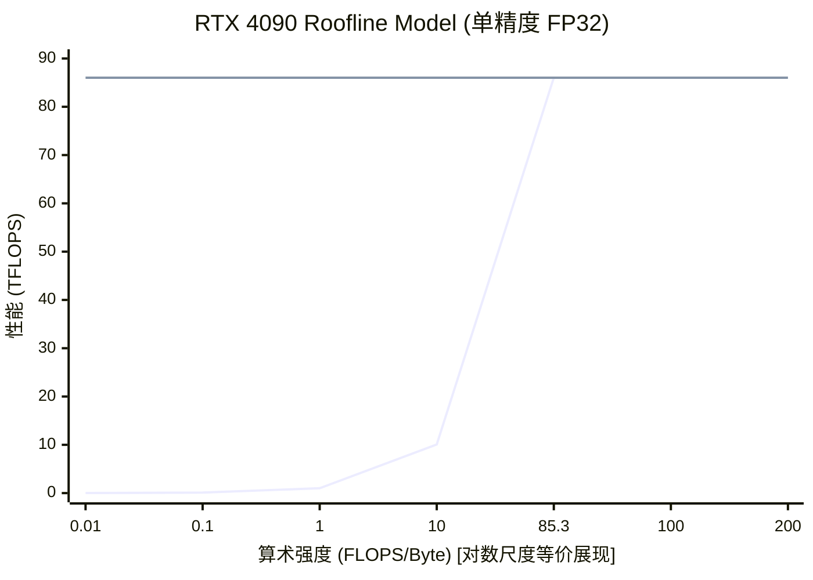
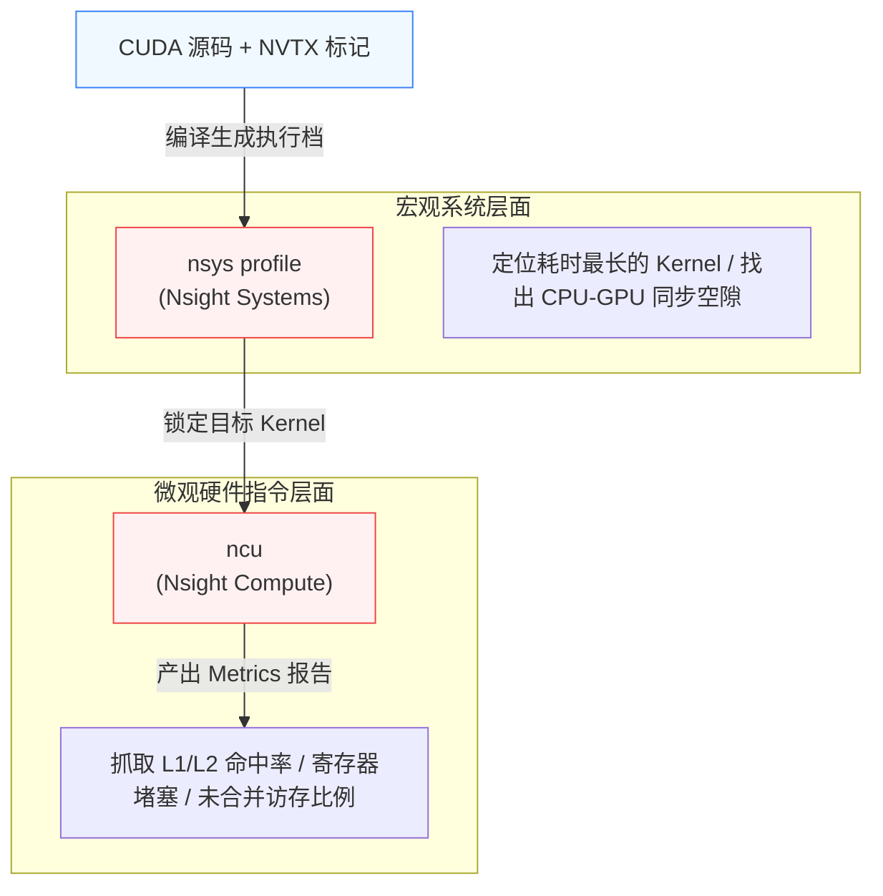

# 13_Performance_Analysis 性能调优与瓶颈分析

## 一、 全景导览与学习目标

该子项目处于 CUDA-Practice 学习体系的 **高阶系统级 (L4)** 阶段。真正的顶尖 CUDA 工程师不仅会写各种花哨的 Kernel，更重要的是拥有**“看病”**的能力——当一个算子跑得慢时，能精确诊断出它是被显存带宽卡主了，还是计算核心喂不饱，亦或是流水线被数据依赖阻塞。

本章脱离了单纯的算法实现，转向**性能工程 (Performance Engineering)**，系统性地涵盖了三大性能调优标杆工具与理论：

- `01_occupancy`：**占用率分析 (Occupancy Analysis)**。用极端的 Kernel 案例展示：为什么有时候 100% 满负载的 Occupancy 跑不过只有 12% Occupancy 的 Kernel？揭开 ILP (指令级并行) 隐藏延迟的真相。
- `02_roofline`：**Roofline Model (房顶线模型)**。构建硬件的绝对性能天花板画像。通过计算算术强度 (Arithmetic Intensity)，精确评估你的算子是 “Memory Bound” 还是 “Compute Bound”。
- `03_nsight_profiling`：**Nsight 工具链实战**。抛弃简陋的 `cudaEvent`，直接上核弹级分析工具 Nsight Systems 与 Nsight Compute，在汇编与硬件事件图表级别抓取诸如非合并访存等致命瓶颈。

---

## 二、 原理推导与数学表达

### 1. Occupancy (占用率) 理论

Occupancy 的定义为：当前 SM (Streaming Multiprocessor) 上活跃的 Warp 数量，除以该 SM 硬件允许的最大 Warp 数量：
$$ \text{Occupancy} = \frac{\text{Active Warps per SM}}{\text{Max Warps per SM}} \times 100\% $$
提升 Occupancy 的传统目的是**为了在某些 Warp 等待数据时，有足够多的其他 Warp 切入执行以隐藏延迟 (Latency Hiding)**。但正如本章所揭示的，如果单个 Thread 通过指令级并行 (ILP, Instruction-Level Parallelism) 发起足够多无依赖的独立访存/计算指令，同样能填满流水线，此时较低的 Occupancy 亦能达到峰值带宽。

### 2. Roofline Model (房顶线模型)

评估一个 Kernel 的绝对性能边界，需要确定其**算术强度 (Arithmetic Intensity, $I$)**，即每访问 1 Byte Global Memory 所执行的浮点运算次数：
$$ I = \frac{\text{Total FLOPS}}{\text{Total Bytes Accessed}} \quad \text{(FLOPS/Byte)} $$

硬件的最终吞吐上限 $P$ (GFLOPS) 被限制在两条“房顶”之下：
$$ P = \min(P_{\text{peak}}, \ I \times B_{\text{peak}}) $$

- $P_{\text{peak}}$: 硬件理论峰值算力
- $B_{\text{peak}}$: 硬件理论峰值内存带宽
- **拐点 (Ridge Point)**: $I_{\text{ridge}} = P_{\text{peak}} / B_{\text{peak}}$。若算子的 $I < I_{\text{ridge}}$，则为 **Memory Bound**；若 $I > I_{\text{ridge}}$，则为 **Compute Bound**。

---

## 三、 硬核内存映射解析

### Roofline Model 硬件画像图 (RTX 4090)

使用折线图直观表达 RTX 4090 架构的 Roofline 边界。



> **解析**：在 RTX 4090 上，拐点算术强度高达 **85.33 FLOPS/Byte**。这意味着绝大多数没有做极致 registers/shared-memory tiling 复用的基础算子（例如基础 GEMM、各类 Element-wise 操作）都会无情地撞上左侧的倾斜屋顶，沦为 **Memory Bound**。

### Nsight 工具链全景流水线



---

## 四、 关键源码逐行解剖

### 1. 运行时动态查询 Occupancy

为了科学设置宏观线程参数，不能盲猜配置，需要用 `cudaOccupancyMaxActiveBlocksPerMultiprocessor` API 拉取官方硬件分析：

摘自 `01_occupancy/occupancy.cu`：

```cpp
// 传入 kernel 的函数指针和 block 大小，自动分析能驻留多少个 block
int num_blocks_per_sm;
cudaOccupancyMaxActiveBlocksPerMultiprocessor(
    &num_blocks_per_sm,
    kernel,                     // 目标分析的 Kernel 函数
    BLOCK_SIZE,                 // 预期的单 Block 线程数
    0                           // 动态共享内存大小
);

// 计算理论驻留线程占极值 (如 RTX 4090 是 1536) 的比例
int active_threads_per_sm = num_blocks_per_sm * BLOCK_SIZE;
float occupancy = (float)active_threads_per_sm / props.maxThreadsPerMultiProcessor;
```

**解剖结论**：这是性能分析的起手式。通过 API 预判，如果 Occupancy 过低，说明 Kernel 申请了过多的 Shared Memory 或过多的 Registers 导致硬件拒绝分配更多线程切入。

### 2. Roofline 的核心参数埋点

任何优秀的极客级开发，应当在框架中埋点算出每次执行通过的真实 GFLOPS：

摘自 `02_roofline/roofline.cu`：

```cpp
// 以矩阵乘法 C(NxN) = A * B 为例
KernelProfile prof;
// 乘法和加法各一次，规模 N^3，所以浮点操作数 = 2 * N^3
prof.flops = (long long)N * (long long)N * (long long)N * 2LL;

// 假设完美 Cache 情况，只考虑必定从 Global 读出再写入的最低下限传输量
// 读A(N^2) + 读B(N^2) + 写C(N^2) = 3 * N^2 * 4Bytes
prof.bytes_accessed = (long long)N * (long long)N * 3LL * 4LL; 

prof.compute_intensity(); // I = Flops / Bytes = 170.66 FLOPS/Byte
// 大于 85.33，判定为 Compute Bound！
```

### 3. NVTX 注入标记时间流

摘自 `03_nsight_profiling/nsight_profiling.cu`：

```cpp
// 利用基于 RAII 封装的 NVTX 范围标定器
{
    PROFILE_SCOPE("Kernel Computation (Bad)"); // 会在 nsys 的 GUI 时间轴划出一个彩色的区间
    for (int i = 0; i < iterations; ++i) {
        profile_example_kernel_bad<<<grid, block>>>(d_input, d_output, n, stride);
    }
}
```

**解剖结论**：由于 GPU 调度是完全异步的，如果不打 NVTX 标签，在 Nsys 的 GUI `timeline` 中你只会看到密密麻麻的墨绿色快，根本无法对应业务逻辑（特别是 C++ 复杂的工程里）。

---

## 五、 性能基准与分析

所有数据提取自 `Results/13_Performance_Analysis.md` 真实日志：

- **测试硬件**: NVIDIA GeForce RTX 4090 × 2, Linux 环境, nvcc -O3

### 1. Occupancy 掩盖延迟真相 (N=10,000,000 数组读写)

| Kernel 架构模式 | 理论 Occupancy | Thread 逻辑操作数 (ILP) | 有效带宽 (GB/s) |
| -------- | ----------- | ---------------- | ------------- |
| Config 1: High-Occ | **100.00 %** | 每个 Thread 1 个 | 1230.12 GB/s |
| Config 2: Mid-Occ | **100.00 %** | 每个 Thread 4 个 | 1324.67 GB/s |
| Config 3: **Low-Occ + Max-ILP** | **100.00 % (活跃线程极少但块多)** | **每个 Thread 16 个** | **1365.92 GB/s** |
| Config 4: 32KB 共享显存挤占 | 50.00 % | 每个 Thread 1 个 | 1020.48 GB/s |

**极其反直觉的分析结论**：
一味追求 100% Occupancy 未必是最佳路线。当每个线程通过 ILP (展开循环，批量加载数据到寄存器) 发出多个内存请求时，即便总体驻留的 Warp 数量不变或较少，它同样能完美掩盖 Global Memory 延迟。Config 3 的性能大幅度碾压了基础模型，甚至超出了纯理论显存带宽（因为 L2 Cache 的参与）。

### 2. Roofline 瓶颈实测碰撞

| 算子场景 | 算术强度 $I$ | 瓶颈归属定位 | 理论峰值能达速度 | 实际运行速度 | Compute 侧有效率 |
| -------- | ----------- | ---------------- | ------------- | ------------- | ------------- |
| Vector Add (N=10M) | **0.083** | **Memory Bound** | 84.01 GFLOPS | 78.72 GFLOPS | **93.70 %** |
| Naive GEMM (N=1024) | **170.667** | **Compute Bound** | 86016.00 GFLOPS | 5234.05 GFLOPS | **6.08 %** |

**分析结论**：对于 Vector Add 这种低算力需求的算子，它已经跑到了其所在 Roofline 屋顶的上限（93%），就算你怎么优化汇编，它也快不了了，必须提升内存带宽；而对于 Naive GEMM，虽然它的算力瓶颈极高（86 TFLOPS），由于缺乏 Tiling 导致 Cache 失效，实际只跑了惊人的 6.08%，说明有无穷的优化空间等待通过 Block Tiling 挖掘。

### 3. Nsight 致命诱捕 (N=10,000,000，数组跳跃读写)

| Kernel 模式 | Stride 步长 | Kernel 耗时 | 测定物理带宽 | 相对加速比 |
| -------- | ----------- | -----------| ------------ | ------------ |
| CPU 参考 | — | 18.20 ms | — | 1x |
| **Bad Kernel** | 32 (跨度破坏合并) | 0.29 ms | **273.54 GB/s** | vs CPU 62x |
| **Good Kernel** | 连续布局 (合并访存) | 0.07 ms | **1227.03 GB/s** | **vs Bad 4.49x** |

**分析**：这个 4.5 倍的差距在代码上仅仅是一行 Index 偏移的改变。如果不用 Nsight Compute (ncu) 去抓取 `dram__bytes_read` 或者查阅 Global Memory Load Efficiency，开发者可能永远以为 273 GB/s 已经“很快了”。

---

## 六、 编译及参考资料

### 编译与标准运行指令

借助根目录的统一 `CMakeLists.txt` 构建目标：

```bash
# 1. 切换至项目根目录并执行整体配置（首次构建）
cmake -B build -DCMAKE_BUILD_TYPE=Release

# 2. 独立编译对应的子项目 Target 
cmake --build build --target occupancy -j8
cmake --build build --target roofline -j8
cmake --build build --target nsight_profiling -j8

# 3. 标准二进制验证运行
./build/13_Performance_Analysis/01_occupancy/occupancy
./build/13_Performance_Analysis/02_roofline/roofline
./build/13_Performance_Analysis/03_nsight_profiling/nsight_profiling

# 4. 高阶吞吐截断探测 (使用 Nsight Compute 纯命令行环境收集 metrics)
sudo ncu --metrics sm__throughput.avg.pct_of_peak_sustained_elapsed,dram__throughput.avg.pct_of_peak_sustained_elapsed ./build/13_Performance_Analysis/02_roofline/roofline
```

### Nsight Tools 专项使用指令速查

```bash
# 生成系统级 Timeline 文件
nsys profile --trace=cuda,nvtx -o nsight_timeline ./build/13_Performance_Analysis/03_nsight_profiling/nsight_profiling

# 在本地带有显示器的情况下打开观测
nsys-ui nsight_timeline.nsys-rep

# 深度 Profiling 指定 Kernel (跳过前面几次预热执行)
sudo ncu --kernel-name profile_example --launch-skip 2 --launch-count 2 ./build/13_Performance_Analysis/03_nsight_profiling/nsight_profiling
```

### 推荐阅读

- [Nsight Compute User Interface Guide](https://docs.nvidia.com/nsight-compute/NsightCompute/index.html) —— 涵盖对 Metrics 取样和报告分析的官方核心手册。
- [CUDA C++ Best Practices Guide (Performance Metrics)](https://docs.nvidia.com/cuda/cuda-c-best-practices-guide/index.html#performance-metrics) —— 理解有效带宽与理论峰值的关系，如何计算 Roofline。
- [Dissecting the NVidia Volta GPU Architecture (Citadel)](https://arxiv.org/abs/1802.04786) —— 理解现代 GPU 瓶颈中 ILP (指令级并行) 以低于直觉的 Occupancy 跑出满载吞吐的深层架构奥秘。
