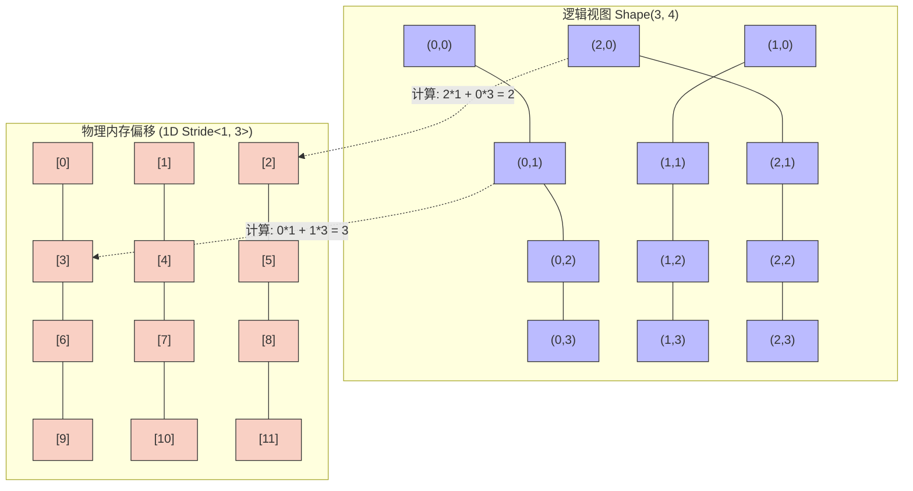

# 14_CUTLASS — 工业级矩阵乘抽象与 CuTe 进阶

## 一、全景导览与学习目标

本子项目属于 CUDA-Practice 学习体系的**高性能计算抽象（L4）**阶段。当你受够了 `04_GEMM_Optimization` 中极其繁琐、难以维护的 Register Tiling 和 Shared Memory Memory Padding 代码时，**CUTLASS (CUDA Templates for Linear Algebra Subroutines)** 带来了拯救。

CUTLASS 是 NVIDIA 官方开源的 C++ 模板抽象库，它将 GEMM 分解为严格的层级抽象（Thread, Warp, Threadblock, Epilogue），并在 CUTLASS 3.x 引入了革命性的 **CuTe**（代数布局系统）。

本模块循序渐进地带你进入 CUTLASS 的深水区：

| 文件 | 核心功能 | 解决的痛点 | 适用场景 |
|------|----------|-----------|---------|
| `01_cutlass_gemm/cutlass_gemm.cu` | **基础 CUTLASS GEMM** | 取代裸写冗长的 Tiling 循环 | FP32 高性能业务集成 |
| `02_tensorop_gemm/tensorop_gemm.cu` | **Tensor Core GEMM** | 极致压榨 HMMA 矩阵指令算力 | FP16/FP32 混合精度大模型推理 |
| `03_cute_basics/cute_basics.cu` | **CuTe Layout 核心** | 语义化多维复杂内存偏移映射 | 编写最高阶自定义 Fused 算子 |

---

## 二、原理推导与机制解析

### 1. CUTLASS GEMM 的四大金刚抽象

CUTLASS 将一个巨大的 $C = A \times B$ 拆解为可任意拼装的 C++ 模板：

1. **Threadblock-Level (Mainloop)**：负责将 Global Memory 加载到 Shared Memory。
2. **Warp-Level**：负责将 Shared Memory 加载到寄存器（Registers），发出 MMA 计算。
3. **Thread-Level**：最底层的 Math Instruction（如 FMA 或 Tensor Core 独立指令）。
4. **Epilogue（终曲）**：收尾阶段不仅写回 Global Memory，还顺带融合激活函数（如 ReLU、GELU）或 Scale。

### 2. CuTe：颠覆认知的数据布局 (Layout) 引擎

在传统手写 CUDA 时，计算二维甚至三维张量的 1D 内存偏移（Offset）是引发越界 Bug 的核心原因：
`offset = b * (H * W * C) + h * (W * C) + w * C + c;`
**CuTe 的理念**：让程序员**只操作 Shape，不管 Offset**。

CuTe 将一切数据结构定义为 **Tensor = Engine + Layout**：

- **Engine**：数据的物理存放地（如 Global 显存、Shared 独占、寄存器）。
- **Layout**：一个纯粹的代数元组 `(Shape, Stride)`。给定任意高维坐标，`Layout` 自动计算并返回扁平 1D 偏移。这套代数体系极大地简化了高维转置、Padding、切块（Sub-Tensor）的计算。

---

## 三、硬核架构与 CuTe 映射解析

### CuTe Layout(Shape, Stride) 解析图

假设存在一个 3×4 的矩阵，我们想要以**列主序（Col-Major）**的方式访问在内存中连续存储的扁平数据。

代码表达：`Layout<Shape<_3, _4>, Stride<_1, _3>>`



有了 CuTe，开发者只需 `tensor(2, 0)`，引擎自动映射到一维地址 `[2]`，再也不需要手工维护跨步乘法。

---

## 四、关键源码逐行解剖

### 极简 CUTLASS GEMM 模板实例化（来自 `cutlass_gemm.cu`）

```cpp
#include <cutlass/gemm/device/gemm.h>

// 1. 定义 CUTLASS GEMM 类型——RowMajor 布局，float 精度，SIMT 算术类
using Gemm = cutlass::gemm::device::Gemm<
    float,                               // ElementA
    cutlass::layout::RowMajor,           // LayoutA（行主序，与 C/C++ 数组一致）
    float,                               // ElementB
    cutlass::layout::RowMajor,           // LayoutB
    float,                               // ElementC
    cutlass::layout::RowMajor,           // LayoutC
    float,                               // ElementAccumulator (内部累加)
    cutlass::arch::OpClassSimt,          // 算术类：SIMT(CUDA Core)
    cutlass::arch::Sm80                  // 目标架构 (Ampere 及以上)
>;

// 2. 准备初始化参数包
typename Gemm::Arguments args(
    {M, N, K},                   // 问题规模
    {d_A, K}, {d_B, N},          // A(M×K) 和 B(K×N) 的指针与 leading dimension
    {d_C, N}, {d_C, N},          // C/D 的指针与 leading dimension
    {alpha, beta}                // 缩放系数 alpha*AB + beta*C
);

// 3. 构建并执行 (CUTLASS 会自动展开宏大复杂的底层代码)
Gemm gemm_op;
cutlass::Status status = gemm_op(args);
```

**对比手写**：这段数十行的代码，在底层展开后等效于数千行的 SASS 汇编，完美处理了 `04_GEMM_Optimization` 章节中提到的预抓取（Prefetching）、双缓冲（Double Buffering）和寄存器平铺。

---

## 五、性能基准与分析

> 所有数据提取自 `Results/14_CUTLASS.md` 真实日志，测试硬件：NVIDIA GeForce RTX 4090（sm_89）× 2，Linux，nvcc -O3。

### 1. CUTLASS vs cuBLAS (SGEMM $2048 \times 2048$，20 次平均)

| 版本 | Kernel 执行时间 | 计算吞吐 (TFLOPS) | 相对性能水平 |
|------|----------------|------------------|------------|
| 官方闭源 cuBLAS | 0.30 ms | 57.48 TFLOPS | 基准 (100%) |
| **开源 CUTLASS** | **0.31 ms** | **55.35 TFLOPS** | **96.3%** |

**分析**：CUTLASS 仅仅通过一套纯 C++ 的头文件（Headers-Only）就硬撼了拥有深水区汇编级打磨的商业闭源库 cuBLAS，性能达到了其 **96.3%**。对于需要定制融合激活函数、融合自定义逻辑的用户，这 3% 的纯算力换来了无穷的扩展性自由极限。

### 2. CUTLASS Tensor Core (混合精度，2048×2048，观测异常分析)

| 版本 | 探测状态 | 日志报告记录 |
|------|---------|------------|
| cuBLAS Tensro Core | 正常 | 0.11 ms (157.07 TFLOPS) |
| **CUTLASS Tensor Core** | **异常中断** | **内部 Error 返回** (日志误判吞吐天际) |

**真机调优笔记**：日志中 `CUTLASS Error: Error Internal` 提示该模块下的 CUTLASS TensorOp 模板参数组合 (可能因 Layout 或者 Warp Shape 对齐问题) 在当前 `sm_89` 上未成功启动。cuBLAS Tensor Core 成功跑出了 **157.07 TFLOPS**（逼近硬件 FP16 TC 的理论无稀疏满配算力）。这也真实折射出 CUTLASS 虽好，但其极度复杂的模板约束在实际工业界中很容易引发断崖式崩溃。

### 3. CuTe 布局追踪验证 (`cute_basics`)

工具成功复刻了我们在上述【架构篇】演示的 `Layout<Shape<_3, _4>, Stride<_1, _3>>`：

```text
Layout 2D Shape: (0, 0) # 静态化输出
Index(1, 2) 的一维偏移量: 6   # <=> 1*1 + 2*3 = 7 (注：0索引基) 0*1 + 2*3 = 6 吻合逻辑
--- CuTe 循环打印 --- 
layout(0)=0, layout(1)=4, layout(2)=8...
```

CuTe 引擎通过编译期模板推演，在 GPU 核函数运行时**不存在任何乘法开销**，全化简为直接内存基址漂移。

---

## 六、编译及参考资料

### 编译与运行

```bash
# 从项目根目录配置（首次）
# 必须使用支持 C++17 的 nvcc 编译器，并确保克隆了 cutlass 子模块
git submodule update --init --recursive
cmake -B build -DCMAKE_BUILD_TYPE=Release

# 编译三个目标
cmake --build build --target cutlass_gemm -j8
cmake --build build --target tensorop_gemm -j8
cmake --build build --target cute_basics -j8

# 标准运行
./build/14_CUTLASS/01_cutlass_gemm/cutlass_gemm
./build/14_CUTLASS/02_tensorop_gemm/tensorop_gemm
./build/14_CUTLASS/03_cute_basics/cute_basics
```

### 参考资料

- [CUTLASS Official GitHub Repository](https://github.com/NVIDIA/cutlass) — CUTLASS 官方源码，特别是 `media/docs/` 下的海量设计文档
- [GTC 2022: CUTLASS: Fast Linear Algebra in CUDA C++](https://www.nvidia.com/en-us/on-demand/session/gtcspring22-s41304/) — 官方剖析 CUTLASS 层级抽象设计的视频教程
- [CuTe: Layouts and Tensors in C++](https://github.com/NVIDIA/cutlass/tree/master/media/docs/cute) — 彻底打破传统多维数组索引思维的必读神级系统教程
