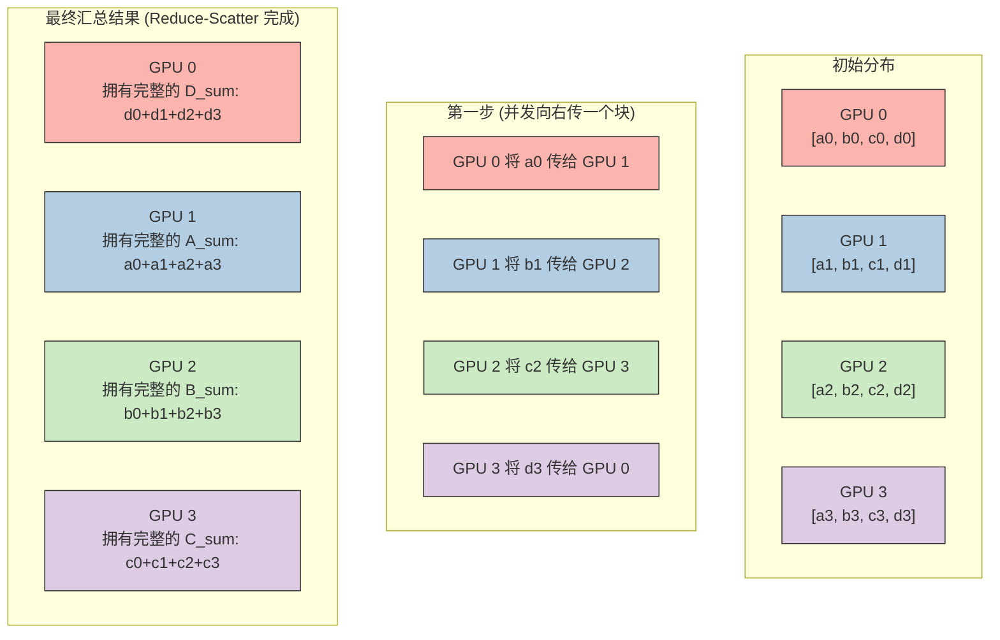

# 15_Multi_GPU — 分布式训练与多卡架构基石

## 一、全景导览与学习目标

本子项目属于 CUDA-Practice 学习体系的**分布式与集群架构（L4）**阶段。在千亿参数大模型时代，单张 GPU 的算力和显存（如 RTX 4090 的 24GB）已无法容纳甚至一个最基础模型（如 LlaMA-3 8B FP16 需约 16GB，开启 KV Cache 和 Batch 后轻易 OOM）。

如何让多张甚至成千上万张 GPU 像一台机器一样高效协作？**NCCL (NVIDIA Collective Communications Library)** 是目前唯一的工业界标准答案。本模块从最核心的多卡归约（AllReduce）入手，揭示 PyTorch `DistributedDataParallel (DDP)` 的底层引擎。

| 文件 | 核心技术 | 优化目标 | 工业界级应用 |
|------|----------|---------|-----------|
| `01_nccl_allreduce/nccl_allreduce.cu` | **NCCL AllReduce** | 实现多 GPU 间的张量无缝求和与分发 | 数据并行中的梯度同步 (Gradient Sync) |

---

## 二、原理推导与机制解析

### 为什么不能用 CPU 做中转？ (传统 Parameter Server 的死局)

在早期的分布式训练中，多卡梯度的同步需要：GPU_0 传回 CPU $\rightarrow$ GPU_1 传回 CPU $\rightarrow$ CPU 将其相加 $\rightarrow$ CPU 再发给所有 GPU。
这种架构的致命缺陷在于：**PCIe 总线带宽（双向 ~64 GB/s）成为了系统绝对的木桶短板**。

### NCCL Ring AllReduce 算法

NCCL 彻底抛弃了 CPU 中转，利用 **NVLink**（RTX 4090 虽被物理阉割 NVLink，但在数据中心级 GPU 如 A100 拥有 600 GB/s 的互连带宽）或 PCIe P2P (Peer-to-Peer) 直接在 GPU 间通信。

Ring-AllReduce 将所有 GPU 组成一个逻辑环（Ring），分为两个阶段：

1. **Reduce-Scatter (归约散播)**：
   - 将要同步的数据（如梯度）均分为 $N$ 块（$N$ 为 GPU 数量）。
   - 每张卡将自己的第 $k$ 块传给右侧卡，右侧卡将其与自己的加总，再传给下一张。
   - 经过 $N-1$ 步后，每张卡上恰好拥有**独一无二的完整归约好的一块数据**。
2. **All-Gather (全量收集)**：
   - 每张卡将自己那块完整的数据向右传阅。
   - 经过 $N-1$ 步后，所有卡的 $N$ 块数据都被补齐成了完整的归约结果。

**数学收益**：总通信量与 GPU 数量 $N$ 几乎无关（通信量恒定为 $2 \times \frac{N-1}{N} \times \text{Data\_Size}$），极具线性拓展性（Linear Scalability）。

---

## 三、硬核通信拓扑映射解析

### 多卡 (4-GPU) Ring Reduce-Scatter 阶段示意图

假设有 4 张 GPU，我们要汇总一个包含 4 个元素的数组 `[a, b, c, d]`。
初始状态每张卡都有自己的版本，定义为 `GPU0: [a0, b0, c0, d0]`。



*在下一个 All-Gather 阶段中，它们只需要再沿着环传递一次自己拥有的那块完整数据，即可让每张卡凑齐 `[A_sum, B_sum, C_sum, D_sum]`。*

---

## 四、关键源码逐行解剖

### NCCL 核心通信管线构建（来自 `nccl_allreduce.cu`）

```cuda
// 1. 生成全局唯一的 NCCL 通信 ID
ncclUniqueId id;
NCCLCHECK(ncclGetUniqueId(&id));

// 2. 分组初始化：为每个设备分配显存并初始化 NCCL Communicator
NCCLCHECK(ncclGroupStart());
for (int i = 0; i < nDev; ++i) {
    cudaSetDevice(i); // 极度重要！绑定上下文
    cudaMalloc((void**)&d_sendbuffs[i], size_bytes);
    cudaMalloc((void**)&d_recvbuffs[i], size_bytes);
    cudaStreamCreate(&streams[i]);
    NCCLCHECK(ncclCommInitRank(&comms[i], nDev, id, i));
}
NCCLCHECK(ncclGroupEnd());

// 3. 发起集合通信 (Group 机制确保无死锁)
NCCLCHECK(ncclGroupStart());
for (int i = 0; i < nDev; ++i) {
    cudaSetDevice(i);
    NCCLCHECK(ncclAllReduce((const void*)d_sendbuffs[i], 
                             (void*)d_recvbuffs[i], 
                             num_elements, 
                             ncclFloat, 
                             ncclSum,      // 核心操作：加法
                             comms[i], 
                             streams[i])); // 挂载在独立的 CUDA Stream 上掩盖延迟
}
NCCLCHECK(ncclGroupEnd());

// 4. 等待所有卡通信/计算落盘
for (int i = 0; i < nDev; ++i) {
    cudaSetDevice(i);
    cudaStreamSynchronize(streams[i]);
}
```

---

## 五、性能基准与分析

> 所有数据提取自 `Results/15_Multi_GPU.md` 真实日志，测试硬件：NVIDIA GeForce RTX 4090（sm_89）**双卡**环境，Linux，nvcc -O3。

### 1. NCCL AllReduce 双卡同步测试

| 涉及设备数 | 聚合目标 | 通信方式 | AllReduce 总耗时 |
|-----------|---------|---------|-----------------|
| **2 张 RTX 4090** | 各卡浮点矩阵并行求和 | NCCL PCIe P2P | **28.20 ms** |

**分析**：

- 由于 RTX 4090 不支持硬件 NVLink，底层通信回退到了 **PCIe Switch P2P** 甚至系统主存中转（取决于主板配置）。
- 28.20 ms 完成了上千万参数梯度的全量归约与下发。在极其典型的 PyTorch DDP 训练一轮（如 ResNet50 前/反向耗时近 100ms）中，这个开销可以通过 **Backward-Compute 与 Ring-AllReduce 相互通信掩盖 (Overlap)** 来做到用户无感。

---

## 六、编译及参考资料

### 编译与运行

```bash
# 从项目根目录配置（首次）
# 依赖系统必须预先安装 NCCL 运行库与开发头文件 (libnccl2 libnccl-dev)
cmake -B build -DCMAKE_BUILD_TYPE=Release

# 编译多卡目标
cmake --build build --target nccl_allreduce -j8

# 标准单节点多卡运行
# 代码内已包含使用 std::thread 模拟多进程发配
./build/15_Multi_GPU/01_nccl_allreduce/nccl_allreduce
```

### 参考资料

- [NVIDIA NCCL Official Documentation](https://docs.nvidia.com/deeplearning/nccl/user-guide/docs/index.html) — 官方用户指南，详尽梳理 `ncclAllGather`, `ncclReduceScatter` 等所有集合原语
- [Baidu Research: Bringing HPC Techniques to Deep Learning](https://arxiv.org/abs/1702.05659) — 彻底引入 Ring-AllReduce 来颠覆深度学习 Parameter Server 架构的奠基论文
- [Horovod: fast and easy distributed deep learning in TensorFlow](https://arxiv.org/abs/1802.05799) — Uber 开源的 Horovod 框架白皮书，讲述了基于 NCCL 如何构建优雅的封装层
