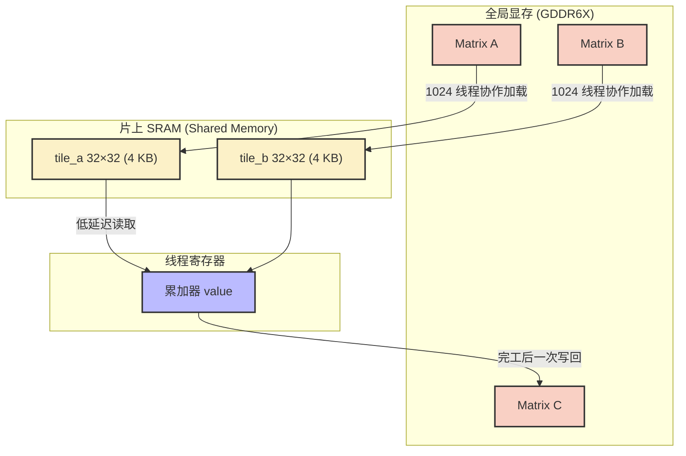
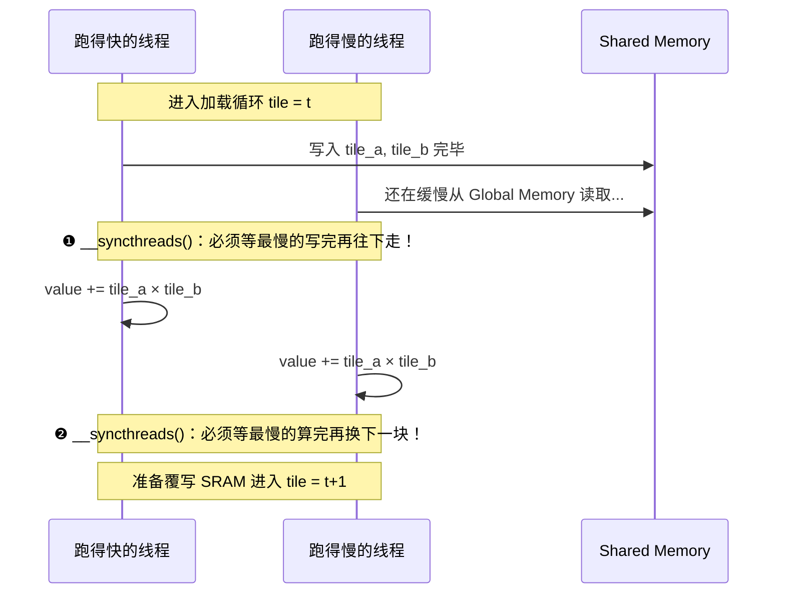
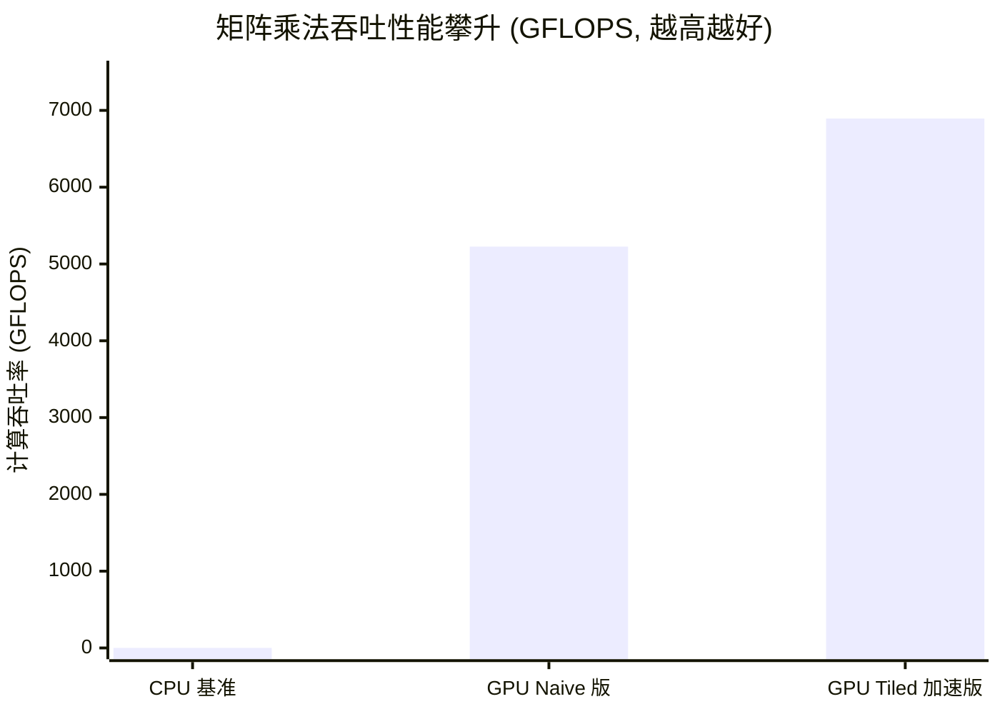

> 📖 **推荐后续**：04_GEMM_Optimization（寄存器 Tiling 进阶）、10_Memory_Optimization（合并访存与 Bank Conflict 详述）

## 为什么所有的教程都从向量加法开始？

几乎所有的 GPU 编程教程第一课都是向量加法 `$C[i] = A[i] + B[i]$`。这不是因为它在算法层面上有什么深度，恰恰相反，因为它纯粹是搬砖——而这正好暴露了 GPU 编程最初也是最底层的痛点。

想象一下一块 RTX 4090，FP32 理论算力高达 82.6 TFLOPS（每秒 82.6 万亿次浮点运算）。但它的显存总线带宽只有约 1008 GB/s。简单算笔账：算力配不上带宽。为了让计算核心不至于饿着肚子等数据，你每从显存里抠出 1 个字节，就必须给它安排大约 82 次运算（这被称为 Roofline 模型的性能拐点，即 $\frac{82.6 \text{ TFLOPS}}{1008 \text{ GB/s}} \approx 81.9 \text{ FLOP/Byte}$）。

而在向量加法里，核心代码 `C[idx] = A[idx] + B[idx]` 的开销极其透明：每个元素我们需要读 `A`，读 `B`，算完写回 `C`，总共搬运了 $3 \times 4 = 12$ 个字节。但这庞大的 12 字节只能换来区区 1 次加法（1 FLOP）。
由此得到它的算术强度（Arithmetic Intensity）：
$$I = \frac{\text{1 FLOP}}{\text{12 Bytes}} \approx 0.083 \text{ FLOP/Byte}$$

这意味着什么？意味着它的性能天花板被显存带宽死死卡住。无论 4090 的算力再涨十倍还是八倍，这种纯粹的 Memory Bound（访存瓶颈）算子的执行时间都不会有什么变化——因为瓶颈根本不在计算。

所以，这第一课我们要讨论的问题不仅是并行，更是**如何突破显存带来的带宽墙**。

---

## Tiling：把 $O(N^3)$ 的冗余访存砍下来

面对朴素的矩阵乘法，情况有了一线生机。

计算目标非常明确：
$$C_{i,j} = \sum_{k=0}^{N-1} A_{i,k} \cdot B_{k,j}$$

在 Naive 版本的实现中，每个线程独立计算 $C$ 的一个元素。为了算这单单一个点，它必须去缓慢的 Global Memory（显存）里老老实实地取出 $A$ 的一整行（$N$ 个 float）和 $B$ 的一整列（$N$ 个 float）。
当 $N = 1024$ 时，整个矩阵乘法算下来，总访问量大约是 8 GB。这其中充满了没必要的重复劳动：相邻两个线程在计算 $C_{i,j}$ 和 $C_{i,j+1}$ 时，明明都需要同一行 $A_{i,:}$，但它们谁也不理谁，各自去显存里取了一遍。

既然如此，Tiling（分块）策略的思路非常自然：**别各自去取了，咱们凑点钱建个片上缓存。**

我们将 $K$ 维度的大循环按照步长 $T$ 切成了若干个小段：
$$C_{i,j} = \sum_{t=0}^{\lceil N/T \rceil - 1} \left( \sum_{k=0}^{T-1} A_{i,\; t \cdot T + k} \cdot B_{t \cdot T + k,\; j} \right)$$

每一小段计算只需要一个 $T \times T$ 的子块数据。我们将这组子块先批量加载到距离计算单元极近的 Shared Memory（也就是片上 SRAM）中，让一个 Block 内的 $T^2$ 个线程共同复用它。

我们来重算一下以 $N = 1024, T = 32$ 为例的访存成本：

- **Naive GEMM**：每个线程各独立扫过一遍所需的行与列，各自读 $2 \times 1024$ 次全局显存，共 $1024^2$ 个线程独立进行。这相当于产生了一次总读取量达到 $= 2 \times 1024^3 \times 4$ 字节 $\approx 8$ GB 的海啸级请求。
- **Tiled GEMM**：我们将 $1024 \times 1024$ 的全图划分为一个个 $32 \times 32$ 的小战区。在每个 Tile 阶段，整个 Block（$32 \times 32$ 个线程）协作发力，合伙加载 $2 \times 32^2$ 个 float 到共享 SRAM 中。每位线程在此阶段只负责搬运 2 个数字（比上面的 $2 \times 1024$ 次舒服太多）。完成这个点乘累加共需要 $1024/32=32$ 个 Tile 阶段，全图有 $(1024/32)^2 = 1024$ 个独立的 Block 同时开工。最终全图的总读取量 $= 1024 \times 32 \times (2 \times 32^2 \times 4) \text{ 字节} = 256$ MB。

看到了吗？全局访存量从 8 GB 直接锐减到了 256 MB，缩小了整整 32 倍——而这个 32 倍的红利恰好就等于我们设定的 Tile 尺寸 $T$。这就是 GPU 中“用一小块片上面积的开销，换取计算体积数十倍提升”的艺术。

---

## 建立存储层级地图

我们刚刚提到了 Shared Memory 和 Global Memory，在正式看代码之前，我们需要对 RTX 4090 的各级存储延迟有个量化直觉：

| 存储层级 | 硬件位置 | 容量 | 响应延迟 | 预估带宽量级 |
| :--- | :--- | :--- | :--- | :--- |
| 寄存器 (Registers) | 紧贴 ALU | 每线程最多 255 个 32-bit | ~1 cycle | 数十 TB/s |
| 共享内存 (Shared Memory) | 片上 SRAM | 每 SM 约 48–100 KB | ~20-30 cycles | 数 TB/s |
| L2 缓存 (L2 Cache) | GPU 芯片内 | 72 MB (4090特色) | ~200 cycles | ~6 TB/s |
| 全局显存 (Global Memory) | 板载 HBM/GDDR | 24 GB | ~400+ cycles | 1008 GB/s |

Tiling 做的事，本质上就是把需要重用的数据手工从那几百个 cycle 的最慢层级（Global Memory）里捞出来，寄存在几十个 cycle 的较快层级（Shared Memory）中。



---

## 核心代码解剖

### Vector Add：无脑合并访存

既然是纯搬砖，那搬砖的手法就很重要了：

```cpp
__global__ void vector_add(const float* A, const float* B, float* C, const int n) {
    int idx = blockDim.x * blockIdx.x + threadIdx.x;
    if (idx < n) {
        C[idx] = A[idx] + B[idx];
    }
}
```

代码确实短得不能再短，但 GPU 能跑得飞快靠的是底层的**合并访存（Coalesced Access）**机制：
`idx` 的分配保证了同一个 Warp（32 个执行同步的线程分组）里发出的访存地址刚好是绝对连续的 128 个字节（32 个 float 的长度）。这就好比 32 个人排好队去仓库拿货，显存控制器可以非常舒服地“一揽子”打个大包发车。仅需 1 个 128-byte 的事务（Transaction），就能同时满足 32 个线程的需求，完美避免了昂贵的零碎读取开销。而边界判断语句 `if (idx < n)` 也绝不会在绝大多数 Warp 里引起控制流发散（Warp Divergence），因为它只会在最后一个没排满的边缘 Block 里发生。

### Naive GEMM：不是死于非对称，而是死于运费

为了看清 Tiling 到底精妙在哪，我们得先看看最直白暴力的 Naive GEMM 解法长什么样：

```cpp
__global__ void matrix_mul_naive(const float* A, const float* B, float* C, int m, int n, int k){
    int row = blockDim.y * blockIdx.y + threadIdx.y;
    int col = blockDim.x * blockIdx.x + threadIdx.x;
    if (row < m && col < k) {
        float value = 0.0f;
        for (int i = 0; i < n; ++i) {
            value += A[row * n + i] * B[i * k + col];
        }
        C[row * k + col] = value;
    }
}
```

很多人对朴素 GEMM 性能差的直觉是：“肯定是因为没有合并访存”。**这是个常见的误区。**
仔细分析一下内存访问模式：在一个常用的 2D Block 划分里，线程编号的本质是连续的 `threadIdx.x` 构成同一个 Warp。这意味着 Warp 内的 32 个线程拥有相同的 `row` 和连续递增的 `col`。

- 读取 `A[row * n + i]`：这 32 个线程读的是同一个内存地址，硬件会自动触发极其高效的**广播（Broadcast）**机制。
- 读取 `B[i * k + col]`：这 32 个线程读的是连续的内存地址，完美触发**合并访存（Coalesced Access）**。

事实令人惊讶：Naive GEMM 的访存模式其实很优秀。那为什么它还是比 Tiled 版慢得多？
因为它死于**运费太贵**。
哪怕硬件再聪明，对于矩阵 `C` 每个元素的计算，你依然实打实地去 Global Memory 跑腿拿了 $2N$ 个数据。整个矩阵算完，总访存量高达 $O(N^3)$。当 $N=1024$ 时，你把这块数据大风刮一般地硬生生搬运了近 **8 GB**。即使都是极其舒服的高效读取，但卡车往返次数太多，总和依然是一个天文数字的延迟。

这恰恰证明了**数据复用**的压倒性地位。访存模式再完美，也救不了重复搬砖带来的物理极限。只有把它拉进 Shared Memory，把复用率提上去，才是真出路。

### Tiled GEMM：两次不得不等

我们把视线拉回 Tiled 版矩阵乘法的内层循环。这段代码最能说明控制流和数据流的焦灼感：

```cpp
for (int tile = 0; tile < num_tiles; ++tile) {
    // 1. 协作将数据搬进高速的片上缓存
    int mCol = tile * TILE_WIDTH + tx;
    if (row < m && mCol < n) tile_a[ty][tx] = a[row * n + mCol];
    else tile_a[ty][tx] = 0.0f; // 边缘越界补全

    int nRow = tile * TILE_WIDTH + ty;
    if (nRow < n && col < k) tile_b[ty][tx] = b[nRow * k + col];
    else tile_b[ty][tx] = 0.0f;

    __syncthreads(); // ❶ 第一道屏障

    // 2. 纯 SRAM 的乘加狂欢
    for (int i = 0; i < TILE_WIDTH; ++i) {
        value += tile_a[ty][i] * tile_b[i][tx];
    }

    __syncthreads(); // ❷ 第二道屏障
}
```

请千万注意那两道 `__syncthreads()` 同步指令，它们在物理层面是不可省略的：

- **第一道屏障**保护的是刚才从显存发起的异步加载。如果不等大家齐心协力把所有数据写进 SRAM 就急着开始算，跑得快的线程可能会读到毫无意义的脏数据。
- **第二道屏障**保护的则是下一次的覆盖。如果有人算得快早早就进入了下一轮大循环，它会直接拿新数据把 SRAM 冲掉，导致算得慢的线程丢掉了这轮本该用的旧数据。这就是典型的 RAW / WAW 数据冒险。

用一张极为典型的时序图来看看如果缺少这两道屏障会发生什么灾难：



---

## 真实性能实测：理论 vs 现实

所有的优化逻辑最终都要上刑场见真章。以下实测数字全部来自一块 RTX 4090（sm_89）的真实日志，使用 C++17 标准和 nvcc -O3 编译。

### 搬砖巅峰：Vector Add（规模 64M 元素，100 次迭代）

| 执行版本 | Kernel 时耗 | 等效有效带宽 | vs 单核 CPU 加速 |
| :--- | :--- | :--- | :--- |
| CPU 参考 | 156.45 ms | — | 1× |
| **GPU (256线程/Block)** | **0.86 ms** | **932.81 GB/s** | **181×** |

总搬运量 = $3 \times 67,108,864 \times 4\text{B} = 768$ MB。
在 0.86 ms 的耗时下，我们实现了约 **932.8 GB/s** 的有效带宽传输，跑到了 4090 理论峰值（~1008 GB/s）的 `92.5%`。多出来的零头不过是 Kernel 下发的极小固定开销，我们确确实实把硬件总线压迫到了极限。

### 阶梯进化：GEMM（规模 1024×1024，10 次迭代）

| 执行版本 | Kernel 时耗 | 计算吞吐率 | vs 单核 CPU |
| :--- | :--- | :--- | :--- |
| CPU 纯串行 | 2090.49 ms | 1.03 GFLOPS | 1× |
| **GPU Naive 版** | **0.41 ms** | **5225.65 GFLOPS** | **5087×** |
| **GPU Tiled 版** | **0.31 ms** | **6893.42 GFLOPS** | **6696×** |



你也许会问：既然上面严密推导了 Tiled 版省掉了 32 倍的冗余内存访问，为什么在最终的测试成绩里，相较于 Naive 版只带来了约 1.3 倍左右（从 5225 到 6893 GFLOPS）的吞吐提升比例呢？

这并非你算错了，而是你无形中享受了现代微架构设计带来的隐性福利。RTX 4090 拥有极为极其奢侈的 **72 MB Huge L2 Cache** 缓存池，而我们在测试中使用的 $1024 \times 1024$ 浮点矩阵 $A, B, C$ 加在总共也就只有 12 MB 左右的体量。
这意味着什么？意味着在 Naive 版本那看似“大水漫灌”、本该被 HBM 慢速拒之门外的海量反复请求中，其实除了第一次是实打实地去 Global Memory 读取外，其余针对同一行或列的绝大多数重复二次访问，都被这 72 MB 的 L2 Cache 给截胡并妥妥接盘了（这是典型的受益于 **L2 Cache 命中的溢出效应**），并没有真的千军万马挤上了慢吞吞的 HBM 独木桥。

然而即使在这个前提下，因为 Tiled 版成功避免了连 L2 到 SM（Streaming Multiprocessor）这段路程的物理竞争瓶颈，其依然能逆流而上，硬生生把这块原本就已被榨干的芯片极限性能再次拔高近三成之巨。这正是极致软硬结合的魅力所在。

---

## 几个绝对不能忽视的事实

- **带宽高高在上。** 写 Kernel 前记得先按一遍计算器：你的算子在这个数据量下，一字节能做几次浮点运算？如果凑不到 4090 那约 82 FLOP/B 的 Roofline 拐点，那么费尽心机优化计算指令也是徒劳的——唯一出路就是老老实实优化显存带宽的利用率。
- **Tiling 的本质：用面积挤压体积。** 这也是本章最核心的内容。通过开辟一个极小的 $32 \times 32$ 的缓存块（占据少量的面积），我们就能以近乎免费的代价，在片上完成海量的点乘累加运算（占据时间维度的计算体积）。
- **6893 GFLOPS 只是个微不足道的开始。** Tiled 版跑出了将近 6.9 TFLOPS 的不俗成绩，但这距离 4090 理论上的 82.6 TFLOPS 峰值还有多远？粗算一下，只发挥了绝对算力不到 **8.4%**。

这意味着，即使我们千辛万苦利用共享内存跳过了最费时的 Global Memory，但 Shared Memory 的自身带宽依然是不够的。我们来严谨地推导一下此时的算术强度：

对于 Tiled GEMM 的最内层循环：

```cpp
for (int i = 0; i < TILE_WIDTH; ++i) {
    value += tile_a[ty][i] * tile_b[i][tx];
}
```

每一次循环，线程需要从 SRAM 读取 1 个 `tile_a` 元素和 1 个 `tile_b` 元素，总共 $2 \times 4 = 8$ 字节的数据。
它执行的运算是一次 FMA（Fused Multiply-Add，乘加指令），等价于 2 次浮点操作（FLOPs）。
因此，这里的实际算术强度为：
$$I = \frac{\text{2 FLOPs}}{\text{8 Bytes}} = 0.25 \text{ FLOP/Byte}$$

比起最初 Vector Add 的 $0.083$，这里确实有了长足进步。但记得我们刚才怎么说 4090 的 Roofline 拐点吗？拐点在 ~82 FLOP/Byte！$0.25$ 距离 $82$ 依然差了两个数量级，所以计算单元依然处在半饱半饥的等待中——每天被迫干等从 Shared Memory 慢吞吞搬过来的浮点数。

要想逼近真正的算力巅峰，唯一的途径是让算术强度继续成倍跃升，让一块数据被读取后，能被翻来覆去地用来狂练无数次加法运算。我们必须让数据离运算更近一步——打入寄存器内部（寄存器是唯一带宽能匹配满算力的层级）。我们将在 04 期的 `GEMM Optimizations` 中接着讲更狂暴的魔法。
