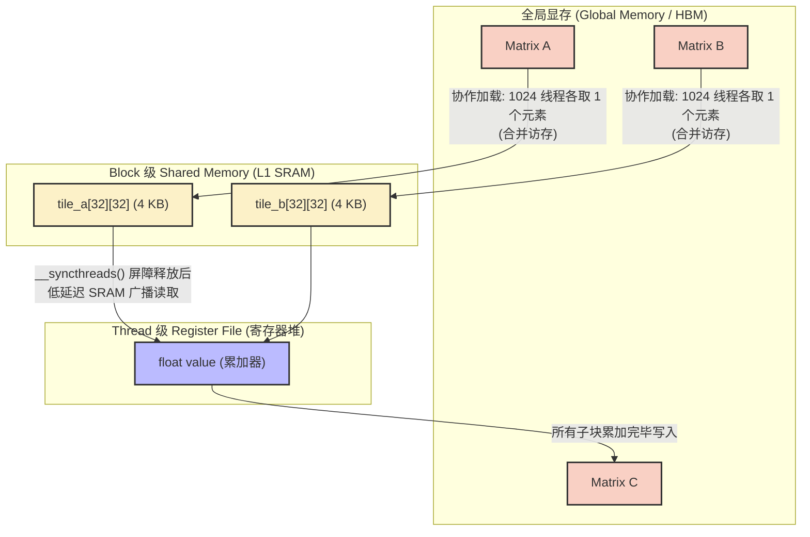
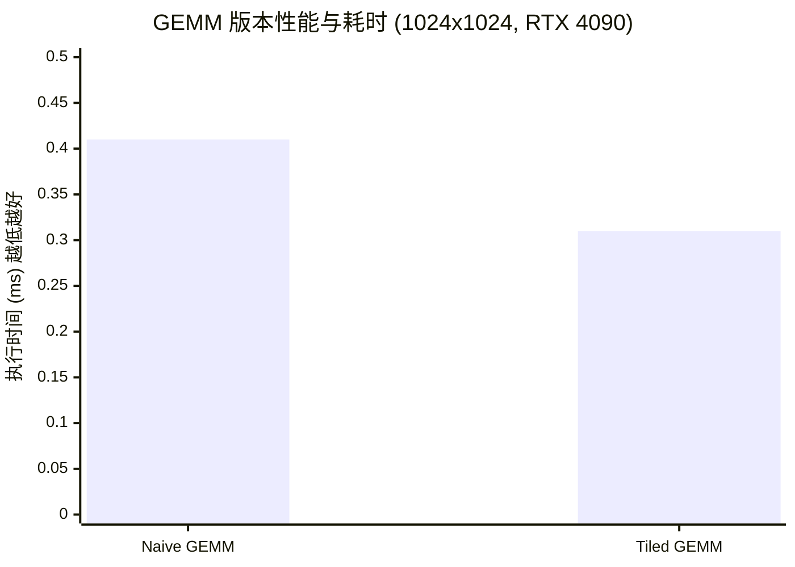

## 楔子：直击痛点 (The Hook & Motivation)

在现代 AI Infra 中，不论是 LLM 推理架构底层的 Linear 分支，或是 Attention 机制里的 $QK^V$ 计算，一切算子最终在物理层大都归结于矩阵乘法 (GEMM)。然而，现代 GPU 的算力与访存能力正在以不同步的速度演进：算力在以指数级狂奔，而 HBM 显存带宽的提升却步履蹒跚（**Memory Wall**）。

假如我们采用朴素的并行化实现，让每个 CUDA 线程计算结果矩阵 $C$ 中的一个元素，对于规模为 $N \times N$ 的矩阵，在计算过程中每个元素都需要独立向 Global Memory（HBM）发起 $2N$ 次读取请求，总读取量达到惊人的 $O(N^3)$。当 $N=1024$ 时，单次计算将向 DRAM 产生约 8 GB 的冗余流量洪峰。面对这种灾难级的访存放大效应，即便是 RTX 4090 ~1008 GB/s 的显存带宽也会在瞬间崩溃。

我们必须反思：**如何在硅片之上，构建一道拦截海量显存请求的大坝？**

---

## 第一性原理与数学重构 (Mathematical Formulation)

矩阵乘法的朴素计算目标可以表达为：

$$C_{i,j} = \sum_{k=0}^{N-1} A_{i,k} \cdot B_{k,j}$$

在未优化的模型中，这个累加操作是连续且原子的，导致了极致的 Memory-Bound。为了适应 GPU 具有极小的高速 SRAM（Shared Memory）的硬件特性，我们需要对这个串行数学公式进行等价的代数变换——分块（Tiling）。

假设我们将矩阵按尺寸 $T$（例如 $T=32$）划分为子块（Tile），上述内积序列即被严格截断：

$$C_{i,j} = \sum_{t=0}^{\lceil N/T \rceil - 1} \left( \sum_{k=0}^{T-1} A_{i,\; t \cdot T + k} \cdot B_{t \cdot T + k,\; j} \right)$$

这一步重排的绝妙之处在于**作用域的收缩**：外层循环 $t$ 决定了进度，而在内侧累加循环（长达 $T$ 的区间内），我们需要用到的 $A$ 和 $B$ 矩阵数据仅仅是一个 $T \times T$ 的局部窗口。这允许我们将这部分数据预取 (Prefetch) 到更靠近计算单元的 L1 Cache/Shared Memory 中进行生命周期内的复用，将 Global Memory 的总吞吐请求严格削减为原来的 $\frac{1}{T}$。

---

## 核心优化演进与硬件映射 (Architecture Mapping)

从朴素实现到 Shared Memory Tiling，其实质是**改变了数据的流向拓扑结构**。

### 1. 软硬件映射图

在 NVIDIA SM（Streaming Multiprocessor）内部，数据调度从 “HBM $\rightarrow$ 寄存器” 跃迁为 “HBM $\rightarrow$ Shared Memory $\rightarrow$ 寄存器”。



### 2. Block/线程协同模型 (Execution Hierarchy)

| Compute 层级 | 并发粒度 | 数据控制平面 |
| :--- | :--- | :--- |
| **Grid** | 宏观分配 | 将整个 $C$ 映射为多个 $32 \times 32$ 区域，分发至不同 SM。 |
| **Block** | 协同加载 | 1024 个线程分摊数据搬运成本：用 $O(T^2)$ 的动作，喂饱 $O(T^3)$ 的算术吞吐。 |
| **Thread** | 标量计算 | 单个线程持有私有寄存器 `value` 作为累加核心，仅对 Shared Memory 寻址极快。 |

---

## 源码手术刀：关键代码深度赏析 (Surgical Code Analysis)

让性能发生质变的核心只在内圈的几十行。我们解剖 `03_matrix_mul_tiled/matrix_mul_tiled.cu` 中真正的魔法区段：

```cpp
// 步进长度为 TILE_WIDTH，在 K 维切片
for (int tile = 0; tile < num_tiles; ++tile) {
    // 【阶段 1：协作拉取到 Shared Memory】
    int mCol = tile * TILE_WIDTH + tx;
    tile_a[ty][tx] = (row < m && mCol < n) ? a[row * n + mCol] : 0.0f;
    int nRow = tile * TILE_WIDTH + ty;
    tile_b[ty][tx] = (nRow < n && col < k) ? b[nRow * k + col] : 0.0f;

    // 【阶段 2：发射屏障，强行同步 Warp 调度】
    __syncthreads();

    // 【阶段 3：超高并发的片上点乘】
    for (int i = 0; i < TILE_WIDTH; ++i) {
        value += tile_a[ty][i] * tile_b[i][tx];
    }

    // 【阶段 4：防覆盖生命周期屏障】
    __syncthreads();
}
```

**手术刀剖析：**

1. **极其克制的算力分配**：`tile_a[ty][tx]` 指令在硬件上转化为 `LD.E`（Global Load）。这是合并访存 (Coalesced Access) 的经典场景：相邻 `tx` 映射到相邻的物理内存地址中，128-byte 的 transaction 完成了一次连续的有效吞吐。这里用三元表达式 `? : 0.0f` 处理非规整边界更是避免了繁琐的分支发散 (Warp Divergence)。
2. **第一道屏障 (`__syncthreads`)**：这是在硅片物理层面上的 Warp 级调度指令 (`BAR.SYNC`)。如果不等待所有线程抓取完毕就进入计算，计算快的 Warp 会读取到未初始化的脏数据。
3. **第二道屏障**：由于外层存在 `for (tile)` 循环，本块算尽后需要装载下一块，如果不设立这道屏障，跑得快的线程会直接把下一轮数据写入 `tile_a`，碾碎慢线程还未消化完的当前轮次数据（经典的 RAW / WAW Data Hazard）。这两道屏障是 Tiling 架构绝对不可逾越的物理法则。

---

## 理论与实际的对决：极限剖析 (Theory vs Reality Profiling)

在深度优化中，一切代码尊严来自 Profiler 结果。所有对比数据提取自项目 `Results/01_Basics.md` 中 RTX 4090 的实测日志（FP32 理论峰值 ~82.6 TFLOPS）。

测试条件：规模 1024x1024 矩阵乘法。



| 版本 | Kernel 时间 (ms) | 计算吞吐 (GFLOPS) | vs CPU 核心加速比 |
| :--- | :--- | :--- | :--- |
| **CPU 朴素基准** | 2090.49 | 1.03 | 1× |
| **GPU Naive 版** | 0.41 | 5225.65 | 5086.95× |
| **GPU Tiled 版** | **0.31** | **6893.42** | **6696.47×** |

### 极限自洽性审判：为什么 Tiled 依然没有逼近理论极限？

上述数据显示，**Tiled GEMM 相比 Naive 快了 1.32×**（由 0.41ms 缩减至 0.31ms）。这完美符合我们在第一性原理中的推演：“避免了 HBM 读取惩罚，使得性能不再是纯粹的 Memory Bound”。

**但，我们遭遇了深刻的滑铁卢：** RTX 4090 的 FP32 理论极限是 82,600 GFLOPS，而我们目前最极致的 `matrix_mul_tiled` 的 6,893 GFLOPS **仅仅达到了理论峰值的 8.35%！**

为什么在完美解决了 Global Memory 带宽墙后，算力依旧如此惨淡？
深度的“侦探级”溯源给出了解释：

1. **指令周期与寄存器依赖 (Register & Instruction Bound)**：每次内侧的乘积累加 `value += tile_a * tile_b` 都会将数据从 Shared Memory `LD.SHARED` 到寄存器中再执行 `FFMA`（Fused Multiply-Add）。在这个微观尺度上，Shared Memory 的访问周期（大约 30 周期）对比寄存器（大约 1 周期）依旧是极度缓慢的。
2. **标量并发陷阱 (Scalar Concurrency)**：每一个操作仅仅是一条极细的标量指令。指令发射器（Instruction Dispatcher）被频繁的 Shared Memory 访存动作所淹没，并没有填满 GPU 中庞大的算术逻辑单元 (ALU)，造成了极低的指令级并行度 (ILP)。

这个绝佳的失败启示了现代 GPU 架构的破壁者们：我们不仅要跨越 Global Memory，**我们要连 Shared Memory 也一并绕过**！必须将核心数据直接锁死在片上最快的器件——**Register File（寄存器堆）**上。这为后续深入到极致狂飙的“**Register Tiling**”（见 `04_GEMM_Optimization`）埋下了沉甸甸的伏笔。

---

## 架构师视角的总结 (Architect's Takeaway)

1. **计算访存比（Arithmetic Intensity）是唯一的铁律**：永远不要直接从 HBM 发起 $O(N^3)$ 级别的请求。在所有复杂的 CUDA 算子中，首先要想尽一切办法扩大单个数据字节的复用率。
2. **用多线程的 $O(T^2)$ 装载交换 $O(T^3)$ 算力**：Tiling 的本质是转移系统瓶颈。将 IO 压力转化为对并发控制 (`__syncthreads()`) 的压力。
3. **软硬协同不能停止在 L1 层**：Tiling 证明了缓存存在的意义，但也暴力揭开了 GPU 未达全速的真相——当你在 Shared Memory 这里停滞不前时，指令发射器就已经在等待延时中饥饿了。真正的神明，永远隐藏在寄存器分配和指令流水线的调度里。
