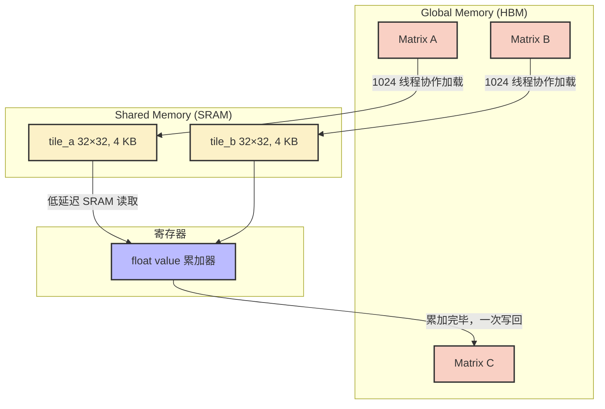
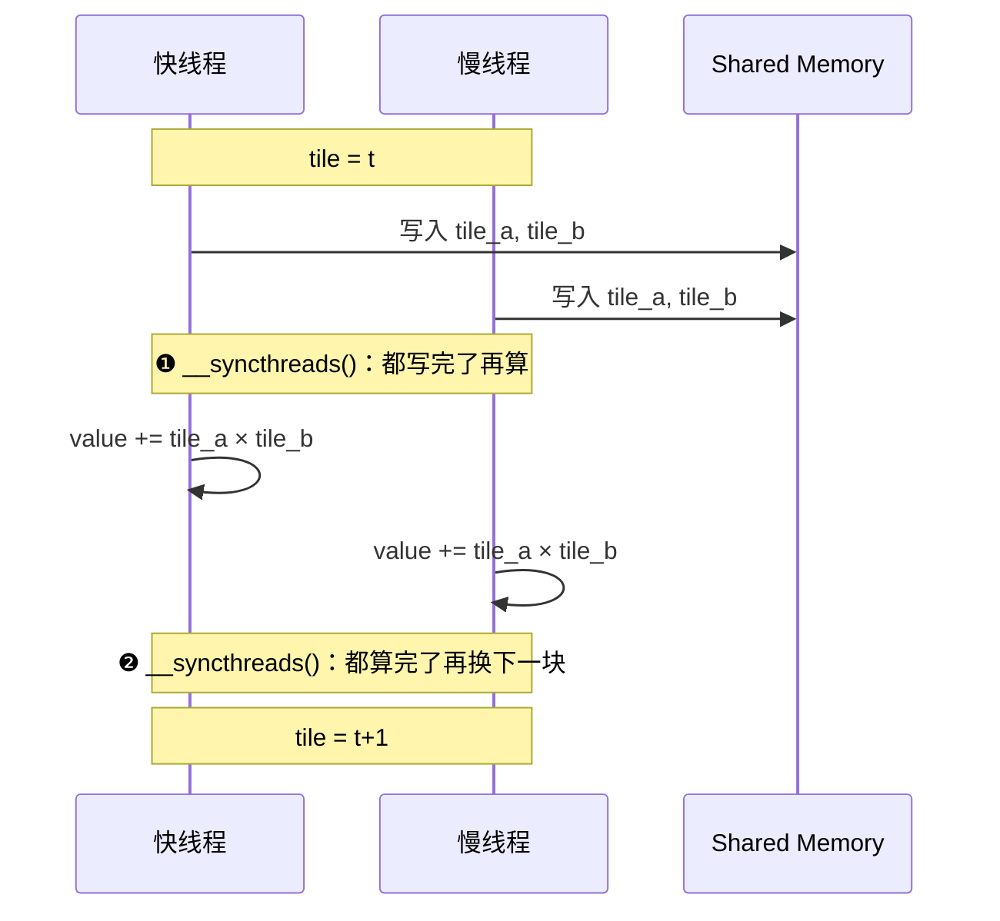
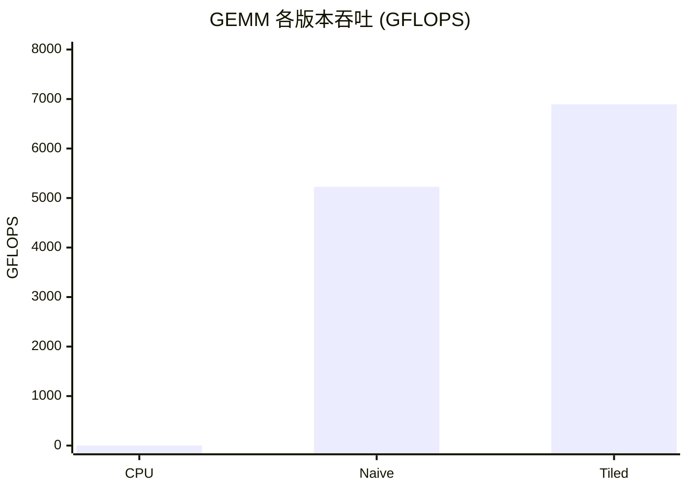

> 📖 **推荐后续**：04_GEMM_Optimization（Register Tiling 进阶）、10_Memory_Optimization（合并访存与 Bank Conflict）

## 为什么从向量加法开始

GPU 编程教程喜欢用向量加法 `C[i] = A[i] + B[i]` 作为第一个例子，不是因为它有什么技术含量，而是因为它几乎不涉及算法——你能做的只有搬数据。这恰好暴露了 GPU 编程中最核心的矛盾。

RTX 4090 拥有 82.6 TFLOPS 的 FP32 算力，但显存带宽只有 1008 GB/s。简单除一下：每搬 1 字节数据进来，你得能做大约 82 次浮点运算才能把算力用满。大多数算子远达不到这个比例。

向量加法是一个极端的例子：每个元素读 A、读 B、写 C，总共搬 12 字节，只做 1 次加法。算术强度 $1/12 \approx 0.083$ FLOP/Byte。这种算子的性能天花板完全由显存带宽决定——不管你怎么优化计算逻辑都没用，因为瓶颈根本不在计算。

矩阵乘法就不一样了。朴素实现中每个线程独立从 Global Memory 读整行整列，$N = 1024$ 时总读取量大约 8 GB。但通过分块（Tiling），把数据先搬到片上的 Shared Memory 让多个线程共享，读取量可以降到 256 MB——32 倍的差距。

这一章就围绕三个案例展开：Vector Add（纯搬运）、Naive GEMM（暴力矩阵乘）、Tiled GEMM（分块矩阵乘），建立两个最基本的直觉——**带宽是大多数算子的瓶颈**，以及**数据复用是突破带宽墙的首要手段**。

---

## 算术强度和 Tiling 的数学

### Vector Add：能搬多快就多快

$$C_i = A_i + B_i, \quad \forall i \in [0, N-1]$$

每个元素完全独立，没有数据依赖。衡量这种算子的唯一指标是有效带宽：

$$BW_{eff} = \frac{3 \times N \times 4\text{B}}{T_{kernel}}$$

分子是总搬运量（读 A + 读 B + 写 C），分母是 Kernel 耗时。$BW_{eff}$ 越接近 1008 GB/s，说明你已经把显存总线压满了。

### GEMM：把 $O(N^3)$ 的冗余访存砍下来

矩阵乘法的计算目标：

$$C_{i,j} = \sum_{k=0}^{N-1} A_{i,k} \cdot B_{k,j}$$

朴素实现中，每个线程计算 $C$ 的一个元素，独立读取整行 $A_{i,:}$（$N$ 个 float）和整列 $B_{:,j}$（$N$ 个 float）。但相邻线程计算 $C_{i,j}$ 和 $C_{i,j'}$ 时，它们读的是同一行 $A_{i,:}$——朴素实现对此完全无视，每个线程各读各的。

Tiling 的思路很直接——按步长 $T$ 把 K 維度的大循环切成若干小段：

$$C_{i,j} = \sum_{t=0}^{\lceil N/T \rceil - 1} \left( \sum_{k=0}^{T-1} A_{i,\; t \cdot T + k} \cdot B_{t \cdot T + k,\; j} \right)$$

每一小段只需要一个 $T \times T$ 的子块。这个子块可以被加载到 Shared Memory（片上 SRAM），Block 内的 $T^2$ 个线程共享它，不用反复去 HBM 拿。

以 $N = 1024$、$T = 32$ 为例算算账：

- 朴素版：每个线程读 $2 \times 1024$ 次 Global Memory，$1024^2$ 个线程，总读取量 ≈ 8 GB
- Tiled 版：每个 Tile 加载 $2 \times 32^2$ 个 float 到 SRAM，共 32 个 Tile，总读取量 ≈ 256 MB

Global Memory 访存量从 8 GB 降到 256 MB，缩减 32 倍——恰好等于 $T$。

---

## 存储层级和数据流

在看代码之前，先对 GPU 的存储层级有个直觉。RTX 4090 的关键数字：

| 存储层级 | 容量 | 延迟 | 带宽量级 |
|:---|:---|:---|:---|
| 寄存器 | 每线程 255 个 32-bit | ~1 cycle | 数十 TB/s |
| Shared Memory (SRAM) | 每 SM 最大 48-100 KB | ~20-30 cycles | 数 TB/s |
| L2 Cache | 72 MB | ~200 cycles | ~6 TB/s |
| Global Memory (GDDR6X) | 24 GB | ~400+ cycles | 1008 GB/s |

寄存器比 Global Memory 快几百倍，Shared Memory 比 Global Memory 快十几倍。Tiling 做的事情就是把数据从最慢的一层搬到较快的一层，然后在片上反复复用。

### Naive GEMM 的数据流

每个线程直接从 Global Memory 读 A 和 B，在寄存器里累加，再写回 C。所有压力都在 HBM 上。

### Tiled GEMM 的数据流



一个 Block 内的 1024 个线程用 $O(T^2)$ 的搬运量，完成了 $O(T^3)$ 的计算。搬一个面，算一个体——这就是 Tiling 赚在哪里。

### 两道 `__syncthreads()` 不能少

Tiled GEMM 的内层循环里有两道同步屏障。不是可选的，是物理必须的。

第一道：加载完 Tile 之后、开始计算之前。如果不等所有线程都把数据写进 SRAM 就开始读，快的 Warp 会读到没初始化的脏数据。

第二道：计算完成后、加载下一个 Tile 之前。如果不等所有线程算完，快线程会直接用新数据覆盖 SRAM，而慢线程还在用旧数据——经典的 RAW/WAW Data Hazard。



---

## 关键代码

### Vector Add

```cpp
__global__ void vector_add(const float* A, const float* B, float* C, const int n) {
    int idx = blockDim.x * blockIdx.x + threadIdx.x;
    if (idx < n) {
        C[idx] = A[idx] + B[idx];
    }
}
```

代码极简，但背后的硬件行为值得说一说：

- `blockDim.x = 256`，同一 Warp 中 32 个连续线程访问的地址刚好是连续的 128 字节，触发合并访存（Coalesced Access）。显存控制器只需 1 个 128-byte 事务就满足了 32 个线程。
- `if (idx < n)` 的边界保护不会引起 Warp Divergence——越界线程集中在最后一个不完整的 Block 里。
- 算术强度 $1/12$ FLOP/Byte，纯粹的 Memory Bound。性能好不好只看你搬数据搬得快不快。

### Tiled GEMM 核心循环

```cpp
for (int tile = 0; tile < num_tiles; ++tile) {
    // 协作加载到 SRAM
    int mCol = tile * TILE_WIDTH + tx;
    tile_a[ty][tx] = (row < m && mCol < n) ? a[row * n + mCol] : 0.0f;
    int nRow = tile * TILE_WIDTH + ty;
    tile_b[ty][tx] = (nRow < n && col < k) ? b[nRow * k + col] : 0.0f;

    __syncthreads(); // 数据就绪

    // 片上点乘——全部命中 SRAM
    for (int i = 0; i < TILE_WIDTH; ++i) {
        value += tile_a[ty][i] * tile_b[i][tx];
    }

    __syncthreads(); // 防覆盖
}
```

加载阶段：同一行线程的 `tx` 连续递增，对 `a[]` 的访问满足合并访存。三元表达式处理边界，编译器会用 predicated execution 实现，不产生真正的分支。

计算阶段：`tile_a` 和 `tile_b` 都在 SRAM 里，访问延迟约 20 cycle，对比 Global Memory 的 400+ cycle。`value` 始终待在寄存器中，编译器会生成 `fmaf` 指令。

---

## 实测数据

测试环境：2× RTX 4090 (sm_89)，nvcc -O3，C++17。

### Vector Add（$N = 67{,}108{,}864$，64M 元素，100 次平均）

| 版本 | Kernel 时间 | 有效带宽 | vs CPU |
|:---|:---|:---|:---|
| CPU | 156.45 ms | — | 1× |
| GPU | 0.86 ms | 932.81 GB/s | 181× |

总搬运量 = $3 \times 64M \times 4B = 768$ MB。理论最小耗时 = $768 / 1008 = 0.762$ ms。实测 0.86 ms，有效带宽达到理论峰值的 92.5%。

剩余的 7.5% 来自 Kernel 启动的固定开销（~5 µs）和显存控制器在极大规模请求下的微小排队延迟。对搬运类算子来说，这已经基本到头了。

### GEMM（$1024 \times 1024$，10 次平均）

| 版本 | Kernel 时间 | 吞吐 (GFLOPS) | vs CPU |
|:---|:---|:---|:---|
| CPU | 2090.49 ms | 1.03 | 1× |
| GPU Naive | 0.41 ms | 5225.65 | 5087× |
| GPU Tiled | 0.31 ms | 6893.42 | 6696× |



Tiled 比 Naive 快 1.32 倍。这个提升幅度不是完整的 32 倍（= $T$），因为 RTX 4090 有 72 MB 的 L2 Cache，即使是 Naive 版本也有一部分数据被 L2 缓存住了，减轻了冗余访存的伤害。

### 6893 GFLOPS 的尴尬

RTX 4090 的 FP32 峰值是 82,600 GFLOPS。Tiled GEMM 跑出了 6893——只有理论峰值的 8.35%。

问题不在 Global Memory 了（Tiling 已经解决了那个问题），而在于 Shared Memory 本身也不够快。内层循环 `value += tile_a[ty][i] * tile_b[i][tx]` 每轮需要 2 次 SRAM 读取，每次 ~20 cycle，但 FMA 指令本身只需 1 cycle——计算单元大量时间在等数据。

算术强度算一下：每轮从 SRAM 读 2 个 float（8 字节），做 1 次 FMA（2 FLOP），所以 $2/8 = 0.25$ FLOP/Byte。4090 在 SRAM 带宽下的 Roofline 拐点大约在 4+ FLOP/Byte——我们差了一个数量级。

解决思路：让每个线程不只算 $C$ 的 1 个元素，而是算一个 $8 \times 8$ 的小块。从 SRAM 取 16 个数，在寄存器里做 64 次 FMA。这就是 Register Tiling，在 04_GEMM_Optimization 里会详细展开。

---

## 几个值得记住的点

**带宽是大多数算子的天花板。** 写 Kernel 之前先算一笔账：你的算子每搬 1 字节能做几次浮点运算？如果低于 ~82 FLOP/Byte（4090 的 Roofline 拐点），你就是 Memory Bound——优化搬运比优化计算更有效。Vector Add 的 932 GB/s 说明了一件事：对于纯 Memory Bound 算子，合并访存到位就差不多了，剩下的交给物理定律。

**Tiling 的本质是用面积换体积。** 一个 $32 \times 32$ 的 Block 搬运 2 个 4 KB 的 Tile（面积），在片上完成 32,768 次 FMA（体积）。这个思路从基础 Tiling 到 Register Tiling 到 Tensor Core 一直贯穿到底。

**8.35% 的峰值占用率不是结束，是开始。** 这个看起来很难看的数字其实揭示了一个关键事实：解决了 Global Memory 的问题不等于 GPU 就跑满了。Shared Memory 也有自己的带宽天花板。真正要做的是把数据进一步锁死在寄存器里——04_GEMM_Optimization 和 09_Tensor_Core 会接着讲这个故事。
