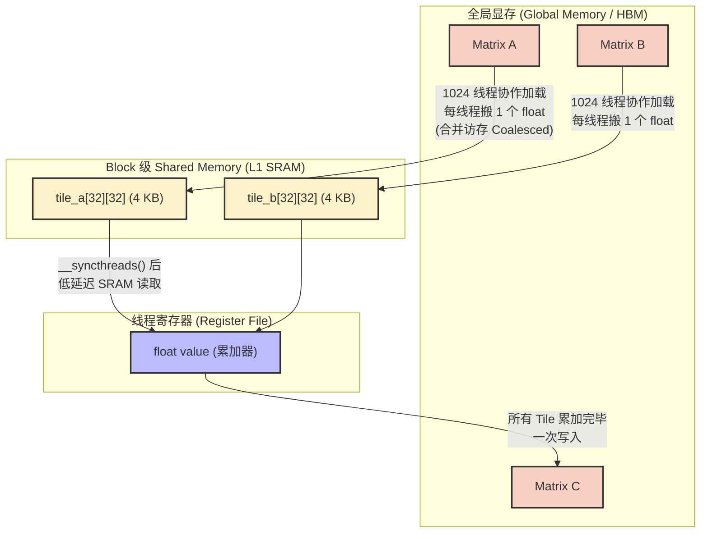
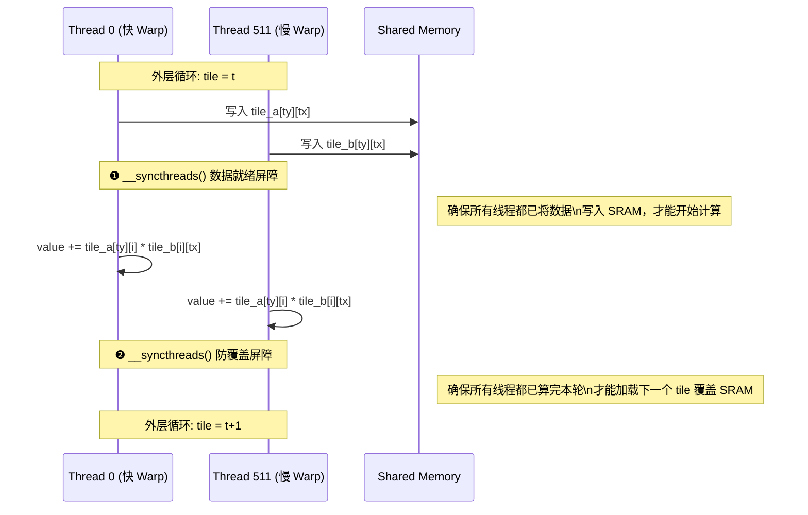
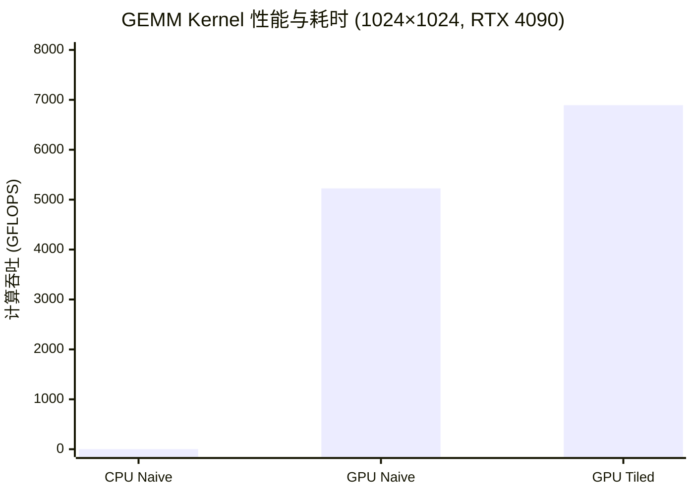

## 楔子：直击痛点

在现代 AI Infra 中，不论是 LLM 推理架构底层的 Linear 分支，或是 Attention 机制里的 $QK^T$ 计算，一切算子最终在物理层大都归结于矩阵乘法 (GEMM)。然而，现代 GPU 的算力与访存能力正在以不同步的速度演进。

以 NVIDIA RTX 4090 为例——这台怪兽拥有 **82.6 TFLOPS** 的 FP32 理论算力，但其显存带宽只有 **1008 GB/s**。这意味着什么？如果你想喂饱这些 ALU，每从显存搬运 1 个字节的数据，你就需要执行大约 82 次浮点运算。大多数算子，远远达不到这个计算密度。这就是所谓的 **Memory Wall（访存墙）**——不是 GPU 算不动，而是数据送不过来。

面对一个最简单的向量加法 `C[i] = A[i] + B[i]`，每个元素除了搬 3 次（读A、读B、写C）之外只做 1 次加法——算术强度（Arithmetic Intensity）低到 $\frac{1}{12}$ FLOP/Byte。而面对更复杂的矩阵乘法，如果朴素地让每个线程独立计算结果矩阵 $C$ 中的一个元素，对于 $N \times N$ 的矩阵，每个元素需要独立向 Global Memory 发起 $2N$ 次读取请求，总读取量达 $O(N^3)$。当 $N=1024$ 时，这将向 DRAM 产生约 **8 GB** 的冗余流量洪峰。

摆在我们面前的核心难题是：**如何在不同层级的存储器之间，构建精密的数据复用策略，使得每一个字节被搬进芯片后都能被反复利用，而不是用一次就扔掉？**

本章通过三个递进的实战案例——Vector Add、Naive GEMM、Tiled GEMM——建立 CUDA 编程的底层直觉。

---

## 第一性原理与数学重构

### 1. 向量加法：Memory Bound 的标杆

向量加法的计算目标极其简单：

$$C_i = A_i + B_i, \quad \forall i \in [0, N-1]$$

每个元素的计算完全独立（Embarrassingly Parallel），没有任何数据依赖。GPU 需要做的仅仅是把 A 和 B 读进来，加一下，写出 C。

因此，衡量这个算子好不好的唯一指标是**有效带宽**（Effective Bandwidth）：

$$BW_{eff} = \frac{3 \times N \times \text{sizeof(float)}}{\text{Kernel Time}}$$

分子是总搬运量（读 A、读 B、写 C 共 3 个数组），分母是 Kernel 耗时。如果 $BW_{eff}$ 能逼近硬件理论峰值 1008 GB/s，说明你已经把显存总线彻底压满了——这就是这个算子在物理上能跑出的最快速度，再怎么优化代码也没用，因为瓶颈不在计算。

### 2. 矩阵乘法：从串行到分块的代数变换

矩阵乘法的计算目标是：

$$C_{i,j} = \sum_{k=0}^{N-1} A_{i,k} \cdot B_{k,j}$$

朴素实现中，每个线程计算一个 $C_{i,j}$，需要从 Global Memory 读取整行 $A_{i,:}$（$N$ 个元素）和整列 $B_{:,j}$（$N$ 个元素）。但不同线程计算的 $C_{i,j}$ 和 $C_{i,j'}$ 其实共享同一行 $A_{i,:}$；计算 $C_{i,j}$ 和 $C_{i',j}$ 共享同一列 $B_{:,j}$。朴素实现对这些共享数据视而不见，导致每一份数据被无数线程各自独立地从远处的 HBM 拉了一遍——**冗余访存高达 $O(N^3)$**。

**代数变换——分块 (Tiling)**：

我们将这个连续大循环按 Tile 大小 $T$ 切段：

$$C_{i,j} = \sum_{t=0}^{\lceil N/T \rceil - 1} \left( \sum_{k=0}^{T-1} A_{i,\; t \cdot T + k} \cdot B_{t \cdot T + k,\; j} \right)$$

外层循环 $t$ 控制进度。在每一轮内层循环中（长度仅 $T$），所需的 $A$ 和 $B$ 数据仅是一个 $T \times T$ 的子块。这个子块允许被预先搬运到更靠近计算单元的 **Shared Memory（片上 SRAM）** 中。一个 Block 内的 $T^2$ 个线程共享这份数据——每个线程只需从 SRAM 读取，而非反复骚扰 HBM。

以 $N = 1024$，$T = 32$ 为例：

- 朴素版本：每个线程读 $2 \times 1024 = 2048$ 次 Global Memory。$1024^2$ 个线程，总读取量 $\approx 2048 \times 1024^2 \times 4B = 8\text{ GB}$。
- Tiled 版本：每个 Tile 加载 $2 \times 32^2 = 2048$ 个 float 到 SRAM，共 $32$ 个 Tile，总 Global Memory 读取量 $\approx 32 \times 2048 \times 1024 \times 4B = 256\text{ MB}$。

**Global Memory 访存量从 8 GB 暴降至 256 MB，缩减 32 倍——恰好等于 $T$。**

---

## 核心优化演进与硬件映射

### GPU 内存层级：理解速度的差距

在深入代码之前，必须先建立对 GPU 物理存储层级的直觉。以下是 RTX 4090 (Ada Lovelace, sm_89) 的关键参数：

| 存储层级 | 容量 | 延迟 | 带宽 | 可编程性 |
|:---------|:-----|:------|:-----|:---------|
| **Register File** (寄存器) | 每线程最多 255 个 32-bit | ~1 cycle | 数十 TB/s 级 | 编译器自动分配 |
| **Shared Memory** (L1 SRAM) | 每 SM 最大 48 KB (可配置至 100 KB) | ~20-30 cycles | ~19 TB/s (理论全片) | `__shared__` 声明 |
| **L2 Cache** | 72 MB | ~200 cycles | ~6 TB/s | 硬件自动管理 |
| **Global Memory** (HBM/GDDR6X) | 24 GB | ~300-500 cycles | **1008 GB/s** | `cudaMalloc` |

核心洞察：Register 比 Global Memory 快 **数百倍**，Shared Memory 比 Global Memory 快 **十几倍**。Tiling 的本质，就是把数据从最慢的 Global Memory 搬到较快的 Shared Memory，让线程在片上反复复用。

### 数据流拓扑变化

#### Naive GEMM：HBM → Register（无中间缓存）

每个线程直接从 Global Memory 读取数据，在寄存器中累加，再写回。所有数据吞吐压力全部施加在 HBM 带宽之上。

#### Tiled GEMM：HBM → Shared Memory → Register（两级缓冲）



### Block / Thread 映射关系

| 层级 | 配置 | 数据职责 |
|:-----|:-----|:---------|
| **Grid** | `dim3((K+31)/32, (M+31)/32)` | 将整个 $C$ 矩阵切分为 $32 \times 32$ 的子块，分发至各 SM |
| **Block** | `dim3(32, 32)` = 1024 线程 | 协作加载 2 个 Tile 到 SRAM，然后在片上完成 $32^3$ 次乘加 |
| **Thread** `(tx,ty)` | 唯一编号 | 加载 `tile_a[ty][tx]` 和 `tile_b[ty][tx]`；累加 $\sum_i \text{tile\_a}[ty][i] \cdot \text{tile\_b}[i][tx]$ |

关键机制：Block 内的 1024 个线程用 $O(T^2) = O(1024)$ 的协作搬运量，喂饱了 $O(T^3) = O(32768)$ 的计算量。这就是 Tiling 的本质——**用搬运一个面的代价，换取计算一个体的产出**。

### 两道 `__syncthreads()` 的物理法则

在 Tiled GEMM 的内层循环中，有两道**绝对不可逾越**的同步屏障：



**第一道屏障**：如果不等所有线程写完 SRAM 就开始计算，跑得快的 Warp 会读到未初始化的脏数据。在硬件层面，这是一条 `BAR.SYNC` 指令，强制 SM 上属于同一个 Block 的所有 Warp 步调一致。

**第二道屏障**：由于外层有 `for (tile)` 循环，下一轮需要往 SRAM 写入新数据。如果不等计算完毕，快线程会直接覆盖 SRAM 中的当前数据，而慢线程还在用——典型的 **RAW / WAW Data Hazard**。

这两道屏障是 Tiling 架构的物理定律，缺一不可。

---

## 源码手术刀：关键代码深度赏析

### 1. Vector Add Kernel

```cpp
__global__ void vector_add(const float* A, const float* B, float* C, const int n) {
    int idx = blockDim.x * blockIdx.x + threadIdx.x;
    if (idx < n) {
        C[idx] = A[idx] + B[idx];
    }
}
```

这段代码极其简单，但它背后的硬件行为值得深挖：

- **全局索引计算**：`blockDim.x * blockIdx.x + threadIdx.x` 将线程映射到一维数组的唯一位置。由于 `blockDim.x = 256`，同一个 Warp（32 个连续线程）访问的 `A[idx]` 地址恰好是连续的 128 字节——这触发了**合并访存（Coalesced Access）**，显存控制器只需要发射 1 个 128-byte 的 transaction 就拉齐了 32 个线程的数据。
- **边界保护 `if (idx < n)`**：当线程总数（Grid × Block）不是 $n$ 的整倍数时，多余的线程不越界。从硬件视角，这种简单的 `if` 不会导致 Warp Divergence，因为越界的线程通常集中在最后一个不完整的 Block 中，不影响其他 Warp 的满载执行。
- **算术强度**：这个 Kernel 的算力压力为零——1 次加法对比 12 字节搬运（读 A 4B + 读 B 4B + 写 C 4B），算术强度仅 $\frac{1}{12} \approx 0.083$ FLOP/Byte。这意味着它是**纯粹的 Memory Bound 算子**，性能完全由显存带宽决定。

### 2. Tiled GEMM 的核心循环

```cpp
for (int tile = 0; tile < num_tiles; ++tile) {
    // 阶段 1：协作加载到 Shared Memory
    int mCol = tile * TILE_WIDTH + tx;
    tile_a[ty][tx] = (row < m && mCol < n) ? a[row * n + mCol] : 0.0f;
    int nRow = tile * TILE_WIDTH + ty;
    tile_b[ty][tx] = (nRow < n && col < k) ? b[nRow * k + col] : 0.0f;

    // 阶段 2：同步屏障 - 数据就绪
    __syncthreads();

    // 阶段 3：片上点乘 - 全部命中 SRAM
    for (int i = 0; i < TILE_WIDTH; ++i) {
        value += tile_a[ty][i] * tile_b[i][tx];
    }

    // 阶段 4：同步屏障 - 防覆盖
    __syncthreads();
}
```

**逐阶段硬件行为分析：**

**阶段 1**：`tile_a[ty][tx] = a[row * n + mCol]` 在硬件上转化为 `LD.E`（Global Load）指令。由于同一行线程的 `tx` 连续递增，对 `a[row * n + mCol]` 的访问是行方向连续的，满足合并访存条件。三元表达式 `? : 0.0f` 处理非规整边界，避免了分支发散（Warp Divergence）——编译器会通过 predicated execution 实现，不产生真正的分支。

**阶段 3**：内层循环 `value += tile_a[ty][i] * tile_b[i][tx]` 是性能的核心。`tile_a` 和 `tile_b` 都驻留在 Shared Memory 中，访问延迟仅 ~20 cycle（对比 Global Memory 的 ~400 cycle）。编译器将 `value` 持久化在寄存器中，`fmaf` 指令直接从 SRAM 读取操作数并在寄存器累加。由于 `TILE_WIDTH = 32`，这个内层循环执行 32 次乘加——每次读取 2 个 float 做 1 次 FMA。

---

## 理论与实际的对决：极限剖析

所有性能数据来自 `Results/01_Basics.md`，测试硬件：**2× NVIDIA GeForce RTX 4090**（sm_89），Linux，nvcc -O3，C++17。

### Vector Add 性能（$N = 67,108,864$，64M 元素，100 次平均）

| 版本 | Kernel 时间 | 有效带宽 | vs CPU 加速比 |
|:-----|:-----------|:--------|:-------------|
| CPU 参考 | 156.45 ms | — | 1× |
| **GPU Vector Add** | **0.86 ms** | **932.81 GB/s** | **181.22×** |

**理论极限推导**：

$N = 67,108,864$ 个 float，每个 4 字节。总搬运量 = $3 \times N \times 4 = 768$ MB。
理论最小耗时 = $768 \text{ MB} / 1008 \text{ GB/s} = 0.762 \text{ ms}$。
实测 0.86 ms，有效带宽 932.81 GB/s = **理论峰值的 92.5%**。

这是极其出色的成绩。剩余 7.5% 的差距来自：Kernel 启动的固定开销（~5µs）、L2 Cache 未命中的偶发 stall、以及显存控制器在处理超大规模地址请求时的微小排队延迟。对于纯搬运类算子，这已经逼近了硅片物理极限。

### GEMM 性能对比（$1024 \times 1024$，10 次平均）



| 版本 | Kernel 时间 (ms) | 计算吞吐 (GFLOPS) | vs CPU 加速比 |
|:-----|:----------------|:------------------|:-------------|
| **CPU 朴素基准** | 2090.49 | 1.03 | 1× |
| **GPU Naive 版** | 0.41 | 5225.65 | 5086.95× |
| **GPU Tiled 版** | **0.31** | **6893.42** | **6696.47×** |

### 极限自洽性审判

**Tiled vs Naive 的提升比例**：$0.41 / 0.31 = 1.32\times$。符合预期——Tiling 将 Global Memory 冗余访问降低了 $T = 32$ 倍，但由于 1024 规模的矩阵在 4090 的 128 个 SM 上已经被较好地调度，原始版本的 L2 Cache（72 MB）也部分缓解了冗余访存，所以并非完整的 32 倍体现。

**但更重要的问题是**：RTX 4090 理论 FP32 峰值是 82,600 GFLOPS，而 Tiled GEMM 只跑到了 6,893 GFLOPS——**仅仅达到理论峰值的 8.35%**！

为什么在完美解决了 Global Memory 带宽墙后，算力依旧如此惨淡？

1. **Shared Memory 延迟瓶颈**：内层的 `value += tile_a[ty][i] * tile_b[i][tx]` 每轮循环需要 2 次 Shared Memory 读取（`LD.SHARED`），延迟约 20-30 cycle。每次 FMA 指令只消耗 1 个时钟周期，但被迫等待 SRAM 数据就绪，导致指令流水线中出现大量 stall。

2. **算术强度仍然不足**：当前每个线程只计算 $C$ 的 1 个元素。内层循环每轮从 SRAM 读取 2 个 float（8 字节），执行 1 次 FMA（2 FLOP）。算术强度 = $2/8 = 0.25$ FLOP/Byte。而 4090 的 Roofline 拐点在 ~82 FLOP/Byte——我们离 Compute Bound 还差了 **300 多倍**！

3. **指令发射饥饿**：由于每次 FMA 都依赖 SRAM 数据，指令发射器（Warp Scheduler）无法独立地预发射后续的浮点指令，导致 ALU 利用率极低。

**这个失败启示了一条根本性的进路**：我们不仅要跨越 Global Memory，**连 Shared Memory 也一并绕过**。必须将核心数据直接锁死在**寄存器堆（Register File）**上——即"**Register Tiling**"（`04_GEMM_Optimization`）。当每个线程同时持有 $8 \times 8 = 64$ 个输出元素时，只需 16 次 SRAM 读取就能爆发 64 次 FMA，算术强度飙升 4 倍。这是后续从 6.9 TFLOPS 到 28.8 TFLOPS 飞跃的核心。

---

## 架构师视角的总结

**铁律一：计算访存比（Arithmetic Intensity）是唯一的判官。**
在动手写任何 CUDA Kernel 之前，先算一笔账：你的算子每搬 1 字节，能做多少次浮点运算？如果低于硬件 Roofline 的拐点（4090 约 82 FLOP/Byte），你永远是 Memory Bound——此时应该去优化数据搬运而非优化计算逻辑。Vector Add 的 932 GB/s 证明了：对于纯 Memory Bound 算子，写好合并访存就够了，剩下的就是等光速。

**铁律二：用搬运面积 $O(T^2)$ 换取计算体积 $O(T^3)$。**
Tiling 的本质是在有限容量的高速存储上反复提取数据价值。一个 $32 \times 32$ 的 Block 只需要搬运 2 个 4 KB 的 Tile（面积代价），就能在片上完成 32,768 次 FMA（体积产出）。这种面积换体积的思想，贯穿了从基础 Tiling 到高级 Register Tiling、再到 Tensor Core 的整条优化链。

**铁律三：片上缓存不能停止在 L1。**
本章最深刻的教训是："解决了 Global Memory 的问题" ≠ "GPU 跑满了"。Tiled GEMM 的 8.35% 峰值占用率暴露了一个残酷事实——Shared Memory 本身也是瓶颈。真正的破壁者，永远隐藏在寄存器分配和指令流水线的调度之中。这为后续 `04_GEMM_Optimization` 的 Register Tiling、`09_Tensor_Core` 的 WMMA 块级指令埋下了沉甸甸的伏笔。
