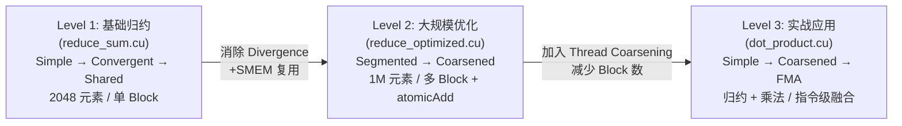
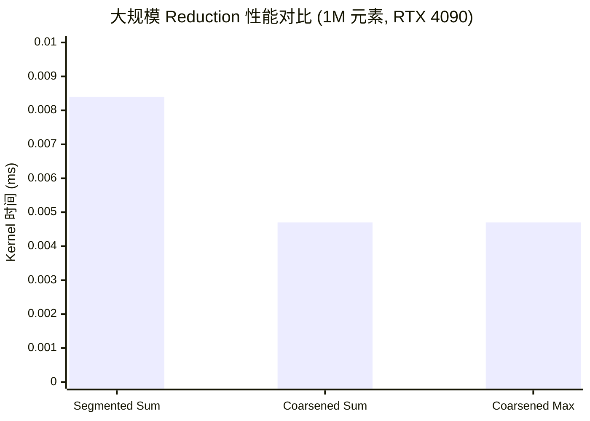

## 楔子：直击痛点

把 N 个数加起来，这不是编程入门的第一课吗？在 CPU 上一个 `for` 循环就结束了。但在 GPU 上，这个看似简单的操作暗藏杀机——**Parallel Reduction（并行归约）** 是所有复杂并行算法的基石。

Softmax 需要求一行的 max 和 sum；LayerNorm 需要求一行的均值和方差；Attention 的分母是一个全局 sum；梯度更新需要在百万参数上执行全局聚合。这些操作本质上都是 Reduction。如果 Reduction 慢了，整个 LLM 推理管线就被掐住了咽喉。

问题在于：加法是**顺序依赖**的——$S = a_0 + a_1 + ... + a_{N-1}$，每一步都必须等待前一步的结果。如何把一个本质上的串行操作变成并行的？答案是**树形归约（Tree Reduction）**——但朴素的树形归约会触发 GPU 最忌讳的硬件陷阱：**Warp Divergence**。

本章通过三组实验——`reduce_sum`（基础归约三版本）、`reduce_optimized`（大规模数据 + 线程粗化）、`dot_product`（归约在实战中的应用）——**层层递进地展示如何将一个 $O(N)$ 的串行操作在 GPU 上优化到逼近理论带宽极限**。

---

## 第一性原理与数学重构

### 归约的数学本质

归约操作可以形式化为：

$$S = \bigoplus_{i=0}^{N-1} a_i$$

其中 $\bigoplus$ 是一个满足**结合律**的二元运算符（加法、取 max、取 min 都满足）。结合律保证了我们可以自由地重新组合计算顺序，而不影响最终结果。这是并行化的数学基础。

### 串行 → 二叉树并行

串行归约需要 $N-1$ 步。改用二叉树归约，$N$ 个元素能在 $\lceil \log_2 N \rceil$ 步内完成：

$$\text{Step } k: \quad a_i \leftarrow a_i \oplus a_{i + 2^k}, \quad \forall i \in \{0, 2^{k+1}, 2 \cdot 2^{k+1}, ...\}$$

以 $N = 8$ 为例：

- Step 0: 4 次加法，活跃线程 = 4
- Step 1: 2 次加法，活跃线程 = 2
- Step 2: 1 次加法，活跃线程 = 1
- **总计 3 步，7 次加法（与串行相同），但最多 4 次并行**

问题在于：**哪些线程应该在哪一步被激活？**——这个看似微小的决策，直接决定了 GPU 的效率差距达 **36%**。

### Divergent vs Convergent：Warp 执行掩码的博弈

**Divergent 算法**（Simple Reduce）：

```
stride = 1, 2, 4, ...
if (threadIdx.x % stride == 0) → 执行加法
```

当 `stride = 1` 时，偶数线程工作、奇数线程闲置。**但 GPU 的 Warp（32 线程一组）是 SIMT 架构**——一个 Warp 中只要有 1 个线程走了不同的分支，整个 Warp 就必须把两个分支都执行一遍，不执行的线程等待。这叫 **Warp Divergence**。

当 `stride = 1` 时，每个 Warp 中 16 个线程执行、16 个等待——**50% 的算力浪费**。随着 stride 翻倍，浪费更严重：`stride = 2` 时 25% 利用率，`stride = 4` 时 12.5%...

**Convergent 算法**：

```
stride = N/2, N/4, ..., 1
if (threadIdx.x < stride) → 执行加法
```

当 `stride = 512`（假设 Block = 1024），前 512 个线程工作。关键在于：**前 16 个 Warp（线程 0~511）全员工作，后 16 个 Warp 全员闲置**。没有任何 Warp 内部出现分支分裂！

| 算法 | stride=512 时 Warp 状态 | Warp Divergence |
|:-----|:----------------------|:----------------|
| **Divergent** | 每个 Warp 中偶数线程工作、奇数等待 → 32 个 Warp 全部分裂 | ❌ 严重 |
| **Convergent** | 前 16 个 Warp 全员工作，后 16 个全员休息 → 零分裂 | ✅ 无 |

这就是为什么一个简单的 `if` 条件翻转，能带来 **36% 的性能提升**。

---

## 核心优化演进与硬件映射

### 三级优化路径

本项目实现了三级逐步深化的优化路径：



### Level 1 → Level 2 的跨越：从单 Block 到多 Block

`reduce_sum.cu` 处理的是 2048 个元素（单 Block，1024 线程）。但实际 LLM 中的 Reduction 涉及百万到上亿元素。`reduce_optimized.cu` 通过以下策略扩展到 1M 元素：

1. **Segmented Reduce**：将 $N$ 个元素按 `2 × BLOCK_SIZE` 分段，每个 Block 独立归约一段，最终用 `atomicAdd` 汇总。每个线程先加载 2 个元素到 Shared Memory，再执行树归约。

2. **Thread Coarsening**：每个线程不是只处理 2 个元素，而是处理 $2 \times \text{COARSE\_FACTOR}$ 个元素。设 `COARSE_FACTOR = 4`，则每个线程先在寄存器中累加 8 个值，再存入 Shared Memory 进入树归约阶段。

**Thread Coarsening 的硬件收益**：

- 启动的 Block 数量减少为原来的 $1/\text{COARSE\_FACTOR}$
- 每次 `__syncthreads()` 需要等待全 Block 同步到达，更少的 Block 意味着更少的同步开销
- 寄存器中的加法完全在 ALU 管线内完成，不需要 Shared Memory 读写往返
- 更少的 Block 调度 → 更少的全局 `atomicAdd` 竞争

### Level 3：Dot Product 的 FMA 指令优化

Dot Product 是归约的实战推广：$\text{dot}(a, b) = \sum_{i=0}^{N-1} a_i \cdot b_i$。它在乘法之后紧接归约加法，为硬件 **FMA（Fused Multiply-Add）** 指令提供了完美的融合机会。

`sum = fmaf(a[i], b[i], sum)` 在硬件层面执行一条 `FFMA` 指令——单周期完成 `a*b+sum`，对比分离的 `FMUL + FADD` 两条指令省去了一次中间寄存器写入和一次流水线 stall。在 `-O3` 优化下，编译器通常会自动将 `sum += a[i] * b[i]` 融合为 FMA，但显式使用 `fmaf()` 保证了这个行为。

---

## 源码手术刀：关键代码深度赏析

### Divergent vs Convergent 的一行之差

**Divergent 版本**（性能较差）：

```cpp
for (int stride = 1; stride <= blockDim.x; stride *= 2) {
    if (threadIdx.x % stride == 0) {          // ← 取模：Warp 内部分裂
        input[i] += input[i + stride];
    }
    __syncthreads();
}
```

`threadIdx.x % stride == 0` 导致同一个 Warp 内的线程走入不同分支。硬件的 SIMT 执行模型迫使不参与计算的线程空转等待——每一步都会有一半的线程被"冻结"在 predicate mask 之下。

**Convergent 版本**（消除 Divergence）：

```cpp
for (int stride = blockDim.x; stride >= 1; stride /= 2) {
    if (threadIdx.x < stride) {               // ← 线性剪切：Warp 整体退出
        input[i] += input[i + stride];
    }
    __syncthreads();
}
```

`threadIdx.x < stride` 形成了一个**连续的活跃区间** `[0, stride)`。随着 stride 缩小，高编号的 Warp 整体退出，而不会在 Warp 内部产生分裂。

### Thread Coarsening 的核心

```cpp
__global__ void coarsened_reduce_sum(float* input, float* output, int length) {
    __shared__ float shared_data[BLOCK_SIZE];
    int tid = threadIdx.x;
    int sid = 2 * COARSE_FACTOR * blockDim.x * blockIdx.x + tid;

    // 阶段 1：每个线程在寄存器中先累加 8 个元素
    float sum = 0.0f;
    for (int i = 0; i < COARSE_FACTOR * 2; ++i) {
        if (sid + i * BLOCK_SIZE < length)
            sum += input[sid + i * BLOCK_SIZE];
    }
    shared_data[tid] = sum;   // 阶段 2：写入 SMEM，进入树归约
    // ... 后续树归约 + atomicAdd
}
```

阶段 1 的 `for` 循环在寄存器中完成——每次从 Global Memory 加载一个 float（`LD.E`），累加到寄存器 `sum`（`FADD`），完全没有 Shared Memory 或 `__syncthreads()` 的参与。当 `COARSE_FACTOR = 4` 时，1024 个线程 × 8 个元素 = **单 Block 处理 8192 个元素**，是无粗化版本（2048 元素/Block）的 4 倍。

Block 数量从 $N / (2 \times \text{BLOCK\_SIZE})$ 下降到 $N / (2 \times \text{COARSE\_FACTOR} \times \text{BLOCK\_SIZE})$，直接减少了 4 倍的 Kernel 调度开销和 `atomicAdd` 竞争。

---

## 理论与实际的对决：极限剖析

所有数据来自 `Results/02_Reduction.md`。硬件：2× RTX 4090 (sm_89), nvcc -O3, C++17。

### Level 1: 基础归约（2048 元素，100 次平均）

| 版本 | Kernel 时间 (ms) | vs Simple 加速比 |
|:-----|:----------------|:----------------|
| Simple Reduce (Divergent) | 0.0051 | 1× |
| **Convergent Reduce** | **0.0038** | **1.36×** |
| Shared Memory Reduce | 0.0038 | 1.36× |

Convergent 和 Shared Memory 版本性能相同（0.0038 ms），因为在这个极小规模下（2048 个 float = 8 KB），数据本身就可能驻留在 L1/L2 Cache 中，Shared Memory 的额外复制反而没有带来收益。而 Divergent → Convergent 的改进纯粹来自于消除了 Warp Divergence——**36% 的提升，仅来自于一行 `if` 条件的改写**。

需要注意的是，在 2048 元素这样的极小规模下，GPU 的带宽 = 2.17 GB/s，远低于理论峰值 1008 GB/s——这不是代码有问题，而是启动一次 Kernel 本身就有 ~5 µs 的固定开销，对于微秒级的 Kernel 来说，launch overhead 完全 dominate 了运行时间。

### Level 2: 大规模归约（1M 元素，100 次平均）

| 版本 | Kernel 时间 (ms) | vs Segmented 加速比 |
|:-----|:----------------|:------------------|
| Segmented Reduce | 0.0084 | 1× |
| **Coarsened Reduce Sum** | **0.0047** | **1.77×** |
| Coarsened Reduce Max | 0.0047 | — |



**理论极限推导**：

数据量 = $1M \times 4B = 4$ MB。理论最小搬运耗时 = $4 \text{ MB} / 1008 \text{ GB/s} \approx 0.004 \text{ ms}$。

实测 Coarsened Reduce 达到 0.0047 ms → 有效带宽 = **887 GB/s = 理论峰值的 88%**。

剩余 12% 的差距来自：

1. `atomicAdd` 的全局序列化开销——多个 Block 的 thread 0 需要原子地往同一个地址累加，产生了 L2 Cache 上的竞争
2. 树归约的最后几步（stride < 32）已经退化到单 Warp 甚至单线程计算，SM 利用率骤降
3. 1M 元素 / 8192 per Block = 仅 128 个 Block，恰好等于 SM 数量，每个 SM 只分到 1 个 Block，Occupancy 可能受限

Thread Coarsening 带来 **1.77× 加速**——几乎将 Segmented 版本的 Block 调度开销和同步开销压缩了一半。

### Level 3: Dot Product（1M 元素，100 次平均）

| 版本 | Kernel 时间 (ms) | vs Simple 加速比 | 有效带宽 |
|:-----|:----------------|:----------------|:---------|
| Simple Dot Product | 0.0092 | 1× | — |
| Coarsened Dot Product | 0.0056 | 1.65× | — |
| **FMA Dot Product** | **0.0056** | **1.66×** | **1506.49 GB/s** |

1506 GB/s **超过了 DRAM 理论峰值 1008 GB/s**！注意 Results 文件的注释："实际带宽可能超过 DRAM 理论峰值，这是 L2 缓存命中的正常现象"。1M × 2 个向量 = 8 MB 数据完全被 RTX 4090 的 **72 MB L2 Cache** 包裹。Kernel 多次迭代运行时（100 次平均），数据在第一次运行后就驻留在 L2 Cache 中，后续迭代不再真正访问 DRAM——于是看到了 L2 Cache 级别的带宽表现。

---

## 架构师视角的总结

**铁律一：分支设计要以 Warp 为单位思考，而非以线程为单位。**
GPU 的最小执行单位不是 Thread，而是 **Warp（32 threads）**。写 `if` 语句时，永远要问自己：这个条件会不会导致同一个 Warp 内的线程走向不同的分支？如果会，就回去改。Convergent Reduce 的 `threadIdx.x < stride` 确保了 Warp 要么全员工作、要么全员退出——这个模式应当刻入骨髓。

**铁律二：Thread Coarsening 是对抗调度开销的最直接武器。**
GPU 上启动 Block 不是免费的——调度、分配 Shared Memory、寄存器初始化都有开销。当数据量足以让每个线程多处理几个元素时（粗化因子 4~8），总 Block 数直接砍掉数倍，`atomicAdd` 竞争减少，同步屏障次数不变但 per-element 成本摊薄了。这个技巧在所有 Memory Bound 算子上都有效。

**铁律三：当数据小到能塞进 L2，你看到的性能数字已经不是 DRAM 的了。**
Dot Product 的 1506 GB/s 不是魔法——它是 L2 Cache 的实力。在 LLM 推理中，许多小规模 Reduction（如 Softmax 的行 max/sum）数据量远小于 L2 容量，这时真正的瓶颈可能是计算而非搬运。理解数据在哪一级存储层上实际运行，是写出高效 Kernel 的前提。后续 `06_Warp_Primitives` 将展示如何用 `__shfl_down_sync` 在寄存器级别完成归约——彻底绕过 Shared Memory。
