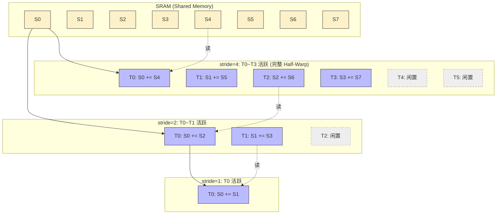
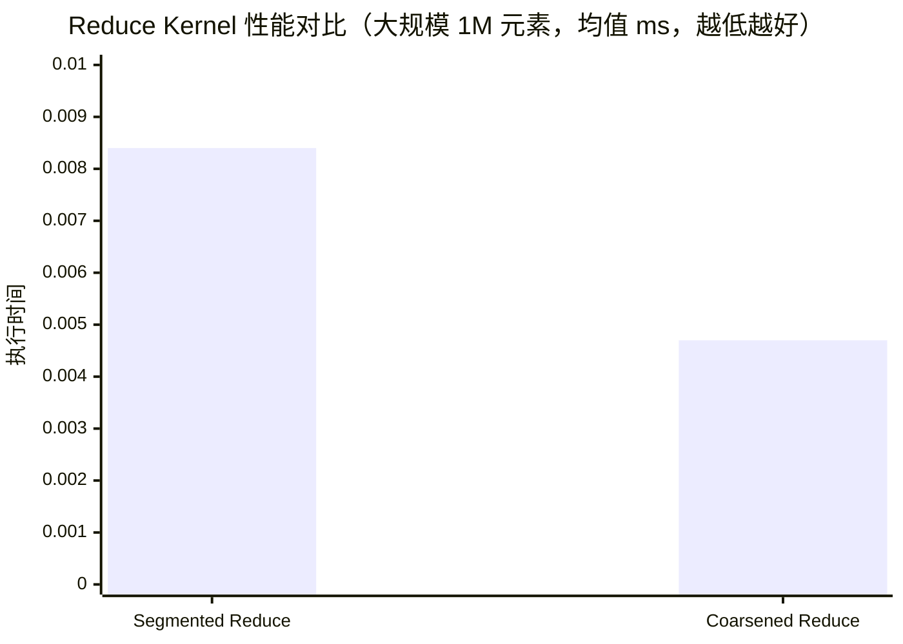

## 楔子：直击痛点 (The Hook & Motivation)

在深度学习框架底层，诸如 `LayerNorm` 的方差计算、Loss 函数的求和、甚至最基础的 `Softmax` 分母项，无一不依赖一个核心的并行原语：**归约 (Reduction)**。

表面上看，把 $N$ 个数字加起来极其简单。但在 GPU 这个拥有成千上万个并发执行单元的猛兽体内，全局协同成了一个巨大的包袱。如果采用最朴素的并发二分折叠，在每一轮迭代中都会有活着的线程和闲置的线程被混合编排在同一个 Warp（线程束）内，这会直接诱发致命的 **Warp Divergence（线程束分化）**，导致原本可以单周期发射 32 条指令的算力单元被空转的掩码（Mask）白白浪费。

难道为了同步结果，就必须牺牲算力的稠密度吗？如何在消除控制流分叉的同时，将 GPU 内存带宽压榨到物理极限？

---

## 第一性原理与数学重构 (Mathematical Formulation)

归约操作的本质，是对一个满足结合律的二元算子 $\oplus$（比如加法、最大值），将长度为 $N$ 的序列坍缩为一个标量：

$$S = x_0 \oplus x_1 \oplus x_2 \oplus \cdots \oplus x_{N-1}$$

在 GPU 上，我们利用完全二叉树的拓扑结构将时间复杂度从串行的 $O(N)$ 降低至并行的 $O(\log N)$。对于第 $d$ 层折叠（$d = 0, 1, \ldots, \log_2 N - 1$），在 Shared Memory 空间中的递推公式为：

$$V^{(d+1)}_i = V^{(d)}_i \oplus V^{(d)}_{i + \text{stride}}, \quad \text{stride} = \frac{\text{BlockSize}}{2^{d+1}}$$

如果任由公式自然展开，在最后几轮时，活跃节点稀疏地散布在各个 Bank 中。真正的架构师思维是**主动重排存活线程的分布规律**（Convergent 算法）：强制存活下的线程索引始终紧凑排列在 $[0, \text{stride}-1]$。这就保证了任何时候只有连续索引的 Warp 在满载工作，多余的 Warp 直接整建制休眠，彻底拔除 Divergence。

不仅如此，为了进一步打破 $\log N$ 层的同步通信延迟，我们需要在进入并行树之前进行**串行代数合并 (Thread Coarsening)**：让单个线程先吞吐 $C$ 个元素：
$$\text{local\_sum}_{tid} = \sum_{k=0}^{C-1} x_{\text{offset}_{tid} + k \cdot \text{BlockSize}}$$
随后的树形归约仅需处理 $\frac{N}{C}$ 个节点。

---

## 核心优化演进与硬件映射 (Architecture Mapping)

从朴素归约到极致调优，其核心矛盾在于**“同步开销 (Synchronization Overhead)”**与**“并发度 (Concurrency)”**之间的权衡。

### 1. 线程连续性与 Shared Memory 映射 (Convergent 算法流向)

以下展示了在 stride=$4\rightarrow2\rightarrow1$ 的进程中，活跃线程（Active Thread）是如何被完美聚集在一起，从而避开 Warp Divergence 缺陷的。



### 2. Thread Coarsening 硬件层收益表

| 层面 | 未粗化 (1 元素/线程) | 粗化 (8 元素/线程) | 物理意义的突破 |
| :--- | :--- | :--- | :--- |
| **Block 数量** | 极大 | 降至 1/8 | 大幅削减 SM 上的 Block 调度拥挤度 |
| **屏障次数** | $\log_2(BlockSize)$ 次 | 不变，但总频次降 1/8 | `__syncthreads()` 的执行阻碍下降 |
| **加法执行环境** | Shared Memory内反复读写 | 私有寄存器链式累加 | 寄存器延迟仅 1 cycle，远胜 SRAM 交互 |

---

## 源码手术刀：关键代码深度赏析 (Surgical Code Analysis)

我们直接剖开目前实测最快的 `02_reduce_optimized/reduce_optimized.cu` 核心逻辑，观赏如何利用 **Thread Coarsening** 直接碾碎系统开销。

```cpp
    // 【解析 1：步长为 2 * COARSE_FACTOR 的全局寻址起始点】
    CInt sid = 2 * COARSE_FACTOR * blockDim.x * blockIdx.x + tid;

    float sum = 0.0f;
    if (sid < length) {
        sum = input[sid];
        // 【解析 2：极致的寄存器级预归约】
        for (int i = 1; i < COARSE_FACTOR * 2; ++i) {
            if (sid + i * BLOCK_SIZE < length) {
                // 完全在 Register File 内发生 FFMA，零缓存依赖
                sum += input[sid + i * BLOCK_SIZE];
            }
        }
    }
    // 【解析 3：仅交出浓缩后的标量给 Shared Memory】
    shared_data[tid] = sum;

    // 此后进行标准的 stride = blockDim.x/2 收敛归约与 __syncthreads()...
```

**手术刀剖析：**

1. **宏观调度的解脱**：这段代码最大的魔力在于 `COARSE_FACTOR`。假设它被设为 4，那么该循环体将预先在单个线程的私有寄存器（Register File）上连续吞下 8（即 2×4）个参数。这意味着什么？意味着原本需要 8 个 Block 才能消化的数据段，现在 1 个 Block 就处理完了。**全局启动的 Block 数量骤降为原先的 1/8**。
2. **纯净的 L1 命中与合并访存**：`input[sid + i * BLOCK_SIZE]` 完美保持了同一个 Warp 内不同线程对内存读取的步调一致性（Coalesced Access），利用 128-byte transactions 高效榨取 HBM。
3. **消除冗余同步**：这 8 次累加彻底脱离了 `__syncthreads()` 的魔爪。在寄存器内部标量累加的代价微乎其微，而任何一次跨线程同步指令对指令流水线（Pipeline）都是严重的打断。

---

## 理论与实际的对决：极限剖析 (Theory vs Reality Profiling)

在面对真实的物理硬件时，算法的优劣将无处遁形。基于 `Results/02_Reduction.md` 在 RTX 4090 上的真机日志，我们对 1,048,576 (1M) 规模的浮点数组进行规约。



| 版本 | Kernel 时间 (ms) | 有效带宽 (GB/s) | vs CPU (4.69 ms) 加速比 |
| :--- | :--- | :--- | :--- |
| **基础分段 (Segmented)** | 0.0084 | — | ~559× |
| **线程粗化 (Coarsened, 因子=4)**| **0.0047** | **887.48** | **991.52×** |

### 理论自洽性终极审判

实测表明，**Coarsened 版比 Segmented 版性能陡增 1.78×**。时间缩减至极致的 **4.7 微秒**。
这 4.7 微秒在干什么？
RTX 4090 的显存峰值带宽是 ~1008 GB/s，而 1M 浮点数体积为 4.00 MB。
如果只算纯粹搬运这 4MB 数据穿过显存总线的最小理论耗时：$4.00 \text{ MB} / 1008 \text{ GB/s} \approx 3.96 \text{ \mu s}$。

我们实际跑出了 **4.7 微秒**，有效带宽 **887.48 GB/s**（约为理论极限的 **88%**）！
至此，算子的本质被彻底揭示：**在极其优秀的 Thread Coarsening 保护下，所有的计算耗时与同步延迟（`__syncthreads`）已被完美隐藏在指令流水的大道之下，整个 Kernel 已经完全退化为一场纯粹的、逼近硅片极限的内存大搬运。**
没有算力瓶颈，只剩光速不可撼动的物理带宽墙。

*(注：部分文档可能曾设想借助指令级 `__shfl_down_sync` 洗除最后的 Block 级同步。但从实测结果反思，由于 Block 数量已被 Coarsening 指数级削减，加上 4090 的 L2/L1 超高命中率，光凭 Coarsening 就已经足以顶破内存带宽天花板。这也是 Profiler 永远是唯一检验真理标准的深刻体现。)*

---

## 架构师视角的总结 (Architect's Takeaway)

1. **并行不等于无脑展开**：在设计树形折叠等并发逻辑时，务必保持收敛（Convergent）。永远让存活的线程成为一组连续的索引，避免出现“每 2 个线程空 1 个” 这种毁灭 Warp 的设计。
2. **寄存器是最好的避风港 (Coarsening 原则)**：当数据可以放入私有寄存器循环累加时，绝对不要将它们过早地暴露在需要 `__syncthreads()` 维持治安的 Shared Memory 中。串行执行并非总是坏事，有节制的底层串行可以换来更高质量的宏观并发。
3. **当算子逼近 Memory Bound，隐藏一切**：当有效带宽达到理论带宽的 85% 以上时，说明所有指令延迟已被良好掩盖（Latency Hiding），再深度的计算级别优化（如内联汇编等）带来的边际收益将无限趋近于零。
