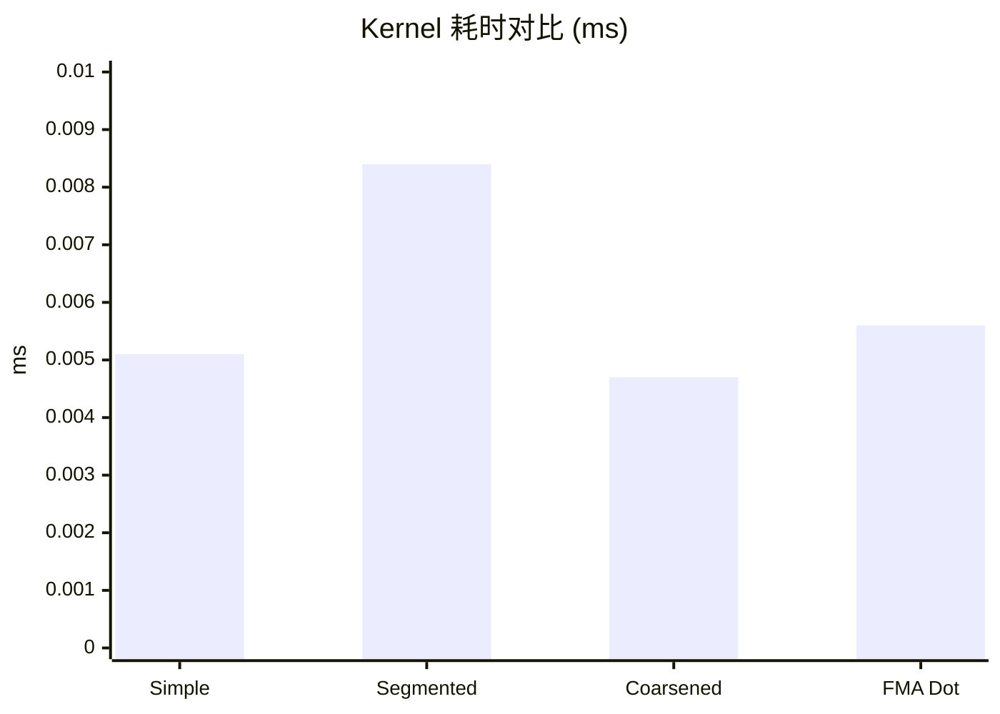

> 📖 **前置阅读**：01_Basics（Shared Memory 基础）  
> 📖 **推荐后续**：06_Warp_Primitives（Warp Shuffle 归约）、03_Scan（Prefix Sum）

## 归约这件小事

把 $N$ 个数加起来。听着简单到不值得写一篇文章——CPU 上一个 `for` 循环就行了。但在 GPU 上，这个问题变得很有意思。

$N$ 个数的求和有数据依赖：你得等两个数加完了才能把结果继续往上加。串行算法需要 $N-1$ 步。并行归约用二叉树的方式把 $N$ 个数两两配对、逐层求和，理论只需要 $\log_2 N$ 步。1M 个元素，串行要 100 万步，并行只要 20 步。

但问题在于，GPU 上的"两两配对"有很多种配法，配错了性能会掉一截。这一章展示三种越来越聪明的配法，每一步提升的原因都跟 GPU 硬件的底层机制有关。

---

## 三种归约和它们各自的问题

### V1：Simple Reduce——教科书写法

```cpp
__global__ void simple_reduce_sum(float* input, float* output) {
    int i = 2 * threadIdx.x;
    for (int stride = 1; stride <= blockDim.x; stride *= 2) {
        if (threadIdx.x % stride == 0) {
            input[i] += input[i + stride];
        }
        __syncthreads();
    }
    if (threadIdx.x == 0) *output = input[0];
}
```

直觉上很清楚：第一轮 stride=1，偶数线程两两相加；第二轮 stride=2，每四个取一个；以此类推。

问题在 `if (threadIdx.x % stride == 0)` 这行。GPU 以 32 个线程为一组（Warp）执行指令，一个 Warp 内的所有线程必须执行同一条指令。当 stride=1 时，Warp 中一半的线程走 `if` 分支做加法，另一半走 `else` 等着——这就是 **Warp Divergence**。硬件的处理方式是把两条路径都执行一遍，用 predicate mask 选择性写入结果。说白了，两条路都跑了，一半的计算白做。

更糟的是，随着 stride 增大，活跃线程越来越少但散布在不同 Warp 中，每个 Warp 都只有零星几个线程在干活。

### V2：Convergent Reduce——让活跃线程挤到同一个 Warp

```cpp
__global__ void convergent_reduce_sum(float* input, float* output) {
    int i = threadIdx.x;
    for (int stride = blockDim.x; stride >= 1; stride /= 2) {
        if (threadIdx.x < stride) {
            input[i] += input[i + stride];
        }
        __syncthreads();
    }
    if (threadIdx.x == 0) *output = input[0];
}
```

把 stride 的方向反过来：从 `blockDim.x` 开始往下减半。这样活跃线程始终是 `threadIdx.x < stride`，它们是编号连续的——集中在前几个 Warp 里。

当 stride 从 1024 减到 512 时，线程 0-511 活跃，占满了前 16 个 Warp，后 16 个 Warp 完全空闲但不浪费调度资源。当 stride 减到 32 以下，只剩一个 Warp 在跑，但这个 Warp 内的线程是连续的——没有 Divergence。

这个改动没有增加任何计算量，仅仅是换了一种线程编组方式。但效果显著：**从 0.0051ms 降到 0.0038ms，快了 1.36×**。

### V3：Shared Memory + 首次加载合并

```cpp
__global__ void shared_reduce_sum(float* input, float* output) {
    __shared__ float shared_data[BLOCK_SIZE];
    int i = threadIdx.x;
    shared_data[i] = input[i] + input[i + BLOCK_SIZE]; // 加载时就做一次加法
    for (int stride = blockDim.x / 2; stride >= 1; stride /= 2) {
        __syncthreads();
        if (threadIdx.x < stride)
            shared_data[i] += shared_data[i + stride];
    }
    if (threadIdx.x == 0) *output = shared_data[0];
}
```

两处改进：一是把数据先搬到 Shared Memory 做归约（后续访问走 SRAM 而非 Global Memory），二是在加载时每个线程直接对两个相邻元素求和，相当于免费多做了一层归约。

在 2048 元素的小规模测试中，V2 和 V3 性能一致（都是 0.0038ms）——因为数据量太小，SRAM 的优势体现不出来。但在大规模下 SRAM 的低延迟会更有意义。

---

## 进阶：Thread Coarsening 和多 Block 归约

小规模归约只是热身。实际场景中你要归约的是百万甚至上亿个元素，一个 Block 装不下。`reduce_optimized.cu` 用两个技巧解决这个问题。

### 多 Block + atomicAdd

每个 Block 归约自己的局部和，最后用 `atomicAdd` 把各 Block 的局部和累加到全局结果。这里 `atomicAdd` 的开销不大——Block 数量通常只有几十到几百个，远小于元素数量。

### Thread Coarsening：让每个线程多干点活

```cpp
__global__ void coarsened_reduce_sum(float* input, float* output, int length) {
    __shared__ float shared_data[BLOCK_SIZE];
    int tid = threadIdx.x;
    int sid = 2 * COARSE_FACTOR * blockDim.x * blockIdx.x + tid;

    // 每个线程先用寄存器累加 COARSE_FACTOR*2 个元素
    float sum = 0.0f;
    if (sid < length) {
        sum = input[sid];
        for (int i = 1; i < COARSE_FACTOR * 2; ++i) {
            if (sid + i * BLOCK_SIZE < length)
                sum += input[sid + i * BLOCK_SIZE];
        }
    }
    shared_data[tid] = sum;
    // ... 后面接标准的 SRAM 归约树 ...
}
```

COARSE_FACTOR=4 时，每个线程负责 8 个元素的初步累加（在寄存器里做，零同步开销），然后再把结果放进 SRAM 做树形归约。

好处直接：Block 减少了 8 倍，Kernel Launch 开销和 `atomicAdd` 竞争都等比下降。而且寄存器里的连续累加操作可以被编译器 pipeline，充分利用 ILP（指令级并行）。

---

## 实测数据

测试环境：2× RTX 4090 (sm_89)，nvcc -O3，C++17。

### 小规模 Reduce Sum（$N = 2048$，100 次平均）

| 版本 | Kernel 时间 | vs Simple |
|:---|:---|:---|
| Simple (有 Divergence) | 0.0051 ms | 1× |
| Convergent (无 Divergence) | 0.0038 ms | 1.36× |
| Shared Memory | 0.0038 ms | 1.36× |

这里 Convergent 和 Shared Memory 性能一样——$N = 2048$ 太小了，全部数据大概率已经在 L1 Cache 里。SRAM 的优势在大规模数据上才能拉开差距。

### 大规模优化 Reduce（$N = 1{,}048{,}576$，1M 元素，100 次平均）

| 版本 | Kernel 时间 | 有效带宽 | vs CPU |
|:---|:---|:---|:---|
| CPU | 4.69 ms | — | 1× |
| Segmented（无粗化） | 0.0084 ms | — | — |
| Coarsened（粗化因子 4） | 0.0047 ms | 887.48 GB/s | 992× |

Coarsened 比 Segmented 快 1.77×。887 GB/s 的有效带宽达到了 HBM 理论峰值的 88%。

### 点积（$N = 1M$，100 次平均）

| 版本 | Kernel 时间 | 有效带宽 |
|:---|:---|:---|
| Simple | 0.0092 ms | — |
| Coarsened | 0.0056 ms | 1506 GB/s |
| FMA | 0.0056 ms | 1506 GB/s |

1506 GB/s 超过了 HBM 的理论峰值 1008 GB/s，这是 L2 Cache 命中的效果——1M 个 float 只有 4 MB，远小于 RTX 4090 的 72 MB L2 Cache。多次迭代平均下来，大量数据直接从 L2 返回，不走 HBM。

Coarsened 和 FMA 版本无差异。`fmaf(a, b, sum)` 和 `sum += a * b` 在现代 nvcc -O3 下编译结果一样——编译器会自动生成 FMA 指令。手写 `fmaf` 在这里更多是表达意图。



---

## 从这些实验里能学到什么

**Warp Divergence 的代价不在计算，在调度。** Divergent 分支让一个 Warp 的有效利用率降到 50% 甚至更低。但修复方法可以很简单——只要确保同一 Warp 内的线程走相同分支就行。Convergent Reduce 的核心就是一行 `if (tid < stride)` 替换了 `if (tid % stride == 0)`。

**Thread Coarsening 是减少调度开销的通用技巧。** 让每个线程多负责几个元素，用寄存器做预先累加，可以减少 Block 数量、降低 `atomicAdd` 竞争、利用 ILP。这个思路不只适用于归约——GEMM 的 Register Tiling（04_GEMM_Optimization）本质上也是 Thread Coarsening 的一种体现。

**大规模归约的瓶颈是带宽，不是计算。** 1M 个 float 只做 sum 运算，算术强度接近 0。优化到 887 GB/s 带宽之后，剩下的 12% 差距来自 atomicAdd 的序列化和 Kernel Launch 固定开销。要再快，得用 Warp Shuffle——06_Warp_Primitives 会讲。
