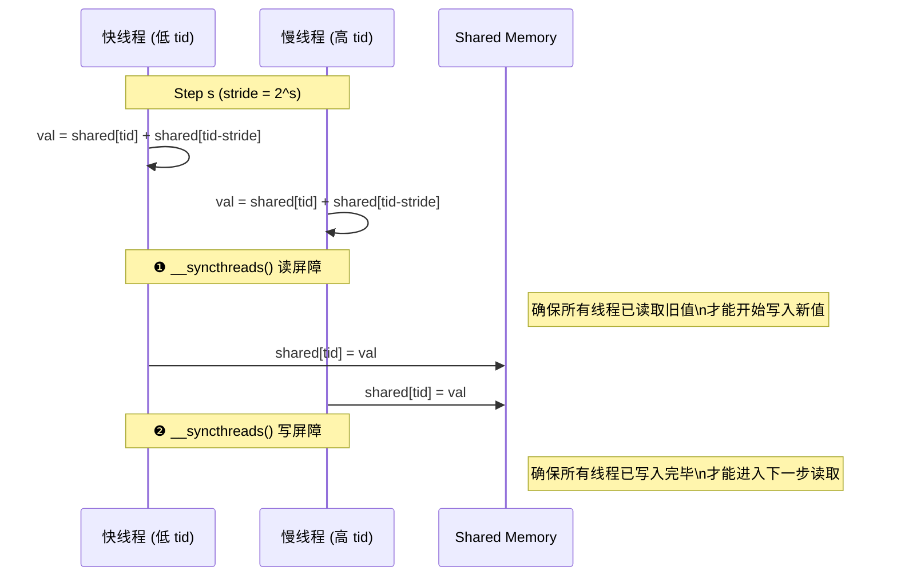
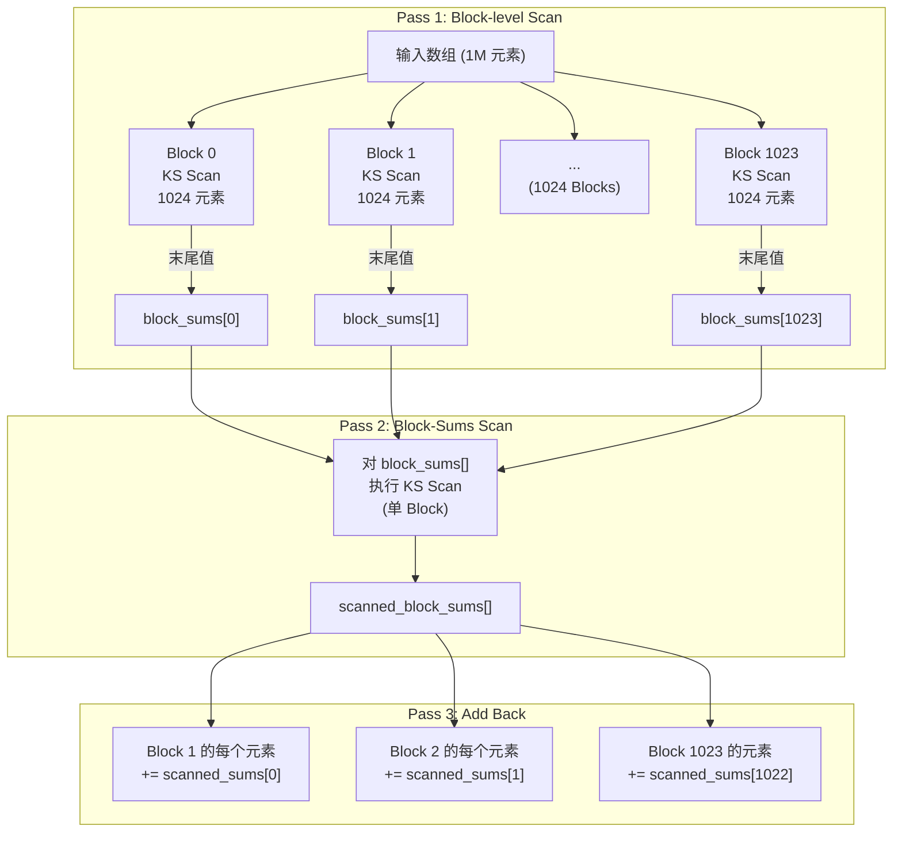

## 楔子：直击痛点

Prefix Sum（前缀和）看似不起眼，却是并行计算的"瑞士军刀"。Stream Compaction（稠密化）需要它、Radix Sort 需要它、稀疏矩阵的 CSR 行指针需要它、甚至 GPU 上的动态内存分配也依赖它。一切需要将局部决策汇聚为全局偏移量的场景，都绕不开 Scan。

但 Scan 和 Reduction 有着本质的不同：Reduction 只输出 1 个标量，Scan 必须输出 $N$ 个值——**每个位置都需要知道它之前所有元素的累计和**。这种强数据依赖让并行化变得极其棘手。

两位计算机科学先驱分别给出了截然不同的并行方案——**Kogge-Stone** 和 **Brent-Kung**。它们在理论复杂度上交锋：KS 用更多的加法换取更少的步骤（低延迟），BK 用更少的加法换取更高的效率（低工作量）。但在 GPU 的 SIMT 架构上，理论复杂度并不直接等于实际性能——**硬件利用率才是真正的裁判**。

本章通过两组实验——单 Block 的 KS vs BK 算法对比，以及多 Block 的三遍全局 Scan——展示并行前缀和的完整工程实践。

---

## 第一性原理与数学重构

### Scan 的形式化定义

给定输入数组 $[a_0, a_1, ..., a_{N-1}]$，Inclusive Prefix Sum 的输出为：

$$y_i = \sum_{k=0}^{i} a_k$$

即 $y_0 = a_0, \quad y_1 = a_0 + a_1, \quad y_2 = a_0 + a_1 + a_2, \quad ...$

串行实现只需一个 `for` 循环：$y_i = y_{i-1} + a_i$，复杂度 $O(N)$。但每一步都依赖前一步的结果，似乎无法并行。

### Kogge-Stone 算法：用冗余换低延迟

KS 的核心思想是：在每一步中，让每个元素向前"看"越来越远的邻居，逐步扩大它的前缀覆盖范围。

$$\text{Step } s: \quad a_i^{(s)} = \begin{cases} a_i^{(s-1)} + a_{i-2^{s-1}}^{(s-1)} & \text{if } i \geq 2^{s-1} \\ a_i^{(s-1)} & \text{otherwise} \end{cases}$$

以 $N = 8$ 为例，KS 算法的完整执行过程：

| Step | stride | 活跃线程 | 加法次数 | 操作 |
|:-----|:-------|:---------|:---------|:-----|
| 1 | 1 | 线程 1-7 | 7 | 每个元素加上左邻 |
| 2 | 2 | 线程 2-7 | 6 | 每个元素加上隔 1 个的邻居 |
| 3 | 4 | 线程 4-7 | 4 | 每个元素加上隔 3 个的邻居 |

**总步数 = $\lceil \log_2 N \rceil = 3$，总加法 = 17**（串行仅 7 次）。KS 多做了 2.4 倍的计算，但步数从 7 减为 3——这是用**计算冗余（Work）换取了延迟（Span）**。

### Brent-Kung 算法：用理论最优工作量换延迟

BK 分两个阶段：

**Up-sweep（规约阶段）**：从底向上做树形归约，将部分和逐层堆叠到间距更大的位置。和 Reduction 的结构完全一致。

$$\text{Up stride } s: \quad a_{(k+1) \cdot 2^s - 1} \mathrel{+}= a_{(k+1) \cdot 2^s - 1 - 2^{s-1}}$$

**Down-sweep（分发阶段）**：将已经计算好的部分和向中间位置分发，填补 Up-sweep 没有覆盖到的位置。

$$\text{Down stride } s: \quad a_{(k+1) \cdot 2^s - 1 + 2^{s-1}} \mathrel{+}= a_{(k+1) \cdot 2^s - 1}$$

总加法 $\approx 2N - 2 - \log_2 N$，接近串行的 Work 量。但步数 = $2 \log_2 N - 1$，比 KS 的 $\log_2 N$ 多了近一倍。

### KS vs BK：理论博弈

| 指标 | Kogge-Stone | Brent-Kung |
|:-----|:-----------|:-----------|
| **步数 (Span)** | $\log_2 N$ | $2\log_2 N - 1$ |
| **总加法 (Work)** | $N \log_2 N - N + 1$ | $2N - 2 - \log_2 N$ |
| **每步活跃线程** | 几乎全员（$N - 2^s$） | 指数递减/递增 |
| **GPU 适配性** | ✅ 高——所有 Warp 持续忙碌 | ❌ 低——大量 Warp 闲置 |

在 GPU 上，**算力是"免费"的，空闲才是代价**。KS 虽然多做了加法，但每一步都让几乎全部线程参与计算，所有 Warp 保持忙碌。BK 虽然总加法少，但在 Up-sweep 末期和 Down-sweep 初期只有极少数线程在工作——128 个 SM 中可能只有 1 个在干活，其余 127 个等待。

---

## 核心优化演进与硬件映射

### Kogge-Stone 的双屏障关键设计

KS 算法在 CUDA 实现中需要一个精巧的同步策略——每一步需要**两道** `__syncthreads()`：



**为什么需要两道屏障？** 如果只有一道 `__syncthreads()`（在写入之后），快线程可能在慢线程还没读取 `shared[tid-stride]` 的旧值之前，就已经覆盖了那个位置的数据。这是经典的 **Read-After-Write (RAW) Hazard**。解法是先用局部变量 `val` 保存计算结果，等所有人都读完之后再统一写入。

### 多 Block 全局 Scan：三遍架构

单 Block 的 Scan 最多处理 `BLOCK_SIZE` 个元素（1024）。为了支持百万级数组，`segmented_scan.cu` 实现了经典的三遍全局 Scan：



这个三遍架构的关键约束：Block 数量不能超过 `BLOCK_SIZE`（1024），否则 Pass 2 自身又超出了单 Block Scan 的处理能力，需要递归。在 $N = 1M$ 时，1024 个 Block 恰好处在上限边缘。

### Coarse Scan：Thread Coarsening + 段内 KS

`coarse_scan` 在单 Block 内通过 Thread Coarsening 扩展处理范围——每个线程负责 `COARSE_FACTOR = 4` 个连续元素：

1. **串行前缀和**：每个线程在 Shared Memory 中对自己负责的 4 个元素做串行的 Inclusive Scan
2. **收集段尾值**：将每个线程处理的最后一个元素提取到 `section_sums[]`
3. **KS Scan**：对 `section_sums[]` 做 Kogge-Stone Scan，得到跨段累加值
4. **分发回写**：将跨段累加值加回每个非首段的元素

这样 1024 个线程 × 4 个元素 = 4096 元素/Block，避免了多 Block 架构的额外开销。

---

## 源码手术刀：关键代码深度赏析

### Kogge-Stone 的双屏障内核

```cpp
for (int stride = 1; stride < blockDim.x; stride *= 2) {
    __syncthreads();                          // ❶ 读屏障
    float val = 0.0f;
    if (tid >= stride) {
        val = shared_data[tid] + shared_data[tid - stride];
    }
    __syncthreads();                          // ❷ 写屏障
    if (tid >= stride) {
        shared_data[tid] = val;
    }
}
```

**逐行解析：**

- **`stride *= 2`**：stride 从 1 倍增到 `blockDim.x/2`，共 $\log_2(1024) = 10$ 步。每步将前缀覆盖范围翻倍。
- **第一个 `__syncthreads()`**：保护上一步的写入已全部完成，当前步才能安全读取。
- **`val = shared_data[tid] + shared_data[tid - stride]`**：所有线程同时读取 Shared Memory 中的旧值，存入寄存器 `val`——此时不修改 SRAM，所以不会产生 RAW 冲突。
- **第二个 `__syncthreads()`**：确认所有线程都读完旧值后，才统一写入新值。
- **`if (tid >= stride)`**：只有前缀范围足够的线程才参与计算。当 `stride = 1` 时，线程 0 不参与（它已经是自身的前缀和）。

### 三遍 Scan 的 Pass 3 分发

```cpp
__global__ void add_block_sums(float* output, const float* scanned_block_sums, int n) {
    int gid = blockIdx.x * blockDim.x + threadIdx.x;
    if (blockIdx.x > 0 && gid < n) {
        output[gid] += scanned_block_sums[blockIdx.x - 1];
    }
}
```

这个 Kernel 极度简洁但至关重要：它将 Pass 2 计算出的跨 Block 前缀和"广播"给每个 Block 的所有元素。`blockIdx.x > 0` 确保 Block 0 不被修改（它本身的前缀和已经正确）。每个线程只做一次 Global Memory 读取和一次加法——纯 Memory Bound，完美的合并访存。

---

## 理论与实际的对决：极限剖析

所有数据来自 `Results/03_Scan.md`。硬件：2× RTX 4090 (sm_89)。

### 单 Block：KS vs BK（1024 元素）

| 算法 | Kernel 时间 (ms) | vs KS 比率 |
|:-----|:----------------|:----------|
| **Kogge-Stone** | **0.0028** | **1× (基准)** |
| Brent-Kung | 0.0037 | 0.76× (更慢) |

KS 比 BK 快 **32%**——在机器级别完全印证了我们的理论分析：BK 的 Down-sweep 阶段活跃线程太少，大量 Warp 空转消耗时钟周期，而 KS 每一步都有 $N - 2^s$ 个线程忙碌，Warp 利用率远高于 BK。

在 1024 元素的极小规模下，GPU 有效带宽仅 2.21 GB/s——与峰值 1008 GB/s 相去甚远。但这不是算法的问题：4 KB 的数据跑 Kernel 启动开销本身就 dominate 了运行时间（~5 µs launch overhead vs ~3 µs kernel execution）。

### 多 Block 全局 Scan（1M 元素）

| 场景 | 算法 | Kernel 时间 (ms) | CPU加速比 | 有效带宽 |
|:-----|:-----|:----------------|:---------|:---------|
| 小规模 4096 元素 | Coarse Scan | 0.0047 | 1.27× | 6.93 GB/s |
| 小规模 4096 元素 | Segmented Scan | 0.0059 | — | — |
| **大规模 1M 元素** | **Segmented Scan** | **0.0221** | **80.69×** | **378.77 GB/s** |

**理论极限推导**：

数据量 = $1M \times 4B = 4$ MB（读取）+ $4$ MB（写入，因为 Scan 输出 = 输入规模）= $8$ MB 最小搬运量。
但三遍 Scan 总计搬运量 = Pass 1 读写 $2 \times 4$ MB + Pass 2 读写 $2 \times 4$ KB（block_sums, 可忽略）+ Pass 3 读写 $2 \times 4$ MB ≈ **16 MB**。
理论最小耗时 = $16 \text{ MB} / 1008 \text{ GB/s} \approx 0.016 \text{ ms}$。

实测 0.0221 ms → 有效带宽 378.77 GB/s = **理论峰值的 37.6%**。

**为何仅达到理论的 37.6%？深度溯源：**

1. **三遍 Kernel Launch Overhead**：三个独立 Kernel（`segmented_scan` × 2 + `add_block_sums` × 1）各有 ~5 µs 的启动开销，总计 ~15 µs，占 22.1 µs Kernel 时间的 ~68%！这是小数据量 + 多遍架构的致命伤。
2. **KS 算法内部的 Work 冗余**：$N \log_2 N = 1024 \times 10 = 10240$ 次加法，远超串行的 1023 次。多出的 9000 多次加法不仅无法喂饱 ALU（因为是 Shared Memory Bound），反而增加了每一步的 `__syncthreads()` 等待时间。
3. **Scan 的固有并行效率低**：与 Reduction 不同，Scan 的每一步都需要**全数组同步**（不仅仅是局部 Warp），导致 `__syncthreads()` 频率极高——KS 在单 Block 内执行 20 次 `__syncthreads()`（每步 2 次 × 10 步）。

**数据规模扩展的亚线性特性**：数据量从 4096 增长到 1M（256 倍），Kernel 时间仅增长 3.78 倍——这说明并行度确实在起作用，只是被 Kernel Launch 和同步开销严重稀释了。

---

## 架构师视角的总结

**铁律一：在 GPU 上，"少做事"不如"让所有人都有事做"。**
BK 理论上做的加法更少（$2N$ vs $N\log N$），但在 4090 的 128 个 SM 上，它的 Down-sweep 阶段大量 SM 闲置。GPU 从来不怕你多算几次，它怕的是 Warp 吃白饭。KS 的"浪费"恰好是 SIMT 架构最需要的——保持全员忙碌，就是最大的效率。

**铁律二：多 Kernel Launch 是小数据量的隐形杀手。**
三遍全局 Scan 在算法层面是优雅的，但每次 Kernel Launch 都有不可压缩的固定开销。当数据量不够大时（< 几十 MB），Launch Overhead 可能占据 Kernel 总时间的 50% 以上。解法要么是合并 Kernel（如 `coarse_scan` 在单 Block 内完成整个流程），要么是使用 CUDA Graph 将多 Kernel 静态编排为一个 DAG（`08_Advanced`），要么是用 CUB/Thrust 等库的优化实现。

**铁律三：Scan 是并行计算的"试金石"——同步成本无法隐藏。**
Reduction 只关心最终的 1 个值，中间结果可以随便覆盖。Scan 必须保留每一步的中间值，并且每一步都依赖上一步的全局状态——这使得 `__syncthreads()` 的频率极高。KS 的双屏障设计（先读后写，两次同步）是对 RAW Hazard 的教科书应对，但它也揭示了 Scan 操作在 SIMT 架构上的天然劣势。后续 `06_Warp_Primitives` 将展示如何用 `__shfl_up_sync` 在 Warp 内零开销地完成小规模 Scan。
