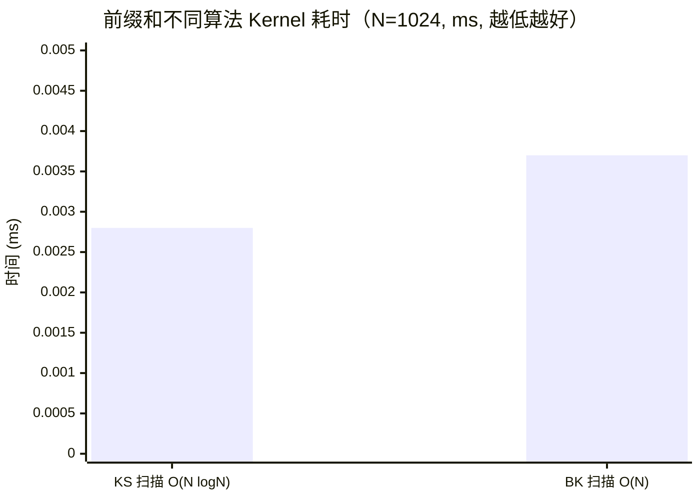

## 楔子：直击痛点 (The Hook & Motivation)

在建立现代系统级的底层组件时（例如：流压缩 Stream Compaction、大基数排序 Radix Sort，或构建内存分配器的位图索引），我们必然会遭遇一个比归约 (Reduction) 更刁钻的对手：**前缀和 (Prefix Sum / Scan)**。

归约允许我们将庞大的数据肆意揉捏，只求最终那一个坍缩的标量。而基于严苛定义的包含扫描 (Inclusive Scan)，不仅要求总和，它还**强制保留计算路径上的每一个中间状态**：
$$y_i = \sum_{j=0}^{i} x_j$$
每一个 $y_i$ 都死死依赖着 $y_{i-1}$ 的运算结果。这似乎是一个彻底串行化的诅咒：你要算第 1024 个结果，就必须等前 1023 个全部到位。如果 GPU 不能打破这种 $O(N)$ 的长链依赖依赖关系，那么在遇到稀疏拉平 (Sparse-to-Dense) 这种需要几百万次前缀和的任务时，整个 HBM 将沦为一条排长队的收费站。如何用空间（极度冗余的并行度）换取时间？

---

## 第一性原理与数学重构 (Mathematical Formulation)

如果一维排队行不通，架构师的首要任务是通过**分层跨步递推**切断串行链条。

### Kogge-Stone (步骤高效) 算法数学推演

Kogge-Stone 算法 (KS) 的核心思想是**让所有元素同时起跑，每一轮收集指数级膨胀的历史视野**。
在步骤 $d$ ($d=1,2,3...$)，如果元素的索引 $i \ge 2^{d-1}$，则该位的结果将融合左侧相距 $2^{d-1}$ 处的结果：
$$y^{(d)}_i = y^{(d-1)}_i \oplus y^{(d-1)}_{i - 2^{d-1}}$$

这一公式极具暴力美学：只需短短 $\log_2 N$ 次迭代，处于最末尾的第 $N$ 个元素就能神奇地囊括从起点到自身的全部信息（因为 $1+2+4+... = N-1$）。
代价是什么？冗余加法次数直逼 $O(N \log N)$ 级别。但是，在极度渴望独立并发调度的 GPU 上，这种“极其平坦但运算超发”的模型才是最高效的。

### Brent-Kung (工作量高效) 算法数学推演

纯从算法复杂度 (Big-O) 分析，KS 的超额计算并不完美。于是学者们提出了 Brent-Kung (BK) 算法。
BK 将求解拆分成两阶段：

1. **Up-sweep (树形规约阶段)**：类似普通 Reduction，自底向上构建满二叉树，仅消耗 $O(N)$ 算力。
2. **Down-sweep (散发扩散阶段)**：从树根反向将中间结果分发至叶子节点补全。

理论上，BK 的总加法工作量严格控制在了 $O(N)$，是一种具有理论绝对美感的“工作量极简”算法。但当我们把它放入硅片时，发生了什么？

---

## 核心优化演进与硬件映射 (Architecture Mapping)

我们必须直接画出 KS 算法在 Shared Memory 中与线程（Thread）交织的动作拓扑图，才能看透它为何在 GPU 上称王。

### Kogge-Stone 指令流向图 (N=8)

```mermaid
graph TD
    classDef read fill:#f9d0c4,stroke:#333;
    classDef write fill:#bbf,stroke:#333;

    subgraph "初始状态 (SRAM)"
        X0[1] X1[2] X2[3] X3[4] X4[5] X5[6] X6[7] X7[8]
    end

    subgraph "Step-1 (stride=1, 并发度=7/8)"
        R1[1+2=3]:::write R2[2+3=5]:::write R3[3+4=7]:::write R4[4+5=9]:::write R5[5+6=11]:::write R6[6+7=13]:::write R7[7+8=15]:::write
        X0-->R1
        X0 -.->|跨1步读取| X1
        X1-->R1; X1 -.-> R2
        X2-->R2; X2 -.-> R3
        X6-->R6; X6 -.-> R7; X7-->R7
    end

    subgraph "Step-2 (stride=2, 并发度=6/8)"
        T2[3+3=6]:::write T3[5+4=9]:::write T4[7+5=12]:::write T7[15+10=25]:::write
        X0 -.->|跨2步读取| R2
        R1 -.->|跨2步读取| R3
        R2 --> T2; R3 --> T3
    end
```

**底层真相解码**：你会发现，即使到了晚期循环，Kogge-Stone 算法的大量线程依然处于**存活状态**（Step-2 中有 6/8 个线程依然在运作）。对于以 Warp（32个线程为一组同步执行）调度的 GPU 而言，这种充沛的存活率使得 Warp 内的算术单元 (ALU) 利用率极高。
相比之下，Brent-Kung 由于依赖树形遍历，在上扫和下扫的最顶端，整个 SM 可能会因为极少数几个存活节点而造成大规模的 Warp 空转。计算复杂度的小($O(N)$)并没有战胜硅片并发调度上的荒芜。

---

## 源码手术刀：关键代码深度赏析 (Surgical Code Analysis)

想要在真实世界运行 KS 算法，存在一个致命的 **DATA HAZARD（数据冒险）**陷阱。我们截取 `01_prefix_sum/prefix_sum.cu` 中最危险的内核：

```cpp
// 在寄存器和 Shared Memory 间构建防线
for (int stride = 1; stride < blockDim.x; stride *= 2) {
    // 【第一道屏障】确保上一轮所有写入都已在 SRAM 中落定
    __syncthreads();
    
    // 强制使用私有寄存器 val 进行拦截
    float val = 0.0f;
    if (tid >= stride) {
        // [危险读取]: 这里在读取别的线程上一轮刚刚写入的位置
        val = shared_data[tid] + shared_data[tid - stride];
    }
    
    // 【第二道屏障】绝对禁止极速线程过早覆盖当前轮次的数据！
    __syncthreads();
    
    if (tid >= stride) {
        // [安全回写]: 所有线程读取完毕后，统一释放入 SRAM
        shared_data[tid] = val;
    }
}
```

**手术刀剖析：双重屏障的物理防御**
你认为一个 `__syncthreads()` 就够了吗？绝对不行。
如果将伪代码写为 `data[tid] += data[tid-stride]` 然后仅在末尾 `__syncthreads()`，那么硬件的微架构将爆发混乱：
某些 Warp 的调度速度极快，它们会瞬间修改自己的 `data[tid]`。这直接污染了后续由于分配延迟还未执行到本行的“慢线程”即将要读取的 `data[tid-stride]` 内存。这就是典型的 **Read-After-Write (RAW) / Write-After-Read (WAR)** 冲突。
架构师为了消除这种因乱序执行引发的脏数据灾难，故意引入了线程独占的**内部寄存器 `val` 作为防覆盖缓冲**，并设立了两重极其严苛的栅栏掩体。牺牲少量的指令发射效率，换取多线程内存访问的绝对确定性。

---

## 理论与实际的对决：极限剖析 (Theory vs Reality Profiling)

让我们调出 `Results/03_Scan.md` (RTX 4090, SM_89, FP32 运算)，看看残酷的数据面板：



| Block 级版本 | 工作复杂度 | Kernel 时间 (ms) | vs KS 加速比 |
| :--- | :--- | :--- | :--- |
| **GPU Kogge-Stone** | $O(N \log N)$ | **0.0028** | **基准** |
| **GPU Brent-Kung** | $O(N)$ | **0.0037** | **0.76× (较慢)** |

### 极限溯源与自洽性反思

这组数据打破了多数程序员在大学课堂上习得的第一直觉——**复杂度低的算法在现代加速器上大概率更慢**。
BK 的耗时为什么比 KS 高出 32%？

1. 相较于 KS 的绝对平坦发射网，BK 强迫芯片执行一个陡峭的控制流树（Up-Sweep与Down-Sweep 分离），引起了沉重的分支预测错乱和极低填充率。
2. KS 的 $\log N$ 次循环在共享内存中的通信极短极快，虽然冗余了 ALU 的加法指令，但 FMA 计算只需 1 拍，而一次因为数据依赖带来的等待停顿需要上百拍来掩盖！在这里，多做加法就是节约时间。

### 工业推广 (大规模 Scan 表现)

进一步延伸至百万元素的 `02_segmented_scan/segmented_scan.cu`（1M 模型）：
RTX 4090 跑出了 **0.0221 ms** 的极端成绩，产生了约 **378 GB/s** 的有效带宽（约为 1008GB/s 的理论吞吐 37%）。对比普通 CPU Scan（1.79 ms），达成了 **80 倍纯粹的并行暴击**。
当数据超过 1024 极化扩容后，三遍算法 (3-Pass) 被触发：计算所有局部 Block Sum，再扫描全局 Block 汇总，最后反哺入局。即便引入了极其昂贵的三次 Kernel HBM 往返，依然将延迟狠狠砸在这极速水平面上。

---

## 架构师视角的总结 (Architect's Takeaway)

1. **大 O 复杂度学说在并行世界的坍塌**：在标量处理器时代，$O(N)$ 必胜 $O(N \log N)$。但在超大规模并行机身上，消除 **Warp Divergence** 以及**降低指令调度深度（Step Depth）**带来收益，远超节约几个乘加器的价值。
2. **警惕并行的自作聪明 (Sync Hazard)**：任何时候多个并发实体存在交错的读写依赖，不仅要锁上边界，更要用各自私有的 Register File 建立免疫缓冲区。
3. **分层治理的大道 (Divide and Conquer)**：任何看似无法避免 $O(N)$ 锁链的长序列依赖（如累计积分），都可以被“解雇式分包”——让块内并行，提炼全局粗粒度信息再次并行，最终合并下放。这是将硬件物理潜力压榨到极尽的唯一解药。
