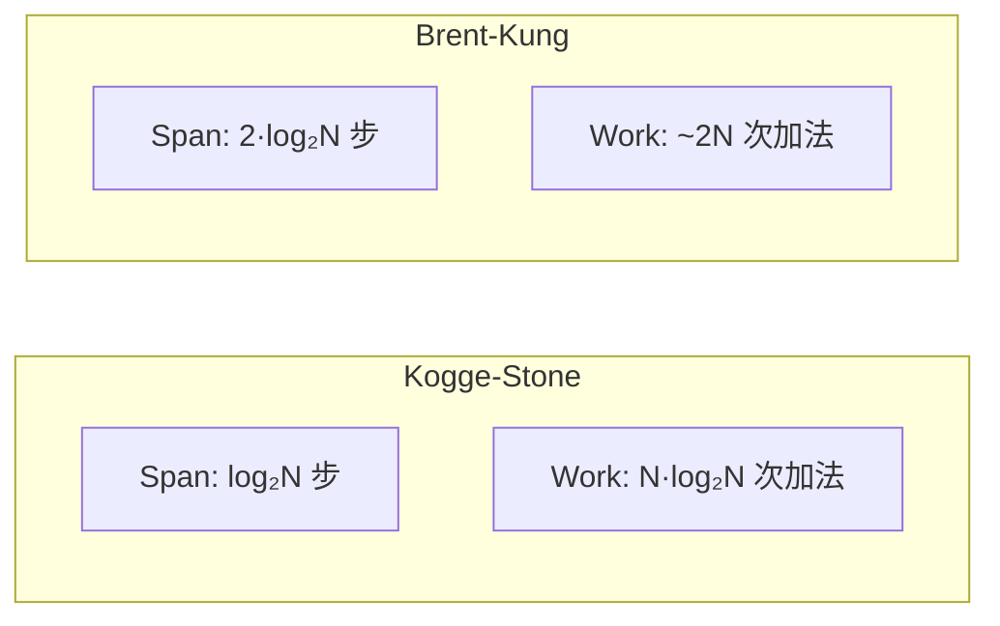
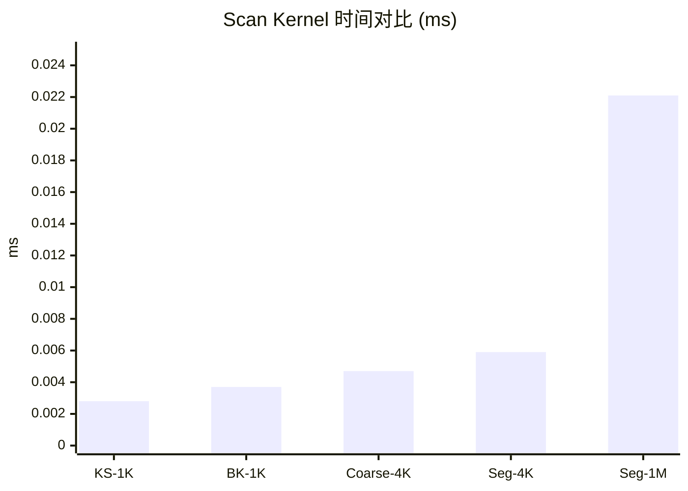

> 📖 **前置阅读**：01_Basics（Shared Memory）、02_Reduction（归约树）  
> 📖 **推荐后续**：06_Warp_Primitives（Warp 级前缀和）

## Scan 比 Reduce 难在哪

Reduce 是把 $N$ 个数变成 1 个数，Scan 是把 $N$ 个数变成 $N$ 个数——第 $i$ 个输出等于前 $i$ 个输入的累加和：

$$\text{output}[i] = \sum_{k=0}^{i} \text{input}[k]$$

看着只是 Reduce 的推广，但有个关键区别：Reduce 只关心最终结果，中间过程可以随意重排；Scan 需要保留每一步的中间结果，而且顺序不能错。这让并行化变复杂了不少。

CPU 上写前缀和只要一个 `for` 循环，$O(N)$ 时间，$O(N)$ 工作量。并行算法面临一个经典的 work vs span 权衡：Kogge-Stone 做更多的工作换更少的步数（低 latency），Brent-Kung 做更少的工作但需要更多步数（高 throughput）。在 GPU 上，哪个更好取决于你 Block 里有多少线程、数据有多大。

---

## 两种经典并行 Scan 算法

### Kogge-Stone：步数少，工作多

原理很直观：每一轮 stride 翻倍，每个线程看自己左边 stride 距离的邻居，加上来。

```
input:     [1, 2, 3, 4, 5, 6, 7, 8]

stride=1:  [1, 3, 5, 7, 9, 11, 13, 15]    每个加左邻1
stride=2:  [1, 3, 6, 10, 14, 18, 22, 26]   每个加左邻2
stride=4:  [1, 3, 6, 10, 15, 21, 28, 36]   每个加左邻4
```

$$\text{span} = O(\log N) \quad \text{work} = O(N \log N)$$

$N = 1024$ 时只需 10 步。但每步有 $O(N)$ 个线程在干活，总工作量是 CPU 串行版的 $\log N \approx 10$ 倍。

### Brent-Kung：两阶段，工作少

分两个阶段。第一阶段（Up-sweep）跟 Reduce 的树形归约一模一样：两两加，四四加，八八加……得到的是一棵"部分和树"。第二阶段（Down-sweep）反过来把部分和往下分发，填充剩余位置。

$$\text{span} = O(2\log N) \quad \text{work} = O(N)$$

工作量等于 CPU 串行版，步数是 Kogge-Stone 的 2 倍。

### 核心代码

Kogge-Stone 的关键是每轮需要**两道** `__syncthreads()`：

```cpp
for (int stride = 1; stride < blockDim.x; stride *= 2) {
    __syncthreads();
    float val = 0.0f;
    if (tid >= stride)
        val = shared_data[tid] + shared_data[tid - stride]; // 读旧值
    __syncthreads();

    if (tid >= stride)
        shared_data[tid] = val; // 写新值
}
```

为什么需要两道？因为线程 $i$ 要读 `shared_data[i - stride]` 的**旧值**，同时线程 $i - stride$ 要写入它的**新值**。如果只用一道同步，快线程写入的新值会被慢线程当旧值读走——经典的 Read-After-Write 冲突。用 `val` 做临时变量配合两道 barrier，确保读写分离。

Brent-Kung 每步只有少数几个线程在工作，但每步都需要一道 `__syncthreads()`：

```cpp
// Up-sweep (reduce phase)
for (int stride = 1; stride < blockDim.x; stride *= 2) {
    int index = (tid + 1) * stride * 2 - 1;
    if (index < blockDim.x)
        shared_data[index] += shared_data[index - stride];
    __syncthreads();
}
// Down-sweep (distribute phase)
for (int stride = blockDim.x / 4; stride > 0; stride /= 2) {
    int index = (tid + 1) * stride * 2 - 1;
    if (index + stride < blockDim.x)
        shared_data[index + stride] += shared_data[index];
    __syncthreads();
}
```

### Work vs Span 可视化



| 指标 | Kogge-Stone | Brent-Kung |
|:---|:---|:---|
| 步数 (span) | $\log_2 N$ | $2 \log_2 N$ |
| 总工作量 (work) | $N \log_2 N$ | $\sim 2N$ |
| 每步活跃线程 | 多（大部分线程都在算） | 少（只有对齐到特定 stride 的线程算） |
| `__syncthreads()` | **每步 2 道** | 每步 1 道 |

---

## 跨 Block 扫描：三遍策略

单 Block 的 Scan 最多处理 BLOCK_SIZE 个元素（这里是 1024）。超过这个规模就需要多 Block 协作。

三遍扫描策略（`segmented_scan.cu` 实现）：

1. **第一遍**：每个 Block 独立做局部 Scan，输出局部前缀和数组，同时把每个 Block 最后一个元素存到辅助数组
2. **第二遍**：对辅助数组做 Scan（如果辅助数组本身也很大，递归执行）
3. **第三遍**：把辅助数组的 Scan 结果加回到每个 Block 的局部结果上

这个策略的精妙之处在于它是递归的——无论数据多大，都可以拆分、解决、合并。

不过这也意味着要启动 3 次 Kernel。对于小规模数据，Kernel Launch 的固定开销（每次 ~5-10 µs）可能占总耗时的很大比例。

---

## 实测数据

测试环境：2× RTX 4090 (sm_89)，nvcc -O3，C++17。

### 单 Block Scan（$N = 1024$，100 次平均）

| 算法 | Kernel 时间 | vs KS |
|:---|:---|:---|
| Kogge-Stone | 0.0028 ms | 1× |
| Brent-Kung | 0.0037 ms | 0.76× (慢 24%) |

Kogge-Stone 比 Brent-Kung 快 24%，尽管它的理论工作量更大。原因：

- $N = 1024$ 时 Kogge-Stone 只要 10 步，Brent-Kung 要 20 步。GPU 上额外的 `__syncthreads()` 是有代价的——每道 barrier 会让整个 Warp scheduler stall 几个 cycle 等所有 Warp 到齐。10 步多出 10 道额外 barrier，但反过来 Kogge-Stone 自己也有每步 2 道 barrier。
- Brent-Kung 的 up-sweep 和 down-sweep 阶段中后期活跃线程极少，SM 的 Warp 利用率低。Kogge-Stone 每步几乎全量线程参与，利用率高。
- 1024 个 float 只有 4 KB，Shared Memory 来回读写的开销本身就不大，Brent-Kung 省的那点工作量不足以补偿 2× 步数的同步开销。

### 多 Block Segmented Scan

#### 小规模（$N = 4{,}096$，100 次平均）

| 版本 | Kernel 时间 | vs Coarse |
|:---|:---|:---|
| Coarse Scan | 0.0047 ms | 1× |
| Segmented Scan | 0.0059 ms | 0.81× |

Segmented 慢了 19%——4096 个元素才 4 个 Block，三遍 Kernel Launch 的固定开销占了大头。

#### 大规模（$N = 1{,}048{,}576$，1M 元素，100 次平均）

| 指标 | 值 |
|:---|:---|
| Kernel 时间 | 0.0221 ms |
| 有效带宽 | 378.77 GB/s |
| vs CPU (1.79 ms) | 80.69× |

378 GB/s = 理论峰值的 37.6%。这个利用率看着不高，有几个原因：

1. Scan 比 Reduce 多一个完整输出的写回操作，访存量是读 + 写 = $2N \times 4B$
2. 三遍策略有两次额外的 Kernel Launch 开销
3. Block 之间通过 Global Memory 传递辅助数组，不像单 Block 那样全在 SRAM 里

数据量从 4K 到 1M 增长了 256 倍，Kernel 时间只增长了 3.78 倍——并行的威力在规模扩大时才真正显现。



---

## 小结

**Kogge-Stone 在小规模上赢 Brent-Kung。** 理论上 BK 的工作量更优，但在 GPU 上，同步开销和线程利用率比纯工作量更关键。$N \le$ BLOCK_SIZE 时，KS 的低 span（少步数）比 BK 的低 work（少加法）更值钱。

**`__syncthreads()` 不是免费的。** Kogge-Stone 每步需要两道 barrier 来保证读写分离，Brent-Kung 每步一道。在极小规模下，barrier 的固定开销本身就是耗时的主角。这也是为什么在极端场景下，Warp-level Scan（`__shfl_up_sync`）可以完全消除 barrier——06_Warp_Primitives 会讲。

**三遍策略能处理任意规模，但 Launch 开销是代价。** 对于延迟敏感的场景，应该考虑用 Persistent Kernel 或者 Cooperative Groups 的 `grid_sync` 来减少 Kernel Launch 次数。CUB 库的 `DeviceScan` 就是这么做的（12_Standard_Libraries）。
