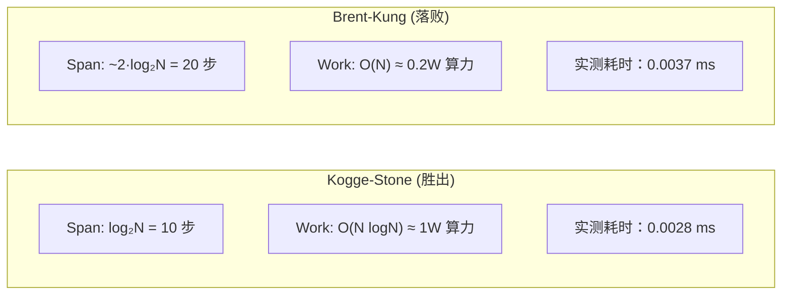
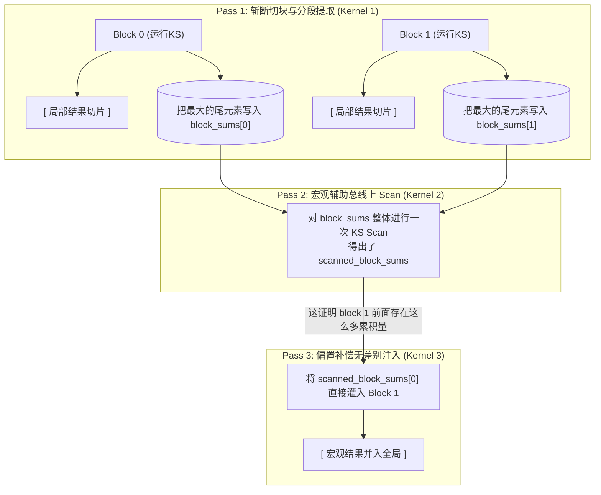
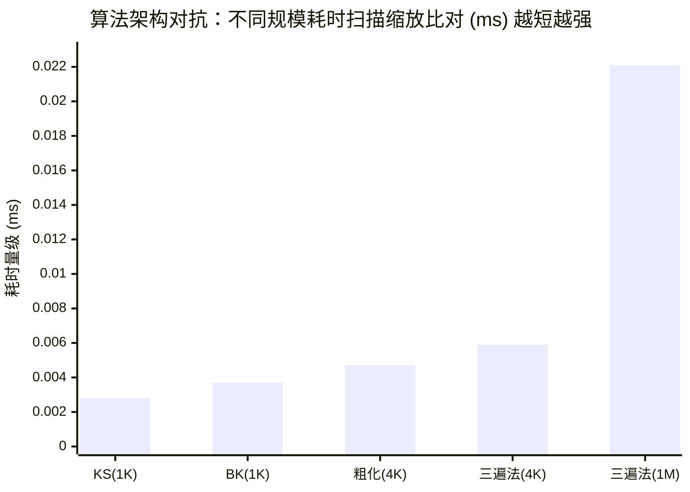

> 📖 **前置阅读**：[01_Basics](01_Basics_Concepts_and_Tiling.md)（Shared Memory 与 Tiling）、[02_Reduction](02_Reduction_Tree_Algo_and_Coarsening.md)（树形归约与线程粗化）
> 📖 **推荐后续**：06_Warp_Primitives（寄存器级前缀和，彻底消灭 Barrier）

如果是求和（Reduce），把 $N$ 个数字糅成 1 个结果，大家各算各的，中间怎么加都行。但前缀和（Scan）要求输出同样大小的 $N$ 个元素，且第 $i$ 个输出必须严格等于前 $i$ 个输入之和。这种强烈的 "$i$ 依赖于 $i-1$" 的链式依赖，是 GPU 并行化最大的痛点之一。

前缀和之所以重要，是因为它是几乎所有需要"动态分配输出位置"的并行算法的地基——比如流压缩（Stream Compaction，把符合条件的元素紧密排列）、基数排序（Radix Sort），甚至动态内存分配。可以说，没有高效的 Scan，GPU 就永远只能做死板的密集矩阵乘加。

## 理论地基：Inclusive, Exclusive 与算法的两个标尺

在正式讨论之前，我们需要理清 Scan 的两种基本形态和评价并行算法的两个核心指标。

### 包含与排他

1. **Inclusive Scan（包含自身的扫描）**：
   $$y_i = \sum_{j=0}^{i} x_j$$
   输出序列的第一项等于输入序列的第一项（$y_0 = x_0$）。
2. **Exclusive Scan（排他性扫描）**：
   $$y_i = \sum_{j=0}^{i-1} x_j, \quad y_0 = 0$$
   这在"内存池指针偏移量分配"时极为常用：第 $i$ 个线程所需分配的起始地址，正好等于前面所有线程所需内存大小的总和。

> 💡 **工程技巧**：Inclusive Scan 的结果向右平移一位，最左边补 0，就变成了 Exclusive Scan。实际开发中，很多算子库底层只实现 Inclusive，然后再用一个轻量级 Kernel 完成一次数组平移。本项目中的 `prefix_sum.cu` 也就是从 Inclusive 实现切入。

### 并行算法设计的两杆秤

串行代码算前缀和是个简单的 `y[i] = y[i-1] + x[i]` 的 `for` 循环。一旦搬到 GPU 的多核阵列上，我们必须在以下两者间持续博弈：

- **Work（总工作量）**：执行的操作总数。这决定了算法在理论上的能量消耗与访存代价。
- **Span（并行跨度/深度）**：在拥有无限处理器的理想机器上，完成任务所需的最少步数。它决定了程序的理论最高速度和延迟。

在这两杆秤的衡量下，诞生了两条截然不同的核心路线：Kogge-Stone（追求极其生猛的低 Span）和 Brent-Kung（追求理论完美的低 Work）。

---

## 路线一：Kogge-Stone（力大砖飞，SIMT 最爱）

Kogge-Stone (KS) 的直觉是让所有的线程都尽量参与，不计成本地降低 Span。每一轮（Step $d$），每个线程寻找距离自己 $2^{d-1}$ 处的历史结果并累加：

$$y^{(d)}_i = y^{(d-1)}_i + y^{(d-1)}_{i - 2^{d-1}}, \quad i \ge 2^{d-1}$$

### 数据流演进的可视化

我们假设数组只有 8 个元素，看看 Kogge-Stone 在硬件里是怎么干活的：

```text
原始输入:   [ 1,  2,  3,  4,  5,  6,  7,  8 ]

stride=1:  [ 1,  3,  5,  7,  9, 11, 13, 15 ]   (每个元素加上左邻 1 步的旧值)
stride=2:  [ 1,  3,  6, 10, 14, 18, 22, 26 ]   (每个元素加上左邻 2 步的旧值)
stride=4:  [ 1,  3,  6, 10, 15, 21, 28, 36 ]   (每个元素加上左邻 4 步的旧值)
```

大家看，仅仅花了 3 步运算（$\log_2 8 = 3$），我们就拿到了所有的最终结果。如果 $N=1024$，也只需要区区 10 步。

### KS 的代价：Work 爆炸与双重同步税

但是，数一数上面的加法次数。每一轮除了最左边几个出界的元素，几乎所有的元素都在做加法。

- **Span（步数）**：$\log_2 N$。
- **Work（操作数）**：$O(N \log N)$。这个理论工作量是纯串行版的 $\log N$ 倍之多。

不仅如此，看看它的核心代码实现（来自 `prefix_sum.cu`）：

```cpp
for (int stride = 1; stride < blockDim.x; stride *= 2) {
    __syncthreads();           // 【同步 1】确保上一轮所有人的写入都已落盘
    float val = 0.0f;
    if (tid >= stride)
        val = shared_data[tid] + shared_data[tid - stride]; // 读两个旧值入寄存器
    __syncthreads();           // 【同步 2】确保所有人都读完了
    
    if (tid >= stride)
        shared_data[tid] = val; // 大胆写回新值
}
```

代码中那个 `val` 变量和**每轮两道 `__syncthreads()`** 极其关键。
因为所有线程在同一个 Shared Memory 数组上既读又写。如果全速冲刺，只放一个同步屏障，然后立刻覆盖 `shared_data[tid]`，跑得快的线程必定会把原本需要借给慢线程做加法的"老数据"无情抹掉（这就是经典的 Read-after-Write Hazard，数据竞态）。
所以我们必须通过寄存器 `val` 暂存计算结果，配合两道强制同步屏障，将"读操作集"与"写操作集"在时间物理线上严格隔离。

对于 1024 个元素的单 Block 计算，KS 会引发 10240 次加法和 **20 次全 Block 全局挂起同步**。

---

## 路线二：Brent-Kung（理论优雅，现实无情）

Brent-Kung (BK) 认为 KS 的 $O(N \log N)$ 冗余计算在算法学上是低劣的。它通过两阶段树形遍历结构，把理论 Work 彻底抽脂，退化回了完美的 $O(N)$。

### 单看算法结构堪称艺术品

1. **Up-sweep（建树归约阶段）**：跟 02_Reduction 的树形归约完全一样，逐步两两加、四四加、八八加。这在数组内部建立起了一棵隐式二叉树，留下了若干关键路径的"部分和"。
2. **Down-sweep（分发扫尾阶段）**：从最上层树根反向遍历，把部分和逐层往下散发，填充那些错过的缝隙位置。

我们来看这充满计算几何美感的索引推导控制（来自 `prefix_sum.cu`）：

```cpp
// 阶段一：Up-sweep (reduce phase)
for (int stride = 1; stride < blockDim.x; stride *= 2) {
    int index = (tid + 1) * stride * 2 - 1; // 精确制导的二叉树局部根节点
    if (index < blockDim.x)
        shared_data[index] += shared_data[index - stride];
    __syncthreads(); // 妙处：每次只有一个节点写，彼此绝不重叠，只需一道屏障！
}

// 阶段二：Down-sweep (distribute phase)
for (int stride = blockDim.x / 4; stride > 0; stride /= 2) {
    int index = (tid + 1) * stride * 2 - 1;
    if (index + stride < blockDim.x)
        shared_data[index + stride] += shared_data[index];
    __syncthreads();
}
```

### BK 遭遇 GPU：水土不服的命门

理论看似很完美，总计的加法减少到了区区两千余次（约等于 $2N$）。但它遭遇了 GPU SIMT（单指令多数据流）硬件特性带来的双重命门：

- **致命的 Span 翻倍**：建树需要 $\log_2 N$ 步，分发又需要 $\log_2 N - 1$ 步。这对屏障同步来说绝对是个坏消息。虽然它每步只要 1 个 `__syncthreads()`，但算下来总共仍有 20 次，并没有比 KS 节省分毫。
- **极不均衡的 Warp Divergence（线程发散）**：在 Up-sweep 后期和 Down-sweep 前期，代码强行模拟了树状结构，这意味着什么？绝大多数线程会撞上 `if` 条件而闲置！因为 `index` 跳跃度极大，32 个同生共死的线程组成的 Warp 里，可能只有 1 个人在吭哧吭哧算，剩下 31 个人双手插兜强制干等。

---

## 算法世纪对决：单 Block 性能实测（$N=1024$）

我们把两种算法放进 RTX 4090 的演武场里（数据 100% 取自 `Results/03_Scan.md` 日志）：



| 算法 | 理论工作量 (Work) | 步数 (Span) / 同步税 | Kernel 耗时 | 相对基准 |
| :--- | :---: | :---: | :---: | :---: |
| **Kogge-Stone** | $\sim 10240$ 次加法 | 10 步，20 次屏障 | **0.0028 ms** | 1.00x |
| **Brent-Kung**  | $\sim 2048$ 次加法 | $\sim 20$ 步，20 次屏障 | 0.0037 ms | 0.76x (慢了 24%) |

**做的工作缩水了 5 倍，反而跑得比谁都慢？**
这正是硬件底层的教诲：在极少数据量下，依靠超低延迟的 SRAM（Shared Memory）通信，省下来的 8000 余次 ALU 加法只有几十个微秒的收益。但为了这几十个微秒，你交出了大量宝贵的 Warp 并发度，制造了无数的空转分支等待。
CUDA 就是一台巨型推土机，它根本不在乎你油耗高不高（Work 大），它只在乎你推得平不平整。KS 赢就赢在所有的线程整齐划一、永不疲倦地齐头狂奔。

---

## 跨越 Block 的边界：如何扫描百万个数据？

以上的对决，全都委身于数据量小于 1024 的温床。如果传入 100 万个元素该怎么办？我们在不同 Block 之间并不能随意调用 `__syncthreads()`。

解决任意规模横向扩展性（Scalability）的标准打法是分治（Divide and Conquer），在 `segmented_scan.cu` 中实现了经典解法。

### 巧妙的过渡手段：线程粗化 (Thread Coarsening)

如果是 $N=4096$，为了这点数据量直接切碎成多个 Block 有点大动干戈。我们在 `coarse_scan` 选用了之前提及的技术：让 1024 线程处理阵列通过 `COARSE_FACTOR=4`，一举吃满 4096。
核心做法是：每个线程一口气读 4 个元素塞进私有寄存器里，老老实实地串行跑一遍局部 Scan。得到局部最大的末尾元素后，再将这些末尾元素一起放进 Shared Memory，统一交给无敌的 KS Scan 跑一次，拿到偏移量，最后再分散退回各自的寄存器里进行加装。
这把最繁重的内存交互全挡在了几乎 0 延迟的寄存器里，避免了高昂的启动税。

### 真正的工业级架构：三遍扫描法 (3-Pass Scan)

当数据量逼近百万，必须拆分成三个各自独立排队执行的 Kernel：



这个架构的宏伟之处在于其天生的**可递归性**：如果 `block_sums` 依然超过了 1024 的安全线，不用怕，再对这个辅助数组本身复用一次这套三遍法流程即可。它生来就做好了无限拔高的准备。

---

### 端到端扩展性实测（RTX 4090 分析）

**小规模局部战（4096 元素）：**

| 算法架构 | Kernel 执行时间 | 硬件特征侧写 |
| :--- | :---: | :--- |
| **Coarse Scan (粗化)** | **0.0047 ms** | 极简干脆的单次 Kernel Launch，依靠寄存器缓冲将局势牢牢控制在一个 Block 体系内。 |
| Segmented (三遍法) | 0.0059 ms | 三次 Kernel Launch 以及数据三次进出显存。这种恒定的启动基础税压垮了它。 |

**大规模兵团战（1M，1,048,576 元素）：**

当数据漫出天际，只有 Segmented Scan 能够扛鼎。

| 指标 | 实测数值 | 效能对比量化 |
| :--- | :---: | :---: |
| 纯 CPU 参考时长 | 1.79 ms | 1.00x |
| **GPU Segmented Scan** | **0.0221 ms** | **狂飙 80.69x 加速** |
| GPU 访存端侧有效带宽 | 378.77 GB/s | 约占旗舰卡 4090 极值带宽的 1/3 |

我们仔细盘算这笔账：问题规模从 4,096 暴涨到 1,048,576，所处理元素的绝对数量整整膨胀了 **256 倍**。
但是，我们的 GPU Kernel 处理时间仅仅从 0.0059 ms 微涨到了 0.0221 ms，只增长了完全不成比例的 **3.78 倍**！
只要你能写出逻辑自洽的代码，成百上千个空闲 SM 流处理器就会被瞬间填满，展示出吞噬数据洪流的恐怖实力。规模越大，其并行的摊薄红利越不可胜收。



你或许会问，378.77 GB/s 的带宽为何迟迟不能触达硬件的极值理论线？这是由于横跨全局强依赖造成的阻碍：三遍扫描强制程序将底层中间流状态写入到缓慢的 Global Memory（HBM），并在下一遍中再度捞出，如此反复折腾。在面对诸如前缀和这种拥有跨域数据一致要求的问题上，我们只能乖乖交出这笔不菲的通讯路费。

---

## 工程经验法则落脚点

算法逻辑和 GPU 物理定律有时往往背道而驰。结合以上所有分析，这是实战中的落脚点：

1. **如果在单 Block 本地范围内（$N \le 1024$）**：闭着眼睛锁死 **Kogge-Stone**。不要迷恋纯数学推演上的加法操作优势，在这个级别的计算单元上，排面整齐划一、少有分支指令，才是决定命运的第一生产力。
2. **如果在较轻度的中层溢出规模（$N \le 4096 \sim 8192$）**：务必选定 **Thread Coarsening + KS**。用线程自身持有的、拥有近乎零延迟的寄存器，去拼凑缓冲这部分工作量，绝对不要花时间去排队等待下一次的 Kernel 唤醒。
3. **如果是面对大吞吐与深远长序列（百万级及以上）**：坦然启用 **三遍扫描法（Segmented Multi-pass Scan）**。认命交出数据流转与 Global Memory 的迟缓延迟税款，这才能换得对无垠体量数据的扩展驾驭能力。

> 💡 **未来工业界探寻**：这套化整为零的 3 篇扫描思维是搭建并行项目的必经根基。但 CUB 与 Thrust 等当世顶尖工业库中，作者通过一种叫作 "Decoupled Look-back（单遍流式状态解耦回溯）"的高超原子控制技术，把三遍强行压缩至 1 遍。如果你悟透了上面三遍法则由于跨域强制写回造成的通讯税痛楚，那日后深入理解解耦设计时，你必将拍案叫绝。
