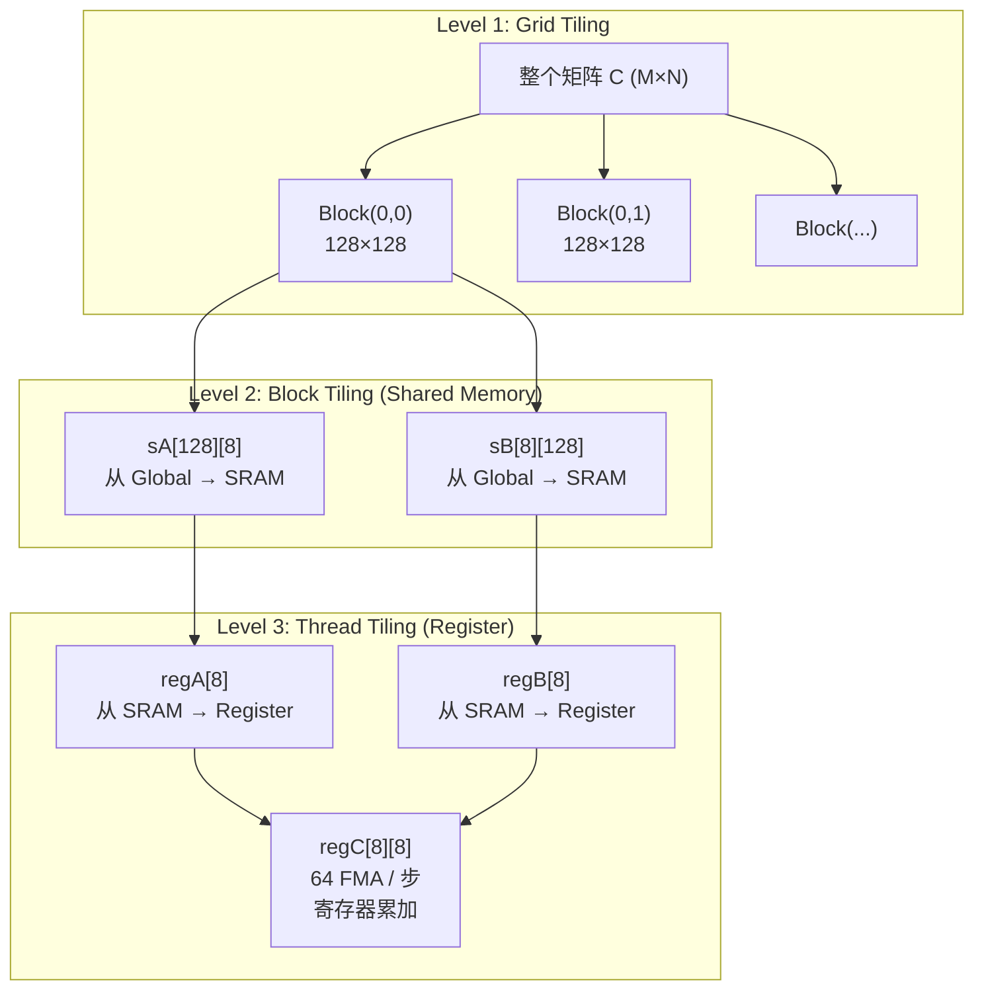
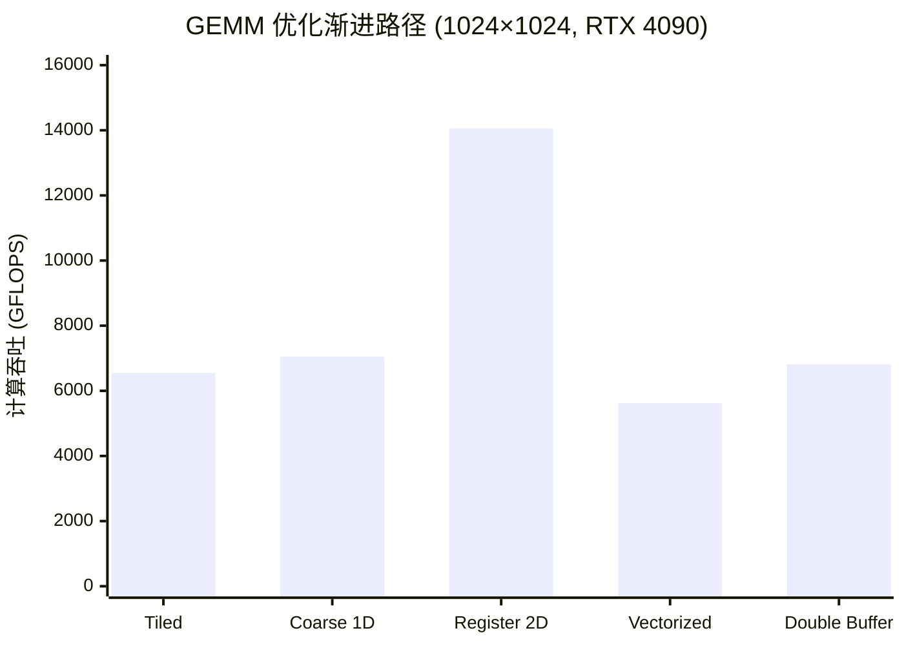

## 楔子：直击痛点

在 `01_Basics` 中，我们用 Tiled GEMM 将 Global Memory 的冗余访存压缩了 $T$ 倍，但最终只达到了理论 FP32 峰值的 **8.35%**。原因很明确：虽然数据从 HBM 搬到了 Shared Memory，但内层每次 FMA 仍然需要 2 次 SRAM 读取——Shared Memory 本身成了新的瓶颈。

真正的高性能 GEMM 需要更激进的策略：**让每个线程一次性从 Shared Memory 取出一批数据，锁定在寄存器中，然后在寄存器堆上发动一轮密集的外积运算（Outer Product）**——这就是 **Register Tiling**。

本章将展示如何通过三层 Tiling 层级（Grid → Block → Thread），将手写 GEMM 的性能从 6.9 TFLOPS 推进到 **28.79 TFLOPS**，达到 cuBLAS 的 **50.1%**。这不是终点，但已经足够深刻地揭示了 GEMM 优化的核心机理。

---

## 第一性原理与数学重构

### 算术强度（Arithmetic Intensity）决定一切

GEMM 的浮点运算量为 $2MNK$（每个 $C_{i,j}$ 需要 $K$ 次乘加 = $2K$ FLOP）。对于 $N = 2048$ 的方阵，FLOPs = $2 \times 2048^3 \approx 17.2 \times 10^9$。

搬运数据量取决于优化层级。以 Tiled GEMM（01_Basics 的方案）为例，每个线程计算 $C$ 的 1 个元素，内层循环从 SRAM 读取 2 个 float：

$$AI_{\text{Tiled}} = \frac{2 \text{ FLOP}}{2 \times 4 \text{ Byte}} = 0.25 \text{ FLOP/Byte (SRAM)}$$

RTX 4090 的 Roofline 拐点（FP32 CUDA Core）约为 $82600 / 1008 \approx 82$ FLOP/Byte（对 DRAM），但对 Shared Memory 带宽（~19 TB/s 全片推算）拐点约 $82600 / 19000 \approx 4.3$ FLOP/Byte。我们的 0.25 远低于这两个拐点——这意味着即使数据已经在 SRAM 上，指令流水线仍然在等数据。

### Register Tiling 的数学变换

Register Tiling 的核心：让每个线程不再只算 $C$ 的 1 个元素，而是计算一个 $TM \times TN$ 的子块（例如 $8 \times 8 = 64$ 个元素）。

在内层循环的每一步（`dotIdx` 从 0 到 BK-1），每个线程：

1. 从 SRAM 取出 $A$ 的 $TM$ 个元素 → 存入 `regA[TM]`
2. 从 SRAM 取出 $B$ 的 $TN$ 个元素 → 存入 `regB[TN]`
3. 执行 $TM \times TN$ 次 FMA → 累加到 `regC[TM][TN]`

$$AI_{\text{RegTile}} = \frac{TM \times TN \times 2}{(TM + TN) \times 4} = \frac{8 \times 8 \times 2}{(8 + 8) \times 4} = \frac{128}{64} = 2.0 \text{ FLOP/Byte (SRAM)}$$

对比 Tiled GEMM 的 0.25 FLOP/Byte，Register Tiling 的 SRAM 算术强度提升了 **8 倍**——因为每次从 SRAM 加载 $(TM + TN)$ 个 float，却能在寄存器堆上爆发 $TM \times TN$ 次 FMA。这正是**外积（Outer Product）** 的数学魔力。

---

## 核心优化演进与硬件映射

### 三级 Tiling 层级



### 配置参数与资源占用

| 参数 | 值 | 硬件含义 |
|:-----|:---|:---------|
| **BM × BN** | 128 × 128 | 每个 Block 负责 C 的一个 128×128 子块 |
| **BK** | 8 | K 维度每次搬运的宽度（8 个 float = 32 Byte） |
| **TM × TN** | 8 × 8 | 每个线程负责 64 个 C 元素 |
| **线程数/Block** | $(128/8) \times (128/8) = 256$ | 16×16 的线程网格 |
| **SRAM 占用** | $128 \times 8 + 8 \times 128 = 2048$ float = 8 KB | 远低于 48 KB 上限 |
| **寄存器/线程** | $8 \times 8 + 8 + 8 = 80$ 个 float = 320 Byte | 约 80 个 32-bit 寄存器（4090 上限 255） |

### 协作搬运机制

256 个线程需要协作将 $128 \times 8 = 1024$ 个 float 从 Global Memory 搬到 `sA`。每个线程负责搬运 $1024 / 256 = 4$ 个元素。搬运 `sB` 同理。

搬运索引的计算：

- `strideA = 256 / 8 = 32`：每次迭代搬运 32 行
- `innerRowA = threadId / BK`、`innerColA = threadId % BK`：将线性线程 ID 映射到二维搬运坐标

这种协作搬运确保了对 Global Memory 的合并访存——同一 Warp 的连续线程访问连续地址。

---

## 源码手术刀：关键代码深度赏析

### 核心内层循环：外积累加

```cpp
// === 阶段 3: 从 Shared Memory 加载到寄存器并计算 ===
for (int dotIdx = 0; dotIdx < BK; ++dotIdx) {
    // 加载 A 的一列到寄存器
    for (int i = 0; i < TM; ++i)
        regA[i] = sA[threadRow * TM + i][dotIdx];
    // 加载 B 的一行到寄存器
    for (int j = 0; j < TN; ++j)
        regB[j] = sB[dotIdx][threadCol * TN + j];
    // 外积累加: TM × TN 次 FMA
    for (int i = 0; i < TM; ++i)
        for (int j = 0; j < TN; ++j)
            regC[i][j] = fmaf(regA[i], regB[j], regC[i][j]);
}
```

**硬件行为解析：**

**SRAM → Register 加载**：`regA[i] = sA[threadRow * TM + i][dotIdx]` 执行 `LDS`（Load Shared）指令，延迟 ~20 cycle。但由于紧随其后有 64 次完全独立的 FMA 指令（不依赖 SRAM），Warp Scheduler 可以在等待 LDS 返回期间调度其他 Warp 的指令——这就是延迟隐藏（Latency Hiding）。

**外积 FMA**：`regC[i][j] = fmaf(regA[i], regB[j], regC[i][j])` 编译为单周期 `FFMA` 指令。三个操作数全部驻留在寄存器中——没有任何存储访问，纯粹的 ALU 运算。当 `TM = TN = 8` 时，每次 `dotIdx` 迭代产生 64 次 FFMA，而只需要 $8 + 8 = 16$ 次 LDS 读取。

**Bank Conflict 隐患**（代码注释中已点明）：`sB[dotIdx][threadCol * TN + j]` 中，同一 Warp 内相邻线程的 `threadCol` 相差 1，访问 `sB` 的列偏移相差 $TN = 8$ 个 float = 32 Byte = 跨越 8 个 Bank。这可能导致 4-way Bank Conflict。工业界的标准解法是 `__shared__ float sB[BK][BN + 1]`——多加一列 Padding 打散 Bank 映射。

### Tiled → Register Tiled 的对比

| 维度 | Tiled GEMM (01_Basics) | Register Tiled (本章) |
|:-----|:----------------------|:--------------------|
| C 元素/线程 | 1 | 64 (8×8) |
| SRAM 读取/FMA | 2 | 16/64 = 0.25 |
| 算术强度 (SRAM) | 0.25 FLOP/Byte | 2.0 FLOP/Byte |
| 寄存器使用/线程 | 1 个累加器 | 80 个 float |
| 线程数/Block | 1024 | 256 |
| ALU 利用率 | 极低 | 大幅提升 |

---

## 理论与实际的对决：极限剖析

所有数据来自 `Results/04_GEMM_Optimization.md`。硬件：2× RTX 4090 (sm_89)。

### 渐进优化路径（1024 × 1024 矩阵）



| 版本 | Kernel 时间 (ms) | 吞吐 (GFLOPS) | vs Tiled 加速比 |
|:-----|:----------------|:-------------|:---------------|
| Tiled GEMM | 0.3273 | 6,553 | 1× |
| Coarse GEMM (1D) | 0.3047 | 7,046 | 1.07× |
| **Register Tiled (2D)** | **0.1528** | **14,055** | **2.14×** |
| Vectorized GEMM | 0.3821 | 5,622 | — |
| Double Buffer GEMM | 0.3149 | 6,820 | — |

Register Tiling 2D 相比 Tiled GEMM 提速 **2.14 倍**——直接证实了从 0.25 → 2.0 FLOP/Byte 的算术强度提升。

### 大规模 Benchmark（2048 × 2048 矩阵）

| 实现 | Kernel 时间 (ms) | 吞吐 (TFLOPS) | vs 理论峰值 |
|:-----|:----------------|:-------------|:-----------|
| **手写 Register Tiling** | **0.60** | **28.79** | **34.9%** |
| **cuBLAS SGEMM** | **0.30** | **57.49** | **69.6%** |

手写版达到 cuBLAS 的 **50.1%**。

### 差距溯源：28.79 vs 57.49 TFLOPS

手写 Register Tiling 仅达到理论 82.6 TFLOPS 的 34.9%——仍有巨大优化空间。核心原因：

1. **Bank Conflict 实锤**：如前文分析，`sB` 的访问存在 4-way Bank Conflict。如果 32 个线程同时访问 Shared Memory 的同一个 Bank，硬件会将请求序列化为 4 轮——SRAM 有效带宽直接降为 1/4。cuBLAS 内部通过 Swizzle Padding 和 128-bit 向量化加载完全消除了此问题。

2. **缺少 Double Buffering**：当前实现在加载下一轮 SRAM 数据之前，必须等待上一轮计算完成（两道 `__syncthreads()`）。工业级实现会使用双缓冲——在计算当前 Tile 的同时异步加载下一个 Tile，让搬运和计算重叠。`advanced_gemm.cu` 的 Double Buffer 版本展示了这种技术，但在 1024 规模下只带来 1.21× 提升，因为 SRAM 消耗翻倍（影响 Occupancy）。

3. **缺少向量化 Global Load**：cuBLAS 使用 `LDG.128`（128-bit 向量化加载）一次搬运 4 个 float，减少了 4 倍的地址计算开销和指令数量。手写版本逐个 float 搬运。

4. **Occupancy 不足**：80 个寄存器/线程 × 256 线程/Block = 20480 个寄存器/Block。RTX 4090 每个 SM 限制 65536 个寄存器，因此最多容纳 3 个 Block/SM → Occupancy 约 50%。cuBLAS 通过更精细的寄存器分配和指令调度，在维持高 ILP 的同时实现了更高的 Occupancy。

---

## 架构师视角的总结

**铁律一：外积（Outer Product）是 GEMM 优化的数学核心。**
Register Tiling 的威力来自于外积运算——$TM$ 个元素 × $TN$ 个元素 = $TM \times TN$ 次 FMA，而取数成本仅 $TM + TN$。当 $TM = TN = 8$ 时，取 16 个数爆发 64 次运算，数据复用率 4 倍。这是从访存密集走向计算密集的数学支点。

**铁律二：每一层缓存都有自己的 Roofline。**
不要以为解决了 HBM → SRAM 的搬运就万事大吉。SRAM 自身也有带宽上限，当算术强度低于 SRAM Roofline 拐点时，你的 Kernel 在 SRAM 层面依然是 Memory Bound。Register Tiling 的真正革命是将瓶颈从 SRAM 推进到了寄存器堆——在那里，数据复用是"免费"的。

**铁律三：50% cuBLAS 是手写 Kernel 的"及格线"，弥合差距需要汇编级优化。**
从 50% 到 90% cuBLAS 的路上，需要逐一消灭 Bank Conflict（Swizzle Padding）、实现 Double Buffering（SRAM 流水线）、引入向量化加载（float4/LDG.128）、以及最终使用 Tensor Core（`09_Tensor_Core`）。每一步都需要对微架构有极致的理解。cuBLAS 之所以强，不是因为它用了什么魔法算法——它和手写版本的数学是完全一样的——而是因为它在每一个硬件细节上都做到了极致。
