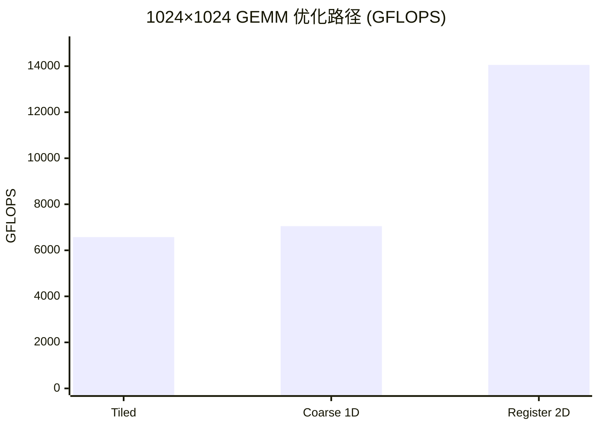

> 📖 **前置阅读**：01_Basics（Tiling 和算术强度）
> 📖 **推荐后续**：09_Tensor_Core（WMMA 硬件加速）、14_CUTLASS（模板元编程 GEMM）

01_Basics 里 Naive GEMM 跑出 0.5 TFLOPS——82.6 TFLOPS 峰值的 0.6%。Tiling 到 SMEM 后大幅改善。但还有一个问题：每个线程只算 $C$ 的一个元素，每次从 SMEM 读两个 `float` 做一次 FMA——SMEM 的读带宽成了新瓶颈。

Register Tiling 的思路：让每个线程算 $C$ 的 $T_M \times T_N$ 个元素（本项目用 $8 \times 8 = 64$），一行 A 和一列 B 在寄存器中被复用 8 次。SMEM 读取次数减少到 $1/T$ = 1/8。

---

## 外积结构

传统的"内积"视角：$C_{ij} = \sum_k A_{ik} \cdot B_{kj}$——每个 $C$ 元素需要一轮独立的乘加。

Register Tiling 换成"外积"视角：一个线程持有 A 的 $T_M = 8$ 个值和 B 的 $T_N = 8$ 个值（共 16 个寄存器），做一次外积就更新 $8 \times 8 = 64$ 个 $C$ 元素。

$$\text{寄存器中：} \quad \vec{a} \cdot \vec{b}^T = \begin{pmatrix} a_0 b_0 & a_0 b_1 & \cdots & a_0 b_7 \\ a_1 b_0 & \cdots & & a_1 b_7 \\ \vdots & & & \vdots \\ a_7 b_0 & \cdots & & a_7 b_7 \end{pmatrix}$$

每次 SMEM → 寄存器搬运 16 个 float，产出 64 次 FMA。算术强度 = $64 / 16 = 4$ FLOP/read——比内积的 $2/2 = 1$ 提高了 4 倍。

```cpp
// 外积核心循环
float a_reg[TM], b_reg[TN];
float c_reg[TM][TN] = {0};

for (int bk = 0; bk < K; bk += BK) {
    // 协作加载 A[BM×BK] 和 B[BK×BN] 到 SMEM
    load_tile_to_smem(A, B, smem_a, smem_b, bk);
    __syncthreads();
    
    for (int k = 0; k < BK; ++k) {
        // 从 SMEM 加载到寄存器
        for (int i = 0; i < TM; ++i)
            a_reg[i] = smem_a[thread_row * TM + i][k];
        for (int j = 0; j < TN; ++j)
            b_reg[j] = smem_b[k][thread_col * TN + j];
        
        // 8×8 外积
        for (int i = 0; i < TM; ++i)
            for (int j = 0; j < TN; ++j)
                c_reg[i][j] += a_reg[i] * b_reg[j];
    }
    __syncthreads();
}
```

---

## 配置参数

| 参数 | 值 | 含义 |
|:---|:---:|:---|
| $B_M, B_N$ | 128 | Block Tile 尺寸 |
| $B_K$ | 8 | K 步长 |
| $T_M, T_N$ | 8 | 每线程计算子块 |
| 线程数/Block | $(128/8) \times (128/8) = 256$ | — |
| 每线程 FMA/步 | $8 \times 8 = 64$ | — |
| SMEM 占用 | $2 \times 128 \times 8 \times 4 = 8$ KB | — |

---

## 优化阶梯

### 1024 × 1024（10 次平均）

| 版本 | Kernel (ms) | 加速比 | GFLOPS |
|:---|:---:|:---:|:---:|
| Tiled GEMM (32×32 Tile) | 0.327 | 1× | 6575 |
| Coarse GEMM (1D, F=4) | 0.305 | 1.07× | 7050 |
| **Register Tiled (2D, 8×8)** | **0.153** | **2.14×** | **14055** |



### 进阶优化（1024 × 1024，10 次平均）

| 版本 | Kernel (ms) | 加速比 |
|:---|:---:|:---:|
| Vectorized (float4 加载) | 0.382 | 1× |
| **Double Buffer** | **0.315** | **1.21×** |

Double Buffering 用两组 SMEM 交替——加载 $k+1$ 的 Tile 同时计算 $k$ 的 Tile——隐藏 SMEM 加载延迟。

### 大规模（2048 × 2048，20 次平均）

| 版本 | Kernel (ms) | 算力 (TFLOPS) | vs cuBLAS |
|:---|:---:|:---:|:---:|
| **Register Tiling** | **0.60** | **28.79** | 50.1% |
| cuBLAS `cublasSgemm` | 0.30 | 57.49 | 100% |

28.79 TFLOPS = 理论峰值的 34.8%。cuBLAS 的 57.49 TFLOPS = 69.6%。差距 2 倍——来自 cuBLAS 的 PTX/SASS 级调优：

| 差距来源 | 预估占比 |
|:---|:---:|
| SMEM 加载无 padding 导致 Bank Conflict | ~10% |
| 无 Double Buffering（手写版在 advanced_gemm 里补了） | ~15% |
| 指令调度非最优（寄存器 Bank Conflict、ILP 不足） | ~15% |
| 无 Epilogue 融合（写回 C 的 Store 是纯串行） | ~10% |

---

## Register Tiling 是 GEMM 优化的分水岭

Register Tiling 之前的优化靠**减少 HBM 访问**（Tiling → SMEM）。Register Tiling 之后的优化靠**减少 SMEM 访问**（寄存器复用 + 外积结构）。更进一步的优化靠**减少寄存器到 Tensor Core 的距离**（WMMA → CUTLASS → SASS 汇编）。

每一级优化都在做同一件事：让数据尽可能**靠近 ALU**，被**尽可能多次复用**。
