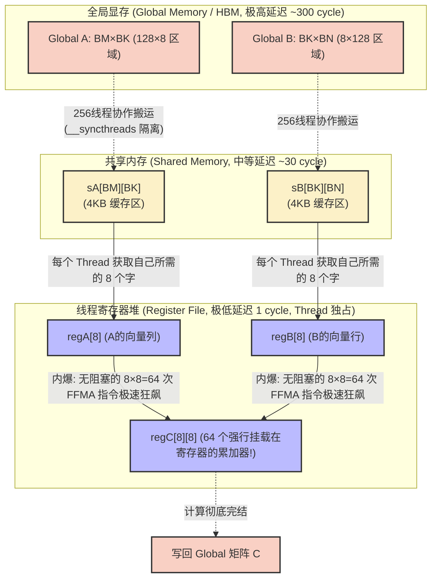
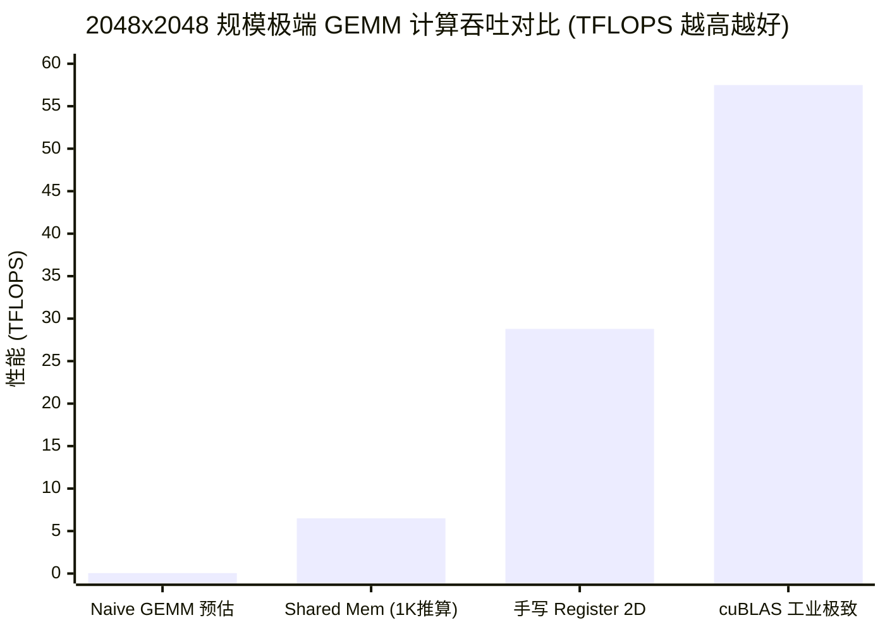

## 楔子：直击痛点 (The Hook & Motivation)

在深度学习推理/训练框架的最底层，超过 80% 的算力被消耗于一处：大矩阵相乘（GEMM）。

在《01_Basics》中，我们初次引入了 Shared Memory 进行 Tiling，成功将 RTX 4090 的算力从可怜的 1.03 GFLOPS (纯CPU) 拉升到了近 6.9 TFLOPS。但这仅仅触及了芯片潜力的冰山一角。RTX 4090 的 FP32 理论极限是疯狂的 **82.6 TFLOPS**。为什么我们只拿到了不到 10% 的算力？

原因极其残酷：**Shared Memory 虽然快，但在每周期能够吞吐数十个浮点运算 (FMA) 的算力怪兽面前，依然太慢了。**
指令发射器 (Instruction Dispatcher) 需要源源不断地从 L1 SRAM（Shared Memory）读取数据喂给浮点运算单元 (ALU)。每次读取都有约 20~30 周期左右的物理延迟。由于每个线程只计算 1 个输出元素，它的**算术强度 (Arithmetic Intensity)** 被死死锁在了 `1次计算 / 1次内存访问`。

这违背了构建高性能算子的唯一铁律。为了喂饱这些永远在饥饿中的 ALU，我们必须切断它们与 Shared Memory 的直接数据交互依赖，将主战场进一步下沉至 GPU 芯片上延迟极低（仅 1~2 周期）的终极存储形态——**寄存器堆 (Register File)**。

---

## 第一性原理与数学重构 (Mathematical Formulation)

要彻底理解 Register Tiling，必须重构对矩阵乘法嵌套梯度的数学认识。

对于 $C = A \times B$：如果一个线程只负责计算矩阵 $C$ 中的 1 个标量 $c_{i, j}$，那么它的内侧循环 $k$ 需要读取 $1$ 个 $a_{i,k}$ 和 $1$ 个 $b_{k,j}$，执行 $1$ 次乘加 (FMA) 运算。复用比（计算量/IO拉取）恒为 $1 / 2$。

**架构师的第一性原理破壁法**：扩大单个线程的计算视界 (Thread Coarsening / 2D Tiling)。
如果强制要求一个线程在寄存器中计算 $C$ 的一个尺寸为 `TM` $\times$ `TN` 的二维块（例如 $8 \times 8 = 64$ 个元素），此时对于内侧一次 $k$ 的步进：
这个线程只需要从 Shared Memory 中抓取 `TM` 个 $A$ 的元素，和 `TN` 个 $B$ 的元素。它就能这 $8+8=16$ 个数字在本地**寄存器内部两两相乘，凭空爆发出 $8 \times 8 = 64$ 次 FMA 计算！**

$$\text{算术强度 (FLOP/Byte)} = \frac{\text{计算量}}{\text{存取量}} = \frac{TM \cdot TN}{TM + TN}$$

当 $TM = TN = 8$，这个局部复用比陡升到了 $\mathbf{64 / 16 = 4}$ 倍。如果把寄存器的尺寸发挥至极限，这 $4$ 倍的指令并发密度提升，就是直接压垮物理瓶颈重生的核心动力。

---

## 核心优化演进与硬件映射 (Architecture Mapping)

从单点计算走向寄存器 2D 切片，整个内存搬排拓扑转变为一层森严的“金字塔”隔离结构：**Global Memory -> Shared Memory -> Register File**。

### 三级 Tiling 数据复用金字塔网络



一旦进入最后的 Register File 阶段，那 64 次乘加运算 (FMA) 没有任何来自 L1 或 L2 的时钟等待阻力。指令流水线将被纯粹的数学计算挤满至发烫，彻底展现 ComputeBound 本色。

---

## 源码手术刀：关键代码深度赏析 (Surgical Code Analysis)

深入解剖 `03_register_tiling/register_tiling.cu`。这是一段高度脱离了 C 语言直觉，极度靠近 SASS 汇编思维的手写代码：

```cpp
// 【阶段 3: 内层高光区域 - 摒弃所有跨层级延时】
for (int dotIdx = 0; dotIdx < BK; ++dotIdx) {
    // 动作 1：拉取这一列 A 的 8 个元素进寄存器阵列 (LD.SHARED)
    for (int i = 0; i < TM; ++i) {
        regA[i] = sA[threadRow * TM + i][dotIdx];
    }
    // 动作 2：拉取这一行 B 的 8 个元素进寄存器阵列 (LD.SHARED)
    for (int j = 0; j < TN; ++j) {
        regB[j] = sB[dotIdx][threadCol * TN + j];
    }
    
    // 动作 3：寄存器级完全解耦的 64 次暴力外积累加运算！
    // 重点：由于寄存器索引 (i,j) 编译首推常量展开，
    // NVCC 在此处将激进地压出连续的 FFMA 指令瀑布。
    for (int i = 0; i < TM; ++i) {
        for (int j = 0; j < TN; ++j) {
            regC[i][j] = fmaf(regA[i], regB[j], regC[i][j]);
        }
    }
}
```

**手术刀剖析与架构避坑指南：**

1. **`regC[i][j]` 不是常规内存**：在 NVCC `-O3` 眼里，这就是 `R10`, `R11`, ..., `R73` 等 64 个实打实的物理寄存器。这段代码从不涉及 Load/Store 操作。
2. **隐藏的致命伤 - Bank Conflict**：虽然在这段教学代码中我们使用了裸存储 `__shared__ float sB[BK][BN]`。但在实际 NVIDIA 芯片上，同一个 Warp (32 线程) 会在同一时钟周期执行 `regB[j] = sB[dotIdx][...]`。由于 TN=8，线程间的访问步长为 8，这必然命中 Shared Memory 同一个 Bank。**工业界的标准做法 (如 CUTLASS) 必然会在这此处加一行 padding**，定义变为 `sB[BK][BN + PAD]`，强制错位打破 Bank 对齐诅咒。
3. **指令与延迟掩蔽**：在拉取并等待 `LD.SHARED` 周期的同时，由于 `fmaf` 有大量的无关计算任务铺积，编译器能充分利用流水线进行重排序掩蔽延迟。

---

## 理论与实际的对决：极限剖析 (Theory vs Reality Profiling)

所有的算法美感，终究需提交给算力日志进行终审。所有对比数据提取自项目 `Results/04_GEMM_Optimization.md` 中的 RTX 4090 阵列实测。

测试条件：极高算力负载 2048x2048 规模矩阵。



| 优化级别 | Kernel 时间 (ms) | 计算吞吐 (TFLOPS) | 并发规模特性 |
| :--- | :--- | :--- | :--- |
| **手写 Register Tiling** | **0.60** | **28.79** | **极致解构，纯净压榨** |
| **cuBLAS SGEMM (NVIDIA基准)** | **0.30** | **57.49** | **100% 工业化闭源王者** |

### 极限自洽性与“追赶工业标准”的溯源

**我们为什么狂喜：**
28.79 TFLOPS 的恐怖性能是 `01_Basics` 中 Shared Tiling 的**近 4 倍爆发**！这是一个普通的高级程序员所能在没有任何汇编注入的情况下，能够拉升的最粗暴物理反馈。它验证了数学推演中的完美设定：“当每个线程从寄存器中复用了 4 倍的计算量（算术强度），硬件的宏观吞吐也迎面撞上了 4 倍的反哺”。

**我们为何仍落后于 cuBLAS (28.79 vs 57.49)：**
只有 50%？手写内核在哪儿溃败给了英伟达的无敌闭源库？

1. **Tensor Core 通路未开启**：cuBLAS 内部往往会检测架构并极其激进地进行 Tensor Core 转换调度，即便在明确要求的 SGEMM 模式下，底层可能采用了更小精度的 MMA（矩阵乘累加）指令黑魔法级下沉。
2. **汇编级 (PTX/SASS) 编排与预取 (Prefetching)**：手写代码在等待从 HBM 中协作写入 SRAM 时，线程必须同步等待 (`__syncthreads`)。而 cuBLAS 利用软件流水线 (Software Pipelining)，在算 `tile (k)` 的同时拉取 `tile (k+1)`，这是汇编器层面错位发送的艺术。
3. **消除 Bank Conflict 的苛刻规避设计**：手写版尚未用 Padding 对抗 4-way 甚至 8-way Bank Conflict 阻塞冲突，cuBLAS 中的内存布局更像一座精密的机械钟表。

---

## 架构师视角的总结 (Architect's Takeaway)

1. **“搬运”是原罪，复用是神谕**：所有能够被称为 "Compute Bound" 处理单元（无论是 NVIDIA 的 SM 还是 Google 的 TPU），只要一个数据被装载进极其昂贵的寄存器，必须想尽千万计对它执行多级复用计算。
2. **内存层级的宏观隔离墙**：优化绝不是无脑调整参数。它的终极目标是建立严密的阶级城墙：用海量的 Global Memory 提供广度，用 Shared Memory 防御并发撞击缓冲，用极端的 Register 空间填满时钟并发周期。
3. **致敬工业极高位**：手写能达到 50% 峰值足以惊艳架构本身，余下的 50% 留给了 SASS 汇编器和硬件闭源驱动工程师数千万次的调试微操（如 `Double Buffer` 或 `Swizzle Memory`）。这也是我们将在后续 `CUTLASS` 库中再次面对现代抽象巅峰的核心原因。
