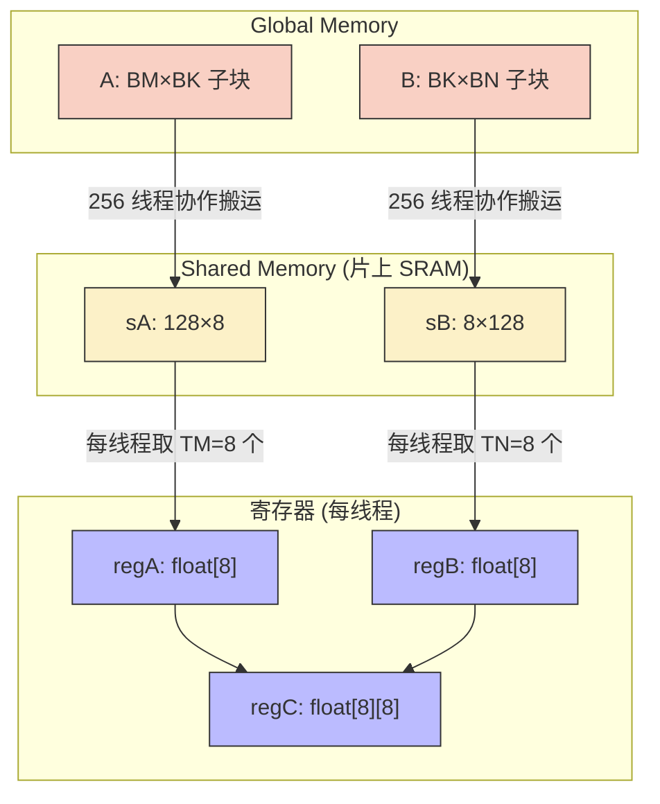
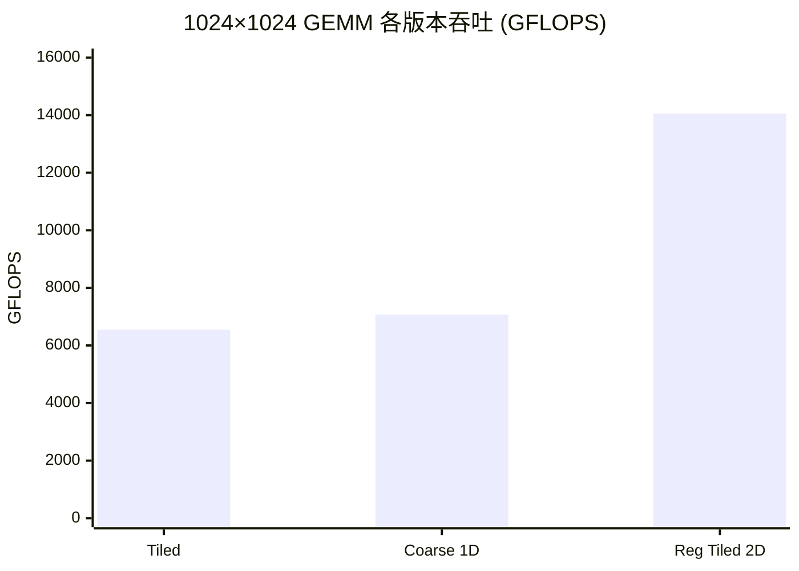

> 📖 **前置阅读**：01_Basics（Shared Memory Tiling 基础）  
> 📖 **推荐后续**：09_Tensor_Core（硬件级矩阵指令）、14_CUTLASS（工业级模板 GEMM）、10_Memory_Optimization（Bank Conflict 详解）

## 01_Basics 的 Tiled GEMM 卡在哪了

上一章用 Shared Memory Tiling 把 GEMM 从 Naive 的 5225 GFLOPS 提到了 6893 GFLOPS。听着不错，但 RTX 4090 的 FP32 峰值是 82,600 GFLOPS——我们才用了 8.35%。差了一个数量级。

瓶颈已经不在 Global Memory 了（Tiling 解决了那个问题）。瓶颈转移到了 Shared Memory 本身。

算一笔账：Tiled GEMM 内层循环中，每轮从 SRAM 读 2 个 float（8 字节），做 1 次 FMA（2 FLOP）。算术强度 = 2/8 = 0.25 FLOP/Byte。而 SRAM 的带宽虽然比 HBM 快很多，但也不是无限的。要真正逼近计算峰值，需要把算术强度再提高——怎么提？把数据从 SRAM 进一步搬到寄存器里，在寄存器里反复复用。

这就是 Register Tiling 的核心思路：每个线程不再只负责 C 的一个元素，而是负责一个 $TM \times TN$ 的小块——从 SRAM 取 $(TM + TN)$ 个数，在寄存器里做 $TM \times TN$ 次 FMA。

---

## Register Tiling 的数学

### 三级 Tiling 层级

| 层级 | 负责范围 | 对应硬件 | Tile 尺寸 |
|:---|:---|:---|:---|
| Grid → Block | C 的一个大块 | Thread Block | $BM \times BN$ (128×128) |
| Block → SRAM | K 维度切片 | Shared Memory | $BM \times BK + BK \times BN$ |
| Thread → Register | C 的一个小块 | 寄存器堆 | $TM \times TN$ (8×8) |

每个 Block 有 256 个线程（$(BM/TM) \times (BN/TN) = 16 \times 16$），每个线程在寄存器里持有 64 个 `float regC[8][8]` 的累加器。

### 关键的外积（Outer Product）结构

内层循环的计算模式不是点积，是外积：

```
对于 K 维度的每一步 dotIdx:
    取 regA[0..7] = sA 的一列 (TM 个)
    取 regB[0..7] = sB 的一行 (TN 个)
    regC[i][j] += regA[i] * regB[j]   // 8×8 = 64 次 FMA
```

从 SRAM 读了 $TM + TN = 16$ 个 float（64 字节），做了 $TM \times TN = 64$ 次 FMA（128 FLOP）。算术强度 = $128 / 64 = 2$ FLOP/Byte。比 01_Basics 的 0.25 FLOP/Byte 高了 **8 倍**。

这 8 倍就是 Register Tiling 性能飞跃的数学来源。

### 数据流



---

## 关键代码解析

### 外积累加的核心

```cpp
for (int dotIdx = 0; dotIdx < BK; ++dotIdx) {
    // SRAM → 寄存器
    for (int i = 0; i < TM; ++i)
        regA[i] = sA[threadRow * TM + i][dotIdx];
    for (int j = 0; j < TN; ++j)
        regB[j] = sB[dotIdx][threadCol * TN + j];

    // 寄存器内外积: 64 次 FMA，零访存
    for (int i = 0; i < TM; ++i)
        for (int j = 0; j < TN; ++j)
            regC[i][j] = fmaf(regA[i], regB[j], regC[i][j]);
}
```

内层双重循环会被编译器完全展开（`#pragma unroll` 或者 nvcc 自动展开），生成 64 条 `FFMA` 指令。这些 FMA 之间没有数据依赖（每条都写不同的 `regC[i][j]`），GPU 的指令调度器可以背靠背发射——理想情况下每 cycle 发射一条。

### Bank Conflict 的隐患

源码中有一段注释值得注意：

> 同一个 Warp 内的 16 个线程同时读 `sB` 的同一行、不同列。由于 `TN=8`，相邻线程的访问间隔是 8 个 float = 32 字节，恰好隔了 8 个 Bank。这会产生 4-way Bank Conflict。

标准修复方案是 `__shared__ float sB[BK][BN + 1]`，加一列 Padding 打散 Bank 对齐（具体原理在 10_Memory_Optimization 中展开）。这里为了代码可读性没有加 Padding，性能因此有一些损失。

---

## 实测数据

测试环境：2× RTX 4090 (sm_89)，nvcc -O3，C++17。

### 三版 GEMM 对比（$1024 \times 1024$，10 次平均）

| 版本 | Kernel 时间 | 吞吐 (GFLOPS) | vs Tiled |
|:---|:---|:---|:---|
| Tiled GEMM | 0.33 ms | 6,544 | 1× |
| Coarse 1D | 0.30 ms | 7,075 | 1.07× |
| Register Tiled 2D | 0.15 ms | 14,055 | **2.14×** |



Register Tiled 比朴素 Tiled 快了 2.14 倍。Coarse 1D（只在一个维度做粗化）的提升有限（1.07×），说明二维展开才能充分利用 Outer Product 的算术强度优势。

### Vectorized 和 Double Buffer（$1024 \times 1024$，10 次平均）

| 版本 | Kernel 时间 | 吞吐 (GFLOPS) | vs Tiled |
|:---|:---|:---|:---|
| Vectorized GEMM | 0.38 ms | 5,621 | 0.86× (慢了!) |
| Double Buffer GEMM | 0.31 ms | 6,820 | 1.04× |

这两个"更高级"的版本反而没比 Tiled 快多少，Vectorized 甚至更慢了。这里有个容易忽略的原因：

- **Vectorized** 用 `float4` 做读写，理论上减少了指令数。但如果 SRAM 布局不配合（地址没对齐到 16 字节），`float4` 的加载反而会拆成 4 次标量加载，白忙一场。
- **Double Buffer** 用两组 SRAM 交替加载和计算，理论上实现流水线重叠。但在 $1024 \times 1024$ 这个规模下，计算时间本身就很短（~0.3ms），流水线的启动和排空开销占比不小，净收益有限。

### Register Tiling vs cuBLAS（$2048 \times 2048$，20 次平均）

| 版本 | Kernel 时间 | 吞吐 (TFLOPS) | vs 理论峰值 |
|:---|:---|:---|:---|
| Register Tiling | 0.60 ms | 28.79 | 34.9% |
| cuBLAS | 0.30 ms | 57.49 | 69.6% |

手写 Register Tiling 达到了 cuBLAS 的 50.1%。余下的差距来自哪里？

1. **Bank Conflict**：没有做 Padding，sB 存在 4-way Bank Conflict
2. **指令级优化**：cuBLAS 的核心 Kernel 是 SASS 汇编手写的，针对 RTX 4090 的指令调度器做了逐条指令调优
3. **Warp 级 Tiling**：cuBLAS 在 Warp 内部还有一层 Tiling（类似 CUTLASS 的做法），进一步提高数据局部性
4. **Auto-Tuning**：cuBLAS 会根据 $(M, N, K)$ 自动选择最优的 Kernel 变体

---

## 总结

**Register Tiling 的本质是把算术强度从 SRAM 级别推到寄存器级别。** 同样是两次 SRAM 读，点积模式算 1 个 FMA，外积模式算 64 个 FMA。8 倍的算术强度差距直接映射为 2× 的实测性能提升。

**"高级"不一定更快。** Vectorized 和 Double Buffer 在特定规模下可能反而变慢。优化手段必须匹配具体的瓶颈——如果当前瓶颈不在你要优化的环节，额外的复杂性只会增加开销。

**手写 50% cuBLAS 是什么水平？** 了不起但还不够。剩下的 50% 需要 Bank Conflict 消除（+~10%）、SASS 级指令调度（+~15-20%）、Warp 级 Sub-Tiling（+~10%）、以及 Auto-Tuning（+~5%）。CUTLASS 作为开源框架覆盖了前三项——14_CUTLASS 会接着这个故事讲下去。
