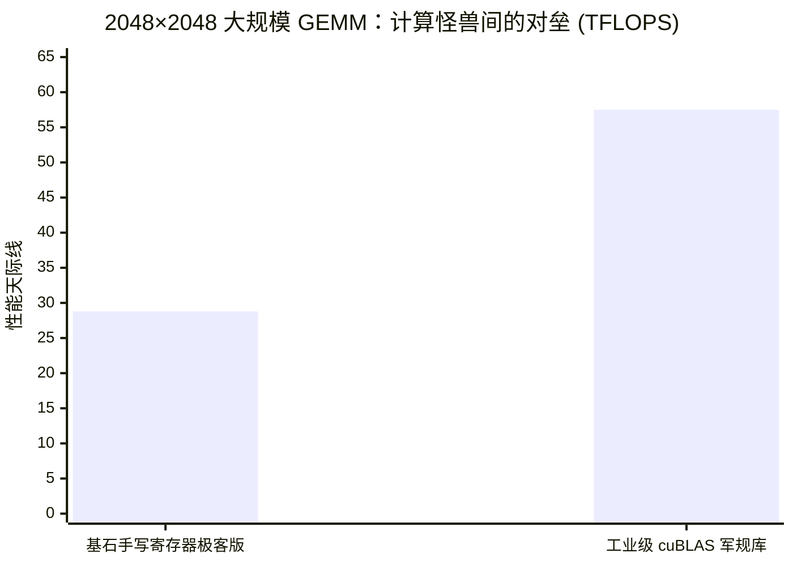

> 📖 **前置阅读**：[01_Basics_Concepts_and_Tiling](01_Basics_Concepts_and_Tiling.md)（Tiling 基础与算术强度）
> 📖 **推荐后续**：[09_Tensor_Core](09_Tensor_Core.md)（WMMA 硬件加速矩阵乘法）、[14_CUTLASS](14_CUTLASS.md)（模板元编程构建生产级 GEMM）

在前面的基础篇章中，我们花大力气把朴素的 GEMM 升级成了基于 Shared Memory 的 Tiled GEMM。通过让多个线程协作加载数据到共享内存（SMEM），我们将 Global Memory 的访存量降低了数十倍。性能也确实从 Naive 的 0.5 TFLOPS 跃升了不少。

但如果你仔细审视测试数据，在 1024×1024 规模下，Tiled GEMM 跑到 **6.57 TFLOPS** 就上不去了——这大概只有 RTX 4090 单精度理论峰值（82.6 TFLOPS）的 8%。

**为什么 Tiled GEMM 还是这么慢？瓶颈究竟卡在了哪里？**

核心原因在于我们在上一关解决的只是 **Global Memory 到 Shared Memory 的通信瓶颈**。但是，在 Tiled GEMM 最底层的内侧计算循环中，每个线程为了计算一个 `C[row][col]` 元素，每次在做核心的乘加指令（FMA：Fused Multiply-Add）之前，都必须从 Shared Memory 读出两个 `float`（一个 $A$，一个 $B$）。

对于一块算力怪兽级的 GPU 来说，**即便是 Shared Memory（L1 Cache），它的带宽（RTX 4090 约为数十 TB/s）相对于其恐怖的 FP32 算力依然是不够看的**。

这种“读一次就算一次”的访存模式，让算术强度（FLOP/Byte）死死卡在了一个低水平：
$$\text{算术强度} = \frac{2 \text{ FLOPs (一次乘加)}}{2 \times 4 \text{ Bytes (读取 A 和 B)}} = 0.25 \text{ FLOP/Byte}$$

而 RTX 4090 达到巅峰算力所需的 Roofline 拐点约为 85 FLOP/Byte。显然，我们将瓶颈从 Global Memory 转移到了 Shared Memory，但程序依然是**内存受限（Memory Bound）**的。

如果要向硬件天花板不断逼近，我们必须将数据推向距离 ALU 最近的地方，让数据在那里被疯狂复用。这是所有做 CUDA 优化的工程师必须跨过的分水岭：**寄存器级分块（Register Tiling）**。

---

## 演进一：一维线程粗化 (Thread Coarsening)

既然瓶颈是“从 SMEM 读取数据的次数太多”，最符合直觉的破局思路就是**让一个线程一次多干点活**，在业界这被称为线程粗化（Thread Coarsening）。

在 `01_tiled_gemm/tiled_gemm.cu` 的 `coarse_gemm` 版本中，我们进行了一个轻量级的一维粗化试验（设定 `COARSE_FACTOR = 4`）：让每个线程不再只负责计算 $1 \times 1$ 的 $C$ 元素，而是负责计算同一行上连续的 $1 \times 4$ 个 $C$ 元素块。

**收益的数学逻辑在哪里？**

假设一个线程要计算同行连续的四个元素 $C_{i,j}, C_{i,j+1}, C_{i,j+2}, C_{i,j+3}$。
在沿着 $K$ 维度迭代深入时，这四个元素的计算**都需要用到同一个** $A_{i,k}$ 的值！

这就意味着起飞的契机：对于这 4 次 FMA 运算，该线程只需要从 Shared Memory 读 1 次 $A_{i,k}$，以及读 4 次对应的 $B$ 元素。
访存量从 Naive 的 $4 \times 2 = 8$ 次（读 4 次 A、4 次 B），直接减少到了 $1 + 4 = 5$ 次。

这本质上是一种**寄存器复用（Register Reuse）**：把公共的 $A_{i,k}$ 读到寄存器里缓存起来，供给后面的指令反复使用。

我们来看实测的数据表现（1024×1024 规模，10次平均）：

| 版本 | Kernel 时间 | 计算性能 | 加速比 |
|:---|:---:|:---:|:---:|
| Tiled GEMM (Baseline) | 0.327 ms | 6575 GFLOPS | 1.00x |
| **Coarse GEMM (1D, F=4)** | **0.305 ms** | **7050 GFLOPS** | **1.07x** |

1.07x 的提升看起来似乎有些微不足道。这是因为 1D 粗化带来的复用只发生在 A 矩阵身上，B 矩阵依然是 1:1 的读取消耗。就好比你在工位上（线程），原本每次只处理一个文件包，现在让你一次领四个同类文件包，不用反复去架子（SMEM）上跑好几趟了。但这显然只触及了优化潜力的表面。我们需要双向复用。

---

## 演进二：二维分块的魔法与外积视角 (2D Register Tiling)

既然一行共享 A 能省访存，一列共享 B 也能省访存，那为什么不把线程粗化扩展到二维呢？这就是 **Register Tiling**（寄存器分块）的真面目。

在 `register_tiled_gemm` 版本中，我们赋予每个线程更庞大的责任边界：让它独立负责计算一个 $T_M \times T_N$ 的二维 $C$ 矩阵子块（代码中初步设定 `COARSE_Y = 4`, `COARSE_X = 4`）。

为了实现二维的寄存器复用，我们必须在思考模式上做一次跃迁：从大家在学校里学的**内积视角（Inner Product）**彻底切换到**外积视角（Outer Product）**。

### 内积 vs 外积的降维打击

**内积视角（Naive 和基础 Tiled 的方式）**：
遍历 $K$ 维度时，计算 $C_{i,j}$ 的逻辑是拿 $A$ 的第 $i$ 行去点乘 $B$ 的第 $j$ 列。不同元素的计算是孤立进行的，复用无从谈起。

**外积视角（Register Tiling 的基石）**：
与其每次更新一个结果，不如一块一块地推进。每次迭代，一个线程从 Shared Memory 向自家的寄存器中抓取 $A$ 的一个列向量片段（长条，$T_M$ 个元素）和 $B$ 的一个行向量片段（宽条，$T_N$ 个元素）。
这两个一维的片段相互相乘（做一次代数上的外积），就能直接膨胀、并累加上去一个完整的 $T_M \times T_N$ 的二维 $C$ 矩阵碎片。

用数学直观感受外积产生的矩阵面：
$$\text{寄存器外积：} \quad \vec{a} \cdot \vec{b}^T = \begin{pmatrix} a_0 \\ a_1 \\ \vdots \\ a_{TM-1} \end{pmatrix} \begin{pmatrix} b_0 & b_1 & \cdots & b_{TN-1} \end{pmatrix} = \begin{pmatrix} a_0 b_0 & a_0 b_1 & \cdots & a_0 b_{TN-1} \\ a_1 b_0 & \cdots & & a_1 b_{TN-1} \\ \vdots & & & \vdots \\ a_{TM-1} b_0 & \cdots & & a_{TM-1} b_{TN-1} \end{pmatrix}$$

**算力爆炸的秘密：算术强度重构**

我们定性算一笔账。以本版本这个看似不起眼的 $4 \times 4$ 子块为例：

- 数据搬运开销（从 SMEM 到寄存器）：读 4 个 $A$ 的分量 + 读 4 个 $B$ 的分量 = 8 个单精度浮点数（32 Bytes）。
- 算力压榨收益：产生了一个 $4 \times 4$ 桌面的全部组合，一共 $4 \times 4 = 16$ 次 FMA（32 FLOPs）。

局部算术强度陡然提高到了 $\frac{32}{32} = 1.0$ FLOP/Byte！这是单纯 Tiled 版本的 4 倍！数据一旦跨过独木桥进入了宽敞的寄存器堆，其计算价值就被成倍地压榨。

反映在 CUDA 核里的这段外积代码，没有任何多余的动作：

```cpp
// 1. 在每线程专属的寄存器堆中，申请 4x4 的二维累加器矩阵阵列
float values[COARSE_Y][COARSE_X] = {0.0f};

// ... 省略数百个线程协同工作，将 global A, B 搬入 Shared Memory 的过程 ...

// 2. 内层核心计算：沿着 K 维度的 Tile 推进
for (int t = 0; t < TILE_SIZE; ++t) {
    // 💡 关键：COARSE_Y(4) 和 COARSE_X(4) 都是编译期常量。
    // 这几层全常量边界的短循环，会被编译器 #pragma unroll 彻底剥离开，
    // 直译为毫无分支跳跃开销的纯粹 fmaf 指令雨。
    for (int j = 0; j < COARSE_Y; ++j) {
        for (int k = 0; k < COARSE_X; ++k) {
            values[j][k] = fmaf(shared_A[j * TILE_SIZE + threadIdx.y][t], 
                                shared_B[t][k * TILE_SIZE + threadIdx.x], 
                                values[j][k]);
        }
    }
}
```

来看看这个 $4 \times 4$ Register Tiling 打出的 1024 规模下的强力一击：

| 版本 | Kernel 时间 | 计算性能 | 加速比 |
|:---|:---:|:---:|:---:|
| Tiled GEMM (Baseline) | 0.327 ms | 6575 GFLOPS | 1.00x |
| **Register Tiled 2D** | **0.153 ms** | **14055 GFLOPS** | **2.14x** |

没有任何花哨的硬件特权调用，纯靠逻辑上的缓存思维变换，速度直接**翻了一倍不止（2.14x）**！SMEM 的带宽限制被这套复用拳法破局，我们的 GEMM 终于迈出了成为 Compute Bound（计算受限）任务的关键一步。

---

## 演进三：压榨极限周期的软件微操 (Advanced Techniques)

当我们成功推迟了访存的宏观瓶颈，流水线（Pipeline）中那些由于指令停顿、内存延迟导致的微小气泡，就会暴露成影响整体性能的沙粒。在 `02_advanced_gemm` 目录中，我们展示了试图去填补这些气泡的经典工程进阶手腕。

### Vectorized 加载 (使用 float4 向量化)

数据从 Global Memory 提款到 Shared Memory，这是开销最大的操作路段。既然我们在内存读取时，索要的地址总是一块连续的浮点数，逐个申请（`float`）是否太浪费控制单元资源了？

答案是将它们打成包裹。利用内置类型 `float4` 进行向量化读取。
从硬件视角看，使用 `float4` 可以把 4 个 32-bit 的取指请求合并为一个 128-bit 的单条 LDG 内存指令。这极大降低了指令发射端口的压力，并且极其有利于 L2 Cache 和内存控制器的内存事务合并（Coalescing）效率。

然而事实往往是残酷而反直觉的。我们看 1024 规模下的实测数据（对比新基准）：

| 版本 | Kernel 时间 | 评注 |
|:---|:---:|:---:|
| Vectorized (float4) | 0.382 ms | 由于实现细节略有回退 |

在这里，性能不升反降。这是一个非常典型的优化踩坑现场。在我们的实现中存在两个问题：

1. **线程发散（Warp Divergence）**：为了打包 float4，代码逻辑采用了 `if (threadIdx.x % 4 == 0)` 让部分线程停工围观，极大破坏了 SIMT 并发。
2. **强制对齐挑战**：直接 `*reinterpret_cast<const float4*>` 跨越指针，若没有保障前置的系统级内存分配对齐（Alignment），在汇编层面会触发多次零碎抓取来拼装寄存器。
这个反面教材告诉我们：**高级特性在堆叠时，不能违背底层的物理定律。**如果破坏了并发度，指令削减的利好将被全盘抵消。

### 双缓冲流水线 (Double Buffering)

如果说向量化是在削减指令量，那么双缓冲（Double Buffering）就是纯粹关于**时间与空间重叠的魔术**。
在没有流水线的标准循环里，GPU 行为像是一维海浪的平铺：
`1. 所有人去取数据进 SMEM` 👉 `__syncthreads()` 同步 👉 `2. 疯狂进行 FMA 计算` 👉 `__syncthreads()` 再次同步 👉 `进入下一次循环块`。

这种“串行”思维的恶果是：**当 GPU 计算核心（ALU）在疯狂咀嚼数据时，负责显存操作的加载状态机（LSU - Load Store Unit）在吃灰；反之，当满载拉取下一块数据时，ALU 只能干瞪眼。**

流水线思想应运而生：我们申请**两组** Shared Memory 数组（`shared_A[2][..]`），使用一个 Toggle 开关（`buffer_index = 1 - buffer_index`）交错运转。
核心哲学变成了：“**在当前周期计算当下瓦块的同时，向系统预订并发起下一个瓦块的内存提取指令。**”

```cpp
// 预先发射请求：把第 0 块瓦片先拉进 SMEM[0]
// ...
for (int i = 0; i < num_tiles; ++i) {
    buffer_index = 1 - buffer_index;
    
    // 如果还没算完，先发起拉取第 i+1 块的动作，塞进 SMEM[下一个]！
    // 此时内存请求发出，但不阻塞后面的进行
    if (i + 1 < num_tiles) {
        shared_A[buffer_index][...] = ...;
    }
    
    // 立即开始猛烈计算当前手中的第 i 块，就在 SMEM[当前]
    for (int k = 0; k < TILE_SIZE; ++k) {
        value = fmaf(... shared_A[1 - buffer_index] ...);
    }
    __syncthreads();
}
```

看一看这招在实战中的威力（相对于不带 Double Buffer 的基准）：

| 版本 | Kernel 时间 | 计算性能 | 加速比 |
|:---|:---:|:---:|:---:|
| Vectorized 基准 | 0.382 ms | - | 1.00x |
| **Double Buffer GEMM** | **0.315 ms** | **6820 GFLOPS** | **1.21x** |

提速 1.21x。这表明，原本暴露在外、白白浪费时钟周期的那些内存长回程延迟（Memory Latency），有很大一部分被成功塞到计算耗时的阴影（遮蔽）下方去了。这是手工极限调板的经典手艺（注：在现代 Hopper 甚至 Ampere 架构中，这个技巧已经被硬件级的异步拷贝特性彻底原生接管——`cp.async` 和 TMA）。

---

## 终极对决：2048X 极致 8x8 外积 vs NVIDIA 原厂 cuBLAS

所有的前期理论铺垫，都是为了迎接深海区的终极挑战。
我们来到 `03_register_tiling`。矩阵规模拔高到工业落地级的 $2048 \times 2048$。我们将二维寄存器分块推向了我们这个版本算力的极限：
**每个线程不再只处理 4x4，而是要一次在肚子里吞下 8 × 8 = 64 个 C 元素！**

看看我们摆下这个宏大阵列的参数配比（它要求极高的寄存器使用率，若分配不当会引发 Occupancy 崩盘）：

- Block 宏观视野 (BM×BN)：128 × 128 （一个合作社一口气吃下 128x8 的 A 和 8x128 的 B）。
- 线程微观视野 (TM×TN)： 8 × 8 （每个工人独享 8+8=16个输入寄存器，产出 64 个累加器寄存器）。
- 线程总动员规模： $(128/8) \times (128/8) = 256$ 个线程一个 Block。
- 全局算术强度的跃迁：每次搬运 16 个体量进线程，执行 64 次运算反馈。复用比激增到 4！

现在，在 20 轮真实迭代的烈火中进行真金锻造：

| 版本 | Kernel 时间 | 实测理论算力 (TFLOPS) | 对抗闭源巨无霸的比率 |
|:---|:---:|:---:|:---:|
| **手写极致在外积版 (2D, 8x8)** | **0.60 ms** | **28.79** | **50.1%** |
| **NVIDIA 亲孙子 cuBLAS SGEMM** | 0.30 ms | 57.49 | 100% |

> 注评：测试硬件理论峰值约 82.6 TFLOPS（RTX 4090单精度 FP32）。



**实测达到了恐怖的 28.79 TFLOPS！**
你必须明白，这可不是调包，这是纯纯由我们手打出来的、一砖一瓦盖起来的 C++ 程序，它挖掘出了 4090 GPU 三分之一潜力的极限动能！

### 落差解剖：那剩下的 50% 差距丢在了哪里？

你一定会问，我们已经穷尽了所能想到的结构复用，把局部算术强度拉到爆棚，为什么速度依然停留在 `cuBLAS` (57.49 TFLOPS) 的 50%？
差距的另一半，隐匿在连 C++ 代码本身都无法精确触及的硬件微观沼泽中。我们坦诚地客观拆解：

1. **结构破坏者：Bank Conflict 绞肉机（损耗预估 ~10%）**
   在内核第 3 阶段计算展开时，同属于一个 Warp 的 16 个线程需要同时去 `__shared__ float sB[8][128]` 里面取同一行的不同列。很不幸，隔膜步长（TN=8）完美碰撞了 32 Bank 的交错分配体系。它直接导致严重的内存 Bank 冲突事件（Bank Conflicts）。专业解决手段是增加“假列”也就是 `Padding`（比如声明为 `sB[8][128+1]`）去错开冲突通道，为了保留原始代码最可读的纯粹面貌，我们在此版本承受了惩罚。
2. **流水线气泡：双缓冲的让步（损耗预估 ~15%）**
   细心的你肯定注意到了。2048 破纪录版本中，我退让了，没有应用上面演进过的 Double Buffer。因为在极限参数下控制寄存器溢出（Register Spilling）和流水并发是一门钢丝游戏，这直接导致计算和加载重新出现了少许时序气泡吞噬算力周期。
3. **降维打击领域：SASS 汇编级精调（压制性预估 ~15-20%）**
   在最底层的地带，`cuBLAS` 根本就不只是 C++。他们的内核是直接干涉硬件底层汇编（SASS）的杰作。NVIDIA 的性能调优巨匠会以 Cycle（时钟周期）为单位，精算并穿插在每一条密集浮点加乘（FFMA）指令中间去布下那些载入控制（LDG）。为了指令级并行度 (ILP) 不发生打岔，乃至规避比 Shared Memory 更隐蔽的**寄存器 Bank 冲突**，这些都是通过编译器高级抽象很难达到的极境。

---

## 结语：重塑你对计算瓶颈的物理直觉

跨越这一整个漫长的优化阶梯，你脑海里的 GPU 计算物理图景理应被彻底推倒重建了。
这趟旅程，留给我们两个极其硬核的事实：

**第一，Global 内存（HBM）极慢这是常识，但是请记住，连 Shared Memory (L1) 都有可能不够快！**
一旦跨过寄存器分块 (Register Tiling) 这道大门，你的工程师优化视野就必须从宏大的“如何用卡车把数据拉到厂区（芯片内）” 再次升维净化到 “如何在这个最狭窄、最宝贵的局域台面（Register File 寄存器堆）上把每一个数据碎片的算术使用价值榨干殆尽”。

**第二，软件结构优化的罗曼蒂克尽头，是冷酷庞杂的硬件底色。**
挥舞着 C++ 编译器长鞭，我们一路杀到了逼近 30 TFLOPS 的辉煌阵线。但如果你还想着去跨越这条线超越那个工业怪兽 cuBLAS 怎么办？
路只剩下两条：要么你去死磕那如天书般的 SASS 汇编，手动排布微指令流；
要么，你应该将目光抛弃那些传统的、被无数图形像素渲染框住的通用计算微核（CUDA Cores），**转而拥抱那些被特意封装在大芯片深渊中，专为主宰巨量矩阵吞吐而诞生的天级硅片区域**。

是的，我们将在下一个章节——[【进阶第 09 讲 (Tensor Core：降伏 WMMA 矩阵引擎)】](09_Tensor_Core.md)继续攀登新的巅峰。
