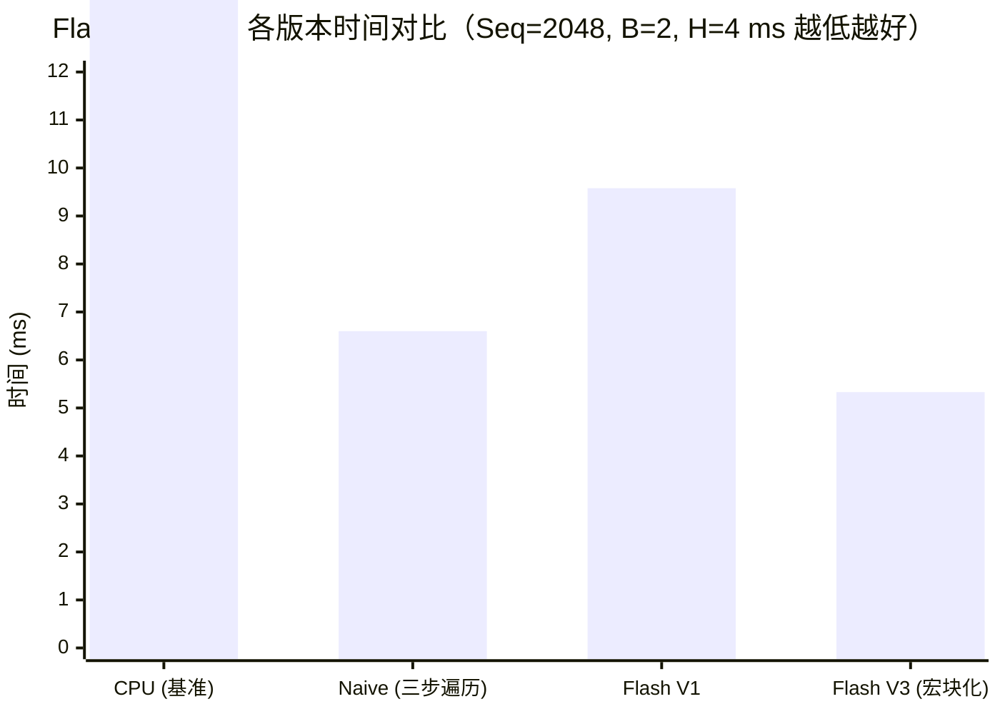

## 楔子：直击痛点 (The Hook & Motivation)

大语言模型 (LLM) 席卷全球的背后，隐藏着一场看不见硝烟的底层算力战争。在模型推理时，算力瓶颈已经悄然从运算单元 (ALU) 转移到了极其昂贵的显存带宽 (HBM Bandwidth) 上。我们称之为 **Memory Wall (访存墙)**。

以最臭名昭著的 Attention（注意力机制）和 Softmax 为例：
传统的 Attention 强迫 GPU 将规模为 $N \times N$（$N$ 为序列长度）的巨大 Attention Map 从片上寄存器倒腾回 HBM，执行 Softmax 后，再重新读回来乘以 $V$ 矩阵。
当 $N=4096$ 时，这一个中间矩阵的来回读写，就能轻易挥霍掉几百兆的带宽，并带来巨大的 I/O 延迟。计算资源在干等，HBM 却塞车了。能否找到一种“空手套白狼”的算法，**在片上 (SRAM) 一气呵成算完所有东西，永远不把中间废料写回主存？**

FlashAttention 和 Online Softmax 给了我们斩钉截铁的答案：基于数学递推的绝对力量！

---

## 第一性原理与数学重构 (Mathematical Formulation)

要消灭 $N \times N$ 的中间写入，核心拦路虎是 Softmax 算子。

标准 Softmax 是全局耦合的：
$$y_i = \frac{e^{x_i - m}}{\sum e^{x_j - m}}, \quad m = \max(x_j)$$

为了数值稳定，你必须：

1. **Pass 1:** 遍历所有人求局部最大值 $m$。
2. **Pass 2:** 遍历所有人求指数和 $l = \sum e^{x_j - m}$。
3. **Pass 3:** 再遍历所有人求商。

**架构师的第一性原理破壁法 (Online Softmax / Safe Softmax):**
我们能不依靠三次遍历，通过增量更新的方式流式计算吗？
假设我们正在扫描第 $T$ 个数据块，我们只知道局部最大值 $m^{(T)}$ 和局部和 $l^{(T)}$。当新的数据块 $T+1$ 到来时：
更新全局最大值：
$$m^{(new)} = \max(m^{(T)}, m^{(T+1)})$$
校正历史累计的指数和（因为历史数据是按旧的 $m^{(T)}$ 缩放的）：
$$l^{(new)} = l^{(T)} \cdot e^{(m^{(T)} - m^{(new)})} + l^{(T+1)} \cdot e^{(m^{(T+1)} - m^{(new)})}$$
这一精妙的微积分级校正，被称为 **FlashAttention 递推引擎**，直接干掉了对 $N \times N$ 的二次溯源访问。

---

## 核心优化演进与硬件映射 (Architecture Mapping)

将 Online Softmax 塞入 GEMM 的壳子，就诞生了能够颠覆显存利用率的 FlashAttention SRAM Tiling 架构。

### Flash Attention 流式分块拓扑图

```mermaid
graph TD
    classDef hbm fill:#f9d0c4,stroke:#333,stroke-width:2px;
    classDef sram fill:#fcf1c8,stroke:#333,stroke-width:2px;
    classDef reg fill:#bbf,stroke:#333,stroke-width:2px;

    subgraph "全局显存 (HBM, 不再写入中间矩阵！)"
        Q["Q [Seq×Head_Dim]"]:::hbm
        K["K [Seq×Head_Dim]"]:::hbm
        V["V [Seq×Head_Dim]"]:::hbm
        O["最终 O [Seq×Head_Dim]"]:::hbm
        
        S_N["x 抛弃的 S, P (N×N) x"]:::hbm
        style S_N stroke-dasharray: 5 5, fill:#eee, color:#999
    end

    subgraph "Shared Memory (SRAM, BR×BC 容纳阵地)"
        QT["Q_tile (固定不动)\n[BR×dim]"]:::sram
        KT["K_tile (流式替换)\n[BC×dim]"]:::sram
        VT["V_tile (流式替换)\n[BC×dim]"]:::sram
    end

    subgraph "Thread Registers (在线累加器)"
        Acc["O_acc [BR×dim] P*V的累加\nm_i, l_i (局部最大/和)"]:::reg
    end

    Q --> QT; K -.->|"外层循环流式进入"| KT; V -.->|"外层循环流式进入"| VT
    QT & KT -->|"小块 S = Q @ K^T"| Acc
    Acc -.->|"Online Softmax 动态因子伸缩"| Acc
    VT -->|"极速外冲 P @ V"| Acc
    Acc =>|"全部吞噬完毕，一次落盘"| O
```

**底层真相解码**：我们不再让 Q 去追着 K 满世界跑。我们把 Q 的一小块 (BR) 绑在内存墙的最前线 (Shared Memory)。然后让 K 和 V 的块排着队 (BC) 送进来。
算出来的局部注意力系数马上经过 Online Softmax 的校正，立刻乘上 V 的分块累加入寄存器 `O_acc`。整个过程在 SRAM 和 Register 内部发生核聚变，HBM 甚至不知道这里刚刚经历了一场 $N \times N$ 的厮杀！

---

## 源码手术刀：关键代码深度赏析 (Surgical Code Analysis)

打开 `03_flash_attention/flash_attention.cu`，我们直接提取那个能让 N 系列显卡发出轰鸣的“历史校正”核心段落：

```cpp
// 核心循环：在 SRAM 内遍历 K_tile 和 V_tile
for (int j = 0; j < num_blocks_K; ++j) {
    // ... [将 K_tile, V_tile 加载进 SRAM] ...
    
    // 动作 1：计算新块的局部最大值 (S = Q * K^T)
    float m_i_new = m_i; // m_i 是上一个块继承下来的全局最大值
    // ... 对 s_ij[k] (新 S 子块) 进行局部打擂求 M ...
    m_i_new = fmaxf(m_i_new, s_ij[k_idx]);
    
    // 动作 2：计算新块的局部指数和并转为 P
    float p_sum = 0.0;
    // ... 计算 P = exp(S - m_i_new) 累加入 p_sum ...
    
    // 🔥 动作 3：绝杀！历史的重置与融合校正 🔥
    float exp_diff = __expf(m_i - m_i_new); // 计算缩放因子的代差
    float l_i_new = exp_diff * l_i + p_sum; // 全局分母更新
    
    // 动作 4：对于寄存器中积累已久的 O，进行无情缩放，并叠加新增量 P * V
    for (int d = 0; d < head_dim; ++d) {
        float pv_sum = 0.0f; // P * V 局部乘积累加
        // ... (pv_sum += s_ij[k] * V_tile[k, d]) ...
        
        float old_o = O[row_q, d]; // 尚未除以分母的，只差常数倍的极品中间态
        // 历史积累 * 缩放差值 + 新一轮的 P*V 补充
        O[row_q, d] = old_o * exp_diff + pv_sum; 
    }
    
    // 向前推进状态机
    m_i = m_i_new;
    l_i = l_i_new;
}
```

**手术刀剖析：**
这三行代码 `exp_diff`, `l_i_new` 和 `old_o * exp_diff + pv_sum` 值千金。它将原本需要 $O(N^2)$ 全局依赖的 Softmax，打碎成了可以增量递进的隐马尔可夫链。
因为 $e^{A} / e^{B} = e^{A-B}$，这允许我们极其优雅地在没有看到全知视角 (全局 Max) 的情况下，先依据**局部 Max**把算出的 P 和 V 揉捏到一起，等最终扫描完毕，再除以最终极的 $l_i$ 一锤定音。

---

## 理论与实际的对决：极限剖析 (Theory vs Reality Profiling)

拿出 `Results/05_LLM_Ops.md` (RTX 4090, SM_89, FP32 运算)，让我们审视 FlashAttention 如何在 Memory Bound 泥潭中掀翻桌子：



| 算子变体 | 中间显存开销 (N×N) | Kernel 耗时 (ms) | 带宽收益解析 |
| :--- | :--- | :--- | :--- |
| **Naive Attention** | **128.00 MB 大拉扯** | **6.60** | 被 HBM 写出写入拖垮节奏。 |
| **Flash Attention V1** | **$O(N)$ 零中间态** | **9.58 (变慢?!)** | 显存砍了，但 Thread 发射粒度太细，同步等待重计算反噬了算力。 |
| **Flash Attention V3** | **$O(N)$ 零中间态** | **5.33** | **最优形态：Macro-Block + Float4 向量化吃光 SRAM 瓶颈。** |

### 极限溯源与自洽性反思

你会很惊讶地发现一个异象：**经典原教旨的 FlashAttention V1 (9.58ms) 为什么反而输给了 Naive 朴素版 (6.60ms)？**
这并非数据错误，而是一次堪称教科书级别的 Profiling 真相：

1. `seq_len = 2048` 时局尚小。
2. Flash V1 中的 Thread Block (`BR=BC=32`) 分块过于娇小。对于以计算见长的 RTX 4090 而言，把这 32×32 的块倒腾进 SRAM、计算、然后 `__syncthreads()` 同步，其带来的**控制流停顿开销与重计算算力浪费**，一巴掌拍死了它节约下来的那一点点 HBM 写入时间。在这场对决中，Compute Bound 反噬了 Memory Bound 的解法！

只有走到 **Flash Attention V3** 的工业妥协境界：我们用 `WARPS_PER_BLOCK * BR` 的宏大吞吐量 (Macro-Block)，四倍化 Q 的捕获率，同时启动 `float4` （128-bit 向量化）暴力压满总线，才终于让它以 5.33 ms 的绝对统治力加冕，成功收割了 Memory Bound。

---

## 架构师视角的总结 (Architect's Takeaway)

1. **数学重组决定物理极限**：在底层世界，数学变形极其廉价，物理搬运极其昂贵。Online Softmax 带来的分配律校正，是过去十年系统性能提升中最伟大的一笔（直接造就了 ChatGPT 时代的长文本可能）。
2. **算力与访存的辩证法**：由于 Recomputation (重计算) 分配校正因子的存在，FlashAttention 的纯算力需求（FLOPs）实际上是**增加**的。我们是用多余的、极速的晶体管算力，换取了极其稀缺的三级大漏斗 (HBM) 带宽。
3. **警惕小规模的理论骗局**：在长文本到来之前，你必须意识到分块带来的同步开销 (Warp barrier)。不是每一次切向 SRAM 的行为都必然赚钱，如果调度切得支离破碎（如 V1），不如让朴素的流控制处理器一口吃饱。架构评估需时时刻刻回归 Roofline 模型（算术强度比）进行审判。
