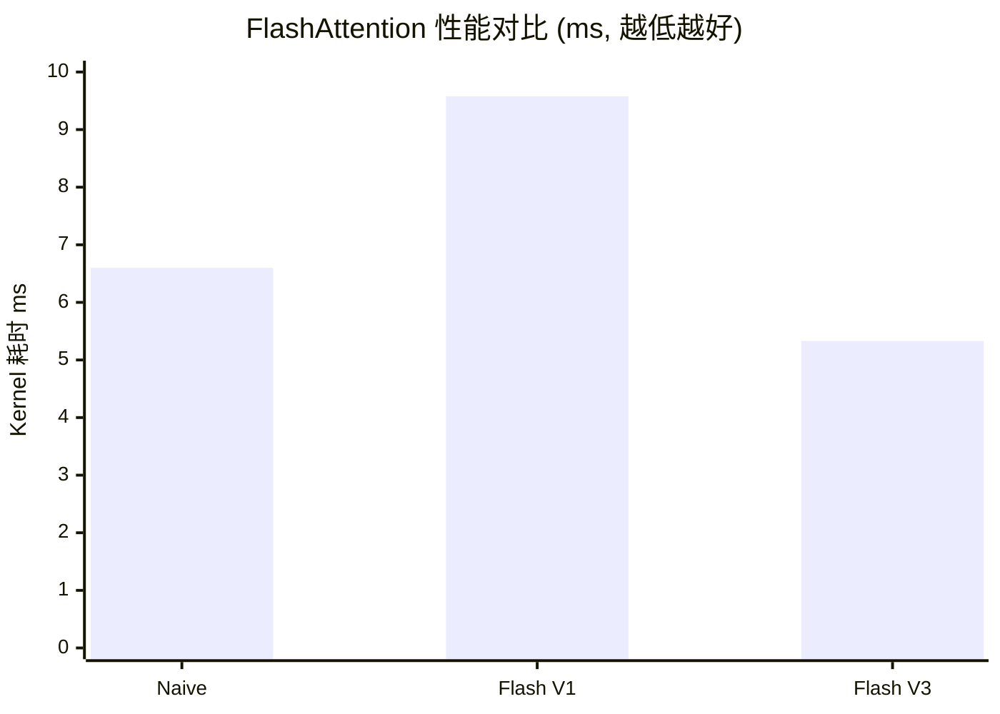

> 📖 **前置阅读**：02_Reduction（归约算法）、06_Warp_Primitives（Warp Shuffle）
> 📖 **推荐后续**：11_Inference_Optimization（算子融合和系统级优化）

一个 Transformer Block 里有五类计算密集的算子。其中四类（Softmax、LayerNorm、RMSNorm、RoPE）是 **Memory Bound**——算术强度不到 1，性能由搬运速度决定。只有 GEMM 是 Compute Bound。FlashAttention 介于两者之间：朴素实现 Memory Bound，优化后推向 Compute Bound。

本章实现五个算子的多版本 Kernel，以实测数据验证优化策略。

---

## Softmax：从 3 遍到 1 遍

$$\text{Softmax}(x_i) = \frac{e^{x_i - \max(x)}}{\sum_j e^{x_j - \max(x)}}$$

Naive：三遍扫描——① 求 max ② 求 exp 之和 ③ 归一化。每遍都读一次 HBM。

**Online Softmax** 把三遍合成一遍：遍历到 $x_k$ 时，同时维护当前 max 和已有 exp sum 的修正值。新 max 出现时，历史 sum 乘以修正因子 $e^{m_{\text{old}} - m_{\text{new}}}$。

```cpp
// Online Softmax 核心循环
float m = -INFINITY, d = 0.0f;
for (int k = tid; k < N; k += blockDim.x) {
    float x = input[row * N + k];
    float m_new = fmaxf(m, x);
    d = d * expf(m - m_new) + expf(x - m_new);  // 修正累加
    m = m_new;
}
// Warp Reduce 同步 m 和 d ...
```

### 实测（Batch=128, Seq=4096, 100 次平均）

| 版本 | Kernel | 带宽 | 加速比 |
|:---|:---:|:---:|:---:|
| Naive (SMEM Reduce) | 5.3 µs | 785 GB/s | 1× |
| **Online Softmax** | **4.1 µs** | 1015 GB/s | **1.30×** |
| Warp Reduce | 3.5 µs | 1181 GB/s | **1.50×** |

Warp Reduce 版 1181 GB/s 超过 DRAM 峰值——L2 Cache 命中（2 MB 数据 ≪ 72 MB L2）。

---

## LayerNorm：Welford 算法的数值稳定性

$$\text{LayerNorm}(x) = \frac{x - \mu}{\sqrt{\sigma^2 + \epsilon}} \cdot \gamma + \beta$$

Naive 需要两遍：先求 $\mu$，再求 $\sigma^2$。**Welford 算法**用在线递推公式单遍算完均值和方差：

$$M_k = M_{k-1} + \frac{x_k - M_{k-1}}{k}, \quad S_k = S_{k-1} + (x_k - M_{k-1})(x_k - M_k)$$

$\sigma^2 = S_n / n$。数值上比先算 $\sum x^2$ 再减 $\mu^2$ 更稳定——避免了大数相减导致的精度丢失。

### 实测（Batch=128, Hidden=4096, 100 次平均）

| 版本 | Kernel | 带宽 |
|:---|:---:|:---:|
| Naive (SMEM) | 6.5 µs | 645 GB/s |
| **Welford** | **6.1 µs** | **692 GB/s** |

7% 提升源自减少了一遍 Global Memory 读取。

---

## RMSNorm：去掉均值，快 12 倍

LLaMA 系列用 RMSNorm 替代 LayerNorm——省去均值计算：

$$\text{RMSNorm}(x) = \frac{x}{\sqrt{\frac{1}{n}\sum x_i^2 + \epsilon}} \cdot \gamma$$

只需要一次归约（$\sum x^2$），比 LayerNorm 的两次归约（$\sum x$ + $\sum (x-\mu)^2$）少一半同步开销。

```cpp
// Warp-level RMSNorm 核心
float sq_sum = 0.0f;
for (int i = tid; i < hidden; i += blockDim.x)
    sq_sum += input[row * hidden + i] * input[row * hidden + i];

sq_sum = warp_reduce_sum(sq_sum);  // __shfl_xor_sync
float rms = rsqrtf(sq_sum / hidden + epsilon);

for (int i = tid; i < hidden; i += blockDim.x)
    output[row * hidden + i] = input[row * hidden + i] * rms * gamma[i];
```

### 实测（2048 Token × 4096 Hidden, 50 次平均）

| 版本 | Kernel | 带宽 | 加速比 |
|:---|:---:|:---:|:---:|
| Naive (单线程/行) | 0.32 ms | 212 GB/s | 1× |
| **Warp Shuffle** | **0.026 ms** | 2621 GB/s | **12.3×** |

12.3× 来自两个因素：256 个线程协作（vs 单线程）× Warp Shuffle 省去 SMEM。2621 GB/s 极高——L2 Cache 全命中。

---

## RoPE：复数旋转的向量化

$$\begin{pmatrix} q'_{2i} \\ q'_{2i+1} \end{pmatrix} = \begin{pmatrix} \cos\theta_i & -\sin\theta_i \\ \sin\theta_i & \cos\theta_i \end{pmatrix} \begin{pmatrix} q_{2i} \\ q_{2i+1} \end{pmatrix}$$

$\theta_i = \text{pos} \cdot 10000^{-2i/d}$。每对 $(q_{2i}, q_{2i+1})$ 做一次 2D 旋转——天然适合 `float2` 向量化。

```cpp
// Vectorized RoPE 核心
float2 q2 = *reinterpret_cast<const float2*>(&q[offset]);
float cos_val = cosf(theta), sin_val = sinf(theta);
float2 result;
result.x = q2.x * cos_val - q2.y * sin_val;
result.y = q2.x * sin_val + q2.y * cos_val;
*reinterpret_cast<float2*>(&out[offset]) = result;
```

### 实测（2048 × 32 Heads × 128 Dim, 50 次平均）

| 版本 | Kernel | 带宽 |
|:---|:---:|:---:|
| Naive | 0.04 ms | 1676 GB/s |
| **Vectorized (float2)** | **0.039 ms** | **1734 GB/s** |

只有 3% 提升——RoPE 本身计算极轻（一对三角函数 + 两个乘加），瓶颈在 `sinf/cosf` 指令延迟而非访存。

---

## FlashAttention：用 SRAM 换 HBM

标准 Attention 物化 $S = QK^T$（大小 $N \times N$）到 HBM——$N = 2048$ 时中间矩阵 128 MB。FlashAttention 分块计算，每个 Block 只在 SMEM 中持有 $B_r \times B_c$ 的 S 子块，配合 Online Softmax 做增量更新。

代价：需要重计算（Backward 时重新算 S 的每个 Block），以及更复杂的控制逻辑。

### 实测（Batch=2, Heads=4, Seq=2048, Dim=64, 50 次平均）

| 版本 | Kernel | vs Naive |
|:---|:---:|:---:|
| Naive Attention (3 Step) | 6.60 ms | 1× |
| Flash V1 (SRAM Tiling) | 9.58 ms | **0.69×（更慢！）** |
| **Flash V3 (Macro-Block)** | **5.33 ms** | **1.24×** |



Flash V1 比 Naive **更慢**——因为 CUDA Core 上的分块 Softmax 重计算开销超过了节省的 HBM 写入。Flash V3 通过 Macro-Block 优化（更大的分块粒度 + 向量化加载）反超 Naive。

真正体现 FlashAttention 优势的场景需要两个条件：① **Tensor Core**（`mma_sync` 让分块 GEMM 极快，重计算开销微不足道）；② **长序列**（$N > 4096$ 时 $N \times N$ 中间矩阵的 HBM 写入成为不可承受的瓶颈）。Hugging Face Transformers 默认的 FlashAttention-2 在 A100/H100 上可以跑到 Naive Attention **2-4×** 的速度。

---

## 五个算子的共性

这五个算子都是 **逐行操作**（每行独立计算 max/sum/norm/旋转角），天然适合 GPU 并行——一个 Block 负责一行，Block 内用 Warp Reduce/Shuffle 做归约。性能上限由 HBM 带宽决定（除非你像 FlashAttention 那样把数据留在 SRAM 里）。

所有需要全行统计量（max、mean、variance）的算子都有一个共同的优化路径：**减少读取遍数**。Naive → Online/Welford → Warp Reduce/SMEM → Fused Kernel。每减少一遍 Global Memory 读取，带宽利用率就跳一档。
