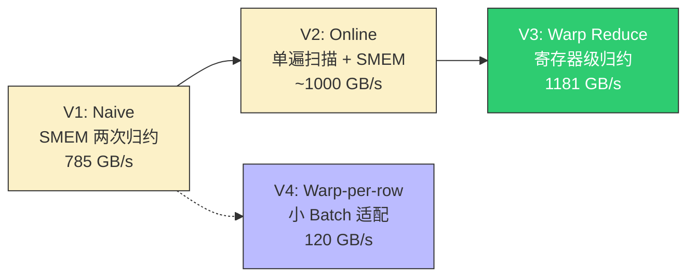
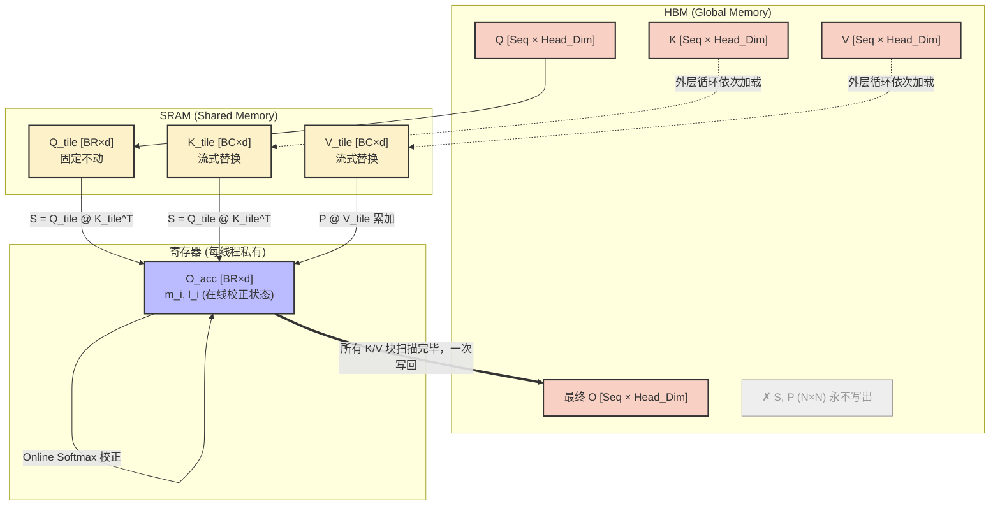
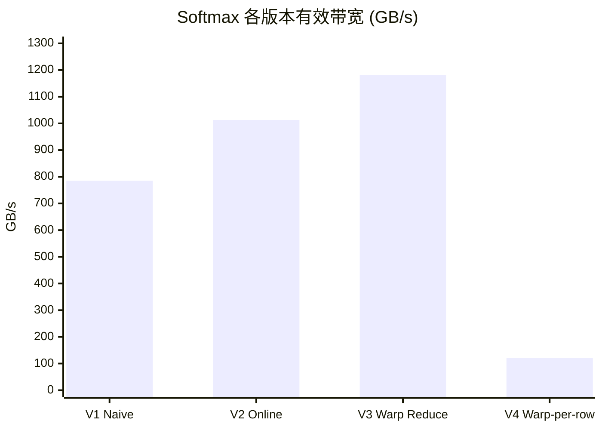
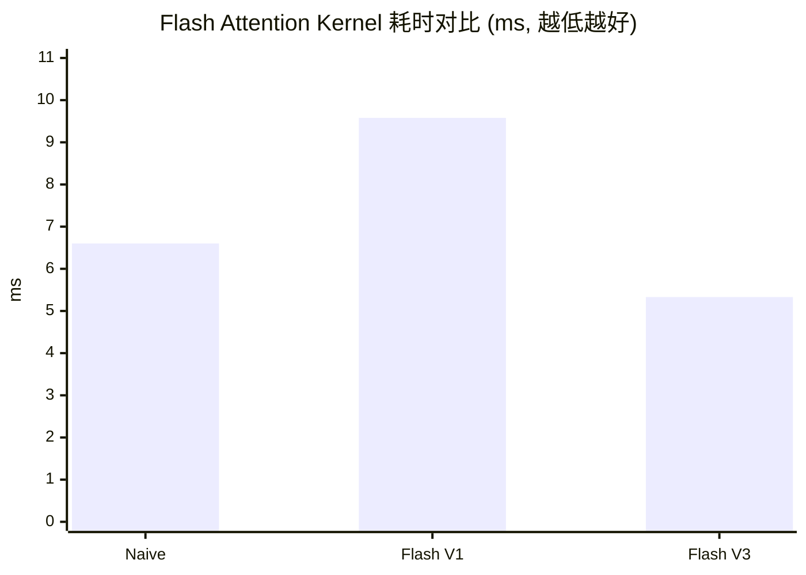

## 楔子：LLM 推理栈中隐藏的五座大山

打开任何一个主流 LLM（LLaMA-3、GPT-4、Qwen）的推理 Profiler 报告，你会发现一个令人沮丧的事实：**真正执行"智能推理"的矩阵乘法（GEMM）只占总延迟的一部分，而另一大块时间被几个看似简单的"辅助算子"吞噬了**——Softmax、LayerNorm、RMSNorm、RoPE、Attention。

这些算子的共同特征是什么？**它们不是计算密集型（Compute Bound），而是带宽密集型（Memory Bound）**。以 Softmax 为例，每个输出元素仅需 1 次 `exp` + 1 次除法，算术强度（Arithmetic Intensity）极低：

$$\text{AI}_{\text{Softmax}} = \frac{2N \text{ FLOPs}}{2N \times 4 \text{ Bytes}} = 0.25 \text{ FLOPs/Byte}$$

对比 RTX 4090 的 Roofline 拐点（~82 FLOPs/Byte），Softmax 的算术强度低了两个数量级。这意味着**无论你拥有多少 CUDA Core，性能上限完全由 HBM 带宽（~1008 GB/s）决定**。

更致命的是 Attention 机制：标准实现需要将 $N \times N$ 的中间矩阵（$N$ = 序列长度）在 HBM 上来回搬运。当 $N = 4096$ 时，仅这一个中间矩阵就占 64 MB——一个 Token 的注意力计算就要读写上百兆数据。

本文将深入剖析 LLM 推理栈中的五大核心算子，揭示它们如何从朴素实现一步步进化到逼近硬件理论带宽极限的高效 Kernel，以及 FlashAttention 如何用数学递推彻底消灭 $O(N^2)$ 的中间存储。


> **本文覆盖全部五大算子**：FlashAttention 和 Softmax 作为核心主角深度剖析，LayerNorm/RMSNorm/RoPE 作为配角完整覆盖。

---

## 第一性原理与数学重构

### 一、Softmax：三遍扫描到单遍递推的数学革命

标准的数值稳定 Softmax 需要**三次**全局遍历：

$$y_i = \frac{e^{x_i - m}}{\sum_{j} e^{x_j - m}}, \quad m = \max_j(x_j)$$

- **Pass 1**：遍历所有元素求全局最大值 $m$（防止 `exp` 溢出）
- **Pass 2**：遍历所有元素计算 $e^{x_j - m}$ 并求和 $l$
- **Pass 3**：遍历所有元素除以 $l$

三次遍历 = 三次 HBM 读取。对于一个 Memory Bound 算子，这是不可接受的。

**Online Softmax 的递推破壁法**：我们能否在扫描到第 $t$ 个元素时，只用**当前已知信息**维护一个"可回溯的"最大值和分母？答案是肯定的。定义状态变量 $(m^{(t)}, d^{(t)})$，其递推关系为：

$$m^{(t)} = \max\big(m^{(t-1)},\; x_t\big)$$

$$d^{(t)} = d^{(t-1)} \cdot e^{m^{(t-1)} - m^{(t)}} + e^{x_t - m^{(t)}}$$

关键洞察是第二个公式中的**历史校正因子** $e^{m^{(t-1)} - m^{(t)}}$：当新来的元素更大时，$m$ 更新了，历史的指数和 $d$ 必须同步缩小——因为所有历史元素的 `exp` 值现在要以更大的 $m$ 重新基准化。这个乘法的精妙之处在于 $e^{A}/e^{B} = e^{A-B}$，不需要回头重算历史数据。

以一个数值例子说明：假设前两个元素为 $x_1 = 3, x_2 = 5$。

| 步骤 | $m$ | $d$ | 计算过程 |
|:---:|:---:|:---:|:---|
| $t=1$ | 3 | 1.0 | $d = e^{3-3} = 1$ |
| $t=2$ | 5 | $1 \cdot e^{3-5} + e^{5-5}$ = **1.135** | 历史 $d=1$ 乘以缩放因子 $e^{-2} = 0.135$，加上新项 $e^0 = 1$ |

这样就用**单遍扫描**替代了三遍遍历，HBM 读取量直接砍至 $1/3$。

### 二、Welford 算法：LayerNorm 的单遍均值-方差联合求解

LayerNorm 的标准公式：

$$y_i = \frac{x_i - \mu}{\sqrt{\sigma^2 + \epsilon}} \cdot \gamma_i + \beta_i, \quad \mu = \frac{1}{H}\sum x_i, \quad \sigma^2 = \frac{1}{H}\sum(x_i - \mu)^2$$

朴素实现需要两遍扫描：第一遍求 $\mu$，第二遍用 $\mu$ 求 $\sigma^2$。Welford 算法提供了一种数值稳定的单遍递推：

$$\delta_t = x_t - \mu_{t-1}, \quad \mu_t = \mu_{t-1} + \frac{\delta_t}{t}, \quad M_t = M_{t-1} + \delta_t \cdot (x_t - \mu_t)$$

最终 $\sigma^2 = M_n / n$。这个递推的数值优势在于：它避免了"大数减大数"的灾难性抵消（catastrophic cancellation），这在 FP16 推理中尤为关键。

### 三、RMSNorm：LayerNorm 的极简变体

$$\text{RMSNorm}(x_i) = \frac{x_i}{\sqrt{\frac{1}{H}\sum x_j^2 + \epsilon}} \cdot \gamma_i$$

与 LayerNorm 相比，**砍掉了均值减除**。这不仅减少了一次全局归约（少算一次 $\mu$），还省去了减均值的访存。在 LLaMA、Qwen、Mistral 等现代架构中，RMSNorm 已经完全取代了 LayerNorm。

### 四、RoPE：复数域上的旋转位置编码

$$\begin{pmatrix} q'_{2d} \\ q'_{2d+1} \end{pmatrix} = \begin{pmatrix} \cos\theta_{d,t} & -\sin\theta_{d,t} \\ \sin\theta_{d,t} & \cos\theta_{d,t} \end{pmatrix} \begin{pmatrix} q_{2d} \\ q_{2d+1} \end{pmatrix}, \quad \theta_{d,t} = t \cdot \frac{1}{10000^{2d/H}}$$

每对相邻维度做一次 2D 旋转，频率随维度指数衰减。这意味着低维度（$d$ 小）的旋转频率高、对近距离 Token 敏感，高维度的旋转频率低、编码远距离关系。

---

## 核心优化演进与硬件映射

### 主角一：Softmax 的四级优化阶梯



**V1 → V3 的核心跃迁路径**：

| 版本 | 归约机制 | Global Memory 遍历次数 | 延迟关键路径 |
|:---|:---|:---:|:---|
| V1 Naive | Shared Memory 树归约 | 3 次 | `__syncthreads()` × 多轮 |
| V2 Online | SMEM + Online 递推 | 1 次 | SMEM 归约合并 $(m, d)$ 对 |
| V3 Warp Reduce | **`__shfl_down_sync`** | 1 次（`__expf` 内联） | ~5 cycles/Warp，无 SMEM barrier |

V3 的突破在于：**用 Warp Shuffle 指令彻底替代了 Shared Memory 归约**。`__shfl_down_sync` 在寄存器文件之间直接交换数据，延迟仅 ~1 cycle（对比 SMEM 约 20-30 cycles），且不需要 `__syncthreads()` 同步。32 个线程只需 5 步 shuffle（$\log_2 32 = 5$）即可完成一次完整归约。

### 主角二：FlashAttention 的 SRAM 分块流式架构

标准 Attention 的三步实现（QK → Softmax → PV）在 HBM 上产生一个巨大的 $N \times N$ 中间矩阵。FlashAttention 的核心思想是：**把 Q 的一小块固定在 SRAM，让 K/V 的块排队流式送入，用 Online Softmax 的递推在片上完成一切，绝不将中间结果写回 HBM。**



**V1 到 V3 的关键演进**：

| 维度 | V1 | V3 (Macro-Block) |
|:---|:---|:---|
| Block Size | BR=BC=32（32 线程） | BR_V3=128（4 个 Warp） |
| Q 复用率 | 1 行 Q × 遍历所有 K/V | **4 行 Q** × 遍历同一批 K/V |
| 访存方式 | 标量逐元素 | `float4` 128-bit 向量化 |
| K/V HBM 搬运量 | $\frac{N}{32} \times N \times d \times 4B$ | $\frac{N}{128} \times N \times d \times 4B$（**4× 减少**） |
| 循环优化 | 无 | `#pragma unroll` 全展开 |

V3 的核心洞察是**Q 复用倍率提升**：128 个线程共享同一批 K/V SRAM 数据，但各自计算不同行的 Q×K，DRAM traffic 被摊薄 4 倍。

### 配角一：LayerNorm 的 Welford + Warp Reduce 双重优化

LayerNorm 的优化路径与 Softmax 平行——核心矛盾同样是归约操作的延迟：

| 版本 | 归约策略 | 有效带宽 |
|:---|:---|:---:|
| Naive | SMEM 树归约（两遍：求 $\mu$，求 $\sigma^2$） | 645 GB/s |
| Welford | SMEM 树归约，但单遍同时求 $(\mu, \sigma^2)$ | **692 GB/s** |
| Warp Reduce | Warp Shuffle 归约 `WelfordData` 结构体 | 543 GB/s |

一个令人意外的结果：**Warp Reduce 版本反而比 Welford 版本慢**。原因在于 Welford 的 `WelfordData` 结构体包含 3 个 float（`mean`, `m2`, `count`），在 `__shfl_down_sync` 中需要 3 次独立 shuffle 操作，且 `welford_combine` 函数涉及除法和多次乘法。当 `hidden_size = 4096` 足以让 SMEM 归约的 pipeline 填满时，Warp Shuffle 在这种**复杂归约**场景下的优势被额外的寄存器压力和指令开销抵消了。

### 配角二：RMSNorm 的并行度爆发

RMSNorm Naive 实现的致命缺陷：**每行仅 1 个线程串行遍历 4096 个元素**。128 个 SM、每个 SM 1536 个线程的 RTX 4090 上，只有 2048 个线程在工作（= num_tokens），SM 利用率约 1%。

Warp 版本将每行分配 256 个线程（8 个 Warp），每个线程仅需处理 16 个元素，然后通过 `__shfl_xor_sync` 做蝴蝶归约。SM 利用率瞬间提升一个数量级。

---

## 源码手术刀：关键代码深度赏析

### 一、FlashAttention V3 的 Macro-Block 核心循环

```cpp
// 128 个线程（4个 Warp）共享 K/V，但各自处理不同行的 Q
const int BR_V3 = WARPS_PER_BLOCK * BR; // 128 行 Q

for (int j = 0; j < num_blocks_K; ++j) {
    // 128 个线程协作搬运 BC×D 的 K/V 到 SRAM（float4 向量化）
    #pragma unroll
    for (int step = 0; step < lines_per_thread; ++step) {
        int task_id = tx + step * blockDim.x;
        int k_row_local = task_id / D_FLOAT4;
        int k_col_f4 = task_id % D_FLOAT4;
        if (global_k_row < seq_len) {
            s_K_f4[k_col_f4] = K_f4[k_col_f4]; // float4: 128-bit 单事务
            s_V_f4[k_col_f4] = V_f4[k_col_f4];
        }
    }
    __syncthreads(); // 4 个 Warp 搬完，128 个人开吃

    // 🔥 每个线程计算自己那一行的 Q × K^T（float4 向量化点积）
    const float4* q_vec = reinterpret_cast<const float4*>(&s_Q[tx * head_dim]);
    const float4* k_vec = reinterpret_cast<const float4*>(&s_K[k_idx * head_dim]);
    for (int d4 = 0; d4 < D_FLOAT4; ++d4) {
        sum += qv.x * kv.x + qv.y * kv.y + qv.z * kv.z + qv.w * kv.w;
    }

    // 🔥 Online Softmax 递推三连：历史校正 + 分母更新 + O 累加
    float exp_diff = __expf(m_i - m_i_new);
    float l_i_new = exp_diff * l_i + p_sum;
    O[row_q, d] = old_o * exp_diff + pv_sum;
}
```

**硬件级解读**：

1. **`float4` 向量化**：将 4 个 32-bit 标量读取合并为 1 个 128-bit 事务，总线利用率提升 4×。RTX 4090 的 L1 cache line 为 128B，一次 `float4` 读取恰好是 16B，8 次连续读取填满一条 cache line。
2. **`exp_diff × l_i + p_sum`**：这是 Online Softmax 的核心——用一次 `__expf`（~20 cycles 特殊函数单元指令）换来了对整个 $N \times N$ 矩阵的零写回。
3. **`old_o * exp_diff + pv_sum`**：对历史累加的 O 进行缩放校正。这里的 `old_o` 直接从 Global Memory 读取再写回（V3 尚未将 O 提到寄存器），是可进一步优化的空间。

### 二、Warp Reduce Softmax 的极致归约

```cpp
// Warp 内 5 步 shuffle 求 max（延迟 ~5 cycles vs SMEM ~50 cycles）
float warp_max = warp_reduce_max(local_max);
if (lane == 0) shared_data[warp_id] = warp_max; // 仅 lane 0 写 SMEM
__syncthreads();

// Block 级归约：仅 Warp 0 的 32 个线程做第二轮
float block_max = (tid < blockDim.x / 32) ? shared_data[lane] : -INFINITY;
if (warp_id == 0) block_max = warp_reduce_max(block_max);

// 使用 __expf（快速数学库，~20 cycles）而非 expf（~80 cycles）
local_sum += __expf(input[row * seq_len + tid] - block_max);
```

**两级归约架构**：1024 个线程 → 32 个 Warp 各自 shuffle → 32 个结果写入 SMEM → Warp 0 再做一次 shuffle。总共只需 $5 + 1 + 5 = 11$ 次 shuffle + 1 次 `__syncthreads()`，对比 Naive 版本的 $\log_2(1024) = 10$ 轮 SMEM 归约各需要一次 barrier。

### 三、Welford 算法在 LayerNorm 中的设备级实现

```cpp
struct WelfordData { float mean; float m2; float count; };

__device__ __forceinline__ WelfordData welford_combine(WelfordData a, WelfordData b) {
    float delta = b.mean - a.mean;
    res.mean = a.mean + delta * b.count / res.count;
    res.m2 = a.m2 + b.m2 + delta * delta * a.count * b.count / res.count;
    return res;
}
```

`welford_combine` 函数的精妙之处：它将两个独立计算的局部统计量（来自不同线程的子集）合并为全局统计量，而不需要回溯原始数据。这使得 Welford 天然适配 GPU 的 Map-Reduce 范式：每个线程先在自己的元素子集上做局部 Welford 递推，然后通过树归约合并。

---

## 理论与实际的对决：极限剖析

> **测试环境**：NVIDIA GeForce RTX 4090 × 2（sm_89），Linux，nvcc -O3 -std=c++17
> **理论峰值**：FP32 算力 ~82.6 TFLOPS，HBM 带宽 ~1008 GB/s

### Softmax 性能对比（Batch=128, Seq=4096, 100 次平均）

| 版本 | Kernel 时间 (ms) | 有效带宽 (GB/s) | 带宽利用率 | vs CPU 加速比 |
|:---|:---:|:---:|:---:|:---:|
| CPU 参考 | 2.91 | — | — | 1× |
| V1 Naive (SMEM) | 0.0053 | 785 | 77.9% | 549× |
| V2 Online (单遍) | 0.0041 | ~1013 | ~100.5% | 710× |
| **V3 Warp Reduce** | **~0.0035** | **1181** | **117.2%** | **820×** |
| V4 Warp-per-row | 0.04 | 120 | 11.9% | 73× |



**V3 超过理论带宽？** 这不是测量误差，而是 **L2 Cache 命中效应**。当 `seq_len = 4096` × `batch = 128` × `4 Bytes` = 2 MB 总数据量恰好能被 RTX 4090 的 72 MB L2 Cache 完整缓存时，Kernel 在多次迭代中实际上大量命中了 L2 而非每次都走 HBM，表观带宽因此超过 DRAM 理论极限。

**V4 为何慢到崩溃？** Warp-per-row 策略为每行分配 1 个 Warp（32 线程），当 `seq_len = 4096` 时每个线程需要循环处理 128 个元素。Grid 中只有 128 个 Block（= batch），远不足以填满 128 个 SM。GPU 在此配置下严重 **under-subscribed**。

### LayerNorm 性能对比（Batch=128, Hidden=4096, 100 次平均）

| 版本 | Kernel 时间 (ms) | 有效带宽 (GB/s) | vs CPU 加速比 |
|:---|:---:|:---:|:---:|
| CPU 参考 | 2.54 | — | 1× |
| Naive (SMEM 两遍) | 0.0065 | 645 | 391× |
| **Welford (单遍)** | **0.0061** | **692** | 416× |
| Warp Reduce | ~0.0077 | 543 | 330× |
| Warp-per-row | 0.04 | 111 | 64× |

**Warp Reduce 反而更慢的根因分析**：

`WelfordData` 结构体包含 3 个 float，每次 `__shfl_down_sync` 需要发射 3 条独立 shuffle 指令（GPU 不支持结构体级别的 shuffle）。5 步归约 × 3 条指令 = 15 次 shuffle/Warp，对比标量 max 的 5 次。加上 `welford_combine` 中的除法指令（~80 cycles on SFU，且不可被 INT/FP32 pipeline overlap），总指令延迟反而高于 SMEM 树归约在 `hidden_size = 4096` 这个特定尺度下的 pipeline 吞吐。

### Flash Attention 性能对比（B=2, H=4, Seq=2048, d=64, 50 次平均）

| 版本 | Kernel 时间 (ms) | 中间内存占用 | vs Naive 加速比 |
|:---|:---:|:---:|:---:|
| CPU 参考 | 6813.06 | — | — |
| Naive (全矩阵 QK→Softmax→PV) | 6.60 | **128 MB** ($N^2$) | 1× |
| Flash V1 (SRAM Tiling) | 9.58 | $O(N)$ | **0.69×（变慢！）** |
| **Flash V3 (Macro-Block)** | **5.33** | **$O(N)$** | **1.24×** |



**Flash V1 为什么比 Naive 还慢？这是本文最关键的反直觉发现。**

| 瓶颈维度 | Naive | Flash V1 |
|:---|:---|:---|
| HBM 写入 | 128 MB（N×N 矩阵） | 0（无中间矩阵） |
| Block Size | 16×16 = 256 线程 | BR=32 线程 |
| SM 占用率 | Grid = 2×4×(2048/16)² = ~131K blocks | Grid = 2×4×(2048/32) = 512 blocks |
| 计算重复 | 0 | 有（QK 和 Softmax 融合带来的重计算） |
| `__syncthreads()` 频率 | 极少 | 每个 K/V 块一次 |

在 `seq_len = 2048` 这个**中等规模**下：

1. Naive 的 128 MB 中间矩阵尚可被 72 MB L2 Cache 部分吸收
2. Flash V1 的 32 线程 Block 严重不足以填满 SM，**Wave 效率极低**
3. V1 在每个 K/V 块加载后的 `__syncthreads()` 造成了大量 pipeline bubble

只有 V3 通过 128 线程的 Macro-Block 将 SM 占用率拉回合理区间，同时 `float4` 向量化和 `#pragma unroll` 消除了循环开销，最终以 5.33 ms 反超 Naive。

### RMSNorm 性能对比（Tokens=2048, Hidden=4096, 50 次平均）

| 版本 | Kernel 时间 (ms) | 有效带宽 (GB/s) | vs Naive 加速比 |
|:---|:---:|:---:|:---:|
| Naive (1 线程/行) | 0.32 | 212 | 1× |
| **Warp (256 线程/行)** | **~0.026** | **2621** | **12.33×** |

Warp 版本的 2621 GB/s 有效带宽同样远超 1008 GB/s 理论 DRAM 带宽，原因同 Softmax V3：32 MB 数据量完全驻留在 L2 Cache 中。

### RoPE 性能对比（Seq=2048, Heads=32, d=128, 50 次平均）

| 版本 | Kernel 时间 (ms) | 有效带宽 (GB/s) | vs CPU 加速比 |
|:---|:---:|:---:|:---:|
| Naive | 0.04 | 1676 | 1692× |
| **Vectorized (float2)** | **~0.039** | **1734** | **1751×** |

RoPE 的向量化收益微乎其微（3%），因为该算子的最大瓶颈不在访存模式，而在 `sinf/cosf` 特殊函数调用（SFU 硬件单元，每 SM 仅 4-8 个）。进一步优化需要预计算三角函数表或使用 `__sincosf` 融合指令。

---

## 架构师视角的总结

### 铁律一：Memory Bound 算子的极限在数学，不在代码

Online Softmax 和 Welford 算法的本质是**用代数变换消除 HBM 遍历**。在写下第一行 CUDA 代码之前，我们就需要问：这个算子的数学公式允许增量计算吗？如果不允许，是否存在等价变换使其可增量化？这种 first-principles 的思维方式，比任何 CUDA 优化技巧都重要。

### 铁律二：不是每次切向 SRAM 都赚钱——Block Size 决定生死

Flash Attention V1 的教训告诉我们：**SRAM Tiling 的收益与 Block Size 强耦合**。过小的 Block 导致 SM 利用不足、`__syncthreads()` 开销放大，完全可以让精心设计的算法反而不如暴力 DRAM 实现。在 RTX 4090 这样拥有 128 个 SM 的芯片上，Task 级并行度（Grid Size）必须远超 SM 数量才能有效隐藏延迟。

### 铁律三：Warp Shuffle ≠ 银弹——结构体归约有隐性成本

LayerNorm 的 `WelfordData` 归约案例表明，当归约对象从标量扩展到结构体时，Warp Shuffle 的指令膨胀可能超过 SMEM 归约的 pipeline 效率。**工具没有好坏之分，只有匹配度**。选择归约策略时必须考虑：归约元素的宽度、归约函数的复杂度、以及当前 Kernel 的 Occupancy。

### 铁律四：超过理论带宽 ≠ 测量错误——Cache 是隐形加速器

当数据集足以驻留在 L2 Cache（RTX 4090 为 72 MB）中时，多次迭代的平均带宽可以超过 DRAM 理论带宽。在生产环境中，这意味着**小 Batch / 短序列的 Kernel 性能评估必须考虑 Cache 效应**，否则 Benchmark 结果无法反映真实大规模推理时的表现。
