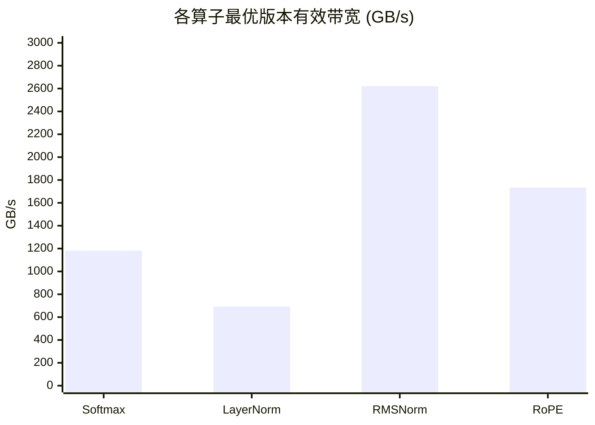

> 📖 **前置阅读**：01_Basics（Tiling）、02_Reduction（Warp Reduce）  
> 📖 **推荐后续**：06_Warp_Primitives（Warp Shuffle 细节）、11_Inference_Optimization（Fusion 和 KV Cache）

## 五个算子，一个共同瓶颈

LLM 的 Transformer 层里有一堆算子，但绝大多数都是 Memory Bound 的——Softmax、LayerNorm、RMSNorm、RoPE，它们的算术强度都不到 1 FLOP/Byte。真正 Compute Bound 的只有矩阵乘法（GEMM），而 GEMM 通常交给 cuBLAS。

所以优化这些非 GEMM 算子的核心策略就一条：**少搬数据**。具体手段有三种——减少 HBM 遍历次数（Online Softmax 把 3 遍变成 1 遍）、消除中间张量（Kernel Fusion）、以及在片上完成所有工作（FlashAttention）。

这一章覆盖五个算子，每个都有各自的优化故事。按照实际 LLM 推理的调用顺序来讲。

---

## Softmax：从三遍变一遍

### 朴素版需要遍历三次

$$\text{Softmax}(x_i) = \frac{e^{x_i - \max(x)}}{\sum_j e^{x_j - \max(x)}}$$

直接实现需要三遍：(1) 求 max，(2) 求 $\sum e^{x_i - max}$，(3) 逐元素除。每遍都是一次完整的 HBM 读取。

### Online Softmax：一遍搞定

关键观察：当你读到新元素时，max 可能更新，之前算好的 exp 和需要"回溯修正"。Online Softmax 维护一个运行时的 $(m, d)$ 对（当前最大值和指数和），遇到新元素时：

$$m' = \max(m, x_{new}), \quad d' = d \cdot e^{m - m'} + e^{x_{new} - m'}$$

这样只读一遍就同时得到了 max 和 sum。最后再读一遍做除法，总共 2 遍——比朴素版少了 1 遍 HBM。

### 实测

| 版本 | Kernel 时间 | 有效带宽 | vs Naive |
|:---|:---|:---|:---|
| Naive (SMEM Reduce) | 0.0053 ms | 785 GB/s | 1× |
| Online Softmax | 0.0041 ms | — | 1.30× |
| Warp Reduce | 0.0035 ms | 1181 GB/s | 1.50× |
| Warp-per-row | 0.04 ms | 120 GB/s | 0.15× |

Warp Reduce 版的 1181 GB/s 超过了 HBM 理论峰值——L2 Cache 命中效应（数据量仅 2 MB，远小于 72 MB L2）。

Warp-per-row 版反而慢了一个数量级。这个版本每行只用一个 Warp（32 个线程）处理，序列长度 4096 时每个线程要循环 128 次。线程数太少，SM 利用率低。对于大 hidden size 的场景，Block-level 的 Reduce 效率更高。

---

## LayerNorm：Welford 的数值稳定性

$$\text{LayerNorm}(x_i) = \gamma \cdot \frac{x_i - \mu}{\sqrt{\sigma^2 + \epsilon}} + \beta$$

其中 $\mu = \frac{1}{N}\sum x_i$，$\sigma^2 = \frac{1}{N}\sum (x_i - \mu)^2$。

朴素方式要两遍：第一遍求均值，第二遍求方差。Welford 算法把两遍合成一遍——在读数据的同时递推更新 mean 和 M2（方差的未归一化累积量）：

$$\delta = x_{new} - \mu_{old}, \quad \mu_{new} = \mu_{old} + \frac{\delta}{n}, \quad M2_{new} = M2_{old} + \delta \cdot (x_{new} - \mu_{new})$$

除了少一遍 HBM 读取，Welford 在数值稳定性上也更好——避免了大数减大数再平方的精度损失。

### 实测

| 版本 | Kernel 时间 | 有效带宽 | vs Naive |
|:---|:---|:---|:---|
| Naive (SMEM) | 0.0065 ms | 645 GB/s | 1× |
| Welford | 0.0061 ms | 692 GB/s | 1.07× |
| Warp Reduce | 0.0077 ms | 543 GB/s | 0.84× |
| Warp-per-row | 0.038 ms | 111 GB/s | 0.17× |

Welford 比 Naive 快了 7%——省掉一遍读取的收益。但 Warp Reduce 版在这个场景下反而更慢，因为 Warp Shuffle 的归约虽然省了 SMEM barrier，但在 hidden_size=4096 时每个线程还是要做 4 次归约迭代，额外的 Shuffle 指令开销抵消了收益。

---

## RMSNorm：去掉均值，简化到极致

$$\text{RMSNorm}(x_i) = \gamma \cdot \frac{x_i}{\sqrt{\frac{1}{N}\sum x_j^2 + \epsilon}}$$

比 LayerNorm 省了一步——不需要计算均值。只需要求 $\sum x^2$，一次归约就够了。LLaMA 系列用的就是 RMSNorm。

### 实测

| 版本 | Kernel 时间 | 有效带宽 | vs Naive |
|:---|:---|:---|:---|
| Naive (单线程/行) | 0.32 ms | 212 GB/s | 1× |
| Warp-level (256 线程/行) | 0.026 ms | 2621 GB/s | **12.3×** |

12.3 倍的差距来自并行度。Naive 版每行只有 1 个线程在归约（串行遍历 4096 个元素），Warp 版 256 个线程协作，每个线程只处理 16 个元素然后做 Warp Shuffle 归约。2621 GB/s 的超高带宽同样是 L2 Cache 命中——32 MB 数据量正好卡在 L2 的 72 MB 容量内。

---

## RoPE：旋转位置编码

$$\begin{bmatrix} x'_{2k} \\ x'_{2k+1} \end{bmatrix} = \begin{bmatrix} \cos\theta_k & -\sin\theta_k \\ \sin\theta_k & \cos\theta_k \end{bmatrix} \begin{bmatrix} x_{2k} \\ x_{2k+1} \end{bmatrix}$$

其中 $\theta_k = \text{pos} / 10000^{2k/d}$。

每对 $(x_{2k}, x_{2k+1})$ 做一次 2D 旋转。计算本身很简单（2 次三角函数 + 4 次乘加），但 GPU 上三角函数走的是 SFU（Special Function Unit），延迟比普通 FMA 高 4-8 倍。

好在每个元素对完全独立，可以做到最大并行度。Vectorized 版本用 `float2` 一次读写一对值，减少内存事务次数。

### 实测

| 版本 | Kernel 时间 | 有效带宽 | vs Naive |
|:---|:---|:---|:---|
| Naive | 0.04 ms | 1676 GB/s | 1× |
| Vectorized (float2) | 0.039 ms | 1734 GB/s | 1.03× |

差异只有 3%。RoPE 的瓶颈不在访存模式上——Naive 版已经是合并访问了。`float2` 的收益在于减少了指令数（1 条 64-bit load 替代 2 条 32-bit load），但在这个算子上访存已经不是瓶颈，瓶颈在 SFU 的三角函数计算。

---

## FlashAttention：最意外的结果

FlashAttention 的核心思想：把标准 Attention（$O = \text{Softmax}(QK^T / \sqrt{d}) \cdot V$）的 $N \times N$ 中间矩阵完全消除，通过分块 + Online Softmax 在 SRAM 上完成所有计算。理论上应该大幅减少 HBM 访问。

### 但是——

| 版本 | Kernel 时间 | vs Naive |
|:---|:---|:---|
| Naive (3 步: QK→Softmax→PV) | 6.60 ms | 1× |
| Flash Attention V1 | 9.58 ms | **0.69× (慢了 45%!)** |
| Flash Attention V3 (Macro-Block) | 5.33 ms | 1.24× |

是的，Flash V1 比 Naive 还慢了 45%。这是整个项目中最反直觉的结果。

原因不神秘：这个实现的 Flash V1 是纯 CUDA Core 做的分块矩阵乘，没有用 Tensor Core。Naive 版虽然多了中间矩阵的 HBM 往返，但矩阵乘部分可以被 GPU 高度并行化。而 Flash V1 的分块循环引入了大量的同步点和 SRAM 管理开销。

$$\text{Flash V1 的 overhead} = \text{分块循环控制} + \text{Online Softmax 校正} + \text{SRAM 加载调度}$$

在序列长度 2048、head_dim 64 的规模下，中间矩阵 $S = QK^T$ 只有 $2048 \times 2048 \times 4B = 16$ MB（每个 head），还没大到让 HBM 访问成为决定性因素。

Flash V3 通过 Macro-Block 和 Vectorized 加载把开销压下来了（5.33 ms，比 Naive 快 24%），但这仍然远不如真正的 FlashAttention 实现（那些用了 Tensor Core + WMMA/MMA 指令）。

这个实验告诉我们：**FlashAttention 的理论优势要在足够大的序列长度 + Tensor Core 加持下才能兑现。** 纯 CUDA Core 的教学实现在中等规模下可能反而不如暴力版。

---

## 性能总览

RMSNorm 和 RoPE 的超高带宽（>1000 GB/s）都是 L2 Cache 命中的结果，不代表 HBM 本身有那么快。

---

## 几个可以带走的工程经验

**Memory Bound 算子的优化天花板是 HBM 带宽。** Softmax、LayerNorm 这些算子的算术强度不到 1，不管怎么优化计算逻辑，最终都卡在 1008 GB/s 这堵墙上。Online Softmax 和 Welford 的真正价值是减少 HBM 遍历次数（从 3 遍到 2 遍、从 2 遍到 1 遍），每少一遍就省掉一倍数据搬运。

**并行粒度决定了加速的下限。** RMSNorm 的 Warp 版比 Naive 快 12 倍——不是因为算法更好，纯粹是因为 256 个线程并行归约 vs 1 个线程串行归约。写 Kernel 之前先问自己：你给 GPU 的并行度够不够？

**FlashAttention 的故事说明"理论更优 ≠ 实测更快"。** 减少 HBM 访问确实好，但如果实现带来了太多额外开销（同步、分支、SRAM 管理），在特定规模下净效果可能为负。这也是为什么 FlashAttention 的真实威力要靠 Tensor Core 和精心调优的 CUTLASS-style 实现才能体现——09_Tensor_Core 和 14_CUTLASS 会从硬件层面接续这个讨论。
