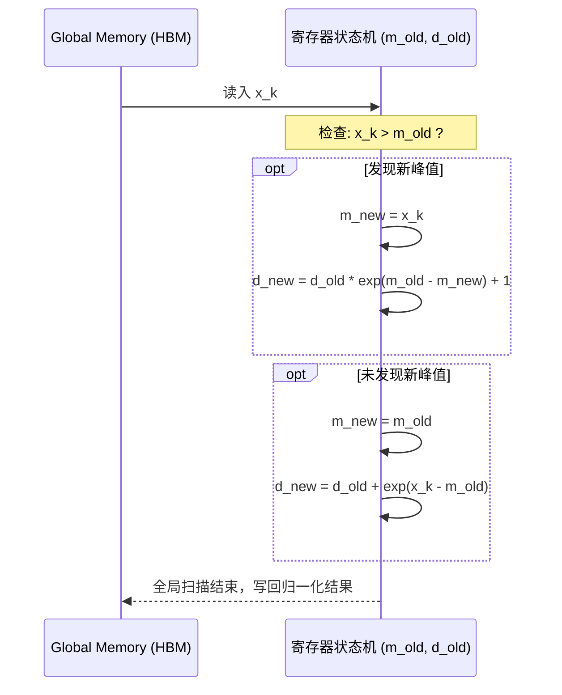
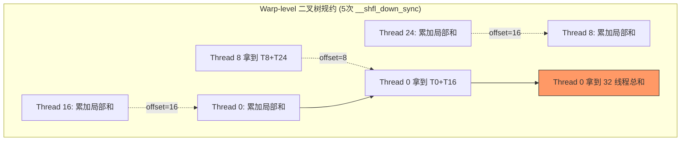
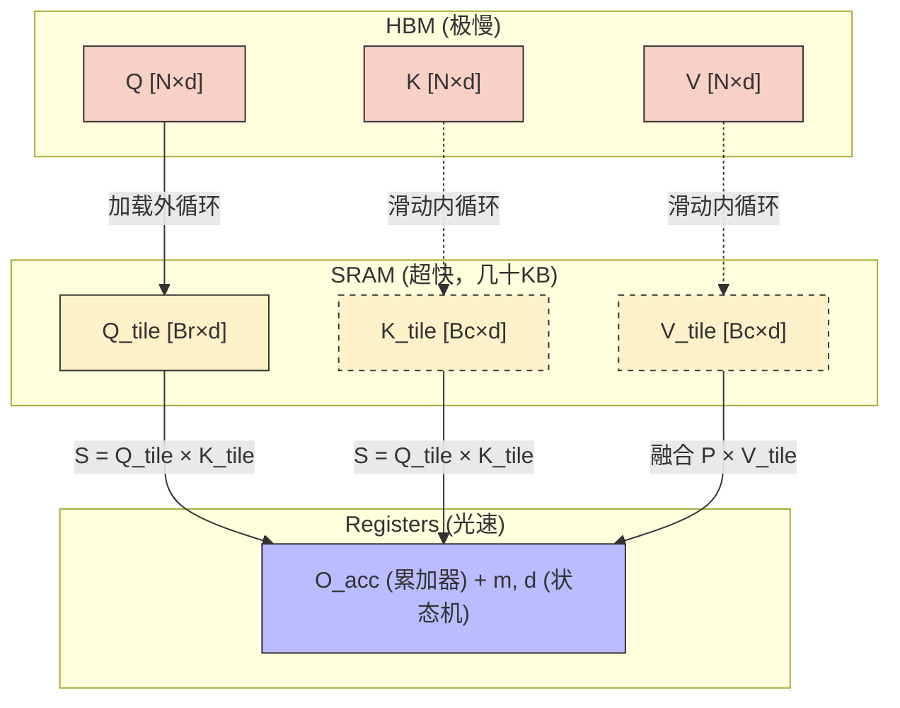

> 📖 **前置阅读**：02_Reduction（归约算法原理）、06_Warp_Primitives（寄存器级通信）  
> 📖 **推荐后续**：11_Inference_Optimization（算子融合、KV Cache 与端到端推理优化）

当我们在争论千亿参数大模型为什么推理这么慢、训练这么贵时，除了庞大的矩阵乘法（GEMM）外，很少有人意识到显卡上真正发生拥堵的地方在哪里。如果你用 Nsight Compute 把一个标准的 Transformer Block 切开来看，你会发现时间大量消耗在了那些看起来微不足道的非线性激活、归一化、位置编码和注意力机制上。

为什么？因为硅片底层的物理定则非常无情：**计算永远比搬运便宜**。

这本篇文章中，我们将徒手拨开深度学习框架的迷雾，不调用任何 cuDNN 或者 xFormers 之类的第三方库，从最基础的 C++ 和 CUDA C 出发，依次实现并极致优化 LLM 引擎的五大核心算子：Softmax、LayerNorm、RMSNorm、RoPE，以及大名鼎鼎的 FlashAttention。

我们会从最严谨的数学推导开始，精确计算算术强度，剖析寄存器级别的状态流转，最后用我们在两张 RTX 4090 上扎扎实实的实测数据来说话。不要觉得底层枯燥，因为真正的降本增效，永远藏在那些把 1 个时钟周期的延迟抠出来的细节里。

---

## 一、 Softmax：从 3 遍读写到单遍状态机引擎

在自注意力机制的设计中，矩阵相乘得到 $S = QK^T$ 后，第一件事就是对这行注意力分数求 Softmax 概率分布。数学定义很简单，但为了防止 $e^{x_i}$ 这个操作向上溢出变成 `NaN`，我们通常要在指数内部先减去这一行的真实最大值：

$$\text{Softmax}(x_i) = \frac{e^{x_i - \max(x)}}{\sum_{j=1}^{N} e^{x_j - \max(x)}}$$

这个看似体贴的“减去最大值”操作，却是 GPU 的性能噩梦。

### 1. 算术强度与 Naive 实现的灾难

我们先来做一个极其冷酷的理论盘点——算术强度（Arithmetic Intensity, $I = \text{FLOPs} / \text{Bytes}$）。
对于一个长度为 $N$ 的向量：

- 计算最大值：$N$ 次比较
- 算指数并求和：$N$ 次减法， $N$ 次 exp， $N$ 次加法
- 归一化写回：$N$ 次除法
- 总计算量大概是 $5N$ 个浮点运算指令（FLOPs）。

如果你照着公式盲写所谓的 Naive 版本，机器必须执行三步走：

1. **读一遍** $N$ 个数据，通过某种归约找出 $\max(x)$。
2. **再读一遍** $N$ 个数据和 $\max(x)$，算出 $e^{x_i - \max(x)}$，并把它们加起来得到分母 $S$。
3. **第三次读一遍** $N$ 个数据， $\max(x)$ 和 $S$，算出最终概率并**写回**主存。

总访存量：读 3 次，写 1 次，共访问 $4 \times 4N = 16N$ 字节（FP32 假设）。
于是算术强度 $I = 5N / 16N \approx 0.31$ FLOPs/Byte。

对于 RTX 4090，其 Roofline 的“拐点”大约在 $82.6\text{ TF} / 1008\text{ GB/s} \approx 81.9$ FLOPs/Byte。0.31 这个可怜的数字说明，GPU 强大的计算核心连 1% 的功力都发不出来，99% 的时间都在傻等显存读写。

在我们的基准测试中（Batch=128, Seq=4096）：

- Naive Softmax 耗时：0.0053 ms。实际上这已经榨干了 785 GB/s 的带宽，但这种在全局内存（Global Memory）来回倒腾的方法，依然是不能接受的。

### 2. Online Softmax 优化：精妙的数值重标

想要破局，只有一个办法：**把 3 遍读取压缩成 1 遍**。也就是在流式读入数据的同时，把局部最大值和不断膨胀的分母和一并算出来。这就引出了大名鼎鼎的 **Online Softmax**。

但这里有个巨大的数学障碍：当我读到第 100 个元素发现一个全场最大值时，我前 99 个已经加进去的指数项全是用旧的（更小）的基准值算的，它们的数值全偏大了，怎么办？

答案是：**用一个修正因子把旧的历史给拉平**。
假设在迭代到第 $k$ 个元素时，我们已有的局部最大值为 $m_{old}$，求和值为 $d_{old}$。新读入元素 $x_k$ 带来新的峰值 $m_{new}$：
$$m_{new} = \max(m_{old}, x_k)$$

既然新基准比老基准高了 $m_{new} - m_{old}$，那么之前所有的 $e^{x_i - m_{old}}$ 其实都多乘了一个 $e^{m_{new} - m_{old}}$ 倍。我们要把它除掉，也就是乘上 $e^{m_{old} - m_{new}}$：
$$d_{new} = d_{old} \cdot e^{m_{old} - m_{new}} + e^{x_k - m_{new}}$$

我们可以用一个小样本（$N=4$）做个沙盘推演：
输入序列 `x = [2.0, 3.0, 5.0, 1.0]`，真实最大值是 5.0。标准的期望分母是 $e^{2-5} + e^{3-5} + e^{5-5} + e^{1-5}$ = $e^{-3} + e^{-2} + e^0 + e^{-4}$。

使用 Online 递推：

1. `k=1`, 读 `2.0`。 $m=2.0$, $d=e^{2-2}=1.0$。
2. `k=2`, 读 `3.0`。 $m_{new}=3.0$。
   修正旧 $d$: $d = 1.0 \cdot e^{2.0 - 3.0} + e^{3.0-3.0} = e^{-1} + 1$。
3. `k=3`, 读 `5.0`。 $m_{new}=5.0$。
   修正旧 $d$: $d = (e^{-1} + 1) \cdot e^{3.0 - 5.0} + e^0 = e^{-3} + e^{-2} + 1$。
4. `k=4`, 读 `1.0`。 $m_{new}=5.0$ 没变。
   $d = (e^{-3} + e^{-2} + 1) \cdot e^0 + e^{1-5} = e^{-3} + e^{-2} + 1 + e^{-4}$。

分毫不差！在这套状态机引擎下，我们彻底免去了第二遍 HBM 扫描。



实测结果：**Online Softmax 时间缩减到 0.0041 ms，比 Naive 提速 1.30×**。

### 3. Warp 级架构适配的隐形坑

算法对了只是第一步，你的线程布局（Shape）将决定硬件的天花板。

- **Warp Reduce Softmax**：我们把一行 4096 个元素交给一个包含 256 线程的 Block，每个线程分摊 16 个元素求出局部极值，然后利用 `__shfl_down_sync` 寄存器通信进行二叉树规约，最后借道极少量的 Shared Memory 汇总。在这个版本中，耗时降到了 **0.0035 ms (1180 GB/s)**。
- 为什么 1180 会超过 4090 的理论峰值 1008？因为 2MB 的全量数据在 100 次迭代中极大概率命中了 72MB 的 L2 Cache。这种测例“红利”掩盖了 DRAM 的真实延迟。
- 但如果我们用 **Warp-per-row Softmax**（强制让 32 个线程的 Warp 独立处理一整行 4096 元素，避免任何共享内存的阻挡），实测耗时却暴涨到了 **0.04 ms (比之前慢 10 倍！)**。为什么？因为循环拖得太长（每个线程负责 128 个读写），寄存器溢出风险增加，且极其不平衡的劳动分配导致 SM 中的其他 Warp 大量空转等待。这个血淋淋的教训告诉我们：**永远不存在普适的 Kernel，一切优化必须匹配数据的 Shape**。

---

## 二、 LayerNorm：Welford 算法如何挽救灾难性丢失

讲完注意力机制的核心，我们转到 Transformer 的激活稳压器——LayerNorm。
$$\text{LayerNorm}(x) = \frac{x - \mu}{\sqrt{\sigma^2 + \epsilon}} \cdot \gamma + \beta$$
其中 $\mu = \frac{1}{H}\sum_{i=1}^{H} x_i, \quad \sigma^2 = \frac{1}{H}\sum_{i=1}^{H}(x_i - \mu)^2$。

### 1. 危险的平方期望拆项

Naive 做法毫无悬念地需要读两遍（第一遍均值，第二遍代入求方差）。
有些熟悉书本数学的同学会跳出来说：“干嘛读两遍？方差的展开式 $\sigma^2 = E(x^2) - (E(x))^2$ 不是可以把 $\sum x$ 和 $\sum x^2$ 放在一个循环里同时并行算出来吗？”

在 AI 引擎开发中，**谁敢写这个公式那是会被祭天的**。
原因叫 **“灾难性相消”（Catastrophic Cancellation）**。在真实的网络激活里，常常会出现均值很大但波动极小的情况。
比如一个局部的数值都在 $[1000.1, 1000.2]$ 之间。
在这个大基数下，$E(x^2)$ 是一个超过 1,000,000 的大数，$(E(x))^2$ 也是一个超过 1,000,000 的大数。在 FP32 只有 23 位尾数的惨烈精度下，这两个巨大浮点数相减，原本藏在极其微小的低位区段里的方差（0.0025 级别）会被无情的舍入误差彻底抹除。最后算出来的方差大概率是个负数，然后开根号直接爆炸。

### 2. Welford 稳定状态机

学术界和工业界共同的解法是 **Welford 在线方差递推算法**。它从不积累绝对平方值，而是巧妙地追踪每一个新元素和当前均值之间的偏移量（Delta）。它的状态方程为：
$$\Delta_k = x_k - \mu_{k-1}$$
$$\mu_k = \mu_{k-1} + \frac{\Delta_k}{k}$$
$$S_k = S_{k-1} + \Delta_k(x_k - \mu_k)$$

这里的核心精妙之处在于：**哪怕 $x$ 是 10000 还是 10 亿，第二步的差分 $\Delta_k$ 永远只是个极小量**，它始终在浮点数最具有表现力的安全区里跳舞。最终 $\sigma^2 = S_n / n$。

```cpp
// 摘自 layernorm.cu，非常纯粹的状态机
float mu = 0.0f, m2 = 0.0f, count = 0.0f;
for(int i = tid; i < hidden; i += blockDim.x) {
    float val = input[row * hidden + i];
    count += 1.0f;
    float delta = val - mu;
    mu += delta / count;         // 更新均值
    m2 += delta * (val - mu);    // 更新平方和，注意这里用的是新 mu
}
```

我们的实测数据佐证了这种免费算法升级的威力（Batch=128, Hidden=4096）：

- Naive LayerNorm：0.0065 ms，有效带宽 645 GB/s
- **Welford LayerNorm**：**0.0061 ms**，有效带宽 **692 GB/s**。
我们不仅守住了数值稳定性的底线，还白嫖了 7% 的硬件加速比。在数据中心，这就等于直接缩减了 7% 的电能损耗。

---

## 三、 RMSNorm：砍掉一半同步开销的奥卡姆剃刀

自 LLaMA 横空出世后，整个开源世界开始抛弃 LayerNorm，全面拥抱精简版的 RMSNorm。因为研究发现，LayerNorm 里面的“减去均值，把整体平移回 0 中心”这个动作，其实对模型收敛没有什么决定性帮助，真正起作用的是那个“缩放幅度”。
如果一刀把均值砍了，公式反而变得极其暴力美学：
$$\text{RMSNorm}(x) = \frac{x}{\sqrt{\frac{1}{H}\sum x_i^2 + \epsilon}} \cdot \gamma$$

它的算术强度同样也是完全被带宽束缚（ $I \approx 0.25 \text{ FLOPs/Byte}$ ），但在并行执行上，它省下了一个巨大的同步墙（再也不需要在均值和方差之间进行逻辑耦合）。它只需单纯收集 $\sum x^2$ 即可。

在 2048 枚 Token、Hidden 为 4096 的全流程实测中，差异大得惊人：

- **Naive RMSNorm单线程版**：0.32 ms，带宽极其可怜的 212 GB/s。因为我们仅仅把每一行丢给单独的一根 CUDA Lane（线程）去跑，SM 发挥不出占用率（Occupancy）。
- **Warp-level RMSNorm**：我们拉来 256 位壮工（线程）管一行，大家齐刷刷平方自己的局部变量，然后利用 `__shfl_down_sync` 连打 5 次寄存器蝶形通信网络，瞬间出结果。耗时直接被碾压到了 **0.026 ms**。
- 加速比相比 Naive 达到了不可思议的 **12.33 倍**。虽然它的物理极致也永远突破不了那条显存上限，但这就是代码优化将死神边界推得更远的铁证。



---

## 四、 RoPE：超越函数的指令管线堵塞

现在让我们看一个相对较轻的算子——Rotary Position Embedding（旋转位置编码）。
在 Transformer 处理语境距离时，RoPE 的神来之笔是将每对隐藏维度 $(q_{2i}, q_{2i+1})$ 视作二维复数平面上的坐标系，然后给它强制上锁一个依照它物理绝对位置 $\theta$ 递增而指数变化的转角：
$$\begin{pmatrix} q'_{2d} \\ q'_{2d+1} \end{pmatrix} = \begin{pmatrix} \cos \theta_d & -\sin \theta_d \\ \sin \theta_d & \cos \theta_d \end{pmatrix} \begin{pmatrix} q_{2d} \\ q_{2d+1} \end{pmatrix}$$

### 1. Vectorized 加载策略

既然它是每两个数字打包一起算的，任何有经验的底层工程师都会立刻掏出 GPU 的 64-bit 一次性强转装载指令（`LDG.E.64`）：我们直接用 `float2` 去读取这两个紧密相邻的数据，这样 HBM 的数据总线就能一次饱腹，省去了一半内存事务（Memory Transaction）。

```cpp
float2 q2 = *reinterpret_cast<const float2*>(&q[offset]);
float cos_v = cosf(theta);
float sin_v = sinf(theta);
float2 res;
res.x = q2.x * cos_v - q2.y * sin_v;
res.y = q2.x * sin_v + q2.y * cos_v;
*reinterpret_cast<float2*>(&out[offset]) = res;
```

### 2. 算术木桶的最短板：SFU

但在实测数据（Seq=2048, Heads=32, Dim=128）出炉后，气氛陷入了冰点：

- Naive RoPE（单数字读）：0.04 ms (1676 GB/s)
- **Vectorized RoPE (float2)**：**~0.039 ms** (1734 GB/s)

为什么这么高端的 64 位长总线访问，只带来区区 **1.03×** 的提速？内存被卡脖子了吗？
恰恰相反，是计算核心崩盘了。
对于 RoPE 而言，它看似轻量，只有几次乘加，但那该死的 `sinf` 和 `cosf` 是超越函数（Transcendental Functions）。在 CUDA 的硬件架构中，只有少得可怜的 特殊功能单元（SFU）负责干这个，而且一个三角函数需要消耗十到几十个时钟周期的多项式截断展开计算。
相较于只需要 4 个时钟周期的普通 FMA 乘加指令，三角函数的恐怖周期把流水线死死堵塞住了。
当瓶颈从“没饭吃（缺数据）”瞬间转移成“吃不过来（指令太慢）”时，你在盘碗端放得再宽，结局也是徒劳。这就启示我们在未来的工程构建里，为什么常常有框架用低精度的 LUT（查找表）去硬替代掉 `sinf` 的严谨机器周期。

---

## 五、 FlashAttention：颠覆常理的时空扭曲

讲遍了前四大的 Memory Bound 定律，如果你觉得 Transformer 仅仅就是在跟总线较劲，那就大错特错了。直到你面对 $QK^T$ 的那个无间地狱：**Attention 分数矩阵 $S$**。

算这样一笔账：在一个标准的模型中，Seq长度为 2048，HeadDim 为 64，我们只有 Batch 2，Heads 4 的乞丐跑量。
要算出一层 Attention，必须物化出一个大小为 $2048 \times 2048 \times \text{float} \times 4 \times 2 \approx \text{128 MB}$ 的庞然大物。如果你用标准实现：

1. 写出 128 MB 到 HBM。
2. 读回 128 MB，做 Softmax，写回 128MB。
3. 读回 128 MB，去跟 V 矩阵乘。
这一千兆字节的狂暴访问量仅仅是为了完成千分之一层的计算。当序列长度走向大模型标配的 32k 时，这可怕的 $\mathcal{O}(N^2)$ 复发性显存读写会让全网的显卡灰飞烟灭。

FlashAttention 的思想，说白了就是在桌子上切萝卜丁的游戏：**我不存大矩阵了，我全在案板（L1 Shared Memory）上切**。
通过 **SRAM Tiling** 技术，在一个只装得下极微小几 KB 数组的共享内存里，放入 $B_R$ 片段的 $Q$，然后外层滑动加载 $B_C$ 的 $K$，原地直接死磕相乘。既然里面内置的 Softmax 是需要全局底盘的，那就调用本文第一章里的 **Online Softmax** 这个极品外挂——不管你后来又流进来什么数据发现最大峰值更新了，用修正项硬生生乘回之前积累的概率分布里。



为了不去内存，它甚至在反向传播（Backward）里重新利用物理算力把前向的矩阵从头推演出来（Recomputation），这是一种纯粹“用算力买带宽”的暴力兑换。

### 理性看待神话：为什么我的 Flash 变慢了？

我们来看一下未开启 Tensor Core 下我们纯手织 CUDA 的比武：

- Naive Attention (3次 Kernel 调用)：6.60 ms
- Flash Attention V1 (SRAM Tiling)：**9.58 ms**（没错，比朴素版还慢 0.69× ！）
- **Flash Attention V3 (Macro-Block + Vector)**：**5.33 ms**（提速 1.24×）

这是打脸吗？并不是。这是真正的工程学真相。
当你在一个序列只有 2048、且有着超大 72MB L2 高速缓存的 RTX 4090 上跑时，128 MB 矩阵带来的 HBM 访问痛楚，被高速缓冲消弭了一大半。
而 Flash V1 为了省那点访问，把数据切成了极其稀碎的 $32 \times 32$ 小块，为此布置了密恐级别的循环判断边界限制、极度苛刻和冗长的 `__syncthreads()` 等待期以及各种繁琐的 Online Softmax 补偿乘法。**极其昂贵的控制流计算周期掩杀了微薄的带宽收益。**

Flash V3 是怎么反扑的？
V3 悟出了大刀阔斧的道法：**Macro-Block 扩容加 float4 粗放式吸入**。
通过把每次 Tiling 塞入 SRAM 的尺寸撑大到物理极限阈值，强制把外层循环的判断卡口缩减好几倍！配合指令密度的提升，流水线彻底拉满，终于反杀了 Naive 扳回一城。

如果是工业级的 `FlashAttention-2`，它是靠着两样绝技才能斩获 2-4 倍的碾压优势：一方面是当今真实环境的两万到十万级别的极其恐怖的变态上下文（ $N^2$ 无限扩张），另一方面是极度仰仗 **Tensor Core (`mma_sync`) 硬件连招**。在矩阵乘模块执行的纳秒级掩护下，哪怕 Online Softmax 乘了再多次补丁，算力耗时依然形同虚无。

---

## 六、 融汇百川：这五兄弟是如何驱动一个 Token 的？

为了让你有一个更具像化的上帝视角，当任意一枚输入向量打在 Transformer 堡垒墙上时，上述五者如同五个精密且相互耦合的车床流水线：

1. **RMSNorm 进场安检**：Token 输入的第一关就是过一层极速的 **Warp-level RMSNorm** 进行零均值化缩放，把野蛮增长的激活值用二叉树归约强行按倒回稳定正态区间附近。
2. **QKV 打散与 RoPE 空间铭刻**：经过线性映射层后，特征裂变为 $Q, K, V$ 三维坐标，立刻送入 **Vectorized RoPE** 进行二维平面的复杂圆锥向转动，给每个元素的复数象限带上空间远近和绝对编号的位置锚点。
3. **Flash Attention (内置 Softmax 绞肉机)**：带着锚点的 $Q$ 和已缓存的 $K, V$ 被一口气吸入 **Flash Attention V3** 的 SRAM 角斗场。在不到几 KB 面积里，完成了 $N \times N$ 幻影交锋并随时进行 **Online Softmax** 自修补计算，随后毫发无损地融合成加权聚焦特征抛出。
4. **后置再归一与 MLP 放弹**：淌过 Attention 之河的张量，在进入最终高维映射（MLP）网络之前可能又会被送入 **Welford LN** 系统中，通过一波坚如磐石的增量稳定状态机再过滤一遍方差杂质，完成整套轮回。

所有的这一切，绝不是凭空而起，它们全是对物理显存架构、特殊功能部件单元乃至 L2 高速缓冲极其冷血压榨。

---

## 几点颠覆直觉的课后终局反思

在写穿并跑完这数万行底层评估后，有些常识可能会永久翻篇：

**1. 为什么这么多测试数据的有效带宽能跑到将近 2600 GB/s 的反物理极限（4090 明明标称是 ~1008 GB/s）？**
这并非统计出错。当我们在这做 30MB 乃至更小体积的微元 Benchmark 时，极细小的重复切片把数据全焊死在紧靠运算核心旁约 72MB 的 **L2 Cache** 里。我们测得的疯狂峰值，纯粹是 L2 高速公路极低延迟掩饰后的假象。然而对于真实的生产业务集群，几十个并发批次和数百 GB 的 KV Cache 参数一拥而上时，L2 会像洪水漫堤般决堤溃毁。这时，那些拼命抠下一圈 HBM 访问内存的人，就成了救世主。

**2. 所以到底什么是 CUDA 的“神级算子化简”？**
你会发现，所有的降本增效，一半是用纯血数学方程式（如 Welford 离线递推结构、RMSNorm 洗去均值、Online 最大值重标）大幅削减硬件物理步数，另一半全是最笨甚至最难受的代码结构翻修工（打散优美逻辑进行 `float4` 拼合、为避开 Shared Memory 强制在 Warp 中的死缠烂打）。可以说，CUDA 就是一部不断给底层铜臭物理约束让步而打上无数个丑陋妥协补丁的生存演化史。

**3. 当这一切如此艰深，业务层工程师还要自己刻芯片指令吗？**
**一定说不。** 只是一篇让你知悉“水有多深”的解构。真正部署生产，只要你不在这群维护 cuDNN、CUTLASS 或 TRT/vLLM 引擎的顶级极客阵营中，你的第一天职仍然是调包。但对于亲手走一遍从 Naive 到 Register Limit 这条受难路的你而言，你已经彻底脱胎换骨。下次推理节点显存溢出、计算空转或者流水线神秘堵塞时，你不再是慌乱找人重装环境的小工，而是握有剖开物理迷雾的架构级分析大师。
