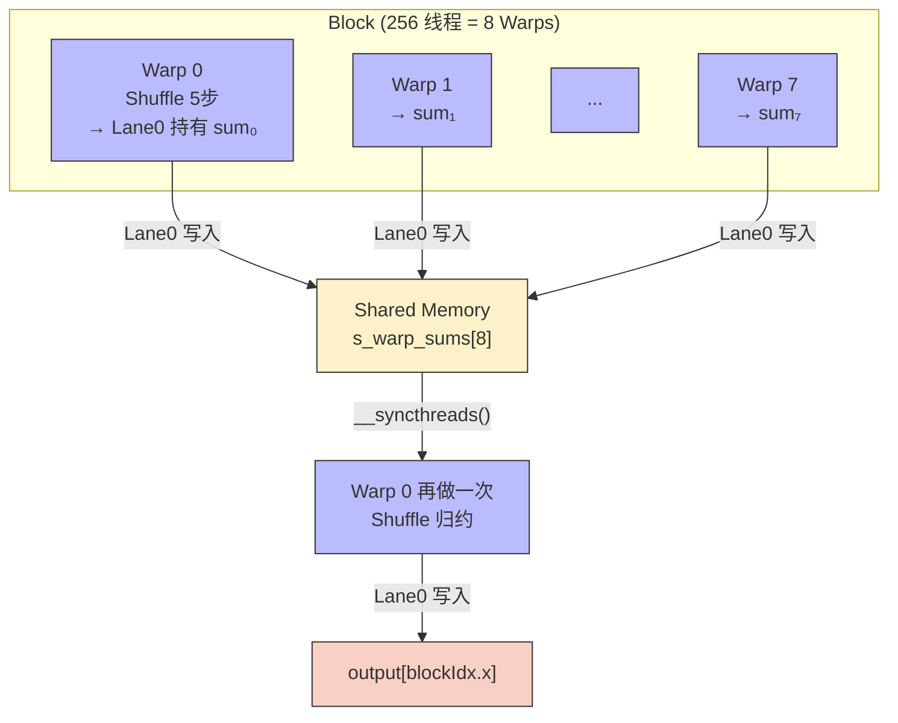
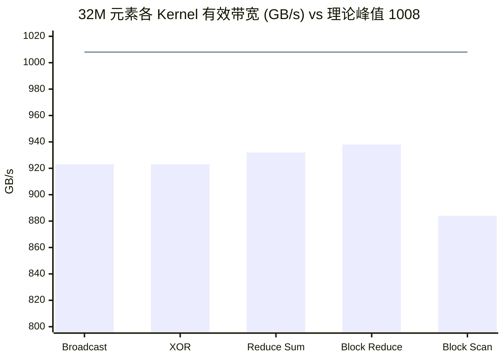

> 📖 **前置阅读**：02_Reduction（SMEM 归约）、03_Scan（前缀和）  
> 📖 **推荐后续**：05_LLM_Ops（Warp Reduce 在 Softmax/LayerNorm 中的应用）

## Shared Memory 也可以嫌慢

用 Shared Memory 做归约，每一轮都要走一套"写 SMEM → `__syncthreads()` → 读 SMEM"的流程。1024 线程的 Block 需要 10 轮，积累下来是好几百 cycle 的同步开销。更烦人的是，`__syncthreads()` 会把整个 Block 所有 Warp 都卡住——哪怕你只想在 32 个线程之间交换一个数。

从 Kepler 架构开始，NVIDIA 提供了一组 Warp Shuffle 指令（`__shfl_sync` 系列），让同一个 Warp 内的 32 个线程直接读取彼此的寄存器值。不走 SRAM，不需要 Barrier，延迟只有 1-2 cycle。原理也好理解：Warp 内 32 个线程本就是 lock-step 执行的，硬件上本来就能互相看到对方的寄存器。

---

## 四种 Shuffle 变体

| 指令 | 语义 | 典型场景 |
|:---|:---|:---|
| `__shfl_sync(mask, val, srcLane)` | 从指定 lane 广播 | 广播标量（如 Softmax 的分母） |
| `__shfl_down_sync(mask, val, δ)` | 从 `lane + δ` 读 | 归约（Reduce） |
| `__shfl_up_sync(mask, val, δ)` | 从 `lane - δ` 读 | 前缀和（Scan） |
| `__shfl_xor_sync(mask, val, laneMask)` | 从 `lane ⊕ laneMask` 读 | 蝴蝶交换（FFT 式） |

`mask = 0xffffffff` 表示全部 32 个 lane 参与。

### Warp Reduce：5 条指令归约 32 个数

```cpp
__device__ float warp_reduce_sum(float val) {
    val += __shfl_down_sync(0xffffffff, val, 16);
    val += __shfl_down_sync(0xffffffff, val, 8);
    val += __shfl_down_sync(0xffffffff, val, 4);
    val += __shfl_down_sync(0xffffffff, val, 2);
    val += __shfl_down_sync(0xffffffff, val, 1);
    return val; // lane 0 持有最终结果
}
```

5 轮 shuffle + 加法，零 SRAM，零 Barrier。总延迟约 10 cycle。对比 SMEM 归约的 ~300 cycle（含 10 次 barrier），延迟压缩了 30 倍。

以 8 线程简化看一下过程：

| Lane | 初始 | 轮 1 (δ=4) | 轮 2 (δ=2) | 轮 3 (δ=1) |
|:---:|:---:|:---:|:---:|:---:|
| 0 | $a$ | $a{+}e$ | $a{+}c{+}e{+}g$ | **全和** ✓ |
| 1 | $b$ | $b{+}f$ | $b{+}d{+}f{+}h$ | — |
| 2 | $c$ | $c{+}g$ | — | — |
| 3 | $d$ | $d{+}h$ | — | — |
| 4 | $e$ | (无效) | — | — |

### Warp Scan：`__shfl_up_sync` 构建前缀和

5 轮 offset 依次为 {1, 2, 4, 8, 16}。每轮中 `lane >= offset` 的线程把 `lane - offset` 的值加上自己的：

$$y_i^{(k)} = \begin{cases} y_i^{(k-1)} + y_{i-2^{k-1}}^{(k-1)} & \text{if } i \ge 2^{k-1} \\ y_i^{(k-1)} & \text{otherwise} \end{cases}$$

5 轮之后，每个 Lane $i$ 持有从 Lane 0 到 Lane $i$ 的 Inclusive Prefix Sum。同样零 SRAM、零 Barrier。

---

## 从 Warp 到 Block：两级归约

单个 Warp 归约很快，但实际 Block 有 256 或 1024 个线程（8-32 个 Warp）。`__shfl_down_sync` 只能在同一 Warp 内通信——这是硬件的边界，没法绕过去。跨 Warp 的数据交换必须借助 Shared Memory。

解决方案是两级架构：



1. 每个 Warp 内部用 Shuffle 归约，结果在 Lane 0
2. 8 个 Lane 0 把结果写进 SMEM（只需要 8 个 float = 32 字节）
3. 一次 `__syncthreads()`
4. Warp 0 从 SMEM 读出这 8 个值，再做一次 Shuffle 归约

整个 Kernel 只需要 **1 次 `__syncthreads()`**，对比纯 SMEM 方案的 10 次。SMEM 用量也从 O(N) 压到 O(Warps)——256 线程只用 128 字节，Block Size 再怎么增大也不变。

### 关键代码

```cpp
// 第一级：Warp 内归约
float sum = input[tid];
#pragma unroll
for (int offset = 16; offset > 0; offset >>= 1)
    sum += __shfl_down_sync(0xffffffff, sum, offset);

// 跨 Warp 中转
__shared__ float shared_warp_sums[32];
if (lane_id == 0) shared_warp_sums[warp_id] = sum;
__syncthreads();  // 整个 Kernel 唯一一次 barrier

// 第二级：Warp 0 二次归约
if (warp_id == 0) {
    sum = (lane_id < num_warps) ? shared_warp_sums[lane_id] : 0.0f;
    for (int offset = 16; offset > 0; offset >>= 1)
        sum += __shfl_down_sync(0xffffffff, sum, offset);
    if (lane_id == 0) output[blockIdx.x] = sum;
}
```

`#pragma unroll` 会把循环展开成 5 条独立的 `SHFL` PTX 指令。编译器能做到这一点是因为每轮之间没有分支依赖。

### Block Scan 的三阶段

Block 级前缀和稍复杂，分三步：

| 阶段 | 操作 | 数据位置 |
|:---|:---|:---|
| ① Warp Scan | 每个 Warp 内做 Inclusive Scan | 寄存器 |
| ② SMEM 协调 | Lane 31 将本 Warp 总和写入 SMEM | SMEM |
| ③ 偏移叠加 | Warp 0 对 SMEM 中的 Warp 总和做 Exclusive Scan，结果加回各 Warp | SMEM → 寄存器 |

最终每个线程的结果 = Warp 内 Scan 结果 + 本 Warp 的 base offset。

### XOR Shuffle：蝴蝶交换

```cpp
val = __shfl_xor_sync(0xffffffff, val, 16);
// Lane 0 ↔ Lane 16, Lane 1 ↔ Lane 17, ...
```

`XOR 16` 让每个 Lane 和"另半个 Warp"的对称位置交换数据。这种蝴蝶模式是 FFT 和 AllReduce 的基础拓扑。组合不同的 `laneMask`（1, 2, 4, 8, 16）可以实现任意排列。

---

## 实测数据

测试环境：2× RTX 4090 (sm_89)，nvcc -O3，C++17。$N = 33{,}554{,}432$（32M 元素，128 MB），100 次平均。

### Shuffle 操作对比

| 操作 | Kernel 时间 | 有效带宽 | vs CPU |
|:---|:---|:---|:---|
| Warp Broadcast | 0.291 ms | 923 GB/s | 102× |
| XOR Shuffle | 0.291 ms | 923 GB/s | 140× |
| Up/Down Shuffle | 0.300 ms | ~900 GB/s | 163× |
| Warp Reduce Sum | 0.144 ms | 932 GB/s | 276× |

Broadcast、XOR、Up/Down 三种操作耗时几乎一样（~0.29ms）——因为它们本质上都是一次 Global Memory 全量读写 + 一条 Shuffle 指令。瓶颈完全在 HBM 带宽上，Shuffle 本身的延迟可以忽略。

Reduce Sum 快了一倍（0.14ms），因为输出量小得多：每个 Warp 的 32 个输入归约成 1 个输出，写回量只有输入的 1/32。

### Block 级归约

| 操作 | Kernel 时间 | 有效带宽 | 带宽利用率 | vs CPU |
|:---|:---|:---|:---|:---|
| Block Reduce Sum | 0.14 ms | 938 GB/s | 93.1% | 340× |
| Block Reduce Max | 0.14 ms | 938 GB/s | 93.1% | 351× |

938 GB/s = 理论峰值的 93%。对比 02_Reduction 中纯 SMEM 方案的 887 GB/s（粗化版），提升了约 6%。

来算一笔账：$N = 32M$ 元素 × 4B（读）+ $32M/256$ × 4B（写）= 128.5 MB。完美带宽下应耗时 $128.5/1008 = 0.127$ ms。实测 0.14 ms，差距 10% 来自 Grid Launch 开销（131,072 个 Block 的调度）、`atomicAdd` 竞争和尾部 Wave 效应。

### Block 级前缀和

| 操作 | Kernel 时间 | 有效带宽 | 带宽利用率 | vs CPU |
|:---|:---|:---|:---|:---|
| Block Inclusive Scan | 0.30 ms | 884 GB/s | 87.7% | 170× |
| Block Exclusive Scan | 0.30 ms | 885 GB/s | 87.8% | 170× |

Scan 比 Reduce 低了 6%。原因很直接：Scan 的写回量和读入量一样大（128 MB + 128 MB = 256 MB），双向总线压力倍增。而且 Scan 需要 2 次 `__syncthreads()`（Warp Scan 后写 SMEM + 读 offset 后加偏移），比 Reduce 多 1 次 barrier。



---

## Warp Shuffle vs Shared Memory：什么时候该用哪个

| 维度 | Warp Shuffle | Shared Memory |
|:---|:---|:---|
| 通信范围 | 同一 Warp 内（32 线程） | 同一 Block 内（最多 1024 线程） |
| 延迟 | ~1-2 cycle | ~20-30 cycle |
| 同步开销 | 隐式（Warp 内 lockstep） | 显式 `__syncthreads()` |
| 适用场景 | 归约、Scan、小范围广播 | Block 级通信、大块数据共享 |
| 局限 | 不能跨 Warp | 需要管理 Bank Conflict |

实际工程中两者经常组合使用——上面的 Block Reduce 就是典型例子：Warp 级用 Shuffle（从 256 归到 8），跨 Warp 用 SMEM 传递（从 8 归到 1）。

---

## 几个可以带走的结论

**Warp Shuffle 的价值在于消除 Warp 内通信的 SRAM 和 Barrier 开销。** 归约和 Scan 这种操作，Shuffle 比 Shared Memory 快 10-20 倍（就通信本身而言）。但在 128 MB 的大规模数据上，实际加速幅度只有 ~6%——因为瓶颈早已转移到了 HBM 带宽。

**938 GB/s 的 Block Reduce 基本到头了。** 93% 的峰值利用率意味着硬件层面能做的已经不多了。剩下的 7% 是 Kernel Launch 固定开销和显存控制器排队延迟。

**Reduce 和 Scan 的性能差来自物理，不来自代码。** Reduce 是"多对一"，写入量极小；Scan 是"多对多"，读写量对称。同样的算法思路，数据流向不同就差 6%——这是总线的物理约束，代码层面优化不了。

**Warp Shuffle 是一堆 LLM 算子的隐藏基础设施。** 05_LLM_Ops 里 Softmax 的 Warp Reduce、LayerNorm 的 Welford 归约、RMSNorm 的 12.3× 加速——背后都是 `__shfl_down_sync` 在干活。
