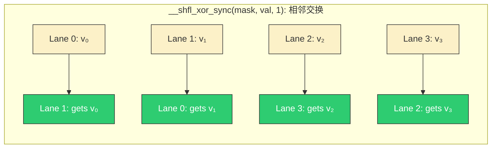
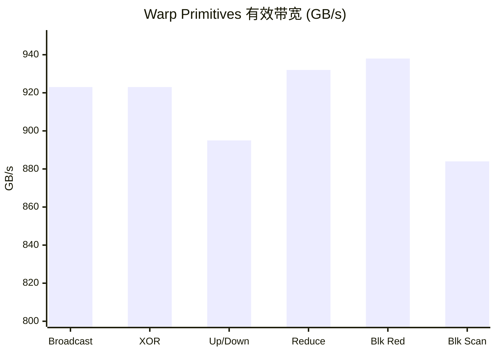

> 📖 **前置阅读**：02_Reduction（Shared Memory 归约）、03_Scan（Block Scan 算法）
> 📖 **推荐后续**：09_Tensor_Core（WMMA 的 Warp 协作）

02_Reduction 用 Shared Memory 做 Block 级归约——加载值到 SMEM → `__syncthreads` → 交错归约 → `__syncthreads` → ... 最终只有 Thread 0 持有结果。每一轮都过一遍 SMEM（~20 cycle 延迟）和 barrier。

但同一个 Warp（32 线程）**物理上共享同一个指令计数器**，不需要同步。`__shfl_sync` 系列指令让 Warp 内任意两个线程直接交换**寄存器值**——延迟 ~1 cycle，完全绕过内存层级。

---

## 四种 Shuffle 变体

| 变体 | 语义 | 典型用途 |
|:---|:---|:---|
| `__shfl_sync(mask, val, src)` | 从 Lane `src` 广播 `val` | 广播常量 |
| `__shfl_xor_sync(mask, val, lane_mask)` | 交换与自身 XOR 的 Lane 的值 | **蝶形归约** |
| `__shfl_up_sync(mask, val, delta)` | 读取 Lane `id - delta` 的值 | **前缀和** |
| `__shfl_down_sync(mask, val, delta)` | 读取 Lane `id + delta` 的值 | 数据下移 |



`mask = 0xFFFFFFFF` 表示全部 32 个 Lane 参与。如果只有部分线程活跃（如条件分支后），必须设置正确的 mask，否则行为未定义。

---

## 5 步 Warp Reduce

用 `__shfl_xor_sync` 做蝶形归约：每步 XOR mask 翻倍（1→2→4→8→16），5 步后 Lane 0 持有 32 个值的和。

```cpp
__device__ float warp_reduce_sum(float val) {
    for (int offset = 16; offset > 0; offset >>= 1)
        val += __shfl_xor_sync(0xFFFFFFFF, val, offset);
    return val;  // Lane 0 持有完整 sum
}
```

5 条指令、5 cycle、无 SMEM、无 barrier。对比 Shared Memory Reduce 需要 5 轮 SMEM 读写 + 5 次 `__syncthreads`。

---

## 两级归约：Warp Reduce + Block Reduce

一个 Block 有 256 线程 = 8 个 Warp。先做 Warp 级归约（5 步），每个 Warp 的 Lane 0 持有局部 sum，写入 SMEM。8 个局部 sum 再做一轮 Warp Reduce。

```cpp
__device__ float block_reduce_sum(float val) {
    __shared__ float shared[32];    // 最多 32 个 Warp
    int lane = threadIdx.x % 32;
    int wid  = threadIdx.x / 32;

    val = warp_reduce_sum(val);     // 第一级：32→1

    if (lane == 0) shared[wid] = val;
    __syncthreads();

    val = (threadIdx.x < blockDim.x / 32) ? shared[lane] : 0.0f;
    if (wid == 0) val = warp_reduce_sum(val);  // 第二级：8→1
    return val;
}
```

只有**一次** `__syncthreads`（Warp 间同步），SMEM 只存 8 个 float（32 字节）。

---

## Warp Scan

前缀和用 `__shfl_up_sync`：

```cpp
__device__ float warp_inclusive_scan(float val) {
    for (int offset = 1; offset < 32; offset <<= 1) {
        float n = __shfl_up_sync(0xFFFFFFFF, val, offset);
        if (threadIdx.x % 32 >= offset) val += n;
    }
    return val;  // 每个 Lane 持有 prefix_sum[0..lane]
}
```

Block Scan 同理采用两级结构：Warp Scan → 写 SMEM → Warp 0 做 Warp Scan（对每个 Warp 的 sum）→ 广播偏移量回每个 Warp。

---

## 实测数据

> **测试环境**：NVIDIA GeForce RTX 4090 × 2（sm_89），Linux，nvcc -O3

### Shuffle 四变体（$N = 32M$，128 MB，100 次平均）

| 操作 | Kernel (ms) | 有效带宽 |
|:---|:---:|:---:|
| Warp Broadcast | 0.291 | 923 GB/s |
| XOR Shuffle | 0.291 | 923 GB/s |
| Up/Down Shuffle | 0.300 | 895 GB/s |
| **Warp Reduce Sum** | **0.150** | **932 GB/s** |

Broadcast / XOR / Up-Down 的 Kernel 时间几乎相同，因为它们的计算量相同——只是数据来源不同。Reduce 更快是因为输出数据量缩小 32 倍。

### Block Reduce（$N = 32M$，128 MB，100 次平均）

| 操作 | Kernel (ms) | 有效带宽 |
|:---|:---:|:---:|
| Block Reduce Sum | 0.14 | 938 GB/s |
| Block Reduce Max | 0.14 | 938 GB/s |

### Block Scan（$N = 32M$，128 MB，100 次平均）

| 操作 | Kernel (ms) | 有效带宽 |
|:---|:---:|:---:|
| Inclusive Scan | 0.30 | 884 GB/s |
| Exclusive Scan | 0.30 | 885 GB/s |



所有 Kernel 都在 880-938 GB/s，逼近 DRAM 峰值 1008 GB/s——这些都是 Memory Bound 算子，Warp Shuffle 消除了计算侧的瓶颈，让性能完全由带宽决定。

---

## Warp Shuffle 在生产代码中的位置

CUB 的 `BlockReduce` 和 `WarpReduce` 底层就是 `__shfl_xor_sync`。FlashAttention 的在线 Softmax 中，每个 Warp 用 Shuffle 快速同步局部 max 和 sum。NCCL 的 AllReduce Kernel 内部也使用 Warp Reduce 做节点内聚合。

手写 Shuffle 的场景越来越少——但理解它的原理是理解所有高性能 CUDA Kernel 内部实现的前提。看到 `__shfl`，就知道这段代码在做 Warp 内的寄存器级数据交换，延迟约 1 cycle，不经过任何内存。
