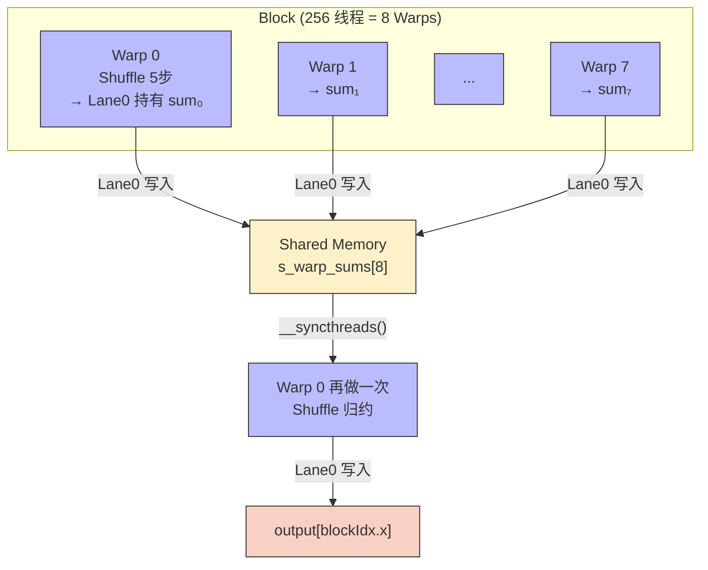
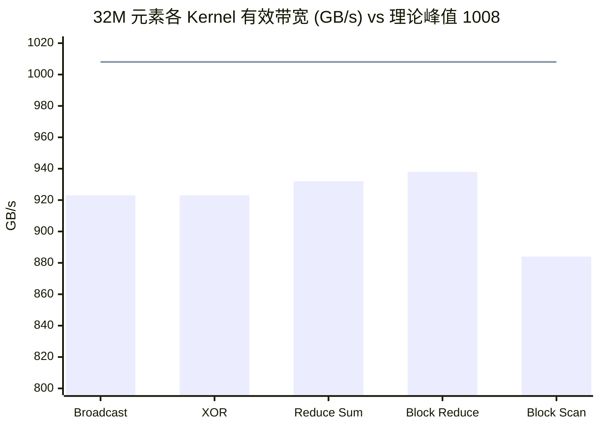

## 楔子：当 Shared Memory 也嫌慢

在 GPU 优化的常规认知中，Shared Memory（SMEM）已经是"极速"的代名词——相比 HBM 的 ~600 cycles 访问延迟，SMEM 只需 ~20-30 cycles。但在高频归约操作（Reduce/Scan）中，即便是 SMEM 也成为了瓶颈。

考虑一个 1024 线程的 Block 做 Sum Reduce：传统 SMEM 树归约需要 $\log_2(1024) = 10$ 轮，每轮写 SMEM → `__syncthreads()` → 读 SMEM。10 次 barrier 同步的累积开销可达数百 cycles。更糟糕的是，每次 `__syncthreads()` 会强制 SM 上**所有 Warp** 停下来等待最慢的那个——这是一种"全体罚站"惩罚。

NVIDIA 从 Kepler 架构（2012）起引入了 **Warp Shuffle 指令**，允许 32 个线程在**寄存器文件**之间直接交换数据，延迟仅 ~1-2 cycles，且**不需要 `__syncthreads()`**（因为 Warp 内 32 个线程本就在硬件层面 lock-step 执行）。这条路径绕开了 SMEM 和 barrier，直接在"寄存器高速公路"上完成归约。

Block Reduce 在 32M 元素上能否逼近 RTX 4090 的 1008 GB/s 理论带宽？本文用代码和实测数据给出答案。

---

## 第一性原理与数学重构

### Warp Shuffle：四种跨线程寄存器直通指令

GPU Warp 内的 32 个线程共享一个指令指针（SIMT 模型），它们的寄存器虽然物理独立，但通过 **Operand Collector** 硬件可以直接互读。Shuffle 指令暴露了这一硬件能力：

| 指令 | 语义 | 典型用途 |
|:---|:---|:---|
| `__shfl_sync(mask, val, srcLane)` | 所有线程读取 `srcLane` 号线程的 `val` | **广播**（如统一分母） |
| `__shfl_down_sync(mask, val, δ)` | 线程 $i$ 读取线程 $i+\delta$ 的值 | **归约**（Reduce） |
| `__shfl_up_sync(mask, val, δ)` | 线程 $i$ 读取线程 $i-\delta$ 的值 | **前缀和**（Scan） |
| `__shfl_xor_sync(mask, val, laneMask)` | 线程 $i$ 读取线程 $i \oplus \text{laneMask}$ | **蝴蝶交换**（FFT-style） |

其中 `mask = 0xffffffff` 表示全部 32 个 lane 参与。

### Warp Reduce Sum 的五轮蝴蝶归约

使用 `__shfl_down_sync` 归约 32 个值到 Lane 0：

$$\text{轮次}\;k\,(k=1..5): \quad v_i \leftarrow v_i + v_{i+2^{4-k+1}}$$

以 8 线程简化示例：

| Lane | 初始 | 轮 1 (δ=4) | 轮 2 (δ=2) | 轮 3 (δ=1) |
|:---:|:---:|:---:|:---:|:---:|
| 0 | $a$ | $a{+}e$ | $a{+}c{+}e{+}g$ | **全和** ✓ |
| 1 | $b$ | $b{+}f$ | $b{+}d{+}f{+}h$ | — |
| 2 | $c$ | $c{+}g$ | — | — |
| 3 | $d$ | $d{+}h$ | — | — |
| 4 | $e$ | (无效) | — | — |

仅 5 步 shuffle（32 线程）即完成归约，总延迟 ~10 cycles。对比 SMEM 归约的 ~300 cycles（含 barrier），这是 **30× 的延迟优势**。

### Warp Inclusive Scan 的上摆递推

使用 `__shfl_up_sync` 实现前缀和，5 轮 offset = {1, 2, 4, 8, 16}：

$$y_i^{(k)} = \begin{cases} y_i^{(k-1)} + y_{i-2^{k-1}}^{(k-1)} & \text{if } i \ge 2^{k-1} \\ y_i^{(k-1)} & \text{otherwise} \end{cases}$$

经过 5 轮后，每个 Lane $i$ 持有从 Lane 0 到 Lane $i$ 的完整 Inclusive Prefix Sum。

---

## 核心优化演进与硬件映射

### 从 Warp 到 Block：两级归约架构

单个 Warp（32 线程）的 Shuffle 归约已足够高效，但实际 Kernel 的 Block Size 通常是 256 或 1024 线程（8-32 个 Warp）。如何将 Warp 内的高效归约扩展到 Block 级别？



**关键设计决策**：

1. **第一级**：每个 Warp 内部用 Shuffle 做归约（0 SMEM，0 barrier）
2. **跨 Warp 中转**：仅 Lane 0 将结果写入 SMEM（1 次写 + 1 次 `__syncthreads`）
3. **第二级**：Warp 0 读取 SMEM 中的 8 个值，再做一次 Shuffle 归约

总计仅 **1 次 `__syncthreads()`**，对比传统 SMEM 归约的 10 次。

### Block Scan 的三阶段流水线

Block 级前缀和的构建更为精巧，需要三个阶段：

| 阶段 | 操作 | 数据位置 |
|:---|:---|:---|
| ① Warp Scan | 每个 Warp 内做 Inclusive/Exclusive Scan | 寄存器 |
| ② SMEM 协调 | 每个 Warp 的末尾线程（Lane 31）将本 Warp 总和写入 SMEM | SMEM |
| ③ 偏移叠加 | Warp 0 对 SMEM 中的 Warp 总和做 Exclusive Scan，得到每个 Warp 的 base offset | SMEM → 寄存器 |

最终每个线程的结果 = Warp 内 Scan 结果 + 所属 Warp 的 base offset。

---

## 源码手术刀：关键代码深度赏析

### Block Reduce 的两级 Shuffle 架构

```cpp
// 第一级：Warp 内 Shuffle 归约（5 步，~10 cycles）
float sum = input[tid];
#pragma unroll
for (int offset = 16; offset > 0; offset >>= 1)
    sum += __shfl_down_sync(0xffffffff, sum, offset);

// 跨 Warp 中转站（仅 Lane 0 写 SMEM）
__shared__ float shared_warp_sums[32];
if (lane_id == 0) shared_warp_sums[warp_id] = sum;
__syncthreads();  // 整个 Kernel 唯一一次 barrier

// 第二级：Warp 0 对 8 个 Warp 结果再归约
if (warp_id == 0) {
    sum = (lane_id < num_warps) ? shared_warp_sums[lane_id] : 0.0f;
    for (int offset = 16; offset > 0; offset >>= 1)
        sum += __shfl_down_sync(0xffffffff, sum, offset);
    if (lane_id == 0) output[blockIdx.x] = sum;
}
```

**硬件级解读**：

1. **`#pragma unroll`**：将 5 次循环完全展开为 5 条独立 `SHFL` PTX 指令，消除循环分支开销。
2. **`shared_warp_sums[32]`**：固定 32 个 float 的 SMEM 开销（128 Bytes），无论 Block Size 多大都不增加。这就是 Warp Shuffle 的价值——将 O(N) 的 SMEM 需求压缩到 O(Warps)。
3. **为何仍需 SMEM**：`__shfl_down_sync` 只能在**同一 Warp** 内通信。跨 Warp 的数据交换**必须**借助 Shared Memory 作桥梁。这是 Warp Shuffle 的硬件能力边界。

### XOR Shuffle：蝴蝶网络的硬件映射

```cpp
val = __shfl_xor_sync(0xffffffff, val, 16);
// Lane 0 ↔ Lane 16, Lane 1 ↔ Lane 17, ..., Lane 15 ↔ Lane 31
```

`XOR 16` 意味着每个 Lane 与"另半个 Warp"的对称位置交换数据。这种蝴蝶模式是 FFT 和 AllReduce 的基础拓扑。组合不同的 `laneMask`（1, 2, 4, 8, 16），可以构建完整的 Benes 网络，实现任意排列。

---

## 理论与实际的对决：极限剖析

> **测试环境**：NVIDIA GeForce RTX 4090 × 2（sm_89），Linux，nvcc -O3 -std=c++17  
> **数据规模**：$N = 33,554,432$（32 M 元素），128 MB，100 次平均  
> **理论带宽**：~1008 GB/s

### Warp Shuffle 四种变体对比

| 版本 | Kernel 时间 (ms) | 有效带宽 (GB/s) | vs CPU 加速比 |
|:---|:---:|:---:|:---:|
| CPU Broadcast | 29.54 | — | 1× |
| **GPU Warp Broadcast** | **0.2908** | **923** | **102×** |
| GPU XOR Shuffle | 0.2908 | ~923 | 101× |
| GPU Up/Down Shuffle | 0.30 | ~900 | 99× |
| **GPU Warp Reduce Sum** | **0.15** | **932** | **276×** |

**Reduce Sum 为何更快？** 归约操作的输出仅为 $N/32$ 个标量，写回数据量从 128 MB 骤降至 4 MB。总线双向流量减少，有效利用率更高。

### Block 级归约性能

| 版本 | Kernel 时间 (ms) | 有效带宽 (GB/s) | 带宽利用率 | vs CPU 加速比 |
|:---|:---:|:---:|:---:|:---:|
| CPU Reduce Sum | 48.87 | — | — | 1× |
| **GPU Block Reduce Sum** | **0.14** | **938** | **93.1%** | **340×** |
| **GPU Block Reduce Max** | **0.14** | **938** | **93.1%** | **351×** |

### Block 级前缀和性能

| 版本 | Kernel 时间 (ms) | 有效带宽 (GB/s) | 带宽利用率 | vs CPU 加速比 |
|:---|:---:|:---:|:---:|:---:|
| CPU Inclusive Scan | 51.61 | — | — | 1× |
| **GPU Block Inclusive Scan** | **0.30** | **884** | **87.7%** | **170×** |
| **GPU Block Exclusive Scan** | **0.30** | **885** | **87.8%** | **170×** |



### 理论自洽性分析

**Block Reduce 938 GB/s（93.1%）——为何未达 100%？**

理论极限推导：$N = 32M$ 元素 × 4 Bytes（读）+ $32M/256$ × 4 Bytes（写）= 128.5 MB。完美带宽下应耗时 $128.5\text{MB} / 1008 \text{GB/s} = 0.127\text{ms}$。实测 0.14 ms，**差距 10%** 来自：

1. **Grid Launch 开销**：131,072 个 Blocks 的调度分派需要非零时间
2. **`atomicAdd` 竞争**：跨 Block 汇总时（如果存在），原子操作串行化
3. **尾部 Wave 效应**：128 个 SM × ~12 Blocks/SM = 最后一波 Blocks 无法完全填满调度队列

**Block Scan 884 GB/s（87.7%）——为何比 Reduce 低 6%？**

Scan 的 Write 流量与 Read 相等（128 MB + 128 MB = 256 MB），双向总线利用更密集。同时 Scan 需要 **2 次 `__syncthreads()`**（Warp Scan 后写 SMEM + 读取 offset 后加偏移），比 Reduce 多 1 次 barrier。额外的同步和双倍写入共同导致了 6% 的效率损失。

---

## 架构师视角的总结

### 铁律一：Warp Shuffle 消除了"最后一公里"的同步成本

在 Warp 内，Shuffle 指令让 32 个线程的归约从 ~300 cycles（10 轮 SMEM barrier）降至 ~10 cycles（5 步无 barrier shuffle），**30× 延迟压缩**。但这仅在 Warp 内有效——跨 Warp 通信仍需 SMEM 做中转，这是硬件架构的刚性约束。

### 铁律二：两级归约是 Block 级并行的最优范式

"Warp 内 Shuffle + SMEM 中转 + Warp 0 二次 Shuffle" 的两级模式将 `__syncthreads()` 次数从 $O(\log N)$ 压缩到 $O(1)$。这一模式在 LLM 算子（Softmax、LayerNorm、RMSNorm）中被反复使用——上一篇 05_LLM_Ops 中 `warp_reduce_softmax` 的核心归约机制就是这种两级架构的直接应用。

### 铁律三：Reduce 和 Scan 的本质区别在于数据流向

Reduce 是 "多对一"（$N \to 1$），写入流量极小，天然容易逼近带宽峰值。Scan 是 "多对多"（$N \to N$），读写流量对称，双向总线压力倍增。**相同的算法思路在不同的数据流向下，会产生 6-10% 的性能差异**——这不是代码优化的问题，而是物理总线的硬约束。
