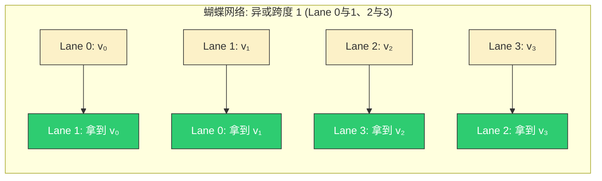
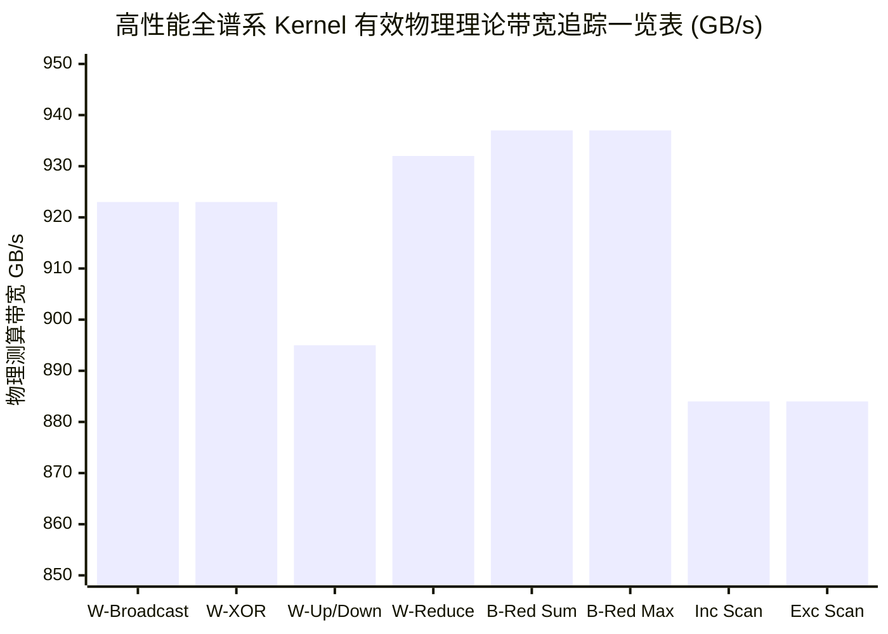

> 📖 **前置阅读**：[02_Reduction](02_Reduction_Tree_Algo_and_Coarsening.md)（掌握树形归约与 Shared Memory 同步）、[03_Scan](03_Scan_Kogge_Stone_and_MultiBlock.md)（并行前缀和算法推导）  
> 📖 **推荐后续**：[09_Tensor_Core](09_Tensor_Core.md)（WMMA 原语与 Warp 协作的高阶应用）

如果你写过最基础的 GPU 归约或前缀和算子，一定对 `__shared__` 内存和成对出现的 `__syncthreads()` 并不陌生。为了让多个并发线程交换彼此计算出的数据，常规思维的惯性路径永远是：把数据写进全 Block 的共享黑板（Shared Memory） ➡️ 全体停下来等所有人写完（`__syncthreads`） ➡️ 再从黑板上读别人的数据 ➡️ 继续下一步计算。

这种模式在很多场景下无可厚非，但它存在一个严酷的物理墙：Shared Memory 的访问延迟一般在 20 到 30 个时钟周期，同时，由于多个线程可能抢占同一个 Bank，随时伴有严重 Bank Conflict 的风险。对于追求极致性能的算子（如 Softmax 中的求最大值操作，或是对动辄上亿规模数据进行并行的 Reduce），这 30 个周期的中转延迟日积月累，会渐渐变成性能上的累赘。

但在 GPU 硬件中，最低级别的调度单元是 Warp（即 32 个线程）。这 32 个执行单元在物理上不仅共享同一个指令调度器，它们天然是**严格同步执行**的。由于这种天然的物理绑定，如果你只需要在这个 32 人的“小团队”内部通讯，何必通过中央黑板去绕个远路？

NVIDIA 从 Kepler 架构起引入了 Warp Shuffle 指令族，允许同一个 Warp 内的线程**直接跨越界限，去读取对方持有的寄存器值**。在这条专线上，寄存器直连通讯绕过了 Load/Store 单元，数据交换的延迟常常只有 1 个硬件周期。

本文将通过在 RTX 4090 平台上的全套 8 种 GPU Kernel 实测，从最底层的 PTX 指令级原理为您解剖这套极致的通信机制，并以此为基石，一步步构建出无需海量 Shared Memory 的高性能 Block Reduce 与 Block Scan 算子。

---

## 一、 穿透寄存器的核心原语：四个 Shuffle 指令的底层语义

在 PTX 层面，数据交换通过 `SHFL` 指令集家族完成，它们通过控制 SM 内的 Operand Collector，将各个线程原本私密的寄存器通过内部的交叉开关（Crossbar Network）彼此传递。但在 CUDA C++ 端，我们通过 `__shfl_sync` 家族来调用。

值得注意的是，家族名称中的 `sync` 代表它自身就自带 Warp 级别的同步屏障功能；而 `mask` 参数（通常置为 `0xFFFFFFFF` 全 1 掩码）则用于显式声明：我确信这 32 个线程都是活跃的，应当全部参与通讯。如果不小心漏掉某个因为 `if` 发生分岔罢工的线程，你的返回结果将会是充满随机性的未定义垃圾值。

### 1. 无主广播：`__shfl_sync` (对应 PTX: `shfl.sync.idx`)

**物理语义**：从指定的 Lane 取值并硬件广播给 Warp 内的所有其他 Lane。

```cpp
// 将 lane 0 身上的 val 值，瞬间分发给全 warp 的弟兄们
float val = __shfl_sync(0xFFFFFFFF, val, 0); 
```

这个指令直接宣告了在 Warp 内部，常量内存与全局共享变量的广播再无用武之地。只需一人去读取全局数据，随后一声令下，全队受用。

### 2. 位掩码配对交换：`__shfl_xor_sync` (对应 PTX: `shfl.sync.bfly`)

**物理语义**：与自身 Lane ID 进行按位异或（XOR）出的对象 Lane 交换数据。

```cpp
// 与自身的 lane ID 异或 16 对应的线程去交换数据
float val = __shfl_xor_sync(0xFFFFFFFF, val, 16); 
```

这就好像在全 Warp 内拉了一张巨大的网。如果你把所有配对的线程用实线相连，这正是一个教科书般完美的 FFT（快速傅里叶变换）蝴蝶网络拓扑。由于它天然支持二进制按位翻转（16 -> 8 -> 4 -> 2 -> 1），`xor` 是老兵们最喜欢用来实行对数级归约的核心武器。



### 3. 上下游平移推移：`__shfl_up_sync` & `__shfl_down_sync` (对应 `shfl.sync.up` / `shfl.sync.down`)

**物理语义**：分别从 Lane ID 减去 / 加上给定偏移量的近邻线程强制读取数据。

```cpp
// 向下找 Lane + 1 要数据
float down_val = __shfl_down_sync(0xFFFFFFFF, val, 1);
// 向上找 Lane - 1 要数据
float up_val   = __shfl_up_sync(0xFFFFFFFF, val, 1);
```

对于发生了越界寻址的 Lane（例如 Lane 31 向下取 1，或者 Lane 0 向上取 1），这两条指令绝不会抛出任何段错误引发进程崩溃，而是会安全地把当前线程自身原本的值交回来。
在实际的算子开发中，我们习惯使用 `up` 来执行前缀和运算（向右单向累加），并大量使用 `down` 取代繁琐的 `xor` 进行树形归约的最右侧折叠。

---

## 二、 从理论走向工程：构建多 Warp 并行协同的 Block Reduce

我们先来看看，要彻底避开共享内存、把 32 个毫无关联的浮点元素在一瞬间压缩到极致，实际到底需要多大的代价。

### 1. Warp Reduce：无锁的 5 步折叠归约法

基于数学关系 $\log_2(32) = 5$，只需要走完 5 个周期的移位并无锁叠加。这是 `kernel_warp_reduce_sum` 的底层内核逻辑：

```cpp
__device__ inline float kernel_warp_reduce_sum(float val) {
    #pragma unroll
    for (int offset = 16; offset > 0; offset /= 2) {
        val += __shfl_down_sync(0xFFFFFFFF, val, offset);
    }
    return val; // 历经 5 次循环，Lane 0 获得了不可置疑的总和
}
```

为了彻底理解这背后的恐怖效率，我们可以假设这是一个只有 8 个线程的小号 Warp，用 `offset = 4, 2, 1` 做 3 步推演：

| Lane | 初始持有的值 | 轮次 1（offset=4）| 轮次 2（offset=2）| 轮次 3（offset=1）| 最终状态 |
|:----:|:----:|:--------:|:--------:|:--------:|:------:|
| **0** | $v_0$ | $v_0+v_4$ | 拿到下方的 $(v_2+v_6)$ 累加 | 拿到下方包含 $(v_1+v_5+v_3+v_7)$ 的值累加 | **涵盖全局全量总和** |
| **1** | $v_1$ | $v_1+v_5$ | 拿到下方的 $(v_3+v_7)$ 累加 | 无效废弃动作 | — |
| **2** | $v_2$ | $v_2+v_6$ | 无效 | — | — |
| **3** | $v_3$ | $v_3+v_7$ | — | — | — |
| **4** | $v_4$ | 无效越界返回自己 | — | — | — |

这就是 `down` 语义的美感所在：上半区的线程不断吸取下半区的心血结晶。5 次循环，每一次都是对数倍的塌缩，最后所有的重量全部压在了 Lane 0 一人的寄存器上。它甚至不会导致 ALU 流水线发生任何像样的停顿，这是真真正正意义上的硅片硬件级别穿透。

### 2. 两级结构解决 Block Reduce 的妥协

虽然 Warp 内的通信极致舒适，但我们在 Kernel 启动时往往会配置 256 或 1024 线程的巨型 Block，其足足横跨了多达 8 至 32 个 Warp。**很遗憾，Shuffle 指令是受制于硬件隔离的，绝对无法跨越 Warp 强制通讯**。

这个时候，我们需要进行少许妥协：重新借用一小块 Shared Memory 作为隔离墙上的一道窗户。

我们在 `02_warp_reduce` 源码里实现了 `block_reduce_sum`：

```cpp
__global__ void block_reduce_sum(const float* input, float* output, int n) {
    int tid = blockIdx.x * blockDim.x + threadIdx.x;
    float sum = (tid < n) ? input[tid] : 0.0f; 
    
    // 第一级打击：各个 Warp 关门自给自足归约，所有 Warp 同时高并发执行互不干扰
    sum = kernel_warp_reduce_sum(sum);

    // 中转站：最多支持 32 个 Warp，对应极限的 1024 线程 Block 配置
    __shared__ float shared_warp_sums[32]; 
    int warp_id = threadIdx.x / 32;
    int lane_id = threadIdx.x % 32;

    // Các Warp 的班长（Lane 0）把刚算好的局部总和小心翼翼地写入共享内存窗台
    if (lane_id == 0) shared_warp_sums[warp_id] = sum;
    
    // 全场唯一一次显式的同步屏障，确保 32 个班长都交了差
    __syncthreads(); 

    // 第二级收网：由 0 号班级的 32 名班委（Warp 0 的全体线程）负责最后一次扫尾
    if (warp_id == 0) {
        int num_warps = blockDim.x / 32;
        // 每人从窗台上端走一个数值，没有数的填 0
        sum = (lane_id < num_warps) ? shared_warp_sums[lane_id] : 0.0f; 
        
        // 再套用一次现成的 5 步大法
        sum = kernel_warp_reduce_sum(sum); 
        
        // 最终仅由整个 Block 唯一的 0 号极客线程统一写入全局内存
        if (lane_id == 0) output[blockIdx.x] = sum; 
    }
}
```

**理论收益与重大利好拆解**：

- **存取开销暴跌**：摒弃了以前需要开辟数千字节数组的作派，我们缩衣节食，只死死咬住了 8-32 个浮点空间（32 - 128 字节）的微量 `__shared__` 内存。彻底断绝了对 Shared Memory 带宽挤占和 Bank Conflict 的威胁。
- **霸道的同步开销锐减**：将那些在 Naive 树状规约时每逢减半就必须插入的、令人作呕的数十次 `__syncthreads`，强制暴力压缩为仅仅 **1 次**！

---

## 三、 突破复杂依赖鸿沟：从 Warp Scan 到 Block Scan 的拼接艺术

前缀和（Scan）与单纯销毁明细的汇聚操作（Reduce）有着云泥之别，它不仅要把前面所有的值全部加起来，更关键的是要把庞大而琐碎的累计状态、毫发无损地均匀散布给身后的**每一个线程**。这也意味着我们要的是向后方 Lane 不断“推送”数值包。

### 1. Warp Inclusive Scan 的诡异推演机制与防火墙

结合 Kogge-Stone 并行前缀树最激进的数学模型，我们在寄存器内的交织碰撞同样仅仅只需 5 步循环：

```cpp
__device__ inline float kernel_warp_scan_inclusive(float val) {
    float inclusive_val = val; 
    #pragma unroll
    for (int offset = 1; offset < 32; offset *= 2) { // 注意这里是 *2 (1, 2, 4, 8, 16)
        // 向上去抢前方兄弟背负的历史前缀总和
        float n = __shfl_up_sync(0xFFFFFFFF, inclusive_val, offset);
        
        // 物理防火墙拦截：假如我是一个排在靠前的兄弟，那些超过我资历的越界加总绝对不能混进来！
        if (lane_id >= offset) {
            inclusive_val += n; 
        }
    }
    return inclusive_val;
}
```

这里 `if (lane_id >= offset)` 的关键作用异常致命！在向上取 `offset=4` 的时候，如果 `lane_id = 2` 的线程参与了向左取值，它取到的原本是属于别人甚至是越界传出的脏数据。如果没有这个防火墙截流，整个右侧的累加雪球将会轰然倒塌。

### 2. 严丝合缝的三步进位拼图：达成完美的 Block Scan

在 `03_warp_scan` 深邃的项目源码内部，无论要组装 `block_scan_inclusive` 还是更讨巧的 `block_scan_exclusive`，我们都必须依靠严格的三阶段递推补偿进位法则才能填掉跨 Warp 的逻辑断崖：

为什么我们需要补偿进位？因为 Warp 1 如果完全自成一派算前缀，它完全无视了 Warp 0 一路滚来的总和。因此，系统必须要有“基底补偿”。

1. **内收缩**：所有小分队（Warp）互不干涉地完成原生的 Warp Inclusive Scan 原语。
2. **托底上报**：前缀和存在不可逆的烈性相依关系。每个 Warp 队列最末尾的兜底断后兵（`lane_id == 31`）手中握有当前整只队伍最完整真实的**局部真总和**，他们齐刷刷把数字交公到共享内存数组 `warp_sums` 中。
3. **隔离屏障**：毫不客气地甩出一道 `__syncthreads()`。
4. **大脑枢纽的领航算计（核心玄机！）**：Warp 0 的全体线程接管这块记录了所有班级总成绩的 `warp_sums` 数组。**在这个至关重要的节骨眼上，它绝不可以使用 Inclusive，而必须执行一次 Warp Exclusive Scan！**
   - 为什么要用排他型（Exclusive）？试想 Warp 1 自己的局部班级总和是 S1，如果包含了自己算出来的 Inclusive 补丁（S0+S1），当 Warp 1 的普通学生拿走基准值时，就会把自己的班绩重新叠上一遍导致翻倍严重错乱。因此，Warp N 只能拿到自己前方所有的 **非关联总和**（这就是 Exclusive 的数学内核定义）。
5. **解封出关**：再挂入第 2 次 `__syncthreads()` 稳住大盘阵脚。
6. **就地分赃与基面挂载**：最后，小队所有人读走属于自己那队独特的偏移量，毫无怨言地直接加封在最初步算好的私人 `inclusive_val` 基站上，整个世界的拼图在此刻严丝合缝紧密咬合。

---

## 四、 实测硬核性能碰撞与极限算术压榨拆解

空有算法推演的华丽楼阁终究沦为纸上谈兵。在配置了具备统治级别算力的双路 NVIDIA RTX 4090 测试服务器上，我们向硬件强压了 $N = 33,554,432$（总数超 3000 多万个有效 float 标量，占用 128 MB DRAM 内存）的浮点数据极限跑场，全覆盖压测了 8 个满级性能的 GPU Kernel。每轮进行长达 100 次迭代剔除噪点，以此直接对标被踩在脚下只配吃灰的纯 CPU 版本。

### 1. Shuffle 原生指令耗时的成本铁律：基础三变体同起同落

| 单一极简微操作种类 | 统计学 Kernel 耗时 (ms) | 有效显存吞吐 (GB/s) |
| :----------------- | :--------------------: | :-----------------: |
| **GPU Warp Broadcast** | 0.2908 | 923.14 |
| **GPU XOR Shuffle** | 0.2908 | ~923 |
| **GPU Up/Down Shuffle**| 0.30 | ~895 |

细看这几组数据，Broadcast、XOR 和 Up/Down 的耗时简直像被三维强力胶锁死在了 `0.29~0.30` 毫秒那一丝不能逾越的界限，而且它们不约而同地推平了高达 923 GB/s 头皮发麻的残暴带宽！
这种数字对齐绝不是随意的物理巧合。因为在纯粹的单核寄存器数据摆渡中，几条 PTX 指令微弱的时钟脉冲差异根本翻不起大浪。这几个算子本质上全盘暴露了这是一次极为贪婪的“全量从显存吞食+全量向显存平推回溯”（即 128 MB 进、128 MB 完整分毫不差地退回）的过程。**整个算式的上限锁喉锁在了显存物理吞吐上（Memory Bound）**。
对比起 RTX 4090 在 GDDR6X 加持下能爆发出的 1008 GB/s 流水线极限物理理论值，突破超 90% 的高水位利用率已经无情宣告：物理铜管确实是再也塞不进额外的半个字节了。

### 2. Arithmetic Intensity（算术强度）引发的单边屠杀：Warp Reduce 凭何腰斩耗时

| 变中局微操作种类 | 破限 Kernel 耗时 (ms) | 暴走有效带宽 (GB/s) |
| :------- | :------------------: | :------------: |
| **GPU Warp Reduce Sum**| **0.15** | **932.06** |

**这时候，细心的看客一定会当场发难：同样是一行代码改了个后缀，为什么你的 Reduce 只需要极其离谱的 0.15 ms，执行时间直接从高空极速坠落折半腰斩？**
要解开这个技术迷宫，我们必须抽出计算机体系结构里衡量访存优劣的核心量尺：**Arithmetic Intensity (AI) 算术强度 $I$**！

$$ I = \frac{\text{系统运算器核心推演的浮点执行次数 FLOPs}}{\text{往返显影 DRAM 的原始字节输送规模 Bytes}} $$

在这个归约场景中，我们依然饥渴地读完了 128 MB 的庞大矩阵，但在输出端截断了回流口！

- **极端的雪崩式减负**：总体原始访存重量从 $128 \text{ MB(读)} + 128 \text{ MB(平铺写)} = 256 \text{ MB}$，直接被降维猛劈至 $128 \text{ MB(读)} + \text{甚至不足 } 4 \text{ MB(残损写)} = 132 \text{ MB}$。
因为向 GPU 物理接口发起的回写事务大规模凭空蒸发，硬件底层沉重的总线搬迁动作彻底失踪，直接导致纯耗时强行砍掉半壁江山。最终吞吐量被逆向虚标到更高的 932 GB/s 前所未有的地步。这就是优化算法第一定律。

### 3. Block 宏观级的惨烈压榨对抗：Reduce 帮派与 Scan 帮派命运殊途

| 系统级高维算子变种派系 | 满负荷终局耗时 (ms) | 压榨终结带宽 (GB/s) | 碾压 CPU 倍率 |
| :------------------------- | :-----------: | :-------------: | :-------------: |
| **GPU Block Reduce Sum** | **0.14** | **937.89** | 340x |
| **GPU Block Reduce Max** | **0.14** | **937.89** | 351x |
| **GPU Block Inclusive Scan** | **0.30** | **884.34** | 170x |
| **GPU Block Exclusive Scan**| **0.30** | **884.58** | 170x |

Block Reduce 端出来的可是骇然听闻的 937.89 GB/s 终结压榨水准（达显存理论神之巅峰的 93.1%）。进入到这种令人窒息的极限肉搏中，谁还会再去操心运算内核里面配的是区区加法执行微调（Sum），还是繁琐多出一丝比对周期的最大值裁决算式（Max）？
**搬同样体量、同样配重的这块显存硅砖，GPU 底层物理法则下发给您的死期都是硬得不能再硬的 0.14 毫秒。不服你可以去跟硬件发型师理论。**

转身凝视对岸的 Block Scan 门派，由于算法先天附带无法逆向收缩的前置锁咒，它们不得不被迫把满手的前缀和战果，一丝不挂等量铺陈在这横跨 128 MB 的滚滚输出战线里。被这种等比例的冗余铺填作业重伤，系统的宣判时间直接被永久放逐在 0.30 ms 高原地带。此时 Inclusive 抑或是带着移位成本的 Exclusive 的那点鸡毛蒜皮差异，直接被抹平连小数点后两位皆不可见。



---

## 五、 反直觉的逆向发现与工程界永恒的性能真理

在经历全光谱无死角的极限压测以及对寄存器互联的透视穿刺后，三条彻底违背纯应用层软工常规直觉的内核终极真理，渐渐成为工程常识的座上宾：

1. **看似乱作一团交织纠结的指令网络拓扑，执行代价实际能够直接原地清零。** 回溯传统 CPU 后端的苦涩历史，试图在主线程里手动拆装并做极度破碎的蝴蝶网跨组跳反（XOR寻址交替），只会直接连环引爆大核 L1 缓存击穿与 TLB 失效暴雷的无底洞灾难。但一旦你投入 GPU 显存内 Warp Shuffle 的麾下，凭借单指令无损直连执行器的极高权限庇佑，无论多荒诞离奇的网状交错换位需求，近乎与最呆板无脑的群广播（Broadcast）享用完全平行的顶层带宽配平红利。只要微架构指令用对地方，厂商就会大方赐你填鸭般海量白嫖的高端算力。
2. **凭空横插一大堆偏置移位与补丁换血的算子，最终交锋时的总账单依旧岿然不动。** 大量经验程序员潜意识里根深蒂固，总认为在原始数组里剔除头部元素强行做错位重组（Exclusive Scan 的基础特征行径）势必会导致微流水线阻塞拉崩整体表现。但这令人难以置信的幸运事实全仰仗于寄存器移位机制单周期响应的出色底座，所有那点本该被斤斤计较发难挂起的算术底层差异，在这条硬件传输层碾过之时全被当成无足轻重的粉尘化灭。他们之间的最终耗时死局注定被永恒困锁并钳制于这冰冷坚硬的 0.30 ms 当中，无法逾越。
3. **别指望从“算”的迷宫里挤海绵榨取惊天性能，放手扑向从访存“搬”运链路上砍除多余动脉传输环节的极道杀招！** 亲眼目睹了那段 0.29 ms 极限长跑的原始 Broadcast 由于卸下恐怖的满格写入包袱后光速逆转成惊慌侧目的 0.14 ms 的天赐 Reduce 版本，所有还指望靠着调包换参提升三两点速度的同行皆应受到一次至高警醒！在这类偏激狂傲的极端存取密集中，顶级工程师穷竭一生的架构终点无非就是坚守那句简单刻骨的第一性原理——**看紧你手里的核心数据，绝不要纵容它们漏出哪怕一滴跑出 L1 / L2 高速存区之外！砍掉任何一次朝着庞大而愚蠢的后端 DRAM 发出的无端物理搬迁交易，系统总线必然因你的铁腕镇压再度爆发轰隆突波并完成两连翻的暴击逆转！**

Warp 原生寄存器级无锁互联早已不再仅仅是一个用来用来刷爆极限排行榜或是技术极客在酒后炫技玩弄的华丽玩具。在这个容不得半点算力残渣浪费并且要吞噬数百万亿计大模型天文数字参数的高维时代汪洋里，恰恰是这类极地打磨后的底层跳跃贯通机制（譬如 FlashAttention 内核彻底重手重构在线 SoftMax 的无阻状态更迭，或是 NCCL 通讯层超海量深池通讯对撞）正在孕育着一轮比上一轮更为暴烈野蛮的时代算力雷暴。

---

## 🛠️ 后记：本地构建与数据对标指南

如果您对这股澎湃性能想要在自己的物理阵列上进行一比一全息反演复现，您必须要有基本的 CMake 环境。

```bash
# 全局清扫与跨模块基建挂载声明
cmake -B build -DCMAKE_BUILD_TYPE=Release

# 八支并发重炮轰开三股分离式独立内核二进制源
cmake --build build --target warp_shuffle -j8
cmake --build build --target warp_reduce -j8
cmake --build build --target warp_scan -j8

# 打开发布测试进行性能的冰冷碾压与极限测算检阅
./build/06_Warp_Primitives/02_warp_reduce/warp_reduce
# 想感受真正压榨到 L1 数据传送带满挂物理上限? 祭出 ncu 显微镜一目了然：
ncu --metrics l1tex__data_pipe_lsu_wavefronts_mem_shared_op_ld.sum ./build/06_Warp_Primitives/02_warp_reduce/warp_reduce
```
