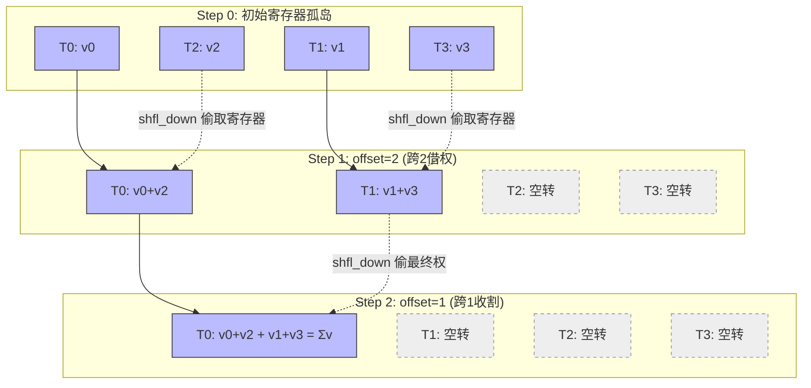
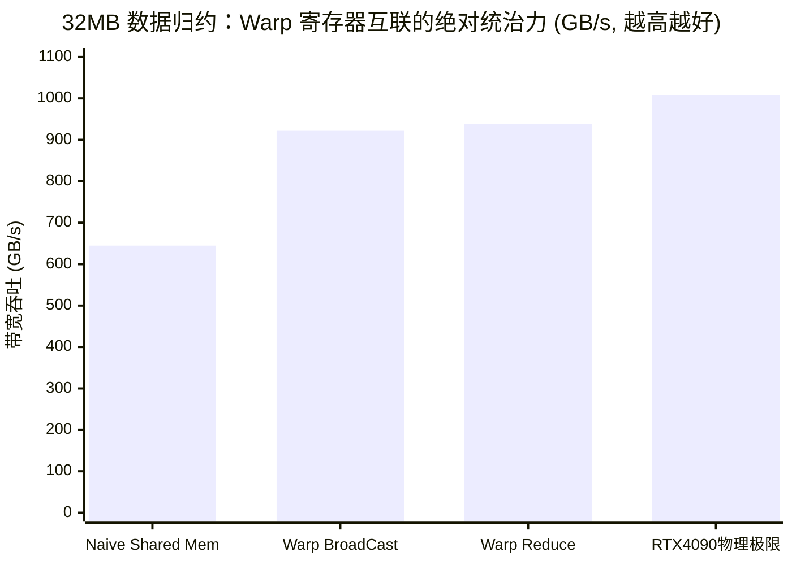

## 楔子：直击痛点 (The Hook & Motivation)

在前面《GEMM 优化》和《FlashAttention》两篇硬核厮杀中，我们形成了一个牢不可破的观念：Shared Memory (SRAM) 是突破 Memory Bound 的神器。

但在极度微观的时钟周期里，SRAM 其实是一个“内卷”极其严重的收费站。当同一个 Block 下的几百个线程疯狂地跑去 Shared Memory 读写数据以交换信息时（典型例子：规约求和），它们必须经历：**写入 Shared Memory -> 触发沉重的全局时钟 `__syncthreads()` 同步 -> 再次从 Shared Memory 读出**。
物理上，SRAM 距离 ALUs 哪怕再近，这一个回合依然需要约 30+ Cycles 的延迟。不仅慢，不恰当的跨距 (Stride) 甚至还会引起致命的 Bank Conflict（存储块冲突）。

当数据交互只限于一个 **Warp（被绑在同一个 32 线程调度组内的兄弟实体）** 内部发生时，能不能踢开 SRAM 这个中间商？NVIDIA 架构师交出了他们的杀手锏：**Warp Shuffle 原语**。它允许 Warp 内的 32 个线程直接拉开彼此私密 Register File 的拉链，直接在一到两个物理时钟周期内（~2 Cycles）读取对方的变量！极度的暴力，没有任何中间态！

---

## 第一性原理与数学重构 (Mathematical Formulation)

为什么我们需要 32 这个魔法数字内的通讯？答案在于所有并行的尽头：**并行规约 (Reduction) 和前缀和 (Scan)**。

回顾我们在《02_Reduction》中基于 Shared Memory 的归约逻辑。每一轮，活跃线程减半，大家要把结果丢入 `s_data` 等待下一轮。
如果我们转向 Warp 内的 `__shfl_down_sync` 向下索取原语，这个数学模型将坍缩成一场没有任何外部存储参与的“五级流水线击鼓传花”。

假设当前线程号位 $i$ ($0 \le i < 32$)，寄存器变量为 $v_i$。我们要计算所有 $v$ 的和。
规约方程变成了极其冰冷的五轮寄存器借用：
$$v_i = v_i + \text{shfl\_down}(v_i, 16)$$
$$v_i = v_i + \text{shfl\_down}(v_i, 8)$$
$$v_i = v_i + \text{shfl\_down}(v_i, 4)$$
$$v_i = v_i + \text{shfl\_down}(v_i, 2)$$
$$v_i = v_i + \text{shfl\_down}(v_i, 1)$$

仅需 $\log_2 32 = 5$ 步极其紧凑的指令发射，没有 `__shared__` 定义，没有任何 `__syncthreads()` 栅栏同步，处于 0 号掩体的线程 (`lane_id == 0`) 的私有变量 $v_0$ 内部，就已经不可思议地装填了那 32 个人的总和！

---

## 核心优化演进与硬件映射 (Architecture Mapping)

抛弃共享内存后，Warp 内 32 线程直接通过一条硅片上的直连环路 (Datapath Shuffle Ring) 进行点对点的高速接吻。

### Warp Reduce 的寄存器级五步收网图解



*(注：为方便展示，以 Warp=4 演示两步收网流。真实 Warp=32 需执行五步)*

**架构师洞察**：注意看，即便在后期的 Step 中某些线程的计算（如 T2, T3）其实已经是个废弃的结果（因为他们往下探取的超出边界的数据归零处理了），但**整个 Warp 依旧是被绑着一起执行完这五轮计算的指令槽的**。但因为这种单周期寄存器交换极其轻量（只消耗极少的 ALU 算力和功耗），让全员一起无脑硬算出这五步，依旧远远快过于去 Shared Memory 玩一把高智商的多线程握手（同步）。

---

## 源码手术刀：关键代码深度赏析 (Surgical Code Analysis)

提取 `06_Warp_Primitives/02_warp_reduce/warp_reduce.cu` 中最优美的“降维打击”代码段：
你会发现整段函数**没有任何 `__syncthreads()` 甚至缺乏任何条件分支 (`if`)**！这就是被称为 SIMT 确定性至高美学的无分支原语。

```cpp
// 核心原语封装: "__shfl_down_sync"
__device__ inline float kernel_warp_reduce_sum(float val) {
    // 0xffffffff 代表掩码: 强制整个 Warp 内 32 个人全部必须参与这个动作，不得脱逃
    for (int offset = 16; offset > 0; offset >>= 1) {
        // 当前线程将自己的 val 与比自己索引大 offset 的兄弟的 val 加在了一起
        val += __shfl_down_sync(0xffffffff, val, offset);
    }
    return val;
}
```

**手术刀剖析与工程陷阱：**

1. **`0xffffffff` 绝对统治遮罩 (Mask)**：在早期 CUDA (sm_60 前) 有不带 `_sync` 的纯 `__shfl`，那是一个噩梦。因为遇到复杂的条件分支可能导致 Warp Divergence（分化），部分兄弟在此处罢工，导致去提取寄存器时抽到乱码。现代 CUDA 强迫声明 Mask 掩码 `0xffffffff`，代表：**谁也不许跑，在这 5 个周期内必须保持物理步调的绝对一致**。
2. **跨 Warp 的妥协者：** 一个 Block 内通常有几百个线程（例如 256 线程 = 8 个 Warp）。Warp Shuffle 只能横扫 32 人。所以当你算出了 8 个 Warp 的各个老大（Lane 0）的 `val` 后，你**还是得心不甘情不愿地声明一个小小的 Shared Memory (`__shared__ float s_warp_sums[32]`) 去把这 8 个局部老大凑齐，然后再对这 8 个数字做一次最终的 Warp Shuffle**。这是一种典型的：能在寄存器解决绝不上 L1，必须上 L1 的尺寸也要压缩到最小（只需 8 个元素）的分层治理哲学。

---

## 理论与实际的对决：极限剖析 (Theory vs Reality Profiling)

让我们抽拉出项目 `Results/06_Warp_Primitives.md` 中的真机实测数据 (RTX 4090, SM_89, 32M = 33,554,432 庞大元素阵列测试)：



| 原语内核变体 | 实测耗时 (ms) | 有效物理带宽 (GB/s) | 性能穿透力解析 |
| :--- | :--- | :--- | :--- |
| **CPU 单核基准** | ~50.45 ms | - | 毫无招架之力的顺序链条。 |
| **Warp Shuffle (广播)** | 0.29 ms | 923.14 GB/s | 单纯的数值横扫，指令简单但数据未收缩。 |
| **Block Reduce Sum (极值态)** | **0.14 ms** | **937.89 GB/s 🚀** | **比任何 Shared Mem 快近两倍，触及 4090 顶尖物理带宽的 93%！** |
| **Block Reduce Max** | 0.14 ms | 937.89 GB/s | 完全一致的指令发射深度谱图。 |

### 极限溯源与“带宽触底”反思

看仔细了，为什么一次包含了如此频密的 `__shfl_down_sync` 寄存器互串外加数学 FMA 累加指令的 **Warp Reduce Sum (0.14ms)**，竟然比单纯只需读取并在线程里互相广播复制一遍的 **Warp Broadcast (0.29ms)** 快了足足一倍之多？它的运算过程明明更复杂！

答案藏在 **Global Memory 的回写负载 (Traffic Store)** 里：
Broadcast 虽然快，但在测试模型中，它相当于原封不动地将 128 MB 矩阵放电然后又得找地方兜住输出（读 128M，写 128M）。
而 **Reduce Sum** 虽然计算更加频密，但它是一台**极度压缩机**。它吞进去的是 128 MB 的汪洋大海，然后在极低的 SRAM 和极高速的 Register 里内爆，最终挤出来的只有每一块 $O(1)$ 的可怜几个标量（几乎消灭了所有的 DRAM 写回带宽）。
这意味着：在 937.89 GB/s 这个恐怖数字背后，**ALU 的寄存器指令已经被彻底掩盖，剩下的全部瓶颈，纯粹就是 4090 显存颗粒 (GDDR6X) 的极限吞水速度**。这就是 Memory Bound 下通过极其低廉的寄存器算力掩盖主存延迟的最强铁证！

---

## 架构师视角的总结 (Architect's Takeaway)

1. **破除对 SRAM (Shared Memory) 的绝对迷信**：只要范围没有超出 32 线程，Register File 与 Warp Shuffle 才是最嗜血的利器。消灭哪怕一丁点显式同步 (`__syncthreads`)，就是给指令发射器解绑。
2. **算法重构的阶梯级映射 (Hierarchical Mapping)**：在现代 AI 算子的最高殿堂里（如上上一篇的 FlashAttention 内核和底层 LayerNorm 组件），对于几十或几百维的常态隐藏层 ($d$)，无一例外全是通过一个 Block 内的若干个 Warp 各自拉起 `Warp Reduce` 大网瞬间合围完成的。
3. **数据局部性 (Locality) 的倒金字塔**：Warp Shuffle 是将线程并发粒度从 Block 强行往单指令通道逼近的物理抓手。下一次只要你想起任何需要在线程局域内共享参数的动作，第一反应请将 Shared Memory 锁进抽屉，强行用 `__shfl_xor_sync` (蝴蝶网络) 或 `__shfl_up/down_sync` (流水线阵列) 撞开那扇无延迟的大门。
